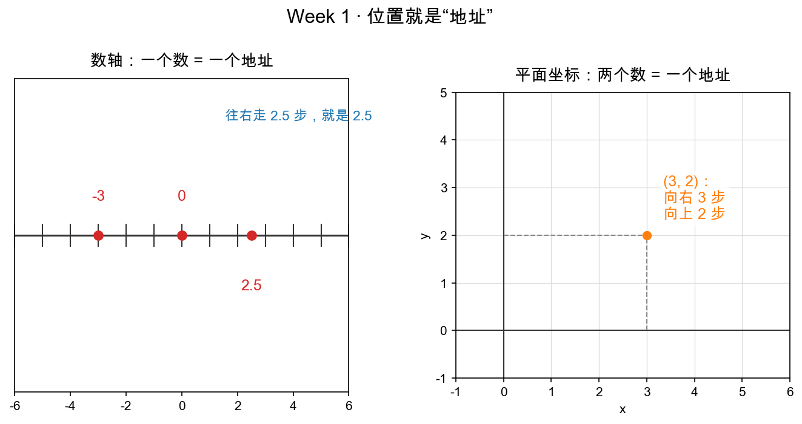

# 第 1 章：数轴与坐标——位置就是"地址"

> 本章你将：
> - 把"数轴"想成一条**能定位的街道**，每个数就是一个"门牌地址"；
> - 学会用**两个数**给平面上的任意一点定位——这就是坐标 (x, y)；
> - 认识"刻度"和"格点"，并亲手做一些"从地址找位置 / 从位置读地址"的练习；
> - 为下一章铺路：坐标，马上要用来表示**箭头**。

---

## 1.1 一条街：数轴就是"地址"

想象一条东西向笔直的街道，正中间是家 7-11，我们把它叫做 **0 号**。沿街每隔 1 米画一个刻度：往东（右）走是 1 号、2 号、3 号……往西（左）走是 -1 号、-2 号……这条"带刻度的直线"，数学上就叫**数轴**。

数轴上每一个位置，正好对应一个数——**一个数 = 一个地址**：

- 0 是 7-11 的地址；
- 3 是"从 7-11 往东走 3 米"的那家店；
- -2.5 是"往西走 2.5 米"的那棵树。

看图左边那条横线：-3、0、2.5 三个点各占一个位置，每个都配着它的"地址数"。"往右走 2.5 步，就是 2.5"——这就是数轴的全部秘密：**它把"位置"这件事翻译成了"数字"**。

> 💡 **你可能会问：方向和正负号是怎么约定的？**
>
> 纯粹是约定。我们习惯"向右为正、向左为负"，换个人也可以"向东为正"。要点只有一条：**正号代表一个方向，负号代表相反方向**。"-3 号"不是说"地址是负数很怪"，而是"往左 3 格的那个位置"。等到了向量（下一章），这个"正负 = 方向"的直觉会用到极致。

---

## 1.2 一条街不够了：平面需要两个地址

现在问题来了：你朋友约你在城市里见面，只告诉你"从广场往东走 300 米"，够吗？不够——你根本不知道还要往北（还是往南）走多远。**一条街只能回答一个方向的问题，平面上的位置需要两个数。**

办法很自然：再铺一条南北向的街，和东西向的街在 7-11（0 号）处垂直交叉。现在给平面上的任意一点定位，只要回答两个问题：

1. 往东（+）/ 西（-）走多远？—— 这个数叫 **x**（横坐标）；
2. 往北（+）/ 南（-）走多远？—— 这个数叫 **y**（纵坐标）。

把这两个数包起来写成 `(x, y)`，就是**平面坐标**——**两个数 = 一个地址**。

图右边就是它：点 `(3, 2)` 的意思是"向右走 3、向上走 2"。看到那两条虚线了吗？它们从坐标轴"投影"下来告诉你：x 是 3（竖直虚线落到 x 轴的位置），y 是 2（水平虚线落到 y 轴的位置）。

> 📌 **划重点：** 坐标的本质是**问路答案**。`(3, 2)` 不是"两个孤零零的数"，它是"沿第一条街走 3、再沿第二条街走 2"这只完整的走法。顺序不能乱：`(3, 2)` 和 `(2, 3)` 是两个完全不同的地点（前者偏东高，后者偏南矮）。

---

## 1.3 刻度与格点：让"地址"真正好用的两条规则

要让坐标成为可靠的定位系统，得给两条街各自**等距地画上刻度**，就像尺子：

1. **原点**：两条街的交叉处，坐标为 `(0, 0)`，是"从零开始走"的起点；
2. **单位长度**：每 1 格表示同样的 1 米（或 1 单位），刻度和刻度之间等距。

有了"原点 + 单位长度 + 两条互相垂直的轴"，平面上就有了一张隐形的**格网**。那些"横竖线交叉的点"，学名叫**格点**（横坐标和纵坐标都是整数的点，比如 `(0,0)`、`(1,2)`、`(-3,1)`）。

> ⚠️ **易踩坑：** 刻度必须**等距**，这是坐标系统的命根子。如果 x 轴第 1 格 1 厘米、第 2 格 5 厘米，"从地址读位置"就会变形。任何一张坐标图，只要刻度不等距，它就是一张"扭曲的地图"，量出来的距离全是错的。这也是为什么本课所有带精确坐标的图都用脚本生成——手画的 ASCII 图刻度对不齐，最容易误导人。

现在你可以回答一个朴素问题了：点 `(4, -1)` 在哪？——从原点向东 4 格，再向南 1 格。点 `(-2, -3)` 呢？向西 2 格，再向南 3 格。**读坐标就是按顺序走两段，仅此而已。**

---

## 1.4 为什么要费这么大劲讲"地址"

因为再过几章，你就会发现：LLM 里说的"向量""坐标""embedding"，本质全是在做同一件事——**给一样东西（一个点、一个箭头、一个词）配上一串数字，当作它的地址**。

- 平面上的点 → 地址是 2 个数 `(x, y)`；
- 一个词（比如"苹果"）→ 地址是几百个数（`(0.12, -0.34, 0.87, ...)`，768 个）。

数字的个数可以随便加，但"地址"这个念头没变。本周第 5 章你会看到，机器"认出两个词意思相近"，靠的正是"它们的地址离得近"。

> 📌 **AI 联系：** word embedding 就是"给每个词发一张门牌"。当你说 `embedding = [0.12, -0.34, ...]`，你在说的其实是："在机器学习搭的那条（几百万维的）'街道'上，'苹果'这个词住在这串坐标上。" 数轴是 1 维的街道，embedding 是 768 维的街道——**维度变了，'地址'的直觉一模一样**。

---

## 1.5 动手练习

不用写代码，先在纸上做几道"地址 ↔ 位置"的翻译题（答案见章末对答案）：

1. 写出从原点出发、走到下面每个点的"走法"：`(5, 0)`、`(0, -3)`、`(-2, 4)`；
2. 反过来读地址：一位朋友说"向东 4 格、向南 3 格"——他的坐标是什么？
3. （稍难）点 `(3, 2)` 和点 `(-1, -5)`，谁的 x 更大？谁的 y 更小？你能用一句话说清"怎么比较两个点的位置"吗？

## 参考答案

这几道是"翻译题"，认真做完再对：1️⃣ `(5,0)`=东 5 北 0（就在 x 轴上）、`(0,-3)`=东北 0 南 3（就在 y 轴下方）、`(-2,4)`=西 2 北 4；2️⃣ `(4, -3)`；3️⃣ `(3,2)` 的 x 更大，`(-1,-5)` 的 y 更小——比较位置就是**分别比较它们的 x 和 y**。

卡住超过 20 分钟也没关系，这一章没有代码可对，回头重读 1.2 节的"问路答案"比喻即可。

---

## 1.6 本章小结

- ✅ 数轴 = 一条带刻度的街道，**一个数 = 一个地址**；正负号是"方向"的约定。
- ✅ 平面需要两个地址：`(x, y)` = "沿 x 轴走 x、沿 y 轴走 y"，**两个数 = 一个地址**，顺序不能乱。
- ✅ 坐标系统 = 原点 + 等距刻度 + 两条互相垂直的轴；格点就是横纵坐标都是整数的点。
- ✅ "地址"这个念头是后面所有内容（向量、embedding）的共同骨架。

下一章，我们把"位置"变成"运动"——从"我在哪"，讲到"我从哪走到哪"。

👉 **[第 2 章：从点到箭头 —— 向量是什么](./02-从点到箭头-向量是什么.md)**
