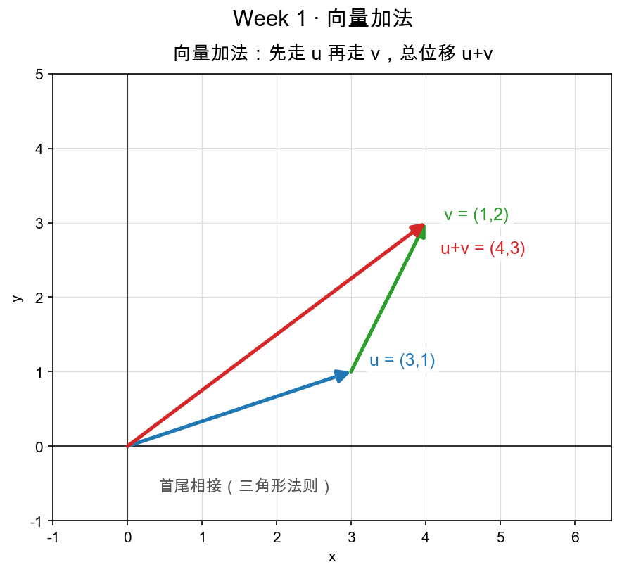
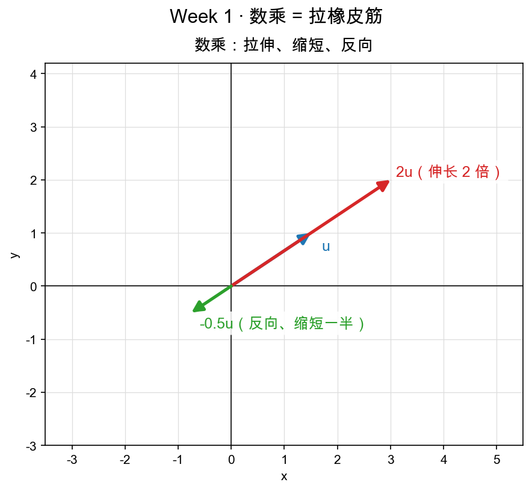

# 第 4 章（Day 1）：用代码画向量——加法与数乘

> 本章你将：
> - 打开 `matrixlab/vec2d.py`，逐个实现 7 个函数：`make`、`add`、`sub`、`scale`、`neg`、`length`、`from_points`；
> - 每个函数都先有**思路 + 手算例子**，再写代码；
> - 搞懂一个贯穿全课的约定：**所有函数返回新向量，不修改输入**；
> - 亲手把 `pytest tests -k w1` 从红跑到绿。

---

## 4.1 我们手上的"画布"长什么样

先打开你的战场文件 `matrixlab/vec2d.py`。它现在长这样（节选）：

```python
import math


def add(u: list, v: list) -> list:
    """向量加法：箭头首尾相接。"""
    raise NotImplementedError("TODO: Week 1 Day 1 —— 向量加法")
```

7 个函数，每个都是一句 `raise NotImplementedError("TODO: ...")` 的空壳。今天的目标：**把 7 个 `raise` 全部换成真实现**。

在动手前，先记住一条贯穿全课的规则，它藏在文件开头的注释里：

> 📌 **划重点：所有函数都返回新向量，不修改传入的向量。**

什么意思？你调 `add(u, v)`，它会**造一支全新的箭**返回给你，而 `u`、`v` 本身原封不动。为什么这么定？因为后面向量会和矩阵、和 numpy 一起用，一旦原地乱改，很容易出现"一支箭被好多地方共享、一处改动全盘皆错"的灵异 bug。**输入当宝贝，输出另起炉灶**——这是工程上的好习惯，也让你每次运算都能复现。

> 💡 **你可能会问：向量凭什么用 `list` 表示？不能用一个类吗？**
>
> 完全可以，本课先用最简单的 `[x, y]`，因为 list 就是"一串有顺序的数"，和"分量的顺序"天然对应，零学习成本。等到了 numpy（Week 2 起），`[x, y]` 会升级成 `np.array([x, y])`，运算写法几乎不变。现在用 list，正是为了让你看清每一步计算到底在算什么。

---

## 4.2 make —— 用坐标造一支箭

**思路**：第 2 章说过，向量 $(x, y)$ 在代码里就是一个两元素的列表。造向量 = 把两个数包进列表。

**手算**：`make(3, 4)` 应该得到 `[3, 4]`。

```python
def make(x: float, y: float) -> list:
    """用坐标造一个向量。"""
    return [x, y]
```

---

## 4.3 add —— 首尾相接

**思路**：加法就是"先走 u，再走 v"，把两段位移拼成一段。分开看，横着的加起来、竖着的加起来：

$$
\begin{aligned}
u &= (3, 1) \qquad &\text{向右 3、向上 1} \\\\
v &= (1, 2) \qquad &\text{再向右 1、向上 2} \\\\
u + v &= (3+1, 1+2) = (4, 3) &
\end{aligned}
$$

这就是"首尾相接"（也叫三角形法则）：把 v 的尾巴接到 u 的头上，从 u 的尾巴到 v 的头，就是总和 $(4, 3)$。



看图：蓝箭 $u=(3,1)$、绿箭 $v=(1,2)$ 首尾相接，红箭就是 $u+v=(4,3)$。图里还标了"首尾相接"四个字——这就是加法的全部几何含义。

```python
def add(u: list, v: list) -> list:
    """向量加法：箭头首尾相接（三角形/平行四边形法则）。"""
    return [u[0] + v[0], u[1] + v[1]]
```

> 📌 **划重点：** 向量加法 = 分量分别相加。几何上 = 首尾相接。$(2,0)+(0,3)=(2,3)$，正是测试 `test_add_is_head_to_tail` 里"先向右 2 再向上 3"那句。

---

## 4.4 sub —— 从 v 的终点走回 u

**思路**：减法就是"反过来的位移"。$u - v$ = 从 v 的终点走回 u 的终点，也就是把对应分量相减。

**手算**：`[4,5] - [1,1] = [4-1, 5-1] = [3, 4]`（这正是测试 `test_sub` 里的例子）。

```python
def sub(u: list, v: list) -> list:
    """向量减法：从 v 的终点走回 u 的终点的位移 = u - v。"""
    return [u[0] - v[0], u[1] - v[1]]
```

> 💡 **你可能会问：减法为什么和 `from_points` 长得很像？**
>
> 因为它们本质是一回事！`A→B` 的位移 = `B - A`（终点减起点）。减法就是"从第二个点走回第一个点"。下一小节 `from_points` 只是把这件事用"起点、终点"两个参数写出来而已。你马上会看到它俩的代码几乎一模一样。

---

## 4.5 scale —— 数乘：拉伸、缩短、反向

**思路**：用个数 a 去乘向量，就是把每支分量都伸长 a 倍。`a > 1` 伸长，`0 < a < 1` 缩短，`a < 0` 先反向再伸缩。

**手算**（对照测试 `test_scale_and_neg`）：

$$
\begin{aligned}
u &= (2, 3) \\\\
2\cdot u &= (2\times 2, 3\times 2) = (4, 6) \qquad &\text{伸长到 2 倍} \\\\
0.5\cdot u &= (2\times 0.5, 3\times 0.5) = (1, 1.5) \qquad &\text{缩短到一半} \\\\
(-1)\cdot u &= (-2, -3) \qquad &\text{反向}
\end{aligned}
$$

```python
def scale(a: float, u: list) -> list:
    """数乘：把向量伸长（|a|>1）或缩短（|a|<1）；a<0 时方向反转。"""
    return [a * u[0], a * u[1]]
```



看下图：蓝箭 $u$、红箭 $2u$（同方向、2 倍长）、绿箭 $-0.5u$（反方向、一半长）。**数乘就是拉橡皮筋**：拉长、压短、或者提起来翻个面。

> 📌 **AI 联系：** 这个"拉橡皮筋"的动作，是 Week 2"线性组合"的半块砖（另一块是 add）。到那时候你会看到，embedding 空间里"给某个语义方向加权"用的就是这个 `scale`。现在先记住：**数乘只改变长度（和取负时方向），不改变箭头的"朝向直线"**。

---

## 4.6 neg —— 反向量

**思路**："相反的方向，同样的长度"。把两个分量都取负即可。

**手算**：`neg([2,3]) = [-2,-3]`。

```python
def neg(u: list) -> list:
    """反向量：与原向量长度相同、方向相反。"""
    return [-u[0], -u[1]]
```

> 💡 **你可能会问：`neg(u)` 和 `scale(-1, u)` 不是一样吗？干嘛单独做个函数？**
>
> 数学上确实一样：$\text{neg}(u) = -1\cdot u$。单独起名是因为"取反向量"这个念头太常用了（比如"往回走"），给它一个名字让人读代码时一眼看懂意图。你也可以偷懒用一个调另一个，但自己写清楚更利于以后复习。

---

## 4.7 length —— 勾股定理（第 2 章的老熟人）

**思路**：第 2.4 节已经算过：$\lvert u\rvert = \sqrt{x^2 + y^2}$。代码里开平方用 `math.sqrt`。

**手算**：$\text{length}([3,4]) = \sqrt{3^2+4^2} = \sqrt{25} = 5$。

```python
def length(u: list) -> float:
    """向量的长度（勾股定理）：sqrt(x² + y²)。"""
    return math.sqrt(u[0] ** 2 + u[1] ** 2)
```

> ⚠️ **易踩坑：** 平方用 `** 2`，开方用 `math.sqrt`，别手滑写成 `u[0]^2`（Python 里 `^` 是"按位异或"，跟平方八竿子打不着）。另外记得文件顶部已经 `import math` 了，直接用 `math.sqrt` 即可。

---

## 4.8 from_points —— 从 A 到 B 的位移

**思路**：终点坐标减起点坐标 = 位移向量。和 `sub` 完全一个道理，只是参数名换成了"点 a、点 b"。

**手算**（对应测试 `test_from_points`）：

- 从 $(1,1)$ 到 $(4,5)$：横走 $4-1=3$、竖走 $5-1=4$ → $(3,4)$；
- 反向走回：从 $(4,5)$ 到 $(1,1)$ → $(1-4, 1-5) = (-3,-4)$（正好是反向量，测试里明说了）。

```python
def from_points(a: list, b: list) -> list:
    """从点 A 到点 B 的位移向量 = B - A。"""
    return [b[0] - a[0], b[1] - a[1]]
```

---

## 4.9 验收：从红到绿

7 个函数写完，回到仓库根目录，跑：

```bash
pytest tests -k w1 -q
```

目标输出：

```text
......                                                                   [100%]
6 passed, 85 deselected in 0.10s
```

`6 passed` = 本周全过。如果还红，别慌，按 3.7 的规则排查：

1. **对着报错看是哪个函数**——pytest 会把失败函数名和你算出的值、期望值都打出来；
2. **手算你卡住的那个例子**——多半是分量加/减反了，或平方写成 `^`；
3. 卡 20 分钟，看 `reference/vec2d.py` 里**那一个函数**，合上重写。

> 💡 **你可能会问：为什么测试名里还有 `test_make_and_add`、`test_add_is_head_to_tail` 这种"组合拳"？**
>
> 因为现实中你不会单独调一个函数，都是连环用：先 `make` 两个向量，再 `add`。测试干脆把这些连环用法也当成一道题来考。打开 `tests/test_w1_vec2d.py` 读一遍，你会发现每道题都配了中文注释——**测试就是最好的需求文档**。

---

## 4.10 动手练习

1. **必做**：把 `matrixlab/vec2d.py` 的 7 个函数全部实现，跑 `pytest tests -k w1 -q` 到 `6 passed`。
2. 在 `python3` 里实测你自己的 `length`：先 `make(3,4)`，再 `length(...)`，看是不是 `5.0`。
3. （挑战）用你已经写好的 `scale` 和 `add` 拼出"中点向量"：给两个向量 $u=(2,2)$、$v=(6,4)$，手算出 $0.5\cdot(u + v)$ 是多少？它和"两支箭的中点"有什么关系？

## 参考答案

卡住 20 分钟以上，打开 `reference/vec2d.py`（和你编辑的文件同名）。**只看卡住的那一个函数**，看懂后合上文件自己重写，再跑测试。第 3 题手算：$u+v=(8,6)$，$0.5\cdot(u+v)=(4,3)$——正是 u、v 两支箭"中点"的位置（Day 2 的颜色混合会再用到这个套路）。

---

## 4.11 本章小结

- ✅ 7 个函数全实现：`make`（包成列表）、`add`（分量加，首尾相接）、`sub`（分量减）、`scale`（数乘，拉伸/缩短/反向）、`neg`（反向量）、`length`（勾股定理）、`from_points`（终点减起点）。
- ✅ 全课约定：**所有函数返回新向量，不修改输入**。
- ✅ 加法 = 首尾相接，数乘 = 拉橡皮筋，减法和 `from_points` 是一回事。
- ✅ `pytest tests -k w1 -q` → `6 passed`，本周的"用代码画向量"到此通关。

你已经能手写一支箭、揉它（加法）、拉它（数乘）了。明天 Day 2，我们把这两招用在一个让你"啊哈"的地方——**把词变成向量**。

👉 **[第 5 章（Day 2）：AI 联系 —— 把词变成向量](./05-Day2-AI联系-把词变成向量.md)**
