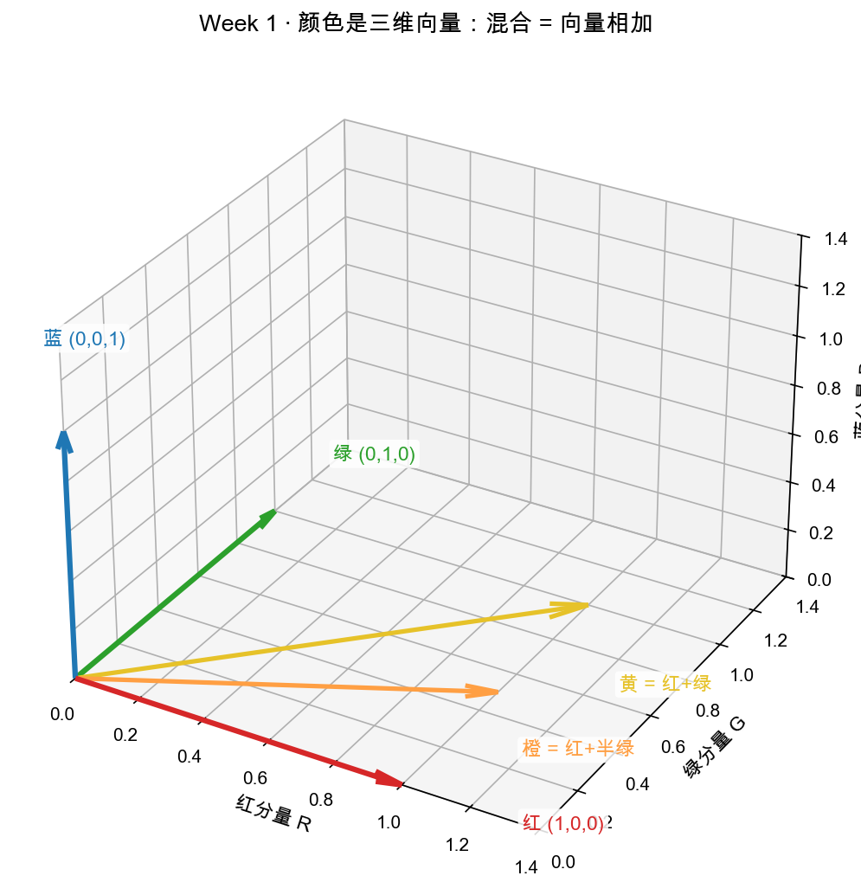

# 第 5 章（Day 2）：AI 联系——把词变成向量

> 本章你将：
> - 用一个"颜色"的例子，把抽象的**三维向量**变成看得见的东西：红绿蓝三个分量；
> - 亲手算一遍"混合颜色 = 向量相加"，把 Day 1 的 `add` / `scale` 用在现实里；
> - 一句话带过 one-hot，然后说出那句关键台词：**embedding 就是给每个词找坐标**；
> - 得到 Week 2"配方"的预告：向量相加/数乘，就是调一杯"语义鸡尾酒"。

---

## 5.1 一开场，先承认一个尴尬

昨天你写的那堆函数——`add`、`scale`、`length`——算的都是 $(3,4)$ 这种"横走几步、竖走几步"。挺好，可你心里大概在嘀咕：**这跟 AI 到底有啥关系？** 我在地图上用箭头走路，跟 ChatGPT 认字，八竿子打不着吧？

今天就是来把这两件事焊在一起的。而且用的道具你天天见：**颜色**。

---

## 5.2 颜色 = 三维向量：红、绿、蓝三个分量

屏幕上的颜色，是怎么用数字表示的？一个约定已经被全行业用烂了：**任何颜色，都可以拆成"红、绿、蓝"三种光的多少**，记成 `(R, G, B)`。

- **红** = $(1, 0, 0)$：红光打满，绿光蓝光关掉；
- **绿** = $(0, 1, 0)$：只开绿灯；
- **蓝** = $(0, 0, 1)$：只开蓝灯。

这三个数是什么？**一个坐标**。只不过它住在三维空间里，坐标轴叫"红分量、绿分量、蓝分量"，而不是 x、y 轴。你昨天在二维里玩的箭头，今天多一维——但"一串数 = 一个位置/一个向量"的直觉，**原封不动**。



看图：三条坐标轴分别是 R（红）、G（绿）、B（蓝）。三支基箭就是纯红、纯绿、纯蓝。你看到一个颜色是 $(0.9, 0.2, 0.3)$，读法就是："这个颜色，红加 0.9、绿加 0.2、蓝加 0.3。"——和读 $(3, 2)$ 是"向右 3、向上 2"**一模一样**。

> 📌 **划重点：** 向量不是二维的专利。你昨天以为"向量 = 平面上的箭头"，其实"向量 = 一串有顺序的数，表示一个有方向有长度的量"。这串数可以是 2 个、3 个、768 个。**维度变了，念头不变。**

---

## 5.3 混合颜色 = 向量相加（Day 1 的 add 登场）

现在，游戏开始。怎么调出**黄色**？

红灯全开 $(1,0,0)$，绿灯也全开 $(0,1,0)$，蓝灯关着。直觉告诉你：红 + 绿 = 黄。用向量写，就是昨天那招 `add`：

$$
\begin{aligned}
&\text{红 } (1, 0, 0) \\\\
+\ &\text{绿 } (0, 1, 0) \\\\
=\ &\text{黄 } (1, 1, 0) \qquad \text{分量分别相加：} R=1+0,\, G=0+1,\, B=0+0
\end{aligned}
$$

再看**橙色** = 红多一点、绿少一点：就是"红全开 + 一半的绿"，用昨天那招 `scale` 先"拉一半"，再 `add`：

$$
\text{橙} = \text{红} + 0.5\cdot\text{绿} = (1,0,0) + 0.5\cdot(0,1,0) = (1, 0.5, 0)
$$

图上正好画了这两支混合箭：`橙 = 红 + 0.5绿`、`黄 = 红 + 绿`。你昨天写的这两个函数——`add` 和 `scale`——此刻正在真实世界里"调颜料"。

| 想要的颜色 | 配方 | 向量怎么写 |
|---|---|---|
| 红 | 纯红 | $(1, 0, 0)$ |
| 黄 | 红 + 绿 | $(1, 1, 0)$ |
| 橙 | 红 + 一半绿 | $(1, 0.5, 0)$ |
| 深红（暗一点） | 红的 0.5 倍（缩短） | $0.5\cdot(1,0,0) = (0.5, 0, 0)$ |

瞧见没？"混合颜色"在向量语言里，就是**把几个基向量（红/绿/蓝）伸缩再相加**。这个动作，学名叫**线性组合**——它正是下一周 Week 2 的主角，先混个脸熟。

> 💡 **你可能会问：三维、768 维的向量我怎么"看"？眼睛只能看 3 维啊。**
>
> 问到了线性代数最诚实的痛点。答案是：**看不懂画面，就顺着低维的直觉往高维照搬**。2 维你会画、3 维你能脑补、768 维你"照公式算"——加法还是分量相加，长度还是"各分量平方和再开方"（把昨天的 $\sqrt{x^2+y^2}$ 推广成 $\sqrt{x^2+y^2+z^2+\dots}$）。直觉的支点是低维，公式的手脚却能伸进高维。后面 Week 5 会专门聊这个"高维照搬"的心法。

---

## 5.4 one-hot：一种最"笨"但也最硬的表示法（一句话带过）

在掏出 embedding 之前，先看人类第一个想到的"把词变成数字"的笨办法，它叫 **one-hot（独热编码）**。

设想词典里只有 3 个词：苹果、香蕉、汽车。给每个词发一支"对照箭"：

- 苹果 = $(1, 0, 0)$
- 香蕉 = $(0, 1, 0)$
- 汽车 = $(0, 0, 1)$

每个词占用一个维度，只有自己那一维是 1，其余全是 0。这就像给三个词分配三支**互不重叠的"颜色基箭"**——每个词是一支独立的基矢。

它"笨"在哪？**它完全不知道"苹果"和"香蕉"都是水果、都比"汽车"更相近**。在 one-hot 眼里，三支箭两两之间距离都相等，谁也不比谁更亲。于是人类想要一个更好的表示——一个能让"意思相近的词，坐标也靠近"的表示。这就是 embedding。

> 📌 **划重点：** one-hot = 每个词一个"独门维度"，互不相干；它的缺陷——"词义上的远近"它一概不知——正是 embedding 要解决的头号问题。

---

## 5.5 embedding：给每个词找坐标

现在说那句全章最想说、你未来会听一万遍的话：

> 📌 **AI 联系：embedding（词嵌入）就是"给每个词找一个坐标"。** 这个坐标不是人拍脑袋定的，而是让模型在大量文本里"学"出来的——学到的是：**意思相近的词，坐标在空间里挨得近**。

回到第 0 章那个"惊鸿一瞥"：

```python
embedding = nn.Embedding(num_words, dim=768)   # 5 万个词，每个词 768 个数
x = embedding(word_id)                          # 查表：这个词的坐标是多少
```

`dim=768` 意思是：每个词住在一根 768 维的"街道"上，有一串 768 个数的门牌。这串数，就是一个**向量**——有方向、有长度，能像昨天的箭头一样被加减、被伸缩、被算长度。

而学完第 5.3 节你会秒懂它的神操作：**"$\text{国王} - \text{男人} + \text{女人} \approx \text{女王}$"**。把"国王"的向量减去"男人"的向量（`sub`），加上"女人"的向量（`add`），得到的坐标，恰好靠近"女王"的向量。用颜色打个比方：就像"橙色 减去 红色，再加 黄色，会得到一种新颜色"——向量加减，就是在**调一杯语义鸡尾酒**。这个等式 Week 2 会正式亮相，今天你只要惊掉下巴就够了。

> 💡 **你可能会问：768 维的坐标，凭什么"意思相近就挨得近"？是谁规定的？**
>
> 不是规定，是"练"出来的。想象模型天天读海量句子，它被要求："给我一个坐标，让经常出现在相似上下文里的词，坐标也相似。" 经过无数次微调，坐标就自然长成了那样（这个"微调"就是 Week 8 的梯度下降，远超今天范围）。今天你只需带走一个画面：**每个词，是一支住在高维空间里的箭头；箭头之间的远近，对应词义之间的远近。**

---

## 5.6 预告：Week 2 的"配方"问题

这一章你已经偷偷摸到了下一周的入口。回看颜色：

- 三个**基向量**（红、绿、蓝）摆在那儿；
- 任意一个颜色，都是它们的"伸缩再相加"（`scale` + `add`）。

比如紫色 $\approx$ $0.7\cdot\text{红} + 0.3\cdot\text{蓝}$（蓝多一点红少一点的配方）。那么反过来问：

> **给学生一个颜色，怎么算出它的"配方"（各用多少红/绿/蓝）？**

这就是 Week 2 的核心——"配方 = 坐标"：给定一组"基础尺子"（基），任何向量都能拆成这组尺子的伸缩相加，而那一串"伸缩系数"就是它在新区间里的**坐标**。把"尺子"从"红绿蓝"换成"几个语义方向"，你就能理解 embedding 的每一维到底在量什么。

先不剧透太多。你现在的行囊已经满满当当：点、坐标、箭头、向量、加法、数乘、勾股定理算长度，还有那句"词 = 高维空间里的坐标"。

---

## 5.7 动手练习

1. 用向量手算：**黄 $(1,1,0)$ 加上 蓝 $(0,0,1)$ 等于什么？** 它在现实里是什么颜色？（提示：三个分量全开）
2. 手算一支"半亮白"：$0.5 \cdot (1,1,1)$ 是多少？它比你第 1 题调出来的颜色暗还是亮？
3. 用你 Day 1 写的代码验证思路：在 `python3` 里 `import vec2d` 一类的操作（或直接看 `vec2d.py`），确认"二维里 `sub` + `add` 能做出 $(3,1)$ 走回 $(0,0)$ 再走向别处"这件事——体会"加减就是来回走路"，为 Week 2 的 $\text{国王}-\text{男人}+\text{女人}$ 做心理准备。

## 参考答案

第 1、2 题做完再对：1️⃣ $(1,1,0)+(0,0,1)=(1,1,1)$——三色全开，是**白色**；2️⃣ $0.5\cdot(1,1,1)=(0.5,0.5,0.5)$，是暗一级的灰白，比白色**暗**。第 3 题是概念题，用 `matrixlab/vec2d.py` 里的 `sub`/`add`/`scale` 即可验证，函数你昨天已经写好了，不放心可对照 `reference/vec2d.py`。

---

## 5.8 本章小结（也是本周小结）

- ✅ 颜色 = 三维向量：`(R, G, B)` 三个分量，坐标轴叫"红/绿/蓝"。
- ✅ 混合颜色 = 向量相加 / 数乘：`黄 = 红 + 绿 = (1,1,0)`，`橙 = 红 + 0.5绿`。这正是 Day 1 的 `add` 和 `scale`。
- ✅ one-hot = 每个词一个独门维度，互不相干，**看不出词义的远近**（一句话带过）。
- ✅ **embedding = 给每个词找坐标**：让意思相近的词坐标靠近，"$\text{国王} - \text{男人} + \text{女人} \approx \text{女王}$"是向量加减的语义魔法。
- ✅ 预告：Week 2 会研究"配方"——把向量拆成一组基的伸缩相加，那就是坐标的本质。

**本周收官**：你已经从"一条街上的地址"，走到了"高维空间里的一支词箭头"。这套"点 → 坐标 → 向量 → 加减数乘 → 词 = 向量"的链条，是理解矩阵的第一级台阶。下一周，我们学会"伸缩再相加"这套动作的正式名字——**线性组合**，并第一次问出那个"配方"问题。

👉 下一周：**[Week 2：线性组合与基 —— 坐标的本质](../week2/README.md)**
