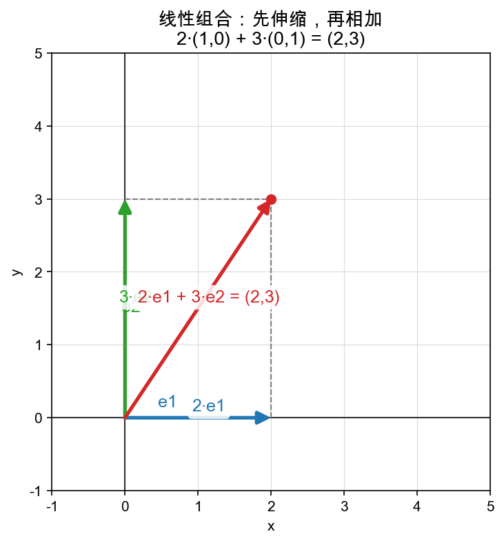

# Day 1：伸缩再相加——线性组合

> 本章你将：
> - 看懂"线性组合"这四个字到底在干什么——**先把箭头伸缩，再把结果相加**；
> - 亲手把 `matrixlab/combo.py` 里的 `lincomb` 实现出来；
> - 手算一遍 $2\cdot e_1 + 3\cdot e_2$，再看着代码替你算出同样的答案；
> - 跑通 `pytest tests -k w2_combo` 的测试到绿。

---

## 1.1 从一个熟悉的动作说起

Week 1 你已经会了两件事：**加法**（首尾相接）和 **数乘**（伸缩）。它们是搭向量积木的"基础乐高块"。

这一周，我们把这两块乐高**组合**起来用。先回想一个地图上的场景：

> 你站在原点。有人告诉你："先朝东走 2 个街区，再朝北走 3 个街区。"于是你到了 $(2, 3)$。

拆开来看，这句话其实是：

- **朝东走 2 格** = 把指向东的单位箭头 $e_1 = (1, 0)$ 拉长 2 倍，得到 $2\cdot e_1 = (2, 0)$；
- **朝北走 3 格** = 把指向北的单位箭头 $e_2 = (0, 1)$ 拉长 3 倍，得到 $3\cdot e_2 = (0, 3)$；
- 最后把这两个箭头加起来：$(2, 0) + (0, 3) = (2, 3)$。

这"伸缩再相加"三个字，就是本章的主角。数学上给它起了个一本正经的名字：**线性组合（linear combination）**。



图上看得清清楚楚：蓝色的 $2\cdot e_1$ 和绿色的 $3\cdot e_2$ 先各自伸缩，红色的对角线就是它们加起来的结果 $(2, 3)$。那两条灰色虚线画出的是一个平行四边形——**加法 = 平行四边形的对角线**，这个直觉在 Week 1 已经见过，现在它有三个颜色分工：两个"零件箭头"，一条"合成箭头"。

---

## 1.2 一句话定义

> **线性组合：给每一支箭头一个"伸缩倍数"（系数），先各自伸缩，再把所有结果加起来。**

用 Unicode 写出来（不用背，看懂就行）：

$$ s\cdot v_1 + t\cdot v_2 = s \times (v_1 \text{ 的每个坐标}) + t \times (v_2 \text{ 的每个坐标}) $$

更一般地，如果手里的箭头是 $v_1$、$v_2$、$\dots$、$v_k$，系数分别是 $c_1$、$c_2$、$\dots$、$c_k$，那它们的线性组合就是：

$$ \sum_{i=1}^{k} (c_i \cdot v_i) $$

那个 $\Sigma$ 就是"把后面这些东西全加起来"的缩写记号，Python 里对应一个 `for` 循环。

> 📌 **划重点：线性组合 = 伸缩 + 相加，就这两步。没有第三步，没有魔法。**

---

## 1.3 手算一遍：$2\cdot e_1 + 3\cdot e_2$

先把图上的例子亲手算一遍，让"伸缩再相加"落到坐标数上。

标准基的两根轴：

$$
\begin{aligned}
e_1 &= (1, 0) \quad &\leftarrow\ \text{指向东的单位箭头} \\\\
e_2 &= (0, 1) \quad &\leftarrow\ \text{指向北的单位箭头}
\end{aligned}
$$

第一步，伸缩：

$$
\begin{aligned}
2\cdot e_1 &= (2\times 1,\ 2\times 0) = (2, 0) \\\\
3\cdot e_2 &= (3\times 0,\ 3\times 1) = (0, 3)
\end{aligned}
$$

第二步，相加（对应坐标相加）：

$$ (2, 0) + (0, 3) = (2+0,\ 0+3) = (2, 3) $$

所以 $2\cdot e_1 + 3\cdot e_2 = (2, 3)$。系数 $(2, 3)$ 直接变成了结果的坐标——这不是巧合，等 Day 3 讲基的时候你会懂为什么这么"顺"。现在先记住动作本身。

再算一个"拧巴"一点的，确认你学会了：

> 手头的箭头是 $(1, 2)$ 和 $(3, -1)$，系数是 2 和 3。求它们的线性组合。

$$
\begin{aligned}
2\cdot(1, 2) + 3\cdot(3, -1)
&= (2, 4) + (9, -3) \\\\
&= (11, 1)
\end{aligned}
$$

算出来是 $(11, 1)$。这正好是测试文件里的 `test_lincomb_mixes_everything`，等下你的代码要替你把这一步自动算出来。

---

## 1.4 系数可以任意取（包括 0 和负数）

伸缩倍数叫**系数（coefficient）**，它是任意一个数，不光能是 2、3 这种正整数：

| 系数取值 | 效果 | 例子 |
|---|---|---|
| 正数 | 顺着箭头方向拉长 / 缩短 | $2\cdot e_1 = (2, 0)$ |
| 0 | 把这支箭头"消灭"，等于没它 | $0\cdot(3, 4) = (0, 0)$ |
| 负数 | 方向反转，再按 |系数| 拉长 | $-1\cdot(1, 0) = (-1, 0)$ |

负数尤其值得点一下：$-1\cdot(1, 0) = (-1, 0)$，箭头掉头指向西了。所以"线性组合"能拼出的箭头，四面八方都有可能，不是只朝东北。

---

## 1.5 把动作写进代码

现在打开你的战场 `matrixlab/combo.py`。里面躺着两个空函数，第一个是 `lincomb`：

```python
def lincomb(coeffs: list, vecs: list) -> list:
    """计算系数 coeffs 与向量 vecs 的线性组合：Σ coeffs[i] * vecs[i]。"""
    raise NotImplementedError("TODO: Week 2 Day 1 —— 线性组合")
```

它的参数有两样：

- `coeffs`：一串系数，比如 `[2, 3]`；
- `vecs`：一串向量，比如 `[[1, 0], [0, 1]]`。

它要返回一个向量，含义是上面 1.2 节那个 $\Sigma$ 的结果。

### 思路

不用想复杂，就两步，和手算一模一样：

1. 结果向量先初始化成**全 0**（长度 = 每个向量的坐标个数，也就是 `len(vecs[0])`）；
2. 拿 `zip(coeffs, vecs)` 把"系数—向量"一对一对配好，每一对做 `c * v`，把结果**逐个坐标加进**结果向量里。

`zip` 会把两个列表配对：`zip([2, 3], [[1,0],[0,1]])` 依次吐出 `(2, [1,0])` 和 `(3, [0,1])`。

内层再来一个循环遍历每个坐标，把 `c * v[i]` 加到 `result[i]` 上。这样一个双层循环（外层按"第几支箭头"，内层按"第几个坐标"）就把 $\Sigma$ 写出来了。

> 💡 **你可能会问：结果向量为什么要一开始全填 0？** 因为加法需要一个起点。0 是加法的"中立数"——任何数加 0 还是它自己，所以从全 0 开始累加，最后留下的就是纯粹的 $\Sigma$。

> ⚠️ **易踩坑：用 `+=` 累加，而不是 `=` 覆盖。** 你要的是 `result[i] += c * v[i]`，一步步**加进去**；如果写成 `result[i] = c * v[i]`，前一支箭头的贡献就被覆盖掉了，最后只剩最后一个向量的贡献。

### 写出后自测

写完后，直接在命令行验证手算过的例子：

```bash
cd /Users/codinghuang/codeDir/study/matrix-intuition
IMPL=matrixlab python -c "from matrixlab.combo import lincomb; print(lincomb([2,3], [[1,0],[0,1]]))"
```

应该打印 `[2, 3]`。再验证拧巴的那个：

```bash
IMPL=matrixlab python -c "from matrixlab.combo import lincomb; print(lincomb([2,3], [[1,2],[3,-1]]))"
```

应该打印 `[11, 1]`。和 1.3 节手算的结果对上了吗？

---

## 📌 AI 联系：把想法"写在向量上"靠的就是它

你可能会觉得"伸缩再相加"太朴素了。但它正是整个线性代数（以及你后面要学的 embedding、attention、神经网络）都反复调用的一个动作。

举个后面会真正用到的例子：神经网络一层的 $Wx + b$，翻译一下就是"把输入的各分量当系数，去组合权重矩阵的列"——这就是线性组合。Week 3 你会看到，**矩阵乘向量本质上就是一次线性组合**。

现在只需要在心里埋一颗种子：**"拿一套数（系数）去混合一套东西（向量）"这件事，值得起个名字，因为后面会用它一百遍。** 这个名字就是"线性组合"。

---

## 动手练习

1. 打开 `matrixlab/combo.py`，实现 `lincomb`（`span_point` 留给下一章 Day 2）。
2. 跑测试：

```bash
cd /Users/codinghuang/codeDir/study/matrix-intuition
IMPL=matrixlab pytest tests/test_w2_combo.py -k lincomb -q
```

预期 `4 passed`。

## 参考答案

卡住超过 20 分钟，去看 `reference/combo.py` 里的 `lincomb`，读懂每一行后**关掉它、自己重写一遍**。

---

下一章，我们要问一个大胆的问题：**给两支箭头，靠"伸缩再相加"，到底能拼出多大的地盘？**

👉 [Day 2：张成平面——两个向量能拼出整个世界吗](./02-Day2-张成平面-两个向量能拼出整个世界吗.md)
