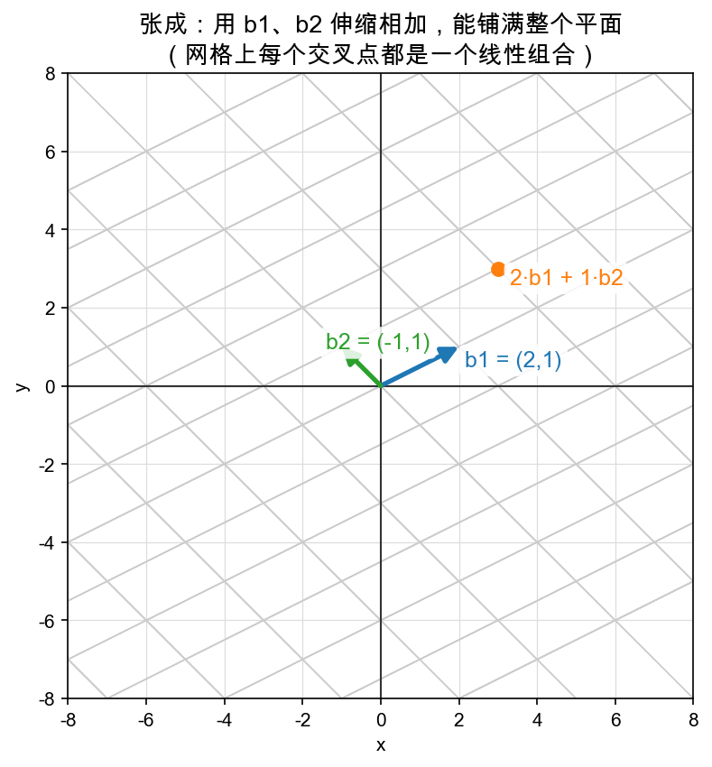

# Day 2：张成平面——两个向量能拼出整个世界吗

> 本章你将：
> - 用"伸缩再相加"回答一个问题：给两支箭头，它们能**覆盖**多大的地盘；
> - 直观理解"张成（span）"——两支不共线的箭头能铺满整个平面；
> - 看懂反例：两支箭头**共线**时，再努力也只能铺出一条线；
> - （埋个不点破的名字）这里已经藏着"线性相关 / 线性无关"的直觉，Day 3 才给它正式起名；
> - 亲手实现 `matrixlab/combo.py` 里的 `span_point`。

---

## 2.1 换个角度问：伸缩再相加，能拼出多少？

Day 1 我们问的是"**按给定系数**能拼出哪个箭头"，答案是唯一的一个点。今天把问题反过来：

> 不给定系数了。让系数**随便在全体实数里取**，两支固定的箭头能把平面上的哪些点"够得到"？

换句话说：**拿 $b_1$、$b_2$ 两支箭头当"原料"，允许任意伸缩、任意相加，最终能覆盖多大的地盘？** 这个"能覆盖到的所有点的集合"，数学上叫**张成（span）**。

先看一个好例子。取：

$$
\begin{aligned}
b_1 &= (2, 1) \\
b_2 &= (-1, 1)
\end{aligned}
$$

这两支箭头一个指向右上、一个指向左上，**不共线**（不在同一条直线上）。下图把它们所有的整数倍组合画成了斜网格：



注意看：横竖交织的斜网格**铺满了整张图**。网格上每一个交叉点，都是一个"整数系数"的线性组合 $s\cdot b_1 + t\cdot b_2$；而如果把 $s$、$t$ 从整数放宽到**任意实数**，网格之间的缝隙也会被填满——于是**整个平面，处处可达**。

结论：**两支不共线的箭头，通过伸缩再相加，能拼出整个平面。**

---

## 2.2 为什么"不共线"是关键词

想想"共线"是什么意思：两支箭头指向同一个方向（或正好相反）。比如：

$$
\begin{aligned}
b_1 &= (2, 0) \quad &\leftarrow\ \text{朝东} \\
b_2 &= (4, 0) \quad &\leftarrow\ \text{也朝东，只是更长}
\end{aligned}
$$

不管你怎么伸缩它们、怎么加，结果的 y 坐标永远是 0——因为两个箭头的 y 坐标都是 0，加来加去还是 0。你永远"够不着"上面、下面、斜上方的任何点。

$$ s\cdot(2,0) + t\cdot(4,0) = (2s + 4t,\ 0) \qquad \leftarrow\ \text{第二个坐标永远是 0} $$

所以两支共线的箭头，张成的不是平面，而只是一条**线**（那条穿过原点的直线）。想铺满平面，缺一个"斜"的方向。

> 📌 **划重点：**
> - 两支箭头**不共线** → 张成整个平面；
> - 两支箭头**共线** → 只能张成一条线。

---

## 2.3 两条极端的边界情况

把"够得着的范围"再抠细一点，看看共线这件事的两种极端：

| 情况 | 举例 | 张成什么 |
|---|---|---|
| 两支不共线 | $(2,1)$、$(-1,1)$ | 整个平面 |
| 两支共线、方向相同 | $(1,0)$、$(2,0)$ | 一条线（x 轴） |
| 两支共线、方向相反 | $(1,0)$、$(-2,0)$ | 还是一条线（x 轴，能左右伸） |
| 其中一支是零向量 | $(1,0)$、$(0,0)$ | 一条线（只剩下那支非零的） |

最后一行值得停一下：$(0, 0)$ 是"什么都没贡献"的箭头，伸缩 100 倍、1000 倍都还是 $(0, 0)$，等于不存在。所以两支箭头里哪怕只有一支是零向量，"可用方向"就少了一个，只能张成一条线。

---

## 2.4 埋一个名字：线性相关 vs 线性无关

上面这些例子里，其实藏着一个非常核心的区分。它今天先以直觉登场，Day 3 会正式点名：

- 两支箭头**不共线**：谁也代替不了谁，少一支就少一个方向，地盘从"平面"缩成"线"。这种"谁也离不开谁"的情况，直觉上叫**无关**。
- 两支箭头**共线**：其中一支只是另一支的"倍数"，有它没它地盘不变。这种"多出来一支其实是多余的"的情况，直觉上叫**相关**。

先记住这个感觉就行——**相关 = 有冗余，无关 = 每个都不可替**。术语和严谨的定义留到后面，现在你脑子里已经有了图。

---

## 2.5 代码：算出张成平面里的一个点

回到战场 `matrixlab/combo.py`，第二个待实现的函数是 `span_point`：

```python
def span_point(b1: list, b2: list, s: float, t: float) -> list:
    """两个向量 b1、b2 张成的平面里，系数为 (s, t) 的那个点。"""
    raise NotImplementedError("TODO: Week 2 Day 2 —— 张成平面里的点")
```

语义非常直白：它返回 $s\cdot b_1 + t\cdot b_2$ 这个点。参数是两支基箭头和一个系数对。

### 思路

坐标只有两维，直接写也行：

```
结果 = (s*b1[0] + t*b2[0],  s*b1[1] + t*b2[1])
```

⚠️ **易踩坑：别把 x 和 y 混用。** 结果的第一个坐标是"两支箭头 **x 分量** 的组合"，第二个是"两支箭头 **y 分量** 的组合"。写成列表就是：

```python
return [s*b1[0] + t*b2[0], s*b1[1] + t*b2[1]]
```

> 💡 **你可能会问：这不就是 `lincomb([s, t], [b1, b2])` 吗？** 完全对，它就是两向量线性组合的特例。之所以单独列一个函数，是因为"张成平面里的点"这个叫法在几何上特别常用，后面换基的时候你会反复"读某个系数对应的点"。你甚至可以一行调用 `lincomb` 来实现它——不过直接展开写最不容易错。

### 自测

```bash
cd /Users/codinghuang/codeDir/study/matrix-intuition
IMPL=matrixlab python -c "from matrixlab.combo import span_point; print(span_point([2,0],[0,3],1,1)); print(span_point([2,0],[0,3],0.5,-1))"
```

应该依次打印 `[2, 3]` 和 `[1.0, -3]`。

---

## 📌 AI 联系：一些向量是"另一边"的配方，才有意义

"共线 = 冗余，不共线 = 每个都重要"这条直觉，会一路陪你走到 embedding 和神经网络：

- 如果一个 embedding 模型学出来的很多维都是"另一维的倍数"（相关），那这些维就是**浪费**的，没提供新信息；
- 好的特征应该像两根不共线的尺子，**各管一个独立方向**，合起来才"铺得满"整个语义空间。

现在只需记住：**方向不相干的箭头，合起来才值钱。** 后面遇到"特征冗余""降维"你会有熟悉的宿命感。

---

## 动手练习

1. 实现 `matrixlab/combo.py` 里的 `span_point`。
2. 跑测试：

```bash
cd /Users/codinghuang/codeDir/study/matrix-intuition
IMPL=matrixlab pytest tests/test_w2_combo.py -q
```

预期 `5 passed`（Day 1 的 `lincomb` 4 个 + 本节的 `span_point` 1 个）。

## 参考答案

卡住超过 20 分钟，去看 `reference/combo.py` 里的 `span_point`，读懂后自己重写一遍。

---

下一章，我们正式把"两支不共线箭头"这个名字扶正——它叫**基（basis）**，也就是"坐标系的尺子"。

👉 [Day 3：基就是坐标系——选谁当尺子](./03-Day3-基就是坐标系-选谁当尺子.md)
