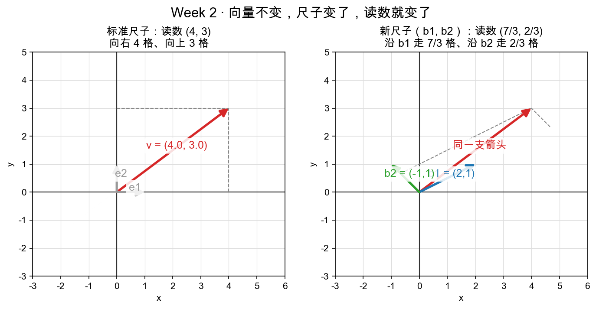

# Day 4：换尺子——同一向量在不同基下的坐标

> 本章你将：
> - 把"换尺子"这件事翻译成一个**配方问题**：$v = s\cdot b_1 + t\cdot b_2$，求 $(s, t)$；
> - 认出这道题就是初中的**二元一次方程组**；
> - 一步步复习**加减消元法**，全程手算，不许跳步；
> - 看懂"无解 / 无穷多解"分别对应两把尺子的什么毛病；
> - 用代码坐标验证图片里的读数 $(\frac{7}{3}, \frac{2}{3})$。

---

## 4.1 配方问题：箭头有了，尺子有了，读数怎么算？

Day 3 我们用斜尺子 $b_1 = (2, 1)$、$b_2 = (-1, 1)$，说"平面上任何向量都能写成 $s\cdot b_1 + t\cdot b_2$"。现在把箭头固定下来，算一次实的。

取那支红箭头：

$$ v = (4, 3) $$

我们想知道：**在新尺子 $b_1$、$b_2$ 下，$v$ 的读数 $(s, t)$ 是多少？** 也就是求 $s$、$t$，使得：

$$ s\cdot b_1 + t\cdot b_2 = v $$

把一个"用配方调制出 v"的问题，看成"配方的量各是多少"。这就是**配方问题**——已知配方表（两支尺子）和成品（箭头 $v$），反推每种原料（系数）加了多少。

把向量乘进去、坐标一一对上：

$$
\begin{aligned}
s\cdot(2, 1) + t\cdot(-1, 1) &= (4, 3) \\\\
\text{x 坐标：}\quad 2s - t &= 4 \\\\
\text{y 坐标：}\quad s + t &= 3
\end{aligned}
$$

看到这两个式子了吗？两个未知数 $s$、$t$，两个方程——这就是初中就反复练过的**二元一次方程组**。所以你早就会解"换尺子"，只是当时没人告诉你它在干嘛。

> 📌 **划重点：换基 = 解二元一次方程组。** 基的量在新尺子下是"几格"，解出来的 $s$、$t$ 就是那几格。

---

## 4.2 用图先看一眼答案

在开算之前，先看看这张图，对答案有个预期：



左边：标准尺子读数是 $(4, 3)$，向右 4 格、向上 3 格——这是我们习以为常的读法。

右边：同一支箭头，换成斜尺子 $b_1$、$b_2$ 后，读数变成了 $(\frac{7}{3}, \frac{2}{3})$——沿 $b_1$ 走 $\frac{7}{3}$ 格，沿 $b_2$ 走 $\frac{2}{3}$ 格，就精确抵达同一支箭头。

**箭头一个没动，读数却从 $(4, 3)$ 变成了 $(\frac{7}{3}, \frac{2}{3})$。** 这就是 Day 3 那个"东西没动，读数变了"的活例子。下面这段代数，就是把 $(\frac{7}{3}, \frac{2}{3})$ 老老实实算出来的过程。

---

## 4.3 加减消元法：一步一步来

方程组：

$$
\begin{aligned}
2s - t &= 4 \qquad &\text{…… ①} \\\\
s + t &= 3 \qquad &\text{…… ②}
\end{aligned}
$$

初中老师教过"加减消元法"，规律是：**把某个未知数的系数凑成相同，然后两式相加或相减，消掉它，变成一元一次方程。**

这里我们消 $t$（因为 ① 里 $t$ 的系数是 $-1$，② 里是 $+1$，加起来正好抵消——这是最省事的选择）。

**第一步：把 ① 和 ② 直接相加，消掉 $t$。**

$$
\begin{aligned}
(2s - t) + (s + t) &= 4 + 3 \\\\
2s + s + (-t + t) &= 7 \\\\
3s + 0 &= 7 \\\\
3s &= 7
\end{aligned}
$$

**第二步：解出 $s$。**

$$ s = \frac{7}{3} $$

**第三步：把 $s = \frac{7}{3}$ 代回 ②，求 $t$。**

$$
\begin{aligned}
\frac{7}{3} + t &= 3 \\\\
t &= 3 - \frac{7}{3} = \frac{9}{3} - \frac{7}{3} = \frac{2}{3}
\end{aligned}
$$

**第四步：验算（别偷懒，代回 ① 检查）。**

$$ 2\cdot\frac{7}{3} - \frac{2}{3} = \frac{14}{3} - \frac{2}{3} = \frac{12}{3} = 4 \qquad \checkmark $$

答案：$(s, t) = (\frac{7}{3}, \frac{2}{3})$。和图里的读数一模一样。

> 💡 **你可能会问：为什么选消 $t$ 而不是消 $s$？** 因为 $t$ 的系数 $-1$ 和 $1$ 加起来正好是 $0$，一步到位。消 $s$ 也行（要先把系数凑成一样），但多几步。消元法的精华就是**挑好消的那个未知数下手**——这也是 Day 5 代码里"选主元"的雏形。

---

## 4.4 消元法的三个通用步骤

把上面这四步抽象成模板（任何二元一次方程组都适用）：

1. **凑系数**：让两个式子里某一个未知数的系数**绝对值相同**（例如都变成 $a\cdot c$）；
2. **相减/相加消元**：两式相减（或相加），把那个未知数消掉，得到只有一个未知数的一元方程；
3. **回代**：解出这个未知数后，代回原方程组里的任意一个式子，求出另一个。

这套流程，明天（Day 5）你要一字不差地写进 `solve_2x2` 里。现在先在纸面上把它演练熟。

---

## 4.5 当尺子"不好"时：无解与无穷多解

不是所有尺子都能唯一地读出坐标。回想 Day 2：两支共线的箭头张不成平面，只能铺一条线。换到"解方程"的语言，就是下面两张病态情况：

### 情况一：无解（两尺子平行）

$$
\begin{aligned}
b_1 &= (1, 1), \qquad b_2 = (2, 2) \qquad &(\leftarrow\ b_2 \text{ 就是 } b_1 \text{ 的两倍，两支共线}) \\\\
v &= (1, 2) \qquad &
\end{aligned}
$$

配方方程：

$$
\begin{aligned}
s + 2t &= 1 \qquad &\text{…… } x \text{ 方向} \\\\
s + 2t &= 2 \qquad &\text{…… } y \text{ 方向}
\end{aligned}
$$

同一个 $s + 2t$，一个式子说它等于 1，另一个说等于 2——**自相矛盾，无解**。几何上，$s\cdot b_1 + t\cdot b_2$ 只能落在一条穿过原点的斜线上，而 $v = (1, 2)$ 根本不在这条线上，所以够不着。两把尺子"平行"，量不出这个点。

### 情况二：无穷多解（两尺子重合，v 恰好在那条线上）

$$
\begin{aligned}
b_1 &= (1, 1), \qquad b_2 = (2, 2) \\\\
v &= (3, 3) \qquad &&\leftarrow\ \text{这次 } v \text{ 落在尺子的那条线上了}
\end{aligned}
$$

配方方程：

$$
\begin{aligned}
s + 2t &= 3 \\\\
s + 2t &= 3
\end{aligned}
$$

两个式子其实**是同一句话**，只有一个独立的约束，$s$ 和 $t$ 有无数种搭配（比如 $s=1,\ t=1$；$s=3,\ t=0$；$\dots$）都能凑出 $(3, 3)$。几何上，$v$ 在尺子的斜线上，有无数种"走法"到达它——**读数不唯一**。

总结成一张表：

| 尺子状况 | 几何含义 | 方程组 | 结果 |
|---|---|---|---|
| 两支不共线 | 两条刻度轴交于一点 | 有唯一解 | 一个确定读数 $(s, t)$ |
| 两支平行（共线）且够不着 $v$ | 量不到这个点 | 矛盾 | 无解 |
| 两支重合（共线）且 $v$ 恰在线上 | 有无数种走法 | 两式等价 | 无穷多解 |

> 📌 **划重点：尺子不共线 → 每点有唯一读数；尺子共线 → 不是量不到（无解），就是量法不唯一（无穷解）。** "共线"这同一个病根，Day 2 用图说，这里用方程再说了一遍。

> ⚠️ **易踩坑：无解 $\neq$ 无穷多解。** 无解是"式子打架"（$1=2$ 这种矛盾）；无穷多解是"式子重样"（第二个式子是第一个的倍数，没给你新信息）。区分的关键是看**右边常数**：系数成比例但常数不成比例 → 无解；系数和常数都成比例 → 无穷多解。

---

## 📌 AI 联系：从一个视角"解"回另一个视角

"已知配方表 + 成品，反推配方比例"这道题，在 AI 里有个耳熟能详的名字——**线性回归 / 解线性系统**。等 Week 7 你会正面遇到 $Ax = b$（已知变换和结果，求输入），那正是这道二元题的 n 元推广。

现在先把"消元"这个手法练熟。它后面会一路升级成高斯消元，是 Week 7 的主角工具。

---

## 动手练习

本章先不写新代码（`solve_2x2` 是明天的主角），练习是**手算 + 用已有代码核对**：

1. 手算这道换基题（建议拿纸笔，把消元每一步写出来）：

基 $b_1 = (1, 0)$，$b_2 = (1, 1)$；向量 $v = (3, 2)$。求 $v$ 在新基下的读数 $(s, t)$。

提示：配方方程是 $s\cdot(1,0) + t\cdot(1,1) = (3,2)$，即 $s + t = 3$、$t = 2$。答案留给你自己核。

2. 用代码验证图片里 $v=(4,3)$、$b_1=(2,1)$、$b_2=(-1,1)$ 的读数，确认是 $(\frac{7}{3}, \frac{2}{3})$：

```bash
cd /Users/codinghuang/codeDir/study/matrix-intuition
IMPL=reference python -c "
from reference.solve2 import coordinates_in_basis
print(coordinates_in_basis([2,1],[-1,1],[4,3]))
"
```

应打印约 $(2.333\dots,\ 0.666\dots)$，即 $(\frac{7}{3}, \frac{2}{3})$。

## 参考答案

本轮换基的完整实现（`solve_2x2` + `coordinates_in_basis`）在 `reference/solve2.py`，明天你会亲手写出它；今天先看懂它的输入输出含义即可。

---

下一章，把这套消元法真正写成 Python——**换基器**登台，同时处理"第一个式子没有 x 要交换"的坑。

👉 [Day 5：代码实战——换基器与"配方"求解](./05-Day5-代码实战-换基器与配方求解.md)
