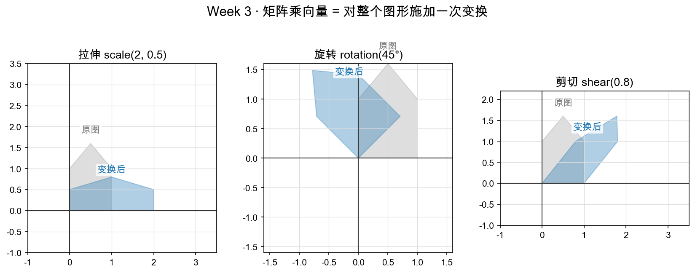

# Day 1：三个开胃变换——拉伸、旋转、剪切

> 本章你将：
> 1. 第一次"看见"**矩阵 = 变换 = 空间的运动**这个核心直觉；
> 2. **从零学会 $\sin$ 和 $\cos$**（单位圆定义，初中就能懂），并会背 $0^\circ/90^\circ/180^\circ$ 的取值表；
> 3. 亲手写出**拉伸、旋转、剪切**三个矩阵，理解旋转矩阵"每列 = $e_1/e_2$ 转到哪"的读法；
> 4. 跑通 Week 3 的第一组测试。

---

## 1.1 从一个"搬家"的比喻开始

你在 Week 1 见过向量，Week 2 见过基（尺子）。今天我们要认识一个新朋友：**矩阵**。

先别管它那一堆方括号里的数字，我们从生活里找感觉。

想象你手里有一张**照片**（上面画着一个小房子）。你现在想对它做三件事：

- **放大/压扁**：把照片横着拉宽、竖着压矮，或者反过来；
- **转一下**：照片逆时针转 45 度；
- **推歪**：照片保持底边不动，上面往右滑——就像手里一副扑克牌，从上往下看，整叠被斜着推了一下。

三件事，效果完全不同。但它们背后是**同一个思想**：

> **矩阵就是一条"搬运规则"：它告诉你，平面上的每一个点，要搬到哪个新位置去。**

我们给这张照片上的每个顶点（其实就是一个个坐标），套用这条规则，得到新坐标；把所有新坐标连起来，就得到一张变形后的照片。所谓"照片被变换了"，本质上是"照片上的每一个点被同一条规则搬到了新家"。

这条"规则"，在数学里的名字叫**变换（transformation）**；它的记法，就是一个小方括号的数表——**矩阵（matrix）**。

> 📌 **划重点：** 矩阵不是一堆随便摆的数字。它是一个**动作**、一条**搬运规则**。将来你看到任何矩阵，第一反应应该是"它会怎么动空间"，而不是"这些数字是什么"。

这个概念是整个课程的地基。孟岩在《理解矩阵》里把它一句话说透了：

> **"矩阵的本质是运动的描述。"**

（他还补了一句更严谨的：运动是瞬间发生的、从一个点"跃迁"到另一个点，所以更准确的说法是"矩阵是线性空间里**变换**的描述"。我们这一周就围绕这句话展开。）

---

## 1.2 矩阵长什么样，怎么"念"

先看一眼矩阵的"长相"。一个 $2\times2$ 矩阵是 2 行 2 列的数表：

$$
\begin{bmatrix} a & b \\ c & d \end{bmatrix}
$$

我们读作："a、b、c、d 四个数，摆成两行两列。"

在代码里，它就是一个"列表的列表"（也叫**行主序**，先一行一行地读）：

```python
M = [[a, b],
     [c, d]]
```

第一行是 `[a, b]`，第二行是 `[c, d]`。这一点请先记住，后面所有代码都是这个约定。

> 💡 **你可能会问：为什么要用"方括号里套方括号"这么啰嗦的写法？**
>
> 因为矩阵天然是"一行一行"的：外层列表里有几项，矩阵就有几行；每一项（内层列表）里有几个数，这一行就有几列。$2\times2$ 就是"外层 2 项，每项 2 个数"。等你写到 Week 8 的神经网络，矩阵会有几百行几千列，那时候你就明白"列表的列表"有多大用处了。

现在，先别管矩阵怎么算。我们直接跳过"算"，去看三个最直观的变换**长什么效果**。

---

## 1.3 开胃菜一：拉伸（scale）

**拉伸**就是让横竖两个方向各放大/缩小一定的倍数。

设想一条规则："x 坐标乘 2，y 坐标乘 3"。那么点 $(1, 1)$ 会搬到 $(2, 3)$，点 $(1, 0)$ 会搬到 $(2, 0)$，点 $(0, 1)$ 会搬到 $(0, 3)$。整个平面被横向拉宽 2 倍、纵向拉高 3 倍。

把这条规则写成矩阵，就是：

$$
\begin{bmatrix} 2 & 0 \\ 0 & 3 \end{bmatrix}
$$

粗略读法是：主对角线（左上到右下）上的 `2` 和 `3`，分别控制 x 和 y 的缩放；副对角线上的 `0` 表示"两个方向不干扰"。

先在代码里表达它（你 Day 2 才真正用它算向量，今天先把"骨架"搭起来）：

```python
def scale_matrix(sx, sy):
    """缩放矩阵：x 方向拉伸 sx 倍，y 方向拉伸 sy 倍。"""
    return [[sx, 0.0],
            [0.0, sy]]
```

> 💡 **你可能会问：sx 或 sy 能不能是 0、负数，甚至小数？**
>
> 都能。`sx=0` 表示把东西拍扁到 y 轴（x 全变 0）；`sx=-1` 表示左右翻个面（镜像）；`sx=0.5` 表示缩小一半。矩阵就是这么灵活——参数一换，动作就变。不过 Week 3 我们先用正的倍数建立直觉，极端的（0 会把空间压扁，Week 4 会专门讲"压扁了就回不去"）先不急。

---

## 1.4 开胃菜二：旋转（rotation）——先花十分钟学会 sin 和 cos

旋转是最漂亮、也最重要的是一个——**Week 6 的 RoPE 位置编码，用的就是它**。但旋转矩阵里会冒出两个陌生的记号：`sin` 和 `cos`。

你可能只在计算器上摁过 SIN、COS 这两个键，从没弄懂它俩是什么。没关系，**这两兄弟其实特别简单**，就是"单位圆上某个角度的坐标"。我们用十分钟把它彻底讲透。

### 1.4.1 先回想"角度"

一个角 $\theta$（读作"西塔"，就是角度的意思），我们规定从**正东方向（x 轴正方向）**开始，**逆时针**转 $\theta$ 度。

比如：

- $\theta = 0^\circ$：不转，还在正东；
- $\theta = 90^\circ$：从正东逆时针转了 90°，指向**正北**；
- $\theta = 180^\circ$：转到**正西**；
- $\theta = 45^\circ$：正好在东北方向的中间。

### 1.4.2 单位圆：半径 1 的钟面

现在画一个**圆，圆心在原点 $(0,0)$，半径是 1**。这个圆叫**单位圆**（"单位"就是"长度 1"）。

想象一根指针：一头钉在圆心，另一头落在圆上，长度恒为 1。这根指针一开始指向正东（落在点 $(1,0)$），然后**逆时针转 $\theta$ 度**。转完之后，指针的**尖端落在圆上的某个点**，我们把这个点的坐标记作 **$(x, y)$**。

> 你可以在脑子里放映这个画面：一根指针从"→"（正东）逆时针拨动，拨到 $\theta^\circ$ 时停住，记下它现在指着的位置。指针每多拨一度，尖端就在圆上挪一点——"角度"和"圆上的那个点"是一一对应的。

好，关键来了——**sin 和 cos 就是那根指针尖端坐标的两个分量**：

> - **$\cos\theta$ = 这个点的 x 坐标**（横坐标）；
> - **$\sin\theta$ = 这个点的 y 坐标**（纵坐标）。

一句话：**cos 是"横"，sin 是"纵"。**

就这么简单。`cos` 和 `sin` 不是神秘函数，它们就是"给一个角度，返回单位圆上那个点的横/纵坐标"的机器。

### 1.4.3 先背 0°、90°、180° 这三个值的表

用上面的定义，我们直接"看"出三个特殊角的值。指针从正东出发：

| 角度 $\theta$ | 指针指向 | 尖端坐标 $(x, y)$ | $\cos\theta$ | $\sin\theta$ |
|---|---|---|---|---|
| $0^\circ$ | 正东 | $(1, 0)$ | 1 | 0 |
| $90^\circ$ | 正北 | $(0, 1)$ | 0 | 1 |
| $180^\circ$ | 正西 | $(-1, 0)$ | -1 | 0 |

把它读一遍，你会恍然大悟：

- $\cos 0^\circ = 1$，$\sin 0^\circ = 0$ —— 因为指向正东，横坐标是 1、纵坐标是 0；
- $\cos 90^\circ = 0$，$\sin 90^\circ = 1$ —— 指向正北，横坐标 0、纵坐标 1；
- $\cos 180^\circ = -1$，$\sin 180^\circ = 0$ —— 指向正西，横坐标 -1。

**这张表你会反复用**（Day 2 手算旋转 90°、Day 3 手算旋转 180°、Day 6 的 RoPE 全都要），建议现在就在脑子里过三遍。

> 💡 **你可能会问：45° 这种"不整"的角呢？**
>
> 用定义一样能求：指针逆时针转 45°，落点在东北方向的中间，横坐标、纵坐标都约等于 0.707（精确值是 $\sqrt{2}/2$）。这些值不用你背、不用你手算，Python 的 `math.cos`、`math.sin` 会替你算精确到小数点后十几位。你只需要**理解定义**——cos 是横、sin 是纵——剩下的交给代码。

### 1.4.4 为什么旋转要叫 sin 和 cos 来帮忙

现在我们把指针的"转 $\theta$ 度"翻译成"搬家规则"。

设想一根向量，本来指向正东，即 $(1, 0)$。让它逆时针转 $\theta$ 度，它的尖端就落到单位圆上"$\theta^\circ$"那个点上。按上面对 sin/cos 的定义，这个新坐标**正好就是 $(\cos\theta, \sin\theta)$**。

再设想一根指向正北的向量 $(0, 1)$。让它也逆时针转 $\theta$ 度——正北本来就比正东"超前 90°"，再转 $\theta$ 度就更超前了。你稍微在脑子里转一下指针就会发现，它落在 **$(-\sin\theta, \cos\theta)$** 这个点上（下面 1.5 节会用 $\theta=90^\circ$ 验证给你看）。

于是我们得到了旋转矩阵：

$$
\begin{bmatrix} \cos\theta & -\sin\theta \\ \sin\theta & \cos\theta \end{bmatrix}
$$

代码里这样写（先搭骨架，Day 2 再具体算）：

```python
import math

def rotation_matrix(theta_deg):
    """旋转矩阵：把向量逆时针旋转 theta 度。"""
    t = math.radians(theta_deg)   # 把"度"换成计算机喜欢的"弧度"
    c, s = math.cos(t), math.sin(t)
    return [[c, -s],
            [s,  c]]
```

> ⚠️ **易踩坑：`math.cos` 要的是"弧度"，不是"度"。**
>
> Python 的 `math.cos(90)` 会算成 cos(90 弧度)，而不是你想要的 cos $90^\circ$。所以要先 `math.radians(90)`，把 $90^\circ$ 转换成"弧度"再喂给 cos/sin。`math.radians` 就干一件事：度 $\times \pi/180 \to$ 弧度。**这个转换永远别忘掉。**（"弧度"是角度的另一种度量单位，你现在只需要知道"转一下就行"，不必深究。）

### 1.4.5 旋转矩阵的"列"读法（关键，先记住这个直觉）

旋转矩阵有两列：

- **第一列 $(\cos\theta, \sin\theta)$**：是 $(1,0)$ 这个向量旋转 $\theta$ 度之后的位置。也就是我们上面推的——正东转 $\theta$ 度，落到 $(\cos\theta, \sin\theta)$。
- **第二列 $(-\sin\theta, \cos\theta)$**：是 $(0,1)$ 这个向量旋转 $\theta$ 度之后的位置。

> 📌 **划重点（本周最重要的一句话之一）：矩阵的每一列，就是"标准基向量被变换后落在哪"。**
>
> - 第 1 列 = $e_1=(1,0)$ 被变换后的位置；
> - 第 2 列 = $e_2=(0,1)$ 被变换后的位置。
>
> 这个读法今天先记住，Day 2 它会直接"长出"矩阵乘向量的规则，Day 3 会"长出"矩阵乘法，Week 4 还会告诉你"矩阵的列 = 一组新基"。**它是理解矩阵的总开关。**

---

## 1.5 开胃菜三：剪切（shear）

最后一个变换最好玩，叫**剪切**（shear）。想象一叠扑克牌，用手按住最底下一张，然后把上面整叠往右推——牌面不再是直角矩形，而是被"推斜"了。

规则是：**x 坐标要加上"k 倍的 y"**，y 坐标不变。

写成矩阵：

$$
\begin{bmatrix} 1 & k \\ 0 & 1 \end{bmatrix}
$$

代码：

```python
def shear_matrix(k):
    """剪切矩阵：x 方向的平移量随 y 线性变化（像一副被推歪的扑克牌）。"""
    return [[1.0, k],
            [0.0, 1.0]]
```

怎么理解它？看两个关键点：

- $y = 0$ 的那条线（x 轴）上的点，$(x, 0)$ 会变成 $(x + k\cdot0, 0) = (x, 0)$——**原地不动**；
- 越往上（y 越大）的点，被往右推得越远。比如 $y=1$ 高度的整条水平线，整体向右挪了 k 个单位。

所以地板（x 轴）纹丝不动，高层被往右推——就是"推歪扑克牌"的画面。

三个开胃菜上齐了。我们把它们排成一排看：



> 左边**拉伸** scale(2, 0.5)：横向拉宽、纵向压矮；
> 中间**旋转** rotation(45°)：整个房子逆时针转 45 度；
> 右边**剪切** shear(0.8)：地面不动、屋顶往右滑。
>
> 注意这三张图里，**变换前后对应顶点的连线方向各不相同**——这正是"不同矩阵 = 不同搬运规则"的直观体现。但它们都被同一个框架描述：**矩阵决定每个点去哪。**

---

## 1.6 三个矩阵的"身份证"

一张表收尾，把三个变换钉在脑子里：

| 变换 | 矩阵 | 效果 | 关键参数 | 谁变了 |
|---|---|---|---|---|
| 拉伸 scale | `[[sx,0],[0,sy]]` | 横乘 sx、纵乘 sy | sx, sy 两个倍数 | 大小 |
| 旋转 rotation | `[[cosθ,-sinθ],[sinθ,cosθ]]` | 逆时针转 $\theta$ 度 | $\theta$ 一个角度 | 朝向 |
| 剪切 shear | `[[1,k],[0,1]]` | $x$ 加 $k\cdot y$ | k 一个系数 | 形状 |

> 📌 **AI 联系：** 别小看这三个"玩具"。真实的大模型里，**拉伸 $\approx$ 缩放数值**、**旋转 $\approx$ RoPE 位置编码（Day 6）**、**剪切 $\approx$ 某种几何变形**——它们不是课本例子，而是大量矩阵的"原子动作"。你今天建立的"矩阵 = 搬运规则"直觉，会一路用到 Week 8。

---

## 动手练习

1. 打开 `matrixlab/mat.py`，把 `scale_matrix`、`rotation_matrix`、`shear_matrix` 三个函数实现出来（照抄 1.3、1.4、1.5 节的思路即可，注意 `rotation_matrix` 要先 `math.radians`）。
2. 在项目根目录跑：

```bash
pytest tests -k w3 -q
```

   你暂时只会绿掉"用到这三个矩阵"的测试（比如 `test_matvec_scale` 里的 `mat.scale_matrix(2,3)` 会先用上它），`matvec` 那条还没实现，会红——这正常，Day 2 把它补上。
3. 手写三个矩阵值，验证你的理解：`scale_matrix(2,3)`、`rotation_matrix(90)`、`rotation_matrix(180)`、`shear_matrix(1)` 分别应该等于什么？写完对照 `reference/mat.py` 里的同名函数。

## 参考答案

`reference/mat.py` 里 `scale_matrix` / `rotation_matrix` / `shear_matrix` 三个函数就是标准答案。**卡住 20 分钟再看**，重点看 `rotation_matrix` 里 `math.radians` 那一行的用意。

---

👉 下一章：[Day 2：矩阵乘向量——为什么这么算](./02-Day2-矩阵乘向量-为什么这么算.md)
