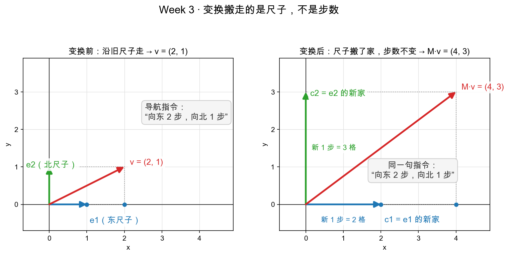
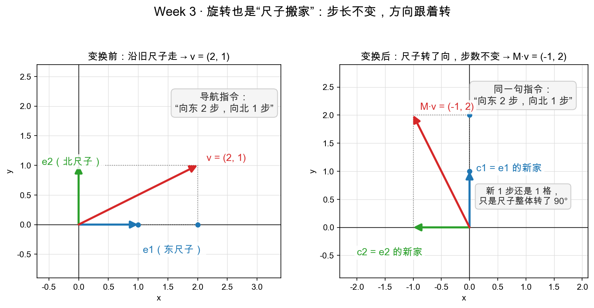

# Day 2：矩阵乘向量——为什么这么算

> 本章你将：
> 1. 搞懂矩阵"到底怎么搬一个点"——**矩阵乘向量（matvec）的规则**；
> 2. 明白这条规则**不是瞎规定的**，而是"$e_1$、$e_2$ 被变换后坐标怎么变"的必然结果；
> 3. 亲手实现 `matvec`，并手算 2-3 个例子对上答案；
> 4. 用"网格不扭曲"的直觉，认识变换的**线性性质**。

---

## 2.1 一个悬而未决的问题

Day 1 我们看了三个矩阵，知道"矩阵是搬运规则"，但一直**没讲它到底怎么把点搬过去**。矩阵是一串数字，向量是一个点 $(x, y)$，这两样东西怎么"相乘"得到新点？

这一章就回答它。而且你会发现：**这个规则不是数学家随手指定的，它是被"e1、e2 两个向量怎么动"逼出来的。**

先记住 Day 1 结尾那个总开关：

> 矩阵第 1 列 = $e_1=(1,0)$ 变换后的位置；第 2 列 = $e_2=(0,1)$ 变换后的位置。

---

## 2.2 回忆：任意向量都能用 e1、e2 "拼"出来

Week 2 讲过，平面上任何向量都能写成两根"标准尺子"的组合。

标准基有两个向量：

- $e_1 = (1, 0)$：正东方向、长度 1 的尺子；
- $e_2 = (0, 1)$：正北方向、长度 1 的尺子。

任意的向量 $v = (x, y)$，都可以拆成：

$$
\begin{aligned}
v &= x\cdot e_1 + y\cdot e_2 \\\\
  &= x\cdot(1,0) + y\cdot(0,1) \\\\
  &= (x, 0) + (0, y) \\\\
  &= (x, y)
\end{aligned}
$$

也就是说：**"向东走 x 步，再向北走 y 步"。** x 和 y 就是这份"配方"（Week 2 的话）里的两个配比。

这个拆解看起来是废话，但它是今天一切的关键——因为接下来我们只关心"e1 和 e2 两个向量被变换后去了哪"，用这两个信息，就能求出**任意**向量去哪。

---

## 2.3 关键一步：变换只看 e1、e2 就够了

假设有一个变换（矩阵 $M$），我们已经知道它做了两件事：

1. 把 $e_1=(1,0)$ 搬到了某个位置，叫它 **$c_1 = (a, c)$**（矩阵的第一列）；
2. 把 $e_2=(0,1)$ 搬到了某个位置，叫它 **$c_2 = (b, d)$**（矩阵的第二列）。

现在问：任意的 $v = (x, y)$ 会被搬到哪？

v 是 x 份 $e_1$ 加 y 份 $e_2$ 拼出来的。一个"讲道理"的变换，必须遵守一条常识：**"几份东西拼起来搬过去，等于每一份各自搬过去再拼起来。"**

说得具体点：

- $e_1$ 搬去 $c_1$，那 x 份 $e_1$ 就该搬去 x 份 $c_1$，即 $x\cdot c_1$；
- $e_2$ 搬去 $c_2$，那 y 份 $e_2$ 就该搬去 y 份 $c_2$，即 $y\cdot c_2$；
- 两者拼起来，$v = x\cdot e_1 + y\cdot e_2$ 就该被搬到 **$x\cdot c_1 + y\cdot c_2$**。

用式子写：

$$
\begin{aligned}
M\cdot v &= M\cdot(x\cdot e_1 + y\cdot e_2) \\\\
         &= x\cdot M\cdot e_1 + y\cdot M\cdot e_2 \\\\
         &= x\cdot c_1 + y\cdot c_2
\end{aligned}
$$

把 $c_1$、$c_2$ 换成它们的坐标 $(a, c)$、$(b, d)$，再展开：

$$
x\cdot(a, c) + y\cdot(b, d) = (a x + b y,\ c x + d y)
$$

于是矩阵乘向量就"闪亮登场"了：

$$
\begin{bmatrix} a & b \\\\ c & d \end{bmatrix}
\begin{bmatrix} x \\\\ y \end{bmatrix} =
\begin{bmatrix} a\cdot x + b\cdot y \\\\ c\cdot x + d\cdot y \end{bmatrix}
$$

这套规则还藏着一个更省脑的读法。**别把 $(x, y)$ 只当成两个坐标——把它当成一句导航指令**："沿尺子 $e_1$ 走 x 步，沿尺子 $e_2$ 走 y 步。"（就是 2.2 节那句"向东走 x 步，再向北走 y 步"。）

变换发生时，尺子被搬走了（$e_1$ 搬到 $c_1$，$e_2$ 搬到 $c_2$），但**这句指令一个字都没改**。所以想知道 v 去哪，根本不用背公式——拿着同一句指令，在新尺子体系里重新走一遍就行：



左图是变换前：沿 $e_1$ 走 2 步、沿 $e_2$ 走 1 步，到达 $v=(2,1)$。右图是变换后（拉伸 `scale_matrix(2, 3)`，横 $\times 2$、纵 $\times 3$）：尺子搬了家，$e_1$ 的新家 $c_1=(2,0)$、$e_2$ 的新家 $c_2=(0,3)$，新尺子的"1 步"分别变长成 2 格和 3 格。但指令没变，还是"2 步 + 1 步"——沿新尺子重走一遍，自然落在 $2\cdot c_1 + 1\cdot c_2 = (4,3)$，和公式算出来的分毫不差。

**x、y 是"走几步"的计数，不是空间里的固定坐标；尺子搬去哪，步数跟着尺子走。** 这就是为什么矩阵乘向量可以直接拿原向量的配比，分别去乘 $e_1$、$e_2$ 的新家。

再来一个**旋转**的例子——这回尺子不变长，只是整体转了向。还是那句指令"向东 2 步，向北 1 步"，变换换成 `rotation_matrix(90)`（逆时针转 90°）：



左图照旧。右图是旋转 90° 之后：$e_1$ 的新家 $c_1=(0,1)$（东尺子转成了"北尺子"），$e_2$ 的新家 $c_2=(-1,0)$（北尺子转成了"西尺子"）。注意它和拉伸的本质区别：**新尺子的"1 步"还是 1 格，一点没变长，只是两根尺子一起转了 90°。** 指令照旧——沿 $c_1$ 走 2 步、沿 $c_2$ 走 1 步，落在 $2\cdot c_1 + 1\cdot c_2 = 2\cdot(0,1) + 1\cdot(-1,0) = (-1,2)$。套公式算一遍：$R(90)\cdot(2,1) = (0\cdot2 + (-1)\cdot1,\ 1\cdot2 + 0\cdot1) = (-1,2)$，分毫不差。

拉伸和旋转，看上去是两种毫不相干的动作，可读法一模一样：**都是"同一句指令、换套尺子重走一遍"。** 差别只在尺子怎么搬——拉伸把尺子拉长了（步长变了），旋转把尺子转向了（步长不变）。这就是"矩阵的列 = 尺子新家"这一个读法的威力：不管是什么变换，先问"$e_1$、$e_2$ 搬去了哪"，剩下的全是走路。

> 📌 **划重点：** 所谓"矩阵乘向量"，本质就是一句话——**变换搬走的是尺子，不是步数**。新向量 = x 乘以"第一列" + y 乘以"第二列"：x、y 是导航指令里的两个步数（原向量的配比），第一列、第二列是 $e_1$、$e_2$ 的新家。这不是背公式，是"同一句指令、换套尺子重走一遍"的直接结果。

> 🔍 **再往深看一层（学习者批注）：** 有没有发现一件事——**吃进去的 $(x,y)$ 和吐出来的结果，用的不是同一套尺子。**
>
> 拿旋转的例子说：输入 $(2,1)$ 是"新尺子上的步数"（沿 $c_1$ 走 2 步、沿 $c_2$ 走 1 步——确切说，"东/北"的含义跟着尺子走，这句指令其实是"沿 1 号尺子走 2 步、沿 2 号尺子走 1 步"）；可算出来的 $(-1,2)$ 却是**旧尺子下的读数**。为什么？因为矩阵的列 $c_1=(0,1)$、$c_2=(-1,0)$ 本身就是"用旧尺子的语言写下来的新尺子位置"——$2\cdot c_1 + 1\cdot c_2$ 一加完，结果天然就是旧尺子读数。
>
> 所以矩阵乘向量还是个**翻译官：吃进"新尺子坐标"，吐出"旧尺子坐标"**。"旋转的效果"正来自翻译前后的对比：同一份指令，在旧尺子上走到达 $(2,1)$，在新尺子上走、翻译回旧尺子读作 $(-1,2)$——两份旧尺子读数一比，"点转了 90°"。
>
> 那反过来呢：既然这笔账可以记在"点动了"头上，也可以记在"尺子动了"头上，两种说法是不是永远等价？正是。Week 4 Day 2 会把这句话正式立起来——**"对象的变换 等价于 坐标系的变换"**，说白了：运动是相对的。今天先记住"翻译官"这个手感就够了。

看到这你会发现，Day 1 的三个矩阵突然全都"活"了。比如旋转矩阵 `[[cosθ,-sinθ],[sinθ,cosθ]]` 的第一列是 $(\cos\theta, \sin\theta)$——就是 $e_1$ 转 $\theta$ 度后的位置；第二列是 $(-\sin\theta, \cos\theta)$——就是 $e_2$ 转 $\theta$ 度后的位置。**矩阵的列，就是"方向尺子"搬去的新坐标。**

---

## 2.4 两个等价的操作读法：行点积 vs 列组合

算 $M\cdot v$ 有两条路，结果一样，选你顺手的：

**读法 A（一行一行地看）：** 结果的每个分量 = M 的某一行和 v"对应相乘再相加"。

$$
\begin{aligned}
\text{第一分量} &= a\cdot x + b\cdot y \quad(\text{第一行}\ [a,b]\ \text{和}\ [x,y]\ \text{配对}) \\\\
\text{第二分量} &= c\cdot x + d\cdot y \quad(\text{第二行}\ [c,d]\ \text{和}\ [x,y]\ \text{配对})
\end{aligned}
$$

这其实就是 Week 5 才会正式介绍、但你现在已经在用的**点积**（对应项相乘、再加起来）。先不用管"点积"这个名字，会算就行。

**读法 B（一列一列地看）：** 结果是"各列的加权和"，权重就是 x、y。

$$
M\cdot v = x\cdot(\text{第一列}) + y\cdot(\text{第二列})
$$

**读法 B 更接近"变换"的直觉**（拼起来搬过去），其实就是 Week 2 学过的"线性组合"老朋友；**读法 A 更好写代码**（一行一个分量）。

看一个具体例子，两个读法都对一遍。$M = \begin{bmatrix}2&0\\\\0&3\end{bmatrix}$（拉伸），$v = (1,1)$：

- 读法 A：第一分量 $= 2\cdot1 + 0\cdot1 = 2$；第二分量 $= 0\cdot1 + 3\cdot1 = 3$ $\to$ 结果 $(2,3)$ ✓；
- 读法 B：第一列 $(2,0)$、第二列 $(0,3)$，结果 $= 1\cdot(2,0) + 1\cdot(0,3) = (2,0)+(0,3) = (2,3)$ ✓。

拉伸放大 2 倍横、3 倍纵，把 $(1,1)$ 变成 $(2,3)$，正是我们 Day 1 的预期。

---

## 2.5 实现 matvec

回顾 `reference/mat.py` 里的实现（今天你要在 `matrixlab/mat.py` 亲手写出它的思路）：

```python
def matvec(M, v):
    """矩阵乘向量：M 的每一行与 v 做点积。"""
    return [M[i][0] * v[0] + M[i][1] * v[1] for i in range(len(M))]
```

逐行看：

- `for i in range(len(M))`：结果有几个分量，就有几行。每行产出一个数。
- `M[i][0] * v[0] + M[i][1] * v[1]`：第 i 行 `[M[i][0], M[i][1]]` 与 v=`[v[0], v[1]]` 对应相乘相加——正是读法 A。

因为本周只处理 $2\times2$ 矩阵和 2 维向量，所以直接写死下标 `[0]`、`[1]` 就够了（Week 8 的神经网络里会用 numpy 处理更大的矩阵，原理完全一样）。

> 💡 **你可能会问：这个函数怎么只看矩阵的行数，不看列数？**
>
> 因为答案是"每行产出一个分量"，结果长度 = 矩阵行数。而"每行和 v 做点积"要求**行里的个数 = v 的维数**，也就是矩阵列数必须等于 v 的长度——$2\times2$ 矩阵配 2 维向量，天然吻合。若有人拿 $3\times3$ 乘 2 维向量，下标 `[2]` 就会越界报错，那是"维度不匹配"，属于调用者的错误。

---

## 2.6 手算三个例子，对上测试

手算是最好的检验。下面三个例子，分别对应 `tests/test_w3_mat.py` 里的三条测试。

### 例 1：拉伸把 e1、e2 拉长

$M = \text{scale\_matrix}(2, 3) = \begin{bmatrix}2&0\\\\0&3\end{bmatrix}$：

- $e_1=(1,0)$ 去哪？第一列 $(2,0)$。心算：横乘 2、纵乘 3 → $(2,0)$ ✓
- $e_2=(0,1)$ 去哪？第二列 $(0,3)$ ✓
- $v=(1,1)$ 去哪？$(2\cdot1+0\cdot1,\ 0\cdot1+3\cdot1) =$ **$(2,3)$** ✓（就是测试 `test_matvec_scale` 的断言）

### 例 2：旋转 90°（东 → 北，北 → 西）

Day 1 背过：$\cos 90^\circ = 0$，$\sin 90^\circ = 1$。所以 $R(90) = \begin{bmatrix}0&-1\\\\1&0\end{bmatrix}$。

- $e_1=(1,0)$ 去哪？第一列 $(0,1)$：正东转到**正北** ✓
- $e_2=(0,1)$ 去哪？第二列 $(-1,0)$：正北转到**正西** ✓
- 套公式验证：$R(90)\cdot(1,0) = (0\cdot1 + (-1)\cdot0,\ 1\cdot1 + 0\cdot0) = (0,1)$ ✓（测试 `test_matvec_rotation_90`）

> 看到没，"旋转 90° 把北转到西"这件事，居然被 `[[0,-1],[1,0]]` 这一串数字完全捕捉了。这就是矩阵的魔力——**一个动作，被四个数字钉死了。**

### 例 3：剪切只推高处的点

$S = \text{shear\_matrix}(1) = \begin{bmatrix}1&1\\\\0&1\end{bmatrix}$：

- $(0,1)$ 去哪？$(1\cdot0+1\cdot1,\ 0\cdot0+1\cdot1) =$ **$(1,1)$**：$y=1$ 高的点，被往右推了 1 个单位 ✓
- $(3,0)$ 去哪？$(1\cdot3+1\cdot0,\ 0\cdot3+1\cdot0) =$ **$(3,0)$**：地面上 $y=0$ 的点纹丝不动 ✓（测试 `test_matvec_shear`）

---

## 2.7 线性：变换"不扭曲网格"

你已经见过变换遵守一条常识——"几份拼起来搬过去，等于先各自搬过去再拼起来"。这条常识有个正式名字，叫**线性（linearity）**。

把它写成两条性质（只记直觉，不证明）：

1. **加进去的，等于各自变完再加**：$M\cdot(u + v) = M\cdot u + M\cdot v$。
2. **放大几倍的，等于变完再放大几倍**：$M\cdot(k\cdot v) = k\cdot(M\cdot v)$（$k$ 是任意倍数）。

直觉版一句话：**线性变换不会把"网格"扭成曲线。**

想象平面上有一张方格纸（坐标网格）。一个线性变换施加后：

- 原来平行的线，变换后**依然平行**；
- 原来等间距的格点，变换后**依然等间距**；
- 直线变直线，原点保持不动。

它只能**伸缩、旋转、剪切**，绝不会把直线弯成抛物线、把方格揉成波浪。

反过来，凡是会"扭曲网格"的（比如"每个点到原点的距离平方一下"，或者"x 坐标加一个固定的 3"这种平移），就**不是线性变换**，也就**不是**单独一个矩阵能干的事——这正是 Day 5 讲 $Wx+b$ 为什么要还带个 $+b$（平移）的原因，先埋个伏笔。

> 📌 **划重点：** 矩阵 = 线性变换 = "不扭曲网格"的运动。判断一个动作能不能用矩阵表示，就问一句"它会扭网格吗"。

---

## 动手练习

1. 实现 `matrixlab/mat.py` 里的 `matvec`（照 2.5 节思路）。
2. 跑：

```bash
pytest tests -k w3 -q
```

   有了 `matvec`，`test_matvec_scale` / `test_matvec_rotation_90` / `test_matvec_shear` 应该全绿（Day 4 之前，`matmul` 那几条还会红，正常）。
3. 手算：用 $M = \begin{bmatrix}1&2\\\\3&4\end{bmatrix}$，求 $M\cdot(1,0)$、$M\cdot(0,1)$、$M\cdot(2,-1)$，再用你写的代码验证一遍。答案提示：三条都等于"x 乘第一列 + y 乘第二列"。

## 参考答案

`reference/mat.py` 里的 `matvec` 是标准答案。**卡住 20 分钟再看**，重点对比你的下标写法和它的差异。

---

👉 下一章：[Day 3：矩阵乘矩阵——变换的复合与顺序](./03-Day3-矩阵乘矩阵-变换的复合与顺序.md)
