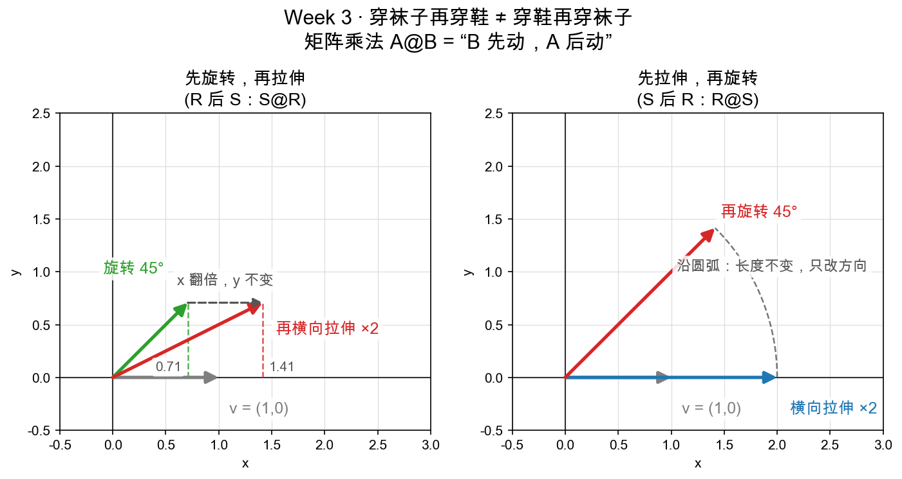

# Day 3：矩阵乘矩阵——变换的复合与顺序

> 本章你将：
> 1. 理解**连续施加两个变换**怎么合成一个（矩阵乘矩阵）；
> 2. 搞懂"行$\times$列点积"这个乘法规则**为什么是必然的**（= 先 B 后 A 的总效果）；
> 3. 牢牢记住 $A@B$ 是"**B 先动、A 后动**"，顺序不能换（穿袜子穿鞋类比）；
> 4. 认识**单位矩阵 $I$ = 什么都不做**。

---

## 3.1 一个人做不来的动作，两个人接力做

Day 2 我们学会了一个变换搬一个点：$M\cdot v$。但现实中，动作常常是**一串**：先拉伸，再旋转；先转 45°，再横向拉宽。

比如图形学里画一个会旋转的小人：你要先把它**旋转**到某个角度，再**平移到**屏幕某个位置，可能还要**缩放**。这是一个动作套一个动作。

问题来了：这一串动作，能不能合并成**一个**动作？

答案：能。而且合并的方式，就是**矩阵乘矩阵**。这一章我们就把这个"合并"的规则彻底搞懂——你会再次发现，**它不是拍脑袋的规定，而是"先 B 后 A"这个总效果逼出来的。**

---

## 3.2 直觉：先 B 后 A 的总效果，就是新矩阵的列

回忆 Day 2 的总开关：**一个矩阵完全由它"把 $e_1$、$e_2$ 送到哪"决定。**

假设我们要"先施加变换 B，再施加变换 A"（注意：先 B，后 A）。这个总效果本身也是一个变换，也由"$e_1$、$e_2$ 最终去哪"决定。我们一步步追：

1. $e_1$ 先被 B 送到 $B\cdot e_1$，再被 A 送到 $A\cdot(B\cdot e_1)$；
2. $e_2$ 先被 B 送到 $B\cdot e_2$，再被 A 送到 $A\cdot(B\cdot e_2)$。

于是，"先 B 后 A"这个总变换，它的两列分别是：

- 第 1 列 = $A\cdot(B\cdot e_1)$；
- 第 2 列 = $A\cdot(B\cdot e_2)$。

而 $B\cdot e_1$ 恰恰是 **B 的第一列**，$B\cdot e_2$ 是 **B 的第二列**（这一点 Day 2 反复强调过）。

所以"先 B 后 A"的矩阵 = **"用 A 去逐个变换 B 的每一列"** 得到的新矩阵。

记这个"先 B 后 A"的总效果为 $A@B$（`@` 是 Python 里矩阵乘法的符号，读作"A 乘 B"），那么：

> 📌 **划重点：** $A@B$ 的每一列 = A 作用在 B 的对应列上。
> - $A@B$ 的第 1 列 = $A\cdot$(B 的第 1 列)；
> - $A@B$ 的第 2 列 = $A\cdot$(B 的第 2 列)。
>
> 这句话是整个矩阵乘法的灵魂，务必刻进脑子。

---

## 3.3 由"列"读法推出"行$\times$列点积"规则

上面是"按列"看的直觉版。现在把它翻译成每个格子该怎么算——也就是大家熟悉的"第 i 行 $\times$ 第 j 列点积"。

设 $A = \begin{bmatrix}a&b\\\\c&d\end{bmatrix}$，$B = \begin{bmatrix}e&f\\\\g&h\end{bmatrix}$。我们要算 $C = A@B$ 的四个格子。

**C 的第 1 列** = A 作用在 B 的第 1 列 $(e, g)$ 上，用 Day 2 的 matvec 规则：

$$
\begin{aligned}
A\cdot(e, g)\ \text{的第一分量} &= a\cdot e + b\cdot g \\\\
A\cdot(e, g)\ \text{的第二分量} &= c\cdot e + d\cdot g
\end{aligned}
$$

所以 C 的第 1 列 = $(a\cdot e+b\cdot g,\ c\cdot e+d\cdot g)$。同理，**C 的第 2 列** = A 作用在 B 的第 2 列 $(f, h)$ 上 = $(a\cdot f+b\cdot h,\ c\cdot f+d\cdot h)$。

把两列并起来，就得到了完整的乘法结果：

$$
\begin{bmatrix} a & b \\\\ c & d \end{bmatrix}
\begin{bmatrix} e & f \\\\ g & h \end{bmatrix} =
\begin{bmatrix} a\cdot e+b\cdot g & a\cdot f+b\cdot h \\\\ c\cdot e+d\cdot g & c\cdot f+d\cdot h \end{bmatrix}
$$

现在你就能看懂"行$\times$列点积"这个规矩了：

- C 的第 i 行第 j 列 = （A 的第 i 行）和（B 的第 j 列）**对应相乘再相加**。
- 比如 C 的左上角 $a\cdot e + b\cdot g$，就是 A 第一行 `[a,b]` 和 B 第一列 `[e,g]` 的点积。

> 📌 **划重点：** "行$\times$列点积"不是数学家随便规定的。它是"先 B 后 A 的总效果"这个**几何事实**，翻译成数字计算的形式罢了。几何先有（先动谁后动谁），公式后写（怎么算每个格子）。

---

## 3.4 顺序不能换：穿袜子再穿鞋 $\neq$ 穿鞋再穿袜子

现在到最容易翻车、也最重要的一点：**$A@B$ 和 $B@A$ 一般不一样。**

$A@B$ 的意思是"**B 先动，A 后动**"——注意，它和**阅读顺序相反**（写在左边 A 是后动的，写在右边 B 是先动的）。

生活里穿衣服就是最好的类比：

> 早晨起床，**先穿袜子（B），再穿鞋（A）**。这个顺序很自然。
> 但如果你**先穿鞋（A→B 反过来），再穿袜子（B→A）**——袜子套在鞋子外面，就很荒谬，效果完全不同。

矩阵乘法 $A@B$ 就是这个味道：**先干的写在右边，后干的写在左边。** 换一下顺序，结果往往完全不同。

用图上看得更清楚。先把这两个动作各自的"规矩"说死：

- **旋转 $R$**：把任何向量逆时针转 45°，长度不变；
- **横向拉伸 $S=\begin{bmatrix}2&0\\\\0&1\end{bmatrix}$**：把任何向量的 **x 分量翻倍，y 分量原封不动**。它认的是**固定的 x 轴**——不是"把箭头沿它自己的指向变长"，而是"把箭头在 x 轴上的影子翻倍，高度不管"。



> 左图（$S@R$，先转后拉）：$v=(1,0)$ 先被转到 45°，终点 $(0.707, 0.707)$（绿），此刻它在 x 轴上的影子只有 0.707。接着横向拉伸：影子翻倍成 1.414，y 分量却一分没动——绿箭头尖被沿灰色虚线**水平**拽到红箭头尖，终点 $(1.414, 0.707)$。x 变大、y 不变，箭头被压扁向 x 轴，角度从 45° 掉到约 26.6°——**这就是红箭头不在绿箭头延长线上、反而在它下方的原因。**
>
> 右图（$R@S$，先拉后转）：$v$ 还整根躺在 x 轴上时拉伸就来了，影子 = 全长，翻倍吃满，变成长度 2（蓝）；随后旋转只是把这根长度 2 的箭头沿灰色虚线圆弧抬到 45°，长度不变，终点 $(1.414, 1.414)$（红）。
>
> 两个终点一比：x 坐标竟然相同，**差距全在 y 上**——左图的 y 分量"出生"在拉伸之后，没赶上翻倍；右图的 y 分量是旋转从已经翻倍的长度里分出来的。这就是 $A@B \neq B@A$ 在纸面上的样子。

你可能会嘀咕："先转再拉、先拉再转，直觉上不是一回事吗？" 这个直觉来自把"拉伸 2 倍"想成了"**箭头沿自己的指向变长 2 倍**"——那是等比缩放 $\begin{bmatrix}2&0\\\\0&2\end{bmatrix}$，每个方向一视同仁，确实和旋转顺序无关。但 $S$ 是**方向性**的：它只放大"此刻"落在 x 轴上的投影，而旋转干的恰恰是改变这个投影。**一个改投影，一个消费投影，顺序自然不能换。**

代码里，`@` 只是普通符号，Python 不会帮你判断顺序对不对：

```python
R = rotation_matrix(90)
S = scale_matrix(2, 1)
S_R = matmul(S, R)   # S@R：先旋转，再拉伸
R_S = matmul(R, S)   # R@S：先拉伸，再旋转
```

> ⚠️ **易踩坑：把 $A@B$ 念成"先 A 后 B"。**
>
> 直觉上，写在左边的 A 像是"先出手"。恰恰相反——**写在右边的 B 先作用于向量**。想不通的时候默念"穿袜子（右）再穿鞋（左）"，或者记住 $A@B\cdot v = A\cdot(B\cdot v)$：v 先被离它最近的 B 作用，再交给 A。

> 💡 **你可能会问：有没有顺序无关、$A@B = B@A$ 的情况？**
>
> 有，但都是特殊情况。比如上面那个"直觉"里的**等比缩放**（x、y 同倍率，和旋转可交换）、两个**同一方向的拉伸**、或者**绕同一个点转两个角度**。但"交换律"不是矩阵乘法的普遍性质——**默认它不成立**，除非你证明它成立。Week 7 讲特征值时你会再见到"什么矩阵对彼此可交换"这类更深的问题。

---

## 3.5 单位矩阵：什么都不做

有没有一个矩阵，施加之后**什么都不变**？

有。它叫**单位矩阵（identity）**，记作 $I$：

$$
\begin{bmatrix} 1 & 0 \\\\ 0 & 1 \end{bmatrix}
$$

用 Day 2 的读法看：第 1 列 = $(1,0) = e_1$ 原地不动；第 2 列 = $(0,1) = e_2$ 原地不动。**两个方向尺子都没动，整个空间自然一点没变。**

所以：

- $I\cdot v = v$：对任何向量，乘完还是它自己；
- $I@A = A@I = A$：先做 A（或先什么都不做）再什么都不做，等于只做 A。

单位矩阵在矩阵运算里的地位，就像**数字 1 在乘法里的地位**——乘 1 不变。它经常充当"默认值""中性元素"。

> 📌 **AI 联系：** 单位矩阵虽然"什么都没干"，但它是理解"初始化"的好踏板。很多模型参数一开始会被初始化成接近"恒等"或"轻微扰动"的状态，为的就是**让网络一开始先学会"原样通过"**，再慢慢学到有意义的变换。你今天认识的 I，就是"原样通过"的数学表达。

---

## 3.6 为什么学它：矩阵乘法是"打包"的开关

你可能会想：一个动作套一个动作，我直接算两次 `matvec` 不就行了，干嘛要专门搞一个"矩阵乘矩阵"？

因为**打包**。在真实的神经网络里，一次前向要经过好几层，每层都是"矩阵乘 + 平移"。如果每算一个数据点都要一层层现场套，代码又慢又啰嗦；而**先把两个矩阵乘成一个矩阵**，再乘向量，结果一模一样，却能：

- 把"一团动作"压缩成"一个动作"，方便理解、方便推理；
- 在真正训练时，让一堆向量**批量**过同一个变换（Day 4 的 `apply_to_points` 就是雏形）。

矩阵乘法的定义，就是为"复合变换能被预先合并"服务的。下周（Week 4）你会看到更惊艳的用法——矩阵乘矩阵还能用来"换坐标系"。

---

## 动手练习

1. 打开 `matrixlab/mat.py`，实现 `matmul`（Day 4 会带你逐行写三重循环，今天先想通它的意义）。
2. 手算：$R(90)$ 先转 90° 再转 90°，应该等于 $R(180)$。写出 $R(90)=\begin{bmatrix}0&-1\\\\1&0\end{bmatrix}$ 和它自己的乘积，验证结果是否等于 $R(180)=\begin{bmatrix}-1&0\\\\0&-1\end{bmatrix}$。
3. 手算验证"顺序重要"：$S=\text{scale}(2,1)=\begin{bmatrix}2&0\\\\0&1\end{bmatrix}$、$R=R(90)$，分别求 $S@R$ 和 $R@S$，看它们确实不相等，再把 $(1,0)$ 分别交给它们，看终点确实不同（对照 `test_matmul_order_matters`）。

## 参考答案

`reference/mat.py` 里的 `matmul` 是标准答案（含三重循环和"先 B 后 A"的注释）。**卡住 20 分钟再看**，重点读它的 docstring 里"几何意义"那两行。

---

👉 下一章：[Day 4：代码实战——手写矩阵乘法](./04-Day4-代码实战-手写矩阵乘法.md)
