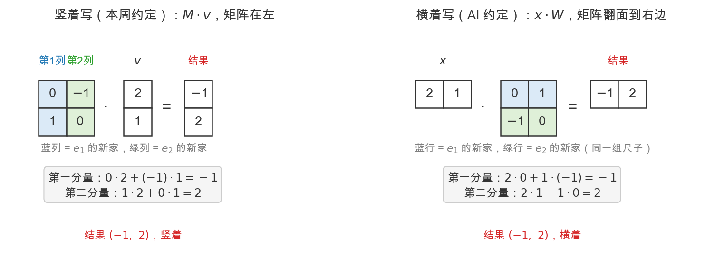
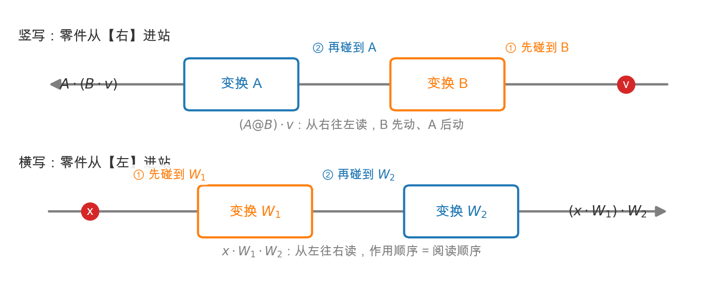

# Day 5：AI 联系——一层网络就是一次变换

> 本章你将：
> 1. 看到真实 LLM 里，**一层神经网络 = 一次变换 + 一次平移**（`Wx + b`）；
> 2. 理解 attention 里的 **QKV 投影**——$X\cdot W_q$ 就是把每个词变换进"查询空间"；
> 3. 明白 **embedding 层 = 查表得到坐标**，正是 Week 3 直觉的第一现场；
> 4. 回答"那个 +b 平移为什么不能并进矩阵"这个 Day 2 埋下的伏笔；
> 5. 搞懂**竖写 vs 横写**两套约定——同一套数学的两种排版，以及一句平移直觉的口诀。

---

## 5.1 你手中已经有了解码 LLM 的第一把钥匙

四天前，你可能还把矩阵当成"一堆数字的方框"。现在你已经知道：

> 矩阵 = 一次线性变换；矩阵乘向量 = 把这个向量搬去新位置。

今天不带新概念，只做一件事：**用你刚建好的直觉，去读真实大模型里的三处矩阵**。读完你会惊讶——那些高深莫测的论文公式，拆开全是 Day 1~Day 3 的内容。

---

## 5.2 一层神经网络：Wx + b = 变换 + 平移

在 Week 8 你会完整训练一个两层网络，这里先看一眼它最核心的一行：

$$
y = W\cdot x + b
$$

逐项拆：

- `x`：输入向量。比如一个词被编码成的一列数字，或者一张图的像素值。
- `W`：**权重矩阵（weight matrix）**。它是一个变换——把输入 x 搬到新的位置。这正是你 Day 1~Day 4 学的矩阵乘向量 $W\cdot x$。
- `b`：**偏置向量（bias）**。它是一次**平移**——把所有结果再整体挪一下。
- `y`：输出。也就是"变换 + 平移之后"的新向量。

所以这里有个非常漂亮的对应：

| 数学 | 直觉 | 你本周刚学 |
|---|---|---|
| $W\cdot x$ | 线性变换（伸/转/剪切） | Day 1~Day 4 的矩阵乘向量 |
| $+ b$ | 平移（整体挪动） | 新：变换之后的"搬家" |

> 💡 **你可能会问：Day 2 结尾说"平移不是线性变换、不能单独用矩阵表示"，那为什么这里 $Wx$ 后面还能 $+b$？**
>
> 问得极好，这正是 Day 2 埋的伏笔。**平移确实不是线性变换**——线性变换必须把原点 $(0,0)$ 保持不动，而平移会把原点搬走。所以单独一个矩阵只能做"伸缩旋转剪切"，做不了平移。
>
> 于是人们想了个通用技巧：把 2 维问题塞进 3 维的"齐次坐标"里（在坐标后面补一个 1），用一个 $3\times3$ 的矩阵把"线性变换 + 平移"一次性全包了。不过对直觉而言，你**不需要**记住"齐次坐标"这词——只需要知道：**$Wx$ 负责"扭"（线性变换），$+b$ 负责"挪"（平移），网络一层 = 扭一下再挪一下**。Week 8 的每一层网络都是这一句的堆叠。

> 📌 **划重点：** 神经网络的一层，不是黑魔法，就是"一个矩阵变换 W，加上一次平移 b"。你今天的工具箱已经能读懂它的一半了。

---

## 5.3 第一个现场：embedding 层 = 查表得到坐标

还记得 Week 1 说过"embedding 就是给每个词找坐标"吗？现在从矩阵的角度再确认一次，它其实是本课程最简单的"矩阵"用法。

一句话：**embedding 层就是一张大表（查表），每一行是一个词的"坐标"。**

- 词典里有 V 个词，每个词被编码成一个 d 维向量（比如 $d=768$）；
- 这张表就是一个 V 行 $\times$ d 列的矩阵，叫 **embedding 矩阵 E**；
- "查表"这个词，用矩阵的话说叫"**取出 E 的第 i 行**"——第 i 行就是第 i 个词的坐标。

为什么能这么简单？因为"查表取第 i 行"这件事，本质上等价于"用一行 0/1 的选择向量去乘 E"。Week 1 提过的 one-hot（独热）编码正是这个"选择向量"：除第 i 位是 1，其余全是 0。用它乘一下，就把 E 的第 i 行挑了出来。

> 📌 **AI 联系：** 你在 Week 1 说"词 = 语义空间里的一个点"，Week 2 说"这个点的坐标 = 各语义刻度的配方"，现在 Week 3 补上最后一块：**这张"词 → 坐标"的对照，就是 embedding 矩阵；把词变成坐标，就是一次查表 / 一次矩阵操作。** 之后所有 attention、相似度计算，都发生在这个由 embedding 张成的空间里。

---

## 5.4 第二个现场：QKV 投影 = 一次变换

现在走到 LLM 的心脏——attention 里的 Q、K、V。这三个字母分别是 Query（查询）、Key（键）、Value（值），Week 6 会逐项拆解。今天只解决一个疑问：**它们是怎么从词向量"变"出来的？**

答案是一行公式（用你熟悉的符号写）：

$$
Q = X \cdot W_q
$$

$$
K = X \cdot W_k
$$

$$
V = X \cdot W_v
$$

其中：

- `X`：一堆词的向量（每一行是一个词的坐标）；
- `Wq`、`Wk`、`Wv`：三个**可学习的权重矩阵**；
- `Q`、`K`、`V`：把 X 变换之后得到的三个新矩阵。

看 $Q = X\cdot W_q$ 这一句——它和你 Day 3 刚学的**矩阵乘矩阵**一模一样！$W_q$ 把 X 的每一行（每个词）都变成一个"新词向量"，这堆新向量就活在"查询空间"里。

> 📌 **AI 联系：** **QKV 投影 = 三次矩阵变换。** 用一个词说清每个角色：
> - `Wq` 把每个词变换进"查询空间"——回答"我（作为提问者）在找什么"；
> - `Wk` 把每个词变换进"键空间"——回答"我（作为回答者）是谁"；
> - `Wv` 把每个词变换进"值空间"——回答"我装着什么内容"。
>
> 三个变换的"动作"（怎么伸、怎么转）不是人写的，是**训练出来的**——这正是 Week 8 "训练 = 学一个变换"的预告。但"矩阵乘矩阵 = 对每个向量施加一次变换"这个机制，你**今天已经完全掌握了**。

> 💡 **你可能会问：为什么同一批词，要变三次、变成三套？**
>
> 因为一个词在三件事里扮演三种角色：当它"主动找别人"时是 Q，当它"等着被找到"时是 K，当它"贡献内容"时是 V。同一批词，换三个变换，就得到三套坐标，各司其职。Week 6 Day 2 会用一个具体的翻译例子把这件事讲得明明白白，先在这里混个脸熟。

---

## 5.5 慢着：向量怎么横过来了？

眼尖的你可能已经在 §5.4 发现了什么不对劲。

Day 2 我们白纸黑字立过规矩："向量**竖着写**，只有 $M\cdot v$ 合法。"可刚才 $Q = X\cdot W_q$ 里，词向量明明**横躺**在 $X$ 的每一行里，矩阵 $W_q$ 还跑到了**右边**——规矩被当面违反了？

不是写错，是**换了一套排版约定**。两套约定都合法，说的也是同一套数学。这一节把这件事彻底说破，以后读论文、读代码就不会再被"矩阵到底写哪边"绊倒。

### 一个例子，两种写法各算一遍

还拿 Day 2 的老朋友：向量 $(2,1)$，旋转 90°，$M=\begin{bmatrix}0&-1\\\\1&0\end{bmatrix}$。

- **竖写**（本周约定）：$M\cdot v$，$v$ 是列向量，$M$ 的**列**是 $e_1$、$e_2$ 的新家；
- **横写**（AI 约定）：$x\cdot W$，$x$ 是行向量，$W$ 就是 $M$ 沿对角线**翻面**（转置，Day 4 学过），$W$ 的**行**是同一组尺子的新家。

逐分量大对账：

| 分量 | 竖写 $M\cdot v$ | 横写 $x\cdot W$ |
|---|---|---|
| 第一个 | $0\cdot2+(-1)\cdot1=-1$ | $2\cdot0+1\cdot(-1)=-1$ |
| 第二个 | $1\cdot2+0\cdot1=2$ | $2\cdot1+1\cdot0=2$ |

**乘的是同样的数，加的也是同样的数，结果都是 $(-1,2)$。** 用式子说，两套写法互为转置：

$$
(x\cdot W)^T = W^T\cdot x^T
$$

把一套写法里所有东西转置一遍，就得到另一套。数学内容一模一样，只是排版翻了 90°。

### 为什么几何偏竖写，AI 偏横写

两边各有充分的理由，理解了理由就再也不会觉得"混乱"：

| | 竖写（几何/教科书） | 横写（深度学习/数据） |
|---|---|---|
| 主角 | **一个点**怎么被搬 | **一张表**（一批样本）怎么被批量处理 |
| 向量形状 | $n\times1$，一列 | $1\times n$，一行 |
| 变换写法 | $M\cdot v$，矩阵在左 | $x\cdot W$，矩阵在右 |
| 顺手之处 | ① "$M\cdot e_i$ = 第 $i$ 列 = 尺子新家"这个地基故事只有竖写才成立；② 算子在左像 $f(x)$，$Ax=b$、$Ax=\lambda x$ 都这么写 | ① 数据天然是表：**一行 = 一个词**（§5.3 的 embedding 矩阵就是）；② 代码里 `X[i]` 一取就是第 $i$ 个词；③ 批量维度严丝合缝 |

第③条展开看：$(n\times d)\ @\ (d\times d') \to (n\times d')$——**词的那个轴原封不动，特征的轴被 $W$ 重新混合**。按 Day 3 的第二把刀（按行切）看，$X\cdot W_q$ 就是"每个词各自独立地被 $W_q$ 变一遍"，一次乘完 $n$ 个词全部变完。要是死抱着竖写做批量，就得写成 $W\cdot X^T$，词变成列，`X[i]` 取出来的是"第 $i$ 个特征"而不是"第 $i$ 个词"，代码和直觉都别扭。

### 你的直觉怎么平移：一句口诀

直觉一个字都不用改，只记一句翻译口诀：

> 📌 **划重点：向量在哪边，矩阵就按哪边切；步数永远在向量里，尺子永远在矩阵里，动作永远由矩阵施加。**
>
> - $M\cdot v$（向量在**右**）：矩阵按**列**读，每列一把尺子，结果 = 步数加权组合各列；
> - $x\cdot W$（向量在**左**）：矩阵按**行**读，每行一把尺子，结果 = 步数加权组合各行。

验一下：$e_1=(1,0)$ 从左边乘，$(1,0)\cdot W = W$ 的第 1 行 $=(0,1)$——东转到北，和竖写里 $M\cdot e_1=(0,1)$ 是**同一个新家**。尺子的住处从"列"换成了"行"，尺子本身一根没变。

### 横写还有个顺手福利：复合顺序从左往右读

回忆 Day 3 批注里的**传送带规则**：零件（数据）从哪边进站，就先碰到哪边的矩阵——离数据近的先作用。

- 竖写 $(A@B)\cdot v$：零件从右进站，先 $B$ 后 $A$——所以本周要你默念"穿袜子再穿鞋"**倒着读**；
- 横写 $x\cdot W_1\cdot W_2$：零件从左进站，**先 $W_1$ 后 $W_2$——作用顺序和阅读顺序一致**，像流水线 `cat | grep | sort`。

这也是为什么深度学习偏爱横写的一个隐性理由：Week 8 的前向传播 `X @ W1 @ W2`，从左往右念过去就是数据的流动顺序，不用倒着。

> ⚠️ **易踩坑：以为"矩阵写哪边"需要你判断、你选择。**
>
> 不需要。给定向量的形状，"前者的列数 = 后者的行数"这条铁律把矩阵的位置**钉死了**：向量竖着（$n\times1$）只有 $M\cdot v$ 能乘，向量横着（$1\times n$）只有 $x\cdot W$ 能乘。你要做的只是**看一眼向量长什么样**——合法摆法永远只有一种，没有选择题。

---

## 5.6 三个现场，一张地图

把今天的三个现场和你的直觉地图对起来：

| LLM 部件 | 矩阵操作 | 你的直觉 |
|---|---|---|
| embedding 层 | 查表取行 / one-hot $\times$ E | 词 = 坐标（Week 1、2） |
| 一层网络 | $W\cdot x + b$ | 变换 + 平移（Week 3 Day 1~4） |
| QKV 投影 | $X\cdot W_q\ /\ W_k\ /\ W_v$ | 矩阵乘矩阵 = 批量变换（Week 3 Day 3） |

你会发现一个惊人的事实：**LLM 里满屏的矩阵，没有一个是"为了矩阵而矩阵"，全都是"把数据从一个空间搬到另一个空间"。** 你这一周建立的"矩阵 = 变换"直觉，恰好是读懂它们所有公式的总钥匙。

---

## 📌 AI 联系（本章小结）

- 神经网络一层 $Wx+b$ = 变换（W）加平移（b），就是"扭一下再挪一下"；
- QKV 投影 $X\cdot W_q$ 等 = 用三个可学习矩阵，把每个词变换进"查询/键/值"三个空间（Week 6 主角登场）；
- embedding 层 = 把词查表变成坐标，是一切变换的起点；
- 竖写/横写只是**排版**：直觉平移口诀"向量在哪边，矩阵按哪边切；步数在向量里，尺子在矩阵里"；
- 所有这些，都建立在你本周"矩阵 = 变换"的地基之上。

---

## 动手练习

1. 用你写的 `matvec`，亲手算一个"迷你投影"：取 `Wq = [[1,0],[0,1]]`（先取单位矩阵，表示"先不改变方向"）和一个词向量 `x=[2,3]`，算 $Q = W_q\cdot x$，确认结果还是 `[2,3]`。这帮你体会"变换可以先从'什么都不变'开始，再靠训练长出有意义的 W"。
2. 想象一下：如果 `Wq` 换成 `rotation_matrix(90)`，`x=[2,3]` 会被"搬"到哪个位置？用你的代码算出来。
3. （可选）读 `tests/test_w3_mat.py` 里 `test_matmul_is_composition` 那条测试，体会"复合变换 = 一个矩阵"在真实代码里如何被断言。
4. **横写手算**：把第 2 题的 `x=[2,3]` 横躺成一行 $[2\ \ 3]$，矩阵用 `rotation_matrix(90)` 的**转置** $\begin{bmatrix}0&1\\\\-1&0\end{bmatrix}$（用你的 `transpose` 验证），手算 $x\cdot W$。和第 2 题 $M\cdot v$ 的结果对比——应该一个数都不差。

（本周是直觉周，AI 章节没有独立的 matrixlab 新函数要写；练习都在用你已经能调的矩阵。）

## 参考答案

本章无新函数。若对 `matvec`/`matmul` 的结果有疑问，回看 `reference/mat.py` 或上一章。第 2、4 题的答案都应是 $(-3, 2)$——竖写横写只是排版，算出来的每个数都一样。

---

👉 下一章：[Day 6：彩蛋——RoPE 预告：旋转矩阵与位置](./06-Day6-彩蛋-RoPE预告-旋转矩阵与位置.md)
