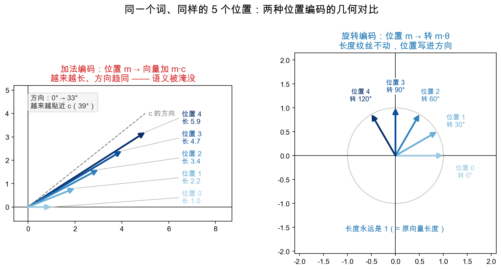
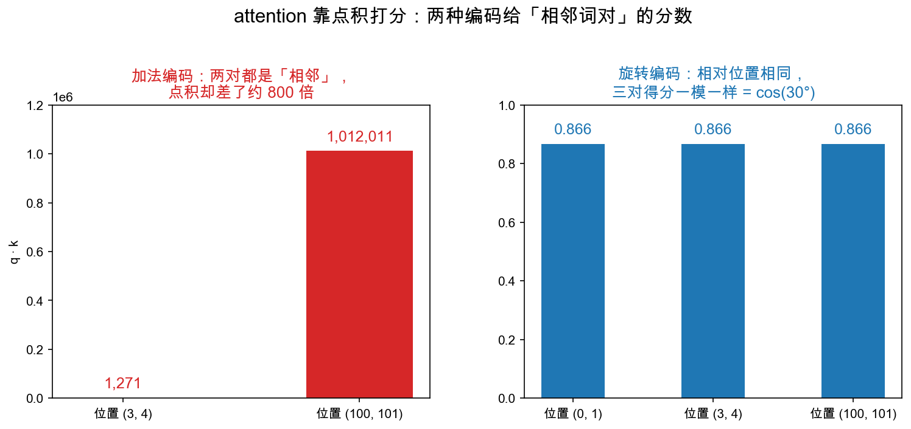
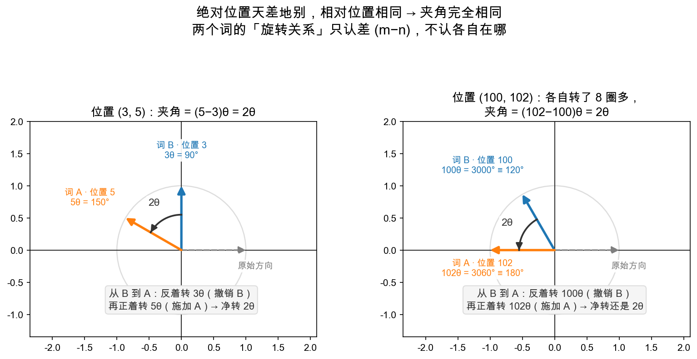

# Day 6：彩蛋——RoPE 预告：旋转矩阵与位置

> 本章你将：
> 1. 看到一个真实的问题：**attention 天生不知道词的顺序**，需要"位置信息"；
> 2. 学到 RoPE 的天才思路——**用旋转矩阵，把位置信息藏进词向量的"方向"里**；
> 3. 亲手淘汰一个最直觉的朴素对手——"位置 $m$ 就加一个大数"，看清它为什么输；
> 4. 理解那句关键公式"转 $m\theta$ 再转 $-n\theta$ = 转 $(m-n)\theta$"（旋转复合 = 角度相加）；
> 5. 收到一张 Week 6 Day 5 的"动手实现"入场券，并先睹为快一张图。

---

## 6.1 一个被忽略的问题：词有顺序

先想一个看似简单、实则致命的问题：

句子"**我 爱 吃 苹果**"和"**苹果 爱 吃 我**"，由**完全相同**的四个词组成，但意思天差地别。

一个会处理语言的模型，必须知道"我"在第 1 个位置、"吃"在第 3 个位置。**顺序（位置）是语义的一部分。**

问题来了：Week 5 你会学到，attention 判断"哪个词对哪个词重要"，靠的是**点积**——而点积**根本不看顺序**。同一批词，不管怎么打乱，只要每个词的向量不变，它们两两之间的点积就完全一样。

也就是说：**attention 的核心机制，天然是个"脸盲 + 路痴"——它分得清"谁是谁"，但不知道"谁排在前、谁排在后"。**

于是必须**额外**把"位置"喂进去。怎么喂？RoPE（Rotary Position Embedding，旋转位置编码）给出了一个极其漂亮、又刚好用上你这一周所有本事的答案。

---

## 6.2 RoPE 的核心思想：把位置藏进"方向"

RoPE 的思路，一句话就能说清：

> **按照词所在的位置 m，把它的向量旋转 $m\times\theta$ 度。**

- 第 0 个位置的词：不转（$0\times\theta = 0^\circ$）；
- 第 1 个位置的词：转 $1\times\theta$ 度；
- 第 2 个位置的词：转 $2\times\theta$ 度；
- ……
- 第 m 个位置的词：转 $m\times\theta$ 度。

这样，**"位置信息"不再是一个额外的数字，而是被"烙"进了向量指的方向里**：位置越靠后的词，转得越多。

这招妙在哪？我们往下看。

> 📌 **AI 联系：** 还记得 Week 1 说过"embedding 就是给每个词找坐标"吗？RoPE 干的事，就是**在词已经有了坐标之后，再按位置把它们各自"转一下"**，把"我是第几个词"这个信息，悄悄写进了坐标的朝向。你 Day 1 学的那族旋转矩阵，正是这整套方案的主角。

---

## 6.3 先淘汰一个对手："位置 $m$ 就加一个大数"行不行？

好戏在下面。在揭晓 RoPE 凭什么赢之前，先把一个最直觉的候选方案抬上来审一审：为什么**偏偏**要用"旋转"来编码位置，而不是别的——比如，**位置 3 就加一个大数、位置 4 加一个更大的数**？

这个方案的意思是：把位置编号直接加进词向量里，

$$
\text{编码后的向量} = \text{词向量} + m \cdot c \quad (c \text{ 是一个固定的向量，那个"大数"})
$$

- 位置 3 的词：向量 $+\ 3c$；
- 位置 4 的词：向量 $+\ 4c$；
- 位置 100 的词：向量 $+\ 100c$。

位置越靠后，加的越多——模型比一比"被加了多少"，不就知道谁前谁后了？（这可不是凭空捏造的稻草人：早期 Transformer 用的"加法位置编码"就是它的升级版。）可惜，它有**三个致命伤，一个比一个严重**。

**致命伤一：大数会"淹没"语义。** 词向量的分量通常在 $\pm 1$ 量级，而位置 100 要加上 $100c$——位置信息在数值上完全碾压了词本身。加小了不行（相邻位置分不清谁前谁后），加大了也不行（语义被淹没），左右为难。看下图左边：随着位置变大，向量**越来越长**、方向越来越趋向 $c$ 的方向——"这个词是什么"越来越看不清，"它在第几位"喧宾夺主。而右边的旋转方案：向量**长度纹丝不动**，位置信息被藏进了一个互不干扰的维度——**方向**。

**致命伤二：点积被"绝对位置"绑架。** 回忆一下，attention 打分靠的是**点积**。我们来算一笔账（把词向量简化成数字 $1$，$c$ 简化成 $10$）：位置 $(3,4)$ 这对词，点积 $= 31 \times 41 = 1271$；位置 $(100,101)$ 这对词，点积 $= 1001 \times 1011 = 1{,}012{,}011$。两对词都是"相邻"、相对位置完全相同，得分却差了将近 **800 倍**！代数上展开就看得一清二楚：

$$
(v+mc)\cdot(w+nc) = \underbrace{v\cdot w}\_{\text{语义}} + \underbrace{n(v\cdot c) + m(w\cdot c)}\_{\text{位置}\times\text{语义，搅在一起}} + \underbrace{mn\Vert c\Vert^2}\_{\text{绝对位置，爆炸项}}
$$

最后一项随 $m \times n$ **平方级膨胀**；中间两项把位置和语义搅成一锅粥。模型看到一个巨大的分数，根本分不清是"这两个词语义相关"，还是"它俩只是排在很后面"。

**致命伤三：没法外推。** 训练时见过的最长句子是 512 个词，"$+\ 512c$"这个信号模型见过；推理时来了一篇 5000 个词的长文，"$+\ 5000c$"是它从未见过的数值，直接懵掉。而语言的规律本质上是**相对的**——"吃"在"苹果"前面 2 位，放在句子开头和第 100 页，含义都一样。

> 📌 **一句话总结：** "加法"编码改变的是向量的**长度**——而长度正是语义的载体，于是位置和语义互相污染；"旋转"编码改变的是**方向**——语义原封不动，位置信息另起炉灶。

---

## 6.4 关键一步："转 $m\theta$ 再转 $-n\theta$ = 转 $(m-n)\theta$"

淘汰了"加法"方案，现在看旋转凭什么赢。它靠的是旋转的一个绝妙性质：**两次旋转复合，角度直接相加。**

用你 Day 3 学的矩阵乘法说：

$$
R(m\theta)\ @\ R(n\theta) = R\big((m+n)\cdot\theta\big)
$$

先转 $n\theta$ 度、再转 $m\theta$ 度，总效果就是转 $(m+n)\theta$ 度。**转角的复合 = 角度的相加**（Day 3 你已经亲手验证过：$R(90)@R(90) = R(180)$，就是"$90+90=180$"）。

那么"转 $m\theta$ 度"的**逆**（反方向转），就是"转 $-m\theta$ 度"。于是：

$$
R(m\theta)\ @\ R(-n\theta) = R\big((m-n)\cdot\theta\big)
$$

即：**"先反着转 $n\theta$ 度，再正着转 $m\theta$ 度"，总效果 = 转 $(m-n)\theta$ 度。**

可是等等——什么时候会需要"先反着转、再正着转"这种操作？答案：**比较两个词的时候**。

想象词 B 在位置 $n$（向量被转了 $n\theta$），词 A 在位置 $m$（向量被转了 $m\theta$）。想知道"A 相对 B 差多少"，最自然的动作是：**站在 B 的朝向上，先把 B 的旋转"撤销"（反着转 $n\theta$，回到原始朝向），再"施加"A 的旋转（正着转 $m\theta$）**。这一"撤销 + 施加"的总效果，就是"从 B 的朝向转到 A 的朝向"要转的角度——这就是两个词之间的**旋转关系**，说白了，就是**两个向量的夹角**。

关键在公式右边：结果里只有 $m-n$，**没有单独的 $m$，也没有单独的 $n$**。看下图体会：

- 左边一对：位置 3 和位置 5，夹角 $2\theta$；
- 右边一对：位置 100 和位置 102——各自都被转了整整 8 圈多（$100\theta = 3000^\circ$！），但定格之后，**夹角还是 $2\theta$**。

所以这个等式的分量在于：**两个词之间的"旋转关系"，只和它们的相对位置 $(m-n)$ 有关，和绝对位置无关。** 这样的例子能举无数个——位置 7 和 3、位置 9 和 5……只要位置差相同，夹角就分毫不差。

> 📌 **划重点：** RoPE 选"旋转"作为编码方式，就是为了买到这个性质——**两个位置间的信息，只依赖"差多少位"，而不是"各自在哪"**。这恰好符合语言的直觉：我们关心的是"吃"比"苹果"靠前多少，而不是它俩绝对是不是第 100 号和第 101 号词。

Week 5 你还会学到：**点积只跟两个向量的"夹角"有关**。把两句话拼起来——

- 位置编码用旋转，夹角就变成了"相对位置"的函数；
- 点积看夹角，于是 attention 的分数天然带上"相对位置"信息。

这就是 RoPE 的完整逻辑链（Week 6 Day 5 会把这条链彻底走完，现在先感受它的巧妙即可）。

---

## 6.5 先睹为快：RoPE 旋转长什么样

下图是 Week 6 Day 5 的主角，先瞄一眼，作为本周的"终点预告"：

> 图中你能大致看到：不同的向量被按"位置"转到了**不同角度**——
> 位置信息没有变成新的数字，而是变成了**方向**。正式动手做这件事，就在 Week 6 Day 5。

（这张图的详细读法留在 Week 6 Day 5，这里只是"先看个热闹"，让你知道六周后你会亲手造出什么。）

---

## 6.6 预告：Week 6 Day 5 你会做什么

作为彩蛋，把三周后的门票剧透给你。到 Week 6 Day 5，你会亲手实现：

- `rotate_2d(v, theta)`：把 2 维向量旋转 $\theta$ 度；
- `apply_rope_2d(xs, theta)`：对一堆词的向量，按位置 m 各自转 $m\theta$ 度；
- `rope_score(q_m, k_n)`：算"带位置编码的 attention 分数"，并验证它**只依赖 $(m-n)$**。

你会发现，那些函数的**核心，就是你 Week 3 Day 1 写的 `rotation_matrix`**——到时候你会感谢今天把 sin/cos 和旋转矩阵吃透了。

> ⚠️ **易踩坑（预告版先行警告）：** 真实的 RoPE 不像这里这么简单——它不是把整个向量转一个角度，而是**把向量两两配对成很多个 2 维小块，每块用不同的"频率" $\theta$ 去转**（高维度转得慢、低维度转得快），这样才既能编码远近、又能编码细节。别慌，这个"两两配对"的细节 Week 6 会拆成小步带你走。今天你只需要带走一个直觉：**"位置 = 转的角度"**。

---

## 📌 AI 联系（本章小结）

- attention 天然不知道词序，所以要额外加位置信息；
- RoPE 的做法：位置 m 的词向量**转 $m\theta$ 度**，把位置写进"方向"；
- 为什么不用"位置 m 就加一个大数"？因为它改的是向量的**长度**：淹没语义、点积被绝对位置绑架（同样相邻，得分能差 800 倍）、还没法外推到更长的句子；
- 为什么用旋转？因为"旋转复合 = 角度相加"，于是两个词的旋转差**只依赖相对位置 $(m-n)$**；
- 配合 Week 5 的"点积看夹角"，attention 分数就自动带上了相对位置；
- 动手实现这些 = Week 6 Day 5。

---

## 动手练习

1. 用你已经实现的 `rotation_matrix` 和 `matmul`，验证今天的核心等式：`R(30) @ R(−30)` 是否等于单位矩阵 `[[1,0],[0,1]]`？（提示：`R(−30)` 就是把角度传 `-30`，即"反着转 30°"；转过去再转回来，应该回到原样。）
2. 再验证 `R(45) @ R(45)` 是否等于 `R(90)`——体会"复合 = 角度相加"。
3. 想一想（不用写代码）：两个词分别在位置 7 和位置 3，另一个场景里两个词在位置 9 和位置 5，哪一对的位置差更大？RoPE 会认为哪一对"关系更近"？（答案：两对位置差都是 4，RoPE 给的旋转差完全相同——这就是"只依赖相对位置"的含义。）
4. 拿出笔算一笔账（不用写代码）：把词向量简化成数字 $1$、$c$ 简化成 $10$，用 6.3 的"加法编码"算一算——位置 $(3,4)$ 这对词的点积是多少？位置 $(100,101)$ 这对呢？两对都是"相邻"，得分差了多少倍？（答案：$31\times41=1271$，$1001\times1011=1{,}012{,}011$，差了约 800 倍——这就是"加法编码"被绝对位置绑架的现场。）

## 参考答案

练习 1、2 都用你写好的 `rotation_matrix` + `matmul` 即可；若不确定结果对不对，`reference/mat.py` 里的 `rotation_matrix` 和 `matmul` 就是答案。**卡住 20 分钟再看。**

---

## 🎉 Week 3 收工，你做到了

回头看这一周，你从"矩阵是一堆数字"出发，一路走到：

- 矩阵 = **变换**（空间的运动）；
- 矩阵乘向量 = 把向量搬过去（为什么这么算，是被逼出来的）；
- 矩阵乘矩阵 = 复合变换（为什么 `A@B` 先 B 后 A，是"先做后面那个动作"的自然结果）；
- 一层网络、QKV、embedding = 这些变换在 LLM 里的真身；
- RoPE = 旋转矩阵把"位置"藏进"方向"的绝妙用法。

**这是整门课的地基。** 接下来 Week 4 会告诉你一个更震撼的事实：矩阵不仅"变换点"，还"变换尺子"——运动是相对的。

👉 继续前进：[Week 4 导读](../week4/README.md)
