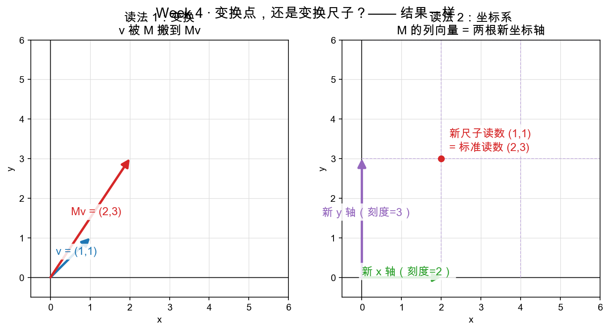

# Day 1：矩阵的列是基向量——一个矩阵，两种读法

> 本章你将：
>
> 1. 用"列向量"的眼睛重看一个矩阵——它的每一列，就是标准基 e1、e2 被变换后落到的地方；
> 2. 发现一个非奇异方阵的列，恰好构成平面上**一组新基（一套新尺子）**；
> 3. 掌握"一个矩阵两种读法"：**变换** 与 **坐标系**，并会背那张对照表；
> 4. 亲眼在图里看到，两种读法指向同一个点。

---

## 1.1 先翻你的旧账：矩阵的列到底装了什么？

Week 3 你写过 `matvec(M, v)`：矩阵乘向量，等于把向量 v 交给变换 M。当时你可能背过一个结论，现在我们要把它重新请出来、放到台灯下仔细看：

> **矩阵的每一列，就是标准基向量被变换后的新位置。**

拿两个老朋友举例（`reference/mat.py` 里就有）：

- 缩放矩阵 `scale_matrix(2, 3) = [[2,0],[0,3]]` 的列是 (2,0) 和 (0,3)——分别是 e1=(1,0) 被拉长到 2 倍、e2=(0,1) 被拉长到 3 倍后的位置；
- 旋转 90° 的矩阵 `rotation_matrix(90) = [[0,-1],[1,0]]` 的列是 (0,1) 和 (-1,0)——正是 e1 逆时针转 90°、e2 也逆时针转 90° 后的位置。

为什么"列 = 变换后的 e"成立？因为 `Me1` 算出来就是 M 的第一列，`Me2` 就是第二列（你把 (1,0) 代进 `[a*x+b*y, c*x+d*y]` 试一下就明白）。这不是巧合，是矩阵张成的定义本身。

---

## 1.2 慢着——那矩阵的列，不就正好是一组基吗？

回忆 Week 2 Day 3 的结论（那时你还不知道矩阵，是拿两根向量拼尺子）：**一组基 = 两根不共线的向量**，它们各躺在一根坐标轴上，成为那根轴上的"单位刻度"。

现在把两件事拼在一起：

1. 矩阵的列是"变换后的 e1、e2"；
2. 只要这个变换不把平面压扁（行列式不为 0，Day 3 详说），变换后的两根向量就**依然不共线**；
3. 两根不共线的向量 = 一组基 = 一套新尺子。

于是得到一个石破天惊的结论，也正是孟岩《理解矩阵》第三篇点破的那句话：

> 📌 **矩阵描述了一个坐标系。** 组成矩阵的那组列向量，就是一套新尺子——每一列都是一根坐标轴的方向，同时是那根轴上的"长度 1"。

> 💡 **你可能会问："非奇异"是什么意思？为什么老强调它？**
>
> "非奇异"就约等于"行列式不等于 0"，通俗说就是**这个变换可逆、不把平面压扁**。只有在这种矩阵里，列向量两两不共线、能当尺子。如果某两列共线了（比如 `[[1,2],[2,4]]`），它俩撑不起整个平面，当不了基。Day 3 会正面讲行列式，这里先记一句：**本周说的"矩阵当尺子"，默认都是非奇异方阵。**

---

## 1.3 那它到底是"变换"还是"坐标系"？

问题来了。Week 3 你刚接受"矩阵 = 变换"，现在又说"矩阵 = 坐标系"。同一个东西，怎么一会儿是搬点子的机器，一会儿是量东西的尺子？

孟岩在原文里，用一个"嚷嚷"替你问出了这句：

> "慢着！你不是说过，矩阵就是运动吗？怎么这会儿矩阵又是坐标系了？"

他的回答是这次教程的题眼，先记下来（下一章 Day 2 再彻底拆开）：

> 📌 **"对象的变换 等价于 坐标系的变换。"** 说白了就是：**运动是相对的。**

具体到 `M = [[2,0],[0,3]]` 身上，你可以**朝左看**、也可以**朝右看**：

- **朝左看（变换）**：M 是一台机器，把向量 (1,1) 拉伸到 (2,3)。是**点动**了。
- **朝右看（坐标系）**：M 是一套新尺子，它的 x 刻度是 2、y 刻度是 3。在这套尺子里读数为 (1,1) 的点，用旧尺子（标准基）一量，读数是 (2,3)。是**尺子换了**，点根本没动。

两种说法，指向完全不矛盾的同一个结果。下面这张图就是它的现场：

左图：v=(1,1) 被 M 拉到 (2,3)（点动）。右图：绿色的新 x 轴（刻度 2）和紫色的新 y 轴（刻度 3）组成了 M 这套尺子，虚线是新刻度网格；那个红点在新尺子里是 (1,1)，在标准尺子里是 (2,3)——**点没动，是尺子换了**。

---

## 1.4 一张对照表：一个矩阵，两种读法

把两种读法并排放好，这一周的纲目就全在这张表里：

| 维度 | 读法 1：变换 | 读法 2：坐标系 |
|---|---|---|
| 矩阵 M 是什么 | 把点搬走的机器 | 一套新尺子（一组基） |
| 列向量是什么 | 变换后的 e1、e2 | 两根新坐标轴（各轴的长度 1） |
| 向量 v 是什么 | 一个等着被搬的点 | 在新尺子里的一次读数 |
| Mv 是什么 | 点被搬之后的新位置 | 这同一个点，在标准尺子里的读数 |
| "动作"发生在哪 | 点被挪走 | 尺子被替换，点原地不动 |
| 一句话 | 点动 | 尺子动 |

> 📌 **划重点：** 同一个矩阵，你既可以说它是"变换"，也可以说它是"坐标系"——差别只在你把它读成"点动了"还是"尺子动了"。两种读法**数学上完全等价**，这是本周所有内容的根基。

> ⚠️ **易踩坑：** "坐标系"读法里，M 的**列**才是坐标轴，不是行。`[[2,0],[0,3]]` 的新 x 轴是 (2,0)（第一列），新 y 轴是 (0,3)（第二列）。要是记成"第一行当 x 轴"就全反了。记住口诀：**列是尺子，行是配方。**

---

## 1.5 那"读数"和"真身"到底啥关系？给你剧透下一章

到这里你心里可能已经长出毛刺：说"在新尺子里读数为 (1,1) 的点，标准尺子里是 (2,3)"——这中间那个"换算"到底怎么发生的？为什么偏偏是乘法 `M × (1,1)`？

这正是 Day 2 要正面攻下的核心：**`Ma = b` 的身份识别**——它不是在"乘"，它是在声明："有一个向量，在 M 这套尺子里读数是 a，在标准尺子 I 里读数是 b，而 a、b 说的是**同一个向量**。"

明天我们会用孟岩那个"把 (1,1) 变到 (2,3)"的经典例子，把"点动 vs 尺子动"一条一条掰开。今天先盯着上面那张对照表，把"列 = 新轴"这个念想焊死在脑子里。

---

## 动手练习

1. **口算列向量**：写出 `M = [[2,0],[0,3]]`、`[[0,-1],[1,0]]`、`[[1,1],[0,1]]` 三张矩阵的列，并分别说清每一列"是谁被变换到哪儿"。哪张矩阵的列**不共线**（能当尺子）？哪张的列**共线**（当不了尺子）？
2. **画中心**：拿纸笔，先画标准基 e1、e2，再画 `[[2,1],[0,1]]` 的两根新轴。标出"新尺子里读数 (1,1) 的点"落在标准图里的哪个位置。（不会画坐标就去看下一章的图，但先自己比划一下。）
3. **读图复述**：回到上面 `w4d1_two_readings.png`，用一句话各说清左右两张子图的含义，说给自己听。

## 参考答案

对照 `reference/coords.py` 顶部的模块注释（它把"变换 vs 坐标系"两种读法一句话写在了开头）；习题的口算结果在 Day 2 和 Day 4 会逐一被代码验证。卡住 20 分钟再看，看完自己重算一遍。

👉 下一章：**[Day 2：Ma = b 的双重解释——运动是相对的](./02-Day2-Ma等于b的双重解释-运动是相对的.md)**
