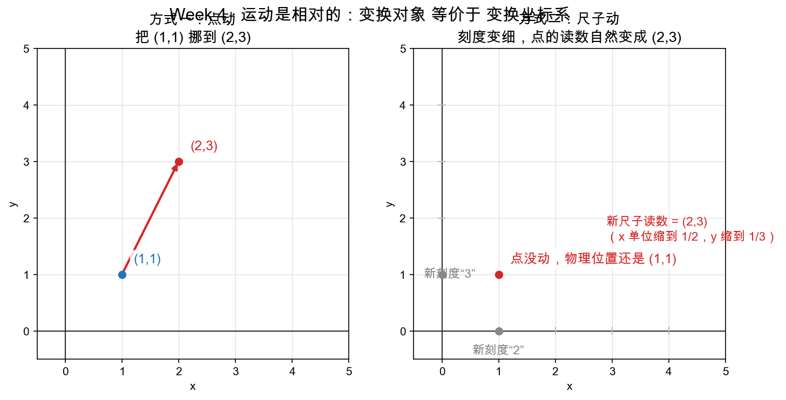

# Day 2：Ma = b 的双重解释——运动是相对的

> 本章你将：
>
> 1. 把一条普通算式 `Ma = b` 读出**两种截然不同、却又等价**的意思；
> 2. 用孟岩那个"把 (1,1) 变到 (2,3)"的经典例子，亲手感受"点动"与"尺子动"；
> 3. 彻底吃透本周的灵魂句：**"对象的变换 等价于 坐标系的变换"**；
> 4. 明白 `Ma = Ib` 不是乘法，而是一次**身份识别**。

---

## 2.1 一条算式，两种语气

先摆一条最普通的式子：

```
Ma = b
```

在 Week 3 的语境里，你只给它读过一种意思。今天让你开双声道，同一句话换种语气，意思整个翻转过来。孟岩《理解矩阵》第三篇原文是这样说的：

> 达成同一个变换的结果，比如把点 (1,1) 变到点 (2,3)——你有两种做法：
>
> **第一，坐标系不动，点动**：把 (1,1) 点挪到 (2,3) 去。
> **第二，点不动，变坐标系**：让 x 轴的度量（单位刻度）变成原来的 1/2，让 y 轴的度量变成原来的 1/3，这样点还是那个点，可是它的坐标就变成 (2,3) 了。
>
> **方式不同，结果一样。**

下面两小节，把这两种语气各放一遍慢动作。

---

## 2.2 读法一：点动（变换）

这是你熟悉的那个频道。M 是一台机器，a 是躺在它面前的一个点：

> **"向量 a 经过矩阵 M 所描述的变换，变成了向量 b。"**

如果 `M = [[2,0],[0,3]]`、`a = (1,1)`，那么 `Ma = (2·1 + 0·1, 0·1 + 3·1) = (2,3) = b`。点真的从 (1,1) 被"拽"到了 (2,3)，坐标系纹丝不动。这是 Week 3 反复练的手感：**矩阵乘向量 = 施加一次变换。**

---

## 2.3 读法二：尺子动（坐标系）

现在切频道。让 M 不再是一台机器，而是一套尺子（Day 1 刚说过，它的列就是新坐标轴）。

> **"有一个向量，它在坐标系 M 里度量的结果是 a；同一个向量，在标准坐标系 I 里度量的结果是 b。"**

还是 `M = [[2,0],[0,3]]`、`a = (1,1)`。这套 M 尺子的 x 刻度是 2、y 刻度是 3——意思是：M 尺子里标着"1"的那一格，实际长度是标准尺子的 2 格。那么一个在 M 尺子里读数为 (1,1) 的向量，拿到标准尺子里一量，自然是 (2,3)。

**点从头到尾没动。** 动的是尺子：原来是标准尺，现在换成了"刻度更粗"的 M 尺。

> 💡 **你可能会问：为什么 x 刻度是 2，点在标准尺子里反而是"2"而不是"0.5"？粗尺子不是该量出更小的数吗？**
>
> 分清楚"谁读谁"。这里的问题是：**同一个物理长度**，用两把刻度不同的尺子去量，各读出多少。M 尺子的 1 格 = 标准尺子的 2 格，所以物理上"标准 2 格长"的东西，M 尺子量出来只要"1 格"——它读出的数**更小**。反过来说，M 尺子读数是 1 的地方，标准尺子读数是 2。方向别搞反：**读数小 ⇔ 尺子刻度粗**。

---

## 2.4 为什么偏偏是"乘"：Ma = Ib 的身份识别

你可能还在犯嘀咕：凭什么是 `M × a` 就完成了这次"换尺子"？乘号到底在哪儿冒出来的？

孟岩给了一个非常漂亮的视角，把它**从"计算"降级成"身份声明"**。他说，孤零零写一个向量 `b`，其实不是 b，而是 `Ib`——I 是单位矩阵（主对角线 1、其余 0），也就是标准尺子：

> "在单位坐标系（直角坐标系）I 中，有一个向量，度量的结果是 b。"

于是 `Ma = b` 应该写成：

```
Ma = Ib
```

读作：

> 📌 **"在 M 坐标系里量出来的向量 a，跟在 I 坐标系里量出来的向量 b，根本就是同一个向量！"**

乘号在这里不是"施加运算"，而是**贴着向量声明它用的是哪把尺子**：`Ma` 是"在 M 尺子里读数为 a 的那个向量"，`Ib` 是"在标准尺子里读数为 b 的那个向量"。等号说的是——这俩是同一个东西。所以：

> 📌 **Ma = Ib 不是乘法计算，它是一次"身份识别"。**

这样一来，"矩阵乘向量为什么是那样算"就有了根源：把一个在 M 尺子里读数为 a 的向量，换回标准尺子看真身，就是在 M 的各列（各轴）方向上按 a 的分量展开再拼起来——正是 `M 的列 × a 的对应分量，再相加`，也就是你背熟的"行×列"。

---

## 2.5 运动是相对的：把两种读法焊成一句话

到这儿，我们已经凑齐了正反两面，可以把本周的灵魂句正式立起来了：

> 📌 **对象的变换 等价于 坐标系的变换。**

展开说，就是孟岩原文那三句层层收紧的话：

1. 固定坐标系下，一个对象的变换；
2. 等价于固定对象时，它所在坐标系的变换；
3. 说白了：**运动是相对的。**

用图看一眼这个"相对"到底有多实在：



左图（方式一）是点动：一个箭头把 (1,1) 直接拽到 (2,3)。右图（方式二）是尺子动：把 x 轴单位刻度缩成 1/2、y 轴缩成 1/3（原来标"1"的地方，现在标"2"、标"3"），点原地不动，读数却从 (1,1) 变成了 (2,3)。**两条路，同一个终点。**

> 📌 **划重点：** 一个 "变换" 的账，永远可以记在"点"头上，也可以记在"尺子"头上。数学不挑记账方式——这就是"相对性"在本周的确切含义：**不是模棱两可，而是两种描述严格等价。**

> ⚠️ **易踩坑：** "相对"不等于"随便"。点动和尺子动**等价**，但数学式子是死的：点动是 `Ma = b`，尺子动是"在 M 尺子里读数为 a 的向量 = 标准尺子读 b"，两者写出来的式子**同一个**。不要以为"既然相对，那我把 M 换成它的逆也行"——不行，逆是 Day 3 讲"把尺子换回去"时才登场的另一个动作。

---

## 2.6 一个数例，两个通道各算一遍

把 `M = [[2,0],[0,3]]`、`a = (1,1)`、`b = (2,3)` 收进一张表，两种读法并排验尸：

| | 读法一：点动（变换） | 读法二：尺子动（坐标系） |
|---|---|---|
| 谁变了 | 点 (1,1) 被搬到 (2,3) | 尺子换成"x 刻度 2、y 刻度 3" |
| 谁没变 | 标准坐标系没动 | 点没动，物理位置没变 |
| (1,1) 是什么 | 点出发的位置 | 新尺子里的读数 |
| (2,3) 是什么 | 点到达的位置 | 老尺子（标准）里的读数 |
| Ma 的意思 | 把 a 变换掉 | 把 a 的"尺子标签"亮出来 |
| 结果 | b = (2,3) | b = (2,3) |

两列最下面一行，一模一样。这就是"等价"最直白的证据。

---

## 2.7 给 Day 3 埋个钩子：尺子能换过去，就能换回来

读法二留下一个自然的问题：我们能把"标准尺子的读数 b"换成"M 尺子的读数 a"，那反过来——**手里只有标准读数 b，想求它在 M 尺子下的读数**——该怎么干？

直觉上就是"换一把尺子"的反向操作：既然把尺子从 I 换成 M 用了 `Ma = b`，那从 M 换回 I，就该用一个"反着来"的东西，把 M 撤销掉。这个"反着来"的东西，就是**逆矩阵 M⁻¹**。

孟岩原文里已经把这层窗户纸点破了大半：

> 我现在要变 M 为 I，怎么变？对了，再前面乘以个 M⁻¹（M 的逆矩阵）……原来 M 坐标系里的 a，在 I 中一量，就得到 b 了。

明天（Day 3）我们就正面攻下它：行列式为什么是"有向面积"、2x2 求逆公式怎么一步步推、行列式为 0 时为什么"回不去"。今天先把"两种读法"和"相对性"嚼透。

---

## 动手练习

1. **重写孟岩的例子**：用自己的话，把"把 (1,1) 变到 (2,3)"的两种做法各写一句（不许看上面，写完再对）。哪一句里动了点？哪一句里动了尺子？
2. **反向读法拆解**：对 `M = [[2,0],[0,3]]`、`a = (3,2)`，分别说出：
   - 读法一：点 (3,2) 被 M 变换到了哪里？
   - 读法二：M 尺子里读数为 (3,2) 的向量，标准尺子里读数是多少？
   两个答案是不是同一个向量？为什么必然相同？
3. **身份识别练习**：把 `Ma = Ib` 这句话，用"谁在哪个尺子里读数是几"的口吻完整念三遍，念到不看式子也能说顺。

## 参考答案

数例答案可在 Day 4 用 `to_standard(M, v)` 跑出来核对（`reference/coords.py` 的 `to_standard` 就是"读法二"的直接实现）；Day 3 会手推并用 `inverse_2x2` 验证反向过程。卡住 20 分钟再看参考答案。

👉 下一章：**[Day 3：逆矩阵——把坐标换回去](./03-Day3-逆矩阵-把坐标换回去.md)**
