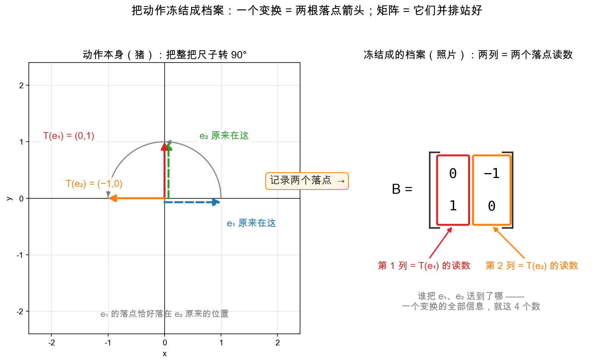
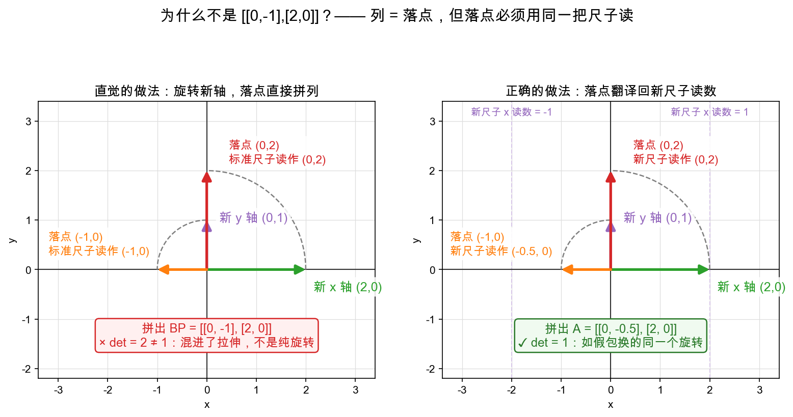

# Day 5：相似矩阵——同一个变换的不同照片

> 本章你将：
>
> 1. 用一分钟复习第一层"拍照"：向量是猪，坐标是照片；
> 2. 跨过本章唯一真正难的一步——**把"动作"冻结成"东西"**，看清为什么变换也能当猪；
> 3. 推导换镜头公式 **$A = P^{-1}BP$**，手算一遍、再用一个点验算一遍；
> 4. 读懂 `similar_photo`（拍照片）与 `is_same_transform`（认猪）这两个函数；
> 5. 领一句"血型预告"：相似矩阵有相同的特征值。

---

## 5.1 温故：第一层拍照——向量是猪

先把前四天的那套话压缩成三行：

- **线性空间是舞台，只有一个。** 它在你选任何尺子之前就存在，也不随尺子变——换基改变的是读数，不是空间；
- **基（尺子）是人为放进去的测量工具**，唯一的作用是"把向量读成数字"；
- **坐标是照片。** 同一个向量，换把尺子就换一串数字——猪没变，照片变了。

也就是这张对应表：

| 拍照的世界 | 线性代数的世界（第一层） |
|---|---|
| 那头猪 | 向量（对象，唯一） |
| 镜头位置 | 基 |
| 照片 | 坐标 |

但矩阵描述的不是向量，而是**动作**（线性变换）。于是问题来了：

> 📌 **动作看不见摸不着，怎么给它拍照？**

这是本章唯一真正难的一步。"向量是猪"很好懂——向量是个"东西"，就戳在那儿；可变换是个"动作"，是过程、是规则，中间好像隔着一条鸿沟。5.2 就用一招填平它。

---

## 5.2 关键一跃：把动作"冻结"成东西

填鸿沟的办法：**把动作冻结成一份静态档案**。凭什么能冻结？靠"线性"这两个字。

任何向量都能拆成基向量的组合：$v = (x, y) = x\ e_1 + y\ e_2$。而线性变换对加法和数乘保结构，所以：

$$
T(v) = x \cdot T(e_1) + y \cdot T(e_2)
$$

读出来就是：**只要知道 $e_1$、$e_2$ 这两根刻度箭头被送到了哪，所有向量的落点就全被定死了。** 一个变换的全部信息，不过如此。

所以"旋转 $90^\circ$"这个动作，冻结成档案，就是两条记录：

```
e₁ 的落点 = (0, 1)      ← 这两根"落点箭头"捆在一起，
e₂ 的落点 = (−1, 0)        就是这个变换的完整快照
```

而你在 Day 1 已经学过：**矩阵的列 = 基向量落点的读数**。把这两根落点箭头并排站好，就是矩阵：



左图是动作本身：虚线是基向量原来的位置，实线是落点，灰色圆弧是它们的"旅程"。右图是冻结成的档案 $B = \begin{bmatrix} 0&-1 \\\\ 1&0 \end{bmatrix}$——**第 1 列是 $e_1$ 落点的读数，第 2 列是 $e_2$ 落点的读数**。

（顺带把矩阵的尺寸读出来：2 列 = 要记录 2 根刻度箭头的落点；2 行 = 每个落点是二维空间里的点，要 2 个数来写。一般地，m 行 n 列的矩阵描述"从 n 维空间到 m 维空间"的变换：列数 = 输入维数，行数 = 输出维数。）

鸿沟就此填平：

> 📌 **划重点：变换这头"猪"，其实是两头向量小猪扎成的一捆。** 动作一旦冻结成"落点档案"，它就和向量一样，是个可以指着的"东西"——当然也能给它拍照。

现在再读孟岩那段话，第二层应该不再抽象了：

> 比如有一头猪，你打算给它拍照，只要给照相机选定了一个镜头位置，就可以给它拍一张照片。这张照片是这头猪的一个**描述**，但只是片面的描述——换一个镜头位置，能得到另一张照片，也是同一头猪的另一个片面的描述。**所有照片都是这同一头猪的描述，但又都不是这头猪本身。**
>
> 同样：对于一个线性变换，只要你选定一组基，就可以找到一个**矩阵**来描述它。换一组基，就得到不同的矩阵。所有这些矩阵都是**同一个变换**的描述，却又都不是变换本身。

两段话是**同一个比喻的两层**，角色分配完全平行：

| | 猪（对象，唯一） | 镜头（人为选择） | 照片（描述，随镜头变） |
|---|---|---|---|
| 第一层 | **向量** | 基 | **坐标** |
| 第二层 | **线性变换**（= 一捆落点箭头） | 基 | **矩阵**（= 落点读数并排） |

三张照片三个样，猪只有一头；三把尺子三个矩阵，变换只有一个——**"像不像"是照片的事，"是不是同一头猪"才是本质的事。**


> 💡 **进阶一瞥（知道即可，不影响后文）：变换们自己也组成一个线性空间。** 既然一个二维到二维的变换 = 4 个数，那么"所有这种变换的全体"就是一个**四维**空间——变换之间能相加、能数乘（$T+S$、$cT$ 仍是变换），完全符合线性空间的定义。而矩阵，恰恰就是变换在这个四维空间里的**坐标**：
>
> $\begin{bmatrix} a&b \\\\ c&d \end{bmatrix} = a\begin{bmatrix} 1&0 \\\\ 0&0 \end{bmatrix} + b\begin{bmatrix} 0&1 \\\\ 0&0 \end{bmatrix} + c\begin{bmatrix} 0&0 \\\\ 1&0 \end{bmatrix} + d\begin{bmatrix} 0&0 \\\\ 0&1 \end{bmatrix}$
>
> 四个小矩阵是这个空间的"标准基"，展开系数恰好就是矩阵的四个元素——和第一层"向量 = 基向量的线性组合，系数就是坐标"**一字不差**。所以第二层不是新魔法，是**同一台"猪—尺子—照片"的机器，搬进了四维猪圈**。这个视角以后还会变现：训练神经网络时，权重矩阵就是被拉平成超高维空间里的一个点，梯度下降就是在那个"变换空间"里挪猪。

---

## 5.3 换镜头，照片怎么变：$A = P^{-1}BP$

现在把"换镜头"翻译成数学。设：

- 有一个变换，在**标准尺子下**的矩阵是 **$B$**（比如旋转 $90^\circ$ = $\begin{bmatrix} 0&-1 \\\\ 1&0 \end{bmatrix}$）；
- 我们换一套新尺子 **$P$**（P 的列 = 新坐标轴，Day 1 的知识）；
- 问：同一个变换，**用 P 这把尺子来描述**，矩阵长什么样？记这张新照片为 **$A$**。

**先别急着背公式，先把"A 必须干什么"钉死。** A 是准备在新尺子里直接干活用的矩阵，所以它必须满足：

> 📌 对任意一个"新尺子读数" $u$，$Au$ 必须等于：**这个点变换之后、再换回新尺子读数**的结果。

有了这个目标，$A$ 长什么样就没有选择余地了——跟着 $u$ 走一趟，就能把它**逼**出来：

1. $u$ 是新尺子读数，先**翻译成标准读数**：乘 $P$（Day 4 的 `to_standard(P, u)`）；
2. 在标准世界里，真刀真枪把动作做一遍：乘 $B$；
3. 把结果**翻译回新尺子读数**：乘 $P^{-1}$（Day 4 的 `to_basis(P, w)`）。

三步连起来，$u$ 的新读数变成了 $P^{-1}\big(B(Pu)\big)$。而我们要求 $Au$ 正好等于它、且对**每一个** $u$ 都成立——唯一的办法就是：

> 📌 **$A = P^{-1}BP$**。口诀一句："**先翻译成标准读数 → 干活 → 再翻译回新尺子**"。

注意这条路线图的方向：从**新尺子**出发，进**标准**世界干活，再回到**新尺子**报数——终点是新尺子，不是标准。

把这条路线图画出来，就是理解 $A = P^{-1}BP$ 的"地图"：外圈三步（① 乘 $P$ → ② 乘 $B$ → ③ 乘 $P^{-1}$）绕一圈，和左边红色的一步直达（A）必然殊途同归：


> ⚠️ **矩阵乘法从右往左读：先做的事，写在乘积的最右边。** $P^{-1}BP$ 里，最先作用于 $u$ 的是右边的 $P$，最后才是左边的 $P^{-1}$。$P$ 和 $P^{-1}$ 的位置一旦记反，拍出来的就是一张"左右手互换"的错照片。

口说无凭，算一遍到底。取 $B$ = 旋转 $90^\circ$、$P$ = $\begin{bmatrix} 2&0 \\\\ 0&1 \end{bmatrix}$（x 轴刻度拉长 2 倍的新尺子）：

```
P⁻¹ = [[0.5, 0], [0, 1]]                              ← Day 3 的逆矩阵公式
BP  = [[0, -1], [1, 0]] · [[2, 0], [0, 1]] = [[0, -1], [2, 0]]
A   = P⁻¹ · (BP) = [[0.5, 0], [0, 1]] · [[0, -1], [2, 0]] = [[0, -0.5], [2, 0]]
```

A 不再漂亮，但它是如假包换的"同一个旋转"。验收——在新尺子里取点 $u = (1,1)$：

```
老路（三步绕一圈）：
  Pu       = (2, 1)        ← 翻译成标准读数
  B(Pu)    = (-1, 2)       ← 在标准世界里旋转 90°
  P⁻¹B(Pu) = (-0.5, 2)     ← 翻译回新尺子读数

新路（直接拿照片 A 乘）：
  Au = (0·1 + (-0.5)·1,  2·1 + 0·1) = (-0.5, 2)   ✓ 一模一样
```

**老路和新路结果相同**——这正是测试 `test_similarity_means_same_effect` 替你把关的那句话，也是 $A = P^{-1}BP$ 的全部意义：同一个变换，换了把尺子，照片从 $\begin{bmatrix} 0&-1 \\\\ 1&0 \end{bmatrix}$ 变成 $\begin{bmatrix} 0&-0.5 \\\\ 2&0 \end{bmatrix}$，猪还是那头猪。

> 💡 **你可能会问：直接把新轴旋转 $90^\circ$、把落点拼成列，得到 $\begin{bmatrix} 0&-1 \\\\ 2&0 \end{bmatrix}$，为什么不对？**
>
> 你算的是上面推导里的中间产物 $BP$。5.2 那条"列 = 落点读数"有个容易被吞掉的后半句：**落点必须用同一把尺子读数**。$(0,2)$ 在新尺子里碰巧还读作 $(0,2)$（y 方向没被拉长）；$(-1,0)$ 在新尺子里要读作 $(-0.5,\ 0)$——x 刻度是标准的 2 倍长，物理上的 "-1" 只读作 "-0.5"。忘了翻译回去，拼出的就是"输入用新尺子、输出用标准尺子"的混血矩阵 $BP$。验一下血型立刻露馅：$\det = 2 \neq 1$，不是纯旋转。这正是路线图第③步（乘 $P^{-1}$）存在的理由。



> 💡 **一句诚实的补充：** 如果新尺子只是**原地转了某个角度、刻度不拉伸不压扁**（还是正交基、朝向相同），二维旋转的照片恰好**不变**——"旋转 $90^\circ$"对每个方向看起来都一样对称。但只要尺子有拉伸或歪斜（比如本节的 P），照片一定变。本节用的都是后一类尺子。

---

## 5.4 相似矩阵：同一头猪，拍得更美

当 $A = P^{-1}BP$ 成立（P 可逆）时，我们就说 A 与 B **相似（similar）**。现在"相似"这个词终于有血有肉了——孟岩原话：

> 所谓相似矩阵，就是**同一个线性变换的不同的描述矩阵**。按照这个定义，同一头猪的不同角度的照片，也可以称为"相似照片"。

注意：**"相似"不是"长得像"，而是"同源"**——$\begin{bmatrix} 0&-1 \\\\ 1&0 \end{bmatrix}$ 和 $\begin{bmatrix} 0&-0.5 \\\\ 2&0 \end{bmatrix}$ 长得一点都不像，但它俩相似，因为拍的是同一个旋转。换个镜头，照片当然变了样，但猪没变。

> 📌 **划重点：换基不换本质，只是拍得更美。** 相似变换（$A = P^{-1}BP$）把一个"丑矩阵"拍成"美矩阵"（更简单、更对称、甚至对角），而**它俩描述的是同一个变换**。工科里那些"把矩阵对角化、化成标准型"，为啥非要加"相似"这个要求？就是为了保证：**化简前后，描述的还是同一个动作。**


三张"照片"右下角盖着同一枚红章：**det 相同、迹（对角线之和）相同**——这就是 5.6 预告的"血型"，Week 7 还会揭晓更深的指纹：特征值。

**那给你两张照片，怎么判断拍的是不是同一头猪？** 办法很直接：拿尺子 P **当场重拍一张**，再和手里的照片逐元素比对。这就是 Day 5 最后两个函数的分工——`similar_photo` 负责"重拍"，`is_same_transform` 负责"比对"：

```python
def similar_photo(P, B):
    P_inv = inverse_2x2(P)
    return _matmul2(P_inv, _matmul2(B, P))   # P⁻¹·B·P，注意先算 B·P

def is_same_transform(A, B, P, eps=1e-9):
    A2 = similar_photo(P, B)
    return all(abs(A[i][j] - A2[i][j]) <= eps for i in range(2) for j in range(2))
```

误差在 `eps` 内，就认定是同一头猪。5.5 马上拿真例子跑给你看。

---

## 5.5 照进代码：旋转 $90^\circ$，标准照 vs 拉长照

把 5.3 手算过的例子搬进代码——这正是测试 `test_similarity_photo` 跑的几行。设动作是"旋转 $90^\circ$"：

```
B = rotation_matrix(90) = [[0, -1], [1, 0]]     # 标准尺子下的照片
P = [[2, 0], [0, 1]]                            # 一套把 x 轴拉长 2 倍的新尺子
A = similar_photo(P, B)                          # B 在 P 尺子下的新照片
```

`A` 就是 5.3 一步步算出来的 $\begin{bmatrix} 0&-0.5 \\\\ 2&0 \end{bmatrix}$——"同一个旋转"在"x 轴被拉长 2 倍的尺子"里拍出来就长这样。给它做个几何读数：对新尺子读数 $(u_1, u_2)$，$Au = (-0.5 u_2,\ 2 u_1)$，即"横读数压半、纵读数翻倍"的一个转身——不再是漂亮的 $\begin{bmatrix} 0&-1 \\\\ 1&0 \end{bmatrix}$。


左图是标准尺子看到的干净圆弧；右图是**同一段物理运动**被 P 尺子读出来的样子——整个圆被拍成了压扁的椭圆。照片畸变了，动作没畸变。

那怎么向代码证明"A 和 B 是同一头猪"？用 5.4 的"重拍比对"：

```
is_same_transform(A, B, P)        # True：拿 P 重拍 B，得到的就是 A
is_same_transform(A, B, [[1,0],[0,1]])   # False：换标准尺子(P=I)重拍，拍不出 A
```

换 P，照片 A 就换；而 A 始终与 B **相似**——同一头猪，只是镜头不同、美丑不同。

---

## 5.6 一句话预告：相似矩阵"共享血型"

最后埋一枚 Week 7 的钩子。既然一堆相似矩阵拍的是同一头猪，那它们之间**必然共享一些"不随镜头变"的东西**——就像同一条血脉的特征。其中最著名的一条：

> 📌 **相似矩阵有相同的特征值。**（特征值 = 变换在"方向不变的直线"上的拉伸倍数——注意：旋转 $90^\circ$ 恰恰连一条这样的直线都没有，而"一条都没有"本身也是指纹的一部分。Week 7 Day 4 揭晓。）

现在你只需记住这个因果：**因为 $A = P^{-1}BP$ 描述的是同一个变换，所以 $A$ 和 $B$ 的"本质指纹"（特征值）相同。** 换镜头能改照片，改不了猪的血型。

> ⚠️ **易踩坑：** 相似要求 P **可逆**。P 必须是"合格的换镜工具"（两根不共线的轴）。要是 P 奇异（$\det=0$，Day 3），它没法当尺子，`similar_photo` 会在算 `inverse_2x2(P)` 时直接抛错，而不是算出个像模像样的假照片。

---

## 动手练习

1. **实现 `similar_photo(P, B)` 和 `is_same_transform(A, B, P, eps=1e-9)`**：照 5.4 的伪代码写（内部 `_matmul2` 自己实现，或复用 Day 4 的乘子）。跑 `pytest tests/test_w4_coords.py -k similarity -q`（直接指定测试文件，比叠两个 `-k` 更准——重复的 `-k` 后者会覆盖前者）。
2. **口头翻译**：把 $A = P^{-1}BP$ 用"先……再……最后……"的口吻说三遍，说到像报天气一样顺。
3. **遮住 5.3，独立复算一遍**：取 $B$ = 旋转 $90^\circ$、$P$ = $\begin{bmatrix} 2&0 \\\\ 0&1 \end{bmatrix}$，自己一步步算 `similar_photo(P, B)`，再代 $u = (1,1)$ 验证"老路（$P^{-1}B(Pu)$）"和"新路（$Au$）"结果相同，最后和 5.3 对对看（这也是测试 `test_similarity_means_same_effect` 的思路）。
4. **给 5.2 的冻结过程换个动作**：取剪切变换"$e_1$ 不动、$e_2$ 被送到 $(1,1)$"，先写出两根落点箭头，拼出它在标准尺子下的矩阵 $\begin{bmatrix} 1&1 \\\\ 0&1 \end{bmatrix}$；再用 5.3 的 P 算出它在新尺子下的照片（答案：$\begin{bmatrix} 1&0.5 \\\\ 0&1 \end{bmatrix}$），并检查两张照片的 $\det$ 是否相同（都是 1——血型没变）。

## 参考答案

`reference/coords.py` 的 `similar_photo` 与 `is_same_transform`（注意 `similar_photo` 里 `_matmul2(B, P)` 在前、`_matmul2(P_inv, ...)` 在后，顺序别倒）。卡住 20 分钟再看。

👉 下一章：**[Day 6：AI 联系——换基就是换视角：PCA 与归一化直觉](./06-Day6-AI联系-换基就是换视角-PCA与归一化直觉.md)**
