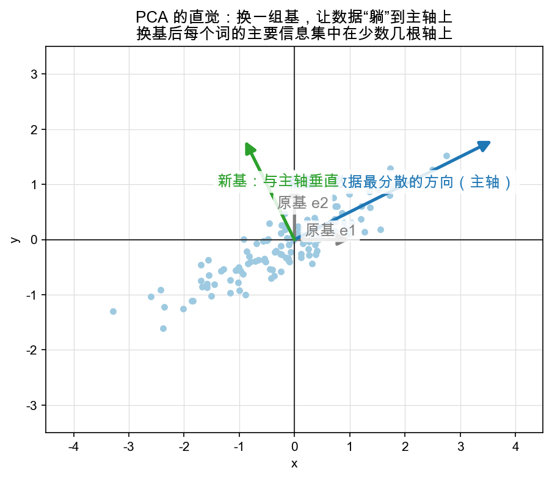

# Day 6：AI 联系——换基就是换视角：PCA 与归一化直觉

> 本章你将：
>
> 1. 把整周的"换基 = 换尺子 = 换视角"接进 AI 的三个真实场景；
> 2. 一句话抓住 **PCA** 的直觉：找一根"数据最分散"的新坐标轴，换个基降维；
> 3. 一句话抓住 **LayerNorm** 的直觉：统一一把尺子（缩放坐标），让每个样本"对齐可比"；
> 4. 用 **embedding 空间换基 = 换视角看语义**收尾，回望初一至今的"语义尺子"。

---

## 6.1 本周的题眼，一句话收口

前五天你其实只在干一件事，只是换了说法：

> **换基 = 换一套尺子 = 换个视角重新读同一个东西。**

- Day 1：矩阵的列 = 新坐标轴；
- Day 2：`Ma = Ib`，点动等价于尺子动；
- Day 3：逆矩阵 = 把尺子换回去（回程票）；
- Day 5：A = P⁻¹BP，换 P 就是给同一个变换"换镜头拍照"。

现在把这句话带回你最初学 AI 的动机。你会惊讶地发现：**AI 里很多"高级"算法，本质就这一句话。**

---

## 6.2 PCA：找一根"数据最分散"的新轴

先从 PCA（主成分分析）开始——它是换基最漂亮的落地。先看直觉，一张图胜过千言：



图里有一团**斜着**拉长的点云（浅蓝）。原本的尺度（灰色 e1、e2）里，这些点的 x、y 两个坐标都"不小"，得用两个数一起描述。但你看它们真实的分布：其实**大部分变动都挤在一根斜着的轴**上（蓝色的主轴），只有一点点散在垂直方向（绿色）。

PCA 的思路因此朴素到可爱：

> 📌 **换一组基，让新坐标轴顺着数据"最分散的方向"摆，数据的主要信息就集中到了少数几根轴上。**

换成矩阵语言（正是本周五天的组合拳）：

1. **找基**：算出数据散得最开的那根方向，作为第一根新轴（"主轴"），再取和它垂直的第二根（"次轴"）；
2. **换基**：把这组新轴当成新尺子，把所有点重新读一遍——这就是 Day 2 的"尺子动"；
3. **降维**：新读数里，主轴坐标几乎装下了全部信息，次轴坐标小得可怜。**丢掉次轴那个坐标**，等于用一根轴就"约等于"概括了整个二维图（Week 7 还会见它更硬核的样子，叫做特征向量/特征值）。

丢掉的那根坐标，就是 Day 3 说的"压扁了、信息有损"——PCA 降维是**有损压缩**，但它"丢"的是**最不重要的信息**，所以性价比极高。你在真实 NLP 里见过的"把 768 维 embedding 降到 2 维画图"，用的多半就是这个换基降维的思路。

> 💡 **你可能会问："数据最分散的方向"怎么用初中数学找出来？**
>
> 直觉版：试着画一堆过原点的方向，看数据沿哪个方向"跨度"最大——那个方向就是主轴。严格版需要一点"方差"（数据离中心多远的平方平均）和 Week 7 的特征值，现在先用"找跨度最长的轴"这个手感接住即可，别急着算。

---

## 6.3 LayerNorm：统一一把尺子

第二个落点更简单，名字叫 **LayerNorm（层归一化）**——transformer 里几乎每层都夹着它。它的直觉，正好也是"换尺子"，只是换的是**刻度**：

> 📌 **LayerNorm = 把每个样本的数值，重新"对齐"到同一把尺子上（同一个均值、同一个跨度）。**

打个比方：两个人报身高，一个报"一米七"，一个报"6 尺"，没法比；你统一规定都用"厘米"这把尺子，才有意义。神经网络里，不同 token 的数值分布有大有小、有正有负，直接喂给下一层会"忽大忽小"不稳定。LayerNorm 做的事就是**给每个样本单独做一次"拿尺子缩放+平移"**：

```
先平移：减掉自身的均值（把"中间"挪到 0）
再缩放：除以自身的标准差（把"跨度"统一成 1）
```

翻译成我们这周的语言：**平移 = 换原点，缩放 = 换刻度**，合起来就是一次"换尺子"。它不做旋转、不换"歪斜的方向"（不像 PCA），只是把每份数据重新量到一把**统一的、以 0 为中心、跨度 1** 的尺子上——于是所有样本"站在同一条起跑线"，下一层学起来稳得多。

> ⚠️ **易踩坑：** LayerNorm 和 PCA 都在"换尺子"，但**目的相反**——PCA 是把数据"散到少数主轴上、方便降维"；LayerNorm 是把数据"压回统一尺度、方便稳定训练"。别因为都叫"归一化"就混为一谈。LayerNorm 是按**样本**（每行）归一，用的也只是平移+缩放，不转方向。

---

## 6.4 Embedding 空间换基 = 换个视角看语义

最后一个，把你拉回 Week 1、2 就埋下的那根线：**embedding（把词变成向量）**。

一个词是一串高维坐标（配方），读它的时候你用默认的"语义尺子"（标准基）。但"语义尺子"不是永远顺手——比如你关心的不是"国王 vs 王后"这些单个概念，而是"大小/贵贱/强弱"这类对比关系，那么**顺着"大小"这根轴去看**，可能比硬看原始坐标更清楚。

这正是换基的价值：**embedding 空间里换一组基，等于换一个"看待语义"的视角。** 同一个词、同一副向量，在不同视角下，突出的语义侧面不同。你会不断在 AI 里撞见这类操作的影子：

- 余弦相似度（Week 5）其实就在选一种"只比方向、不比长度"的读法——某种程度的"换尺度"；
- attention 里的 QKV 投影（Week 6）把词变换进"查询/键/值"三套各用的空间——Week 3 的变换 + 本周的换视角；
- RoPE（Week 6 Day 5）用旋转矩阵给词"转个角度"来编码位置——**旋转，正是换基里最经典的一种（换一组正交的轴，只是转了个方向）**。

> 📌 **划重点：** 数学上的"换基"，落到 LLM 里就是"换一个看数据的视角"。PCA 换到"最分散"的视角，LayerNorm 换到"统一刻度"的视角，embedding 换基换到"你关心的语义"的视角。**同一份数据，不同的尺子，看到不同的重点。**

---

## 6.5 本周收官：一张总分表

把这周从"纯数学"到"AI 落点"一路列下来，收个口：

| 你在 Week 4 学到 | 数学工具 | 在 AI 里的现身 |
|---|---|---|
| 矩阵的列 = 新基 | 矩阵两种读法 | 任何"投影矩阵"都是换基 |
| 点动 = 尺子动 | Ma = Ib | QKV 里"变换进去"的视角 |
| 撤销 / 换回标准 | 逆矩阵 M⁻¹ | 解码/反投影的"回程" |
| 换基不换本质 | A = P⁻¹BP | 同一个模型，换个参数化 |
| 换到"最有用"的视角 | PCA（找主轴） | 降维、可视化、去噪 |
| 统一尺度看数据 | LayerNorm（缩放+平移） | transformer 每层兜底 |

> 📌 **金句本周版：换一把尺子，世界没变，只是你终于看清了它本来的样子。**

---

## 动手练习

1. **复述三连**：不看笔记，各用一句话向朋友解释 PCA、LayerNorm、embedding 换基。哪句卡壳，就回那一节重读。
2. **看图说话**：回到 `w4d6_pca_intuition.png`，指认"主轴""次轴""被丢掉的维度"，说明降维后"一根坐标替代两个坐标"的信息为什么损失小。
3. **动笔勾连**：用一句话写清"PCA 换的尺子"和"LayerNorm 换的尺子"在**方向取向**上的区别（一个转方向、一个只缩放平移）。

## 参考答案

本章无新代码（`matrixlab/coords.py` 的 6 个函数到 Day 5 已全部完成）。概念题的核对靠"自己能翻回来找到原文"，不必死记。完整实现仍看 `reference/coords.py`。

> 本周全部完成。下一站 **Week 5：点积、长度与相似度**——它会告诉你"两个向量有多像"，也正是 attention 里那个 `QKᵀ` 分数的数学底座。我们下周见！

👉 回本周总览：**[Week 4 导读](./README.md)**
