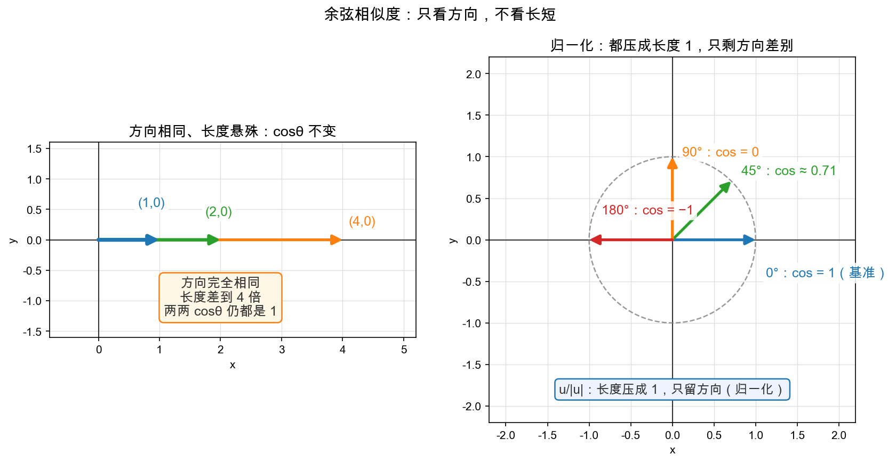

# Day 2：长度、夹角与投影——余弦是"方向契合度"

> 本章你将：
> - 把"长度 = 勾股定理"推广到 3 维、4 维……任意维，并实现 `norm`；
> - 分清两个亲兄弟：**投影长度**（一个数）和**投影向量**（一根箭头），实现 `project_scalar` / `project_onto`；
> - 从点积公式反推出**夹角公式** `cosθ = u·v / (|u||v|)`，实现 `is_orthogonal` / `angle_deg`；
> - 给本周最响的一句 slogan 盖章：**余弦 = 方向的契合度**。

---

## 2.1 复习一个初中老朋友：勾股定理

上一天的伏笔还记得吗？`(3, 4)·(3, −4)`。先不管那个负号，只看 `(3, 4)` 这根箭头——它有多长？

初中就学过：画在坐标纸上，从原点到 (3, 4) 的线段，横着走 3、竖着走 4，它俩和斜边构成直角三角形。斜边长度：

$$\sqrt{3^2 + 4^2} = \sqrt{9 + 16} = \sqrt{25} = 5$$

这就是勾股定理，你早就掌握了。它真正的意思是：**一根向量的长度，等于它每个坐标的平方之和再开根号**。

那 `(3, −4)` 呢？`√(3² + (−4)²) = √(9 + 16) = √25 = 5`，**一样长**。方向和 (3,4) 关于横轴对称，但长度完全相同。

---

## 2.2 长度 = 点积自己跟自己

还记得上一天末尾的练习吗？`(3, 4)·(3, −4) = 3×3 + 4×(−4) = 9 − 16 = −7`，不是 0，说明它俩不垂直。但更有意思的是另一个组合：**向量和自己点积**：

$$(3, 4) \cdot (3, 4) = 3\times3 + 4\times4 = 9 + 16 = 25 = 5^2 = |(3,4)|^2$$

看到了吗？**一个向量和它自己点积，等于它长度的平方**。这一下把"长度"和"点积"挂上了钩：

$$\text{长度（norm）} = \sqrt{u \cdot u} = \sqrt{\sum_i u[i]^2}$$

> 📌 **划重点：** 长度（数学里叫"范数 / norm"）就是"勾股定理推广到 n 维"：不管几维，把每个坐标平方加起来、开根号。2 维是勾股定理，3 维是"两次勾股"，n 维是同一句口诀的 n 次重复。

用向量 (1, 2, 2)（三维空间的一个点）体验一下"逐维平方再开根号"：

$$|(1, 2, 2)| = \sqrt{1^2 + 2^2 + 2^2} = \sqrt{1+4+4} = \sqrt{9} = 3$$

> 💡 **你可能会问：三维空间我没法"看见"，这个长度公式凭什么还对？**
>
> 好消息是：你不必证明。先记住结论——**长度公式就是"每个坐标平方相加再开根号"，任何维度都成立**。至于"为什么直觉靠得住"，第 3 天整个一章都在解决这个心结，先安心往下走。

---

## 2.3 投影：一根箭头的"影子"有两种形态

现在回到上一天那张图：u = (3, 2) 投到 v = (2, 0)（横轴）上，影子从 0 延伸到 3。这个"影子"，数学里叫**投影**，而且它其实有**两种形态**，得一招分清：

| | 投影长度 | 投影向量 |
|---|---|---|
| 英文 | projection scalar | projection onto |
| 是什么 | **一个数**（带正负号） | **一根箭头**（有方向有长度） |
| 上一天的例子里 | 3 | (3, 0) 那根红色箭头 |
| 好比 | 影子"有多长" | 影子"本身"落成一根完整箭头 |

这两个是本周最容易混的一对，务必盯住：

- **投影长度**回答"影子有多长"——是个带符号的数（投到反方向就是负的）；
- **投影向量**回答"影子落在哪"——是一根从原点伸到影子尖端的箭头。

---

## 2.4 先算投影长度：project_scalar

怎么算影子长？回看公式 `u·v = |u|·|v|·cosθ`。这个式子左边是点积，右边拆成"u 的长度 $\times$ 契合度 $\times$ v 的长度"。而"影子长"应该是多少？应该是 **u 的长度 $\times$ 契合度** = `|u|·cosθ`（影子不要太长的 u 也不要 v 的长度，只要 u 顺着 v 的那截）。

把公式两边同除 $|v|$：

$$u \text{ 在 } v \text{ 上的投影长度} = |u|\cos\theta = \frac{u \cdot v}{|v|}$$

验证上一天的例子：u=(3,2)，v=(2,0)，$|v|=2$，$u \cdot v = 6$：

$$\text{投影长度} = \frac{6}{2} = 3 \quad \checkmark \text{ 正好是那条影子长}$$

所以 `project_scalar` 的公式干净利落：

$$\mathrm{project\_scalar}(u, v) = \frac{u \cdot v}{|v|}$$

> ⚠️ **易踩坑：** 分母是 `|v|`（撞上去的那根轴的长度），**不是** `|u|`！很多人手滑除反方向。记法是——"投到谁身上，就除以谁的长度"。而且 v 不能是零向量（长度 0 没法当轴），测试里不会给你这个输入，但你心里要有数。

---

## 2.5 再算投影向量：project_onto

有了影子长，怎么把"影子本身"那根箭头也画出来？

投影向量有两件事必须满足：**方向跟 v 一样**，**长度等于刚才那个影子长**。翻译成"公式"：

- 方向 = v 的方向 = 把 v 除以自己的长度，得到"单位方向" `v / |v|`；
- 长度 = 影子长 = `(u·v) / |v|`。

两者相乘：

$$\begin{aligned}
\text{投影向量} &= \text{影子长} \times \text{单位方向} \\\\
&= \left(\frac{u \cdot v}{|v|}\right) \times \left(\frac{v}{|v|}\right) \\\\
&= \left(\frac{u \cdot v}{|v|^2}\right) \times v \\\\
&= \left(\frac{u \cdot v}{v \cdot v}\right) \times v
\end{aligned}$$

最后一步用了 2.2 节的 $|v|^2 = v \cdot v$。所以代码思路是：

1. 算比例 `s = (u·v) / (v·v)`；
2. 把 v 每个坐标都乘上 s，得到新箭头。

拿例子走一遍：u=(3,2)，v=(2,0)，$u \cdot v = 6$，$v \cdot v = 4$，s = 6/4 = 1.5，于是 `1.5 × (2,0) = (3,0)`。红色箭头就是 (3,0)，长度 3，方向沿横轴。对上了。

> 📌 **划重点：** 投影向量 = `(u·v / v·v) × v`。它本质是"把 v 按某个比例伸缩一下"——又一次用到了 Week 1 就学会的**数乘**。投影长度是这一整串里的那个比例数 `s`，再乘以 `|v|`。

---

## 2.6 夹角公式：把 $\cos\theta$ 解出来

一切就位，可以解决"怎么量夹角"了。从 `u·v = |u|·|v|·cosθ` 把 $\cos\theta$ 单独解出来：

$$\cos\theta = \frac{u \cdot v}{|u| \cdot |v|}$$

于是**夹角** $\theta = \arccos$（反余弦）上面那个数，计算机里是 `math.acos`，转成角度制就是 `math.degrees`。看两个能心算验证的例子：

- u = (1,0)、v = (0,1)：`cosθ = 0 / (1×1) = 0` $\to \theta = 90^\circ$ ✓ 垂直；
- u = (1,0)、v = (1,1)：`cosθ = 1 / (1×√2) = 1/√2` $\to \theta = 45^\circ$ ✓ 对角线。

这个"解出来的 $\cos\theta$"，就是本章标题里那个主角。但在给它起名字之前，先停一下，把一件最容易被含糊带过的事挑明。

**第一步："相似"指什么，是人为选择的定义，不是定理。** "两个向量像不像"并没有天经地义的量法，你得先*选定*一个标准：

- 选"**坐标挨得近不近**"？那用两点的直线距离（欧氏距离）就行；
- 选"**方向要亲、长度也都要有劲**"？那直接用点积——方向越合、越长，分越高（attention 的打分就是这么选的，Week 6 见）；
- 选"**只看指向，不看长短**"？这就是本周的选择，也是 embedding 检索的选择。

注意：选哪个是**定义**，是建模时的选型——数学没法证明"相似*应该*指方向"，就像它没法证明身高该用厘米量。定义落地之后，数学才登场。

**第二步：选定"方向"之后，为什么度量它的偏偏是 $\cos\theta$？** 三个理由，一个比一个硬：

1. **它和夹角严格等价**：$\cos$ 在 $[0^\circ, 180^\circ]$ 上单调递减——$\theta$ 越小 $\cos\theta$ 越大。所以 $\cos\theta$ 就是夹角换了个刻度，排序能力一模一样，还顺手把"最像"标成 $1$、"最不像"标成 $-1$，读着直观。
2. **它好算**：$\theta$ 要动用反余弦，而 $\cos\theta = u·v / (|u||v|)$ 全是乘除开方，计算机里又快又稳。
3. **它有独立的直觉**：归一化后 $\cos\theta = \hat{u}\cdot\hat{v} = \sum_i \hat{u}_i\hat{v}_i$，逐维看就是"这一维你俩同号且都大 $\to$ 加分；唱反调 $\to$ 扣分"——一个按维度累计的"**意见一致度**"。还有个彩蛋：对单位向量，$\frac{1}{2}|\hat{u}-\hat{v}|^2 = 1 - \cos\theta$——在单位球面上，余弦和欧氏距离根本是同一件事的两种写法。

所以严格的因果关系是：**先定义"相似 = 方向像"（人为选择），$\cos\theta$ 再被数学逼成这个定义的最佳度量（可证）**。至于"为什么 embedding 这个场景恰好该选'方向'这个定义"，那是 Day 5 的事——它是一环**经验事实**，不是证明，千万别拿它回头来证这两步，那就循环论证了。

论证到齐，给主角正式挂牌：`cosθ = u·v / (|u||v|)` 有个好听的名字——**余弦相似度（cosine similarity）**。

> 📌 **划重点：** 余弦相似度只由"方向像不像"决定，跟长短无关，所以它就是"**方向的契合度**"：$1$ = 完全同向，$0$ = 垂直（无感），$-1$ = 完全反向。

说它"跟长短无关"，凭什么？先看个对比：`(1,0)` 和 `(2,0)` 长度差一倍，但方向完全相同，`cosθ = 1`；`(2,0)` 和 `(100, 0)` 也是 1。**只要方向不变，$\cos\theta$ 永远是 1，长度再悬殊也没用。** 这不是巧合，而是公式结构保证的。分三层看透它：

**第一层：点积里掺着"长度的水分"。** 回看 `u·v = |u|·|v|·cosθ`，点积其实是三样东西的乘积：**u 的长度 × v 的长度 × 方向契合度**。所以点积本身没法直接当"相似度"用——把 u 拉长 10 倍，点积就涨 10 倍，方向明明一点没变，分数却虚高了。

**第二层：除以 `|u|·|v|`，恰好把水分挤干。** 把 u 任意拉长 $a$ 倍、v 拉长 $b$ 倍（方向不动），代回公式：

$$\frac{(au)\cdot(bv)}{|au|\cdot|bv|} = \frac{ab\ (u\cdot v)}{ab\ |u|\ |v|} = \frac{u\cdot v}{|u|\ |v|}$$

分子膨胀了 $ab$ 倍，分母也跟着膨胀 $ab$ 倍，一除就约掉了——**不管把向量拉多长，$\cos\theta$ 纹丝不动**。这就是"跟长短无关"的严格原因。

**第三层：换个角度看，就是"先压成单位长，再比方向"。** 把公式拆成两半：

$$\cos\theta = \frac{u\cdot v}{|u|\ |v|} = \left(\frac{u}{|u|}\right)\cdot\left(\frac{v}{|v|}\right) = \hat{u}\cdot\hat{v}$$

`u/|u|`（读作"u 帽"）叫**单位向量**：长度压成 1、只留方向。两个单位向量做点积，长度因子天然是 1，结果纯粹由夹角决定。这个"压成长度 1"的动作就是大名鼎鼎的**归一化（normalize）**——先统一规格，再公平比较。



对照上图：左图三根箭头方向完全相同、长度差到 4 倍，两两 `cosθ` 全是 1；右图把向量统一压到单位圆上，差别只剩方向——$0^\circ / 45^\circ / 90^\circ / 180^\circ$ 分别对应 `cos` 值 $1 / 0.71 / 0 / -1$。这个性质，第 4 天讲 embedding 时会成为主角：词向量长短不一，余弦相似度只问"你们俩方向像不像"。

---

## 2.7 动手实现：norm / project_scalar / project_onto / is_orthogonal / angle_deg

一天实现五个函数，但全是上面公式的机械翻译，别慌。逐个来：

**① `norm(u)`** —— 长度。就是 `√(u·u)`：

```python
import math

def norm(u: list) -> float:
    return math.sqrt(dot(u, u))
```

注意：这里**复用**你昨天写的 `dot`，这才是"点积是地基"的意思。

**② `project_scalar(u, v)`** —— 投影长度，一个数：

```python
def project_scalar(u: list, v: list) -> float:
    return dot(u, v) / norm(v)
```

**③ `project_onto(u, v)`** —— 投影向量，一根箭头。2.5 节的公式直接抄：

```python
def project_onto(u: list, v: list) -> list:
    s = dot(u, v) / dot(v, v)   # 比例：影子长 / |v|
    return [s * v[0], s * v[1]] # 把 v 按比例伸缩
```

> ⚠️ **易踩坑：** `project_onto` 的分母是 `dot(v, v)`（= $|v|^2$），`project_scalar` 的分母是 `norm(v)`（= $|v|$）。就差一个平方！写的时候别抄混。

**④ `is_orthogonal(u, v, eps=1e-9)`** —— 是否垂直。按 Day 1 的铁律"垂直 $\Leftrightarrow$ 点积 0"：

```python
def is_orthogonal(u: list, v: list, eps: float = 1e-9) -> bool:
    return abs(dot(u, v)) < eps
```

为什么不是 `dot(u, v) == 0`？因为浮点数有误差，`0.1 + 0.2` 都不是精确的 0.3。所以"足够接近 0"就算垂直，`eps`（1e-9 = 0.000000001）是那个"足够近"的门槛。

**⑤ `angle_deg(u, v)`** —— 夹角（角度制）。2.6 节公式 + 两行保护：

```python
def angle_deg(u: list, v: list) -> float:
    cos = dot(u, v) / (norm(u) * norm(v))
    cos = max(-1.0, min(1.0, cos))  # 防浮点误差越界
    return math.degrees(math.acos(cos))
```

那行 `max(-1, min(1, cos))` 是干什么的？`math.acos` 只接受 $[-1, 1]$ 之间的数，浮点误差可能算出 1.0000000001 或 $-1.0000000001$，一越界程序就崩。这一行把 cos 硬夹回 $[-1, 1]$，叫"钳位（clamp）"。工业代码里这种保护很常见。

写完跑测试，全部五个一起验：

```bash
pytest tests -k w5 -q
```

---

## 2.8 一张表收尾：五个函数一个家谱

| 函数 | 公式 | 输出 | 一句话 |
|---|---|---|---|
| `dot(u, v)` | $\sum_i u[i]\ v[i]$ | 数 | 亲密度（原始分） |
| `norm(u)` | $\sqrt{u \cdot u}$ | 数 | 长度（勾股推广） |
| `project_scalar(u, v)` | $\frac{u \cdot v}{\Vert v\Vert}$ | 数 | 影子长（带符号） |
| `project_onto(u, v)` | $\frac{u \cdot v}{v \cdot v}\ v$ | 箭头 | 影子本身 |
| `is_orthogonal(u, v)` | $\Vert u \cdot v\Vert < \mathrm{eps}$ | 布尔 | 垂直吗 |
| `angle_deg(u, v)` | $\mathrm{degrees}(\arccos(u \cdot v/(\Vert u\Vert\ \Vert v\Vert)))$ | 角度 | 夹角多少度 |

看出血脉关系了吗？**`dot` 是老祖宗，其余五个全是它的孩子**。`norm` 是 dot(u,u) 开根号；投影是 dot 除以长度；夹角是 dot 除以两个长度。记住这一条，五个函数不用背，现推就行。

---

## 2.9 本章小结

- ✅ 长度 = `√(u·u)`：勾股定理的 n 维推广，"每个坐标平方相加再开根号"。
- ✅ 投影有两兄弟：**投影长度**（数，`u·v/|v|`）和**投影向量**（箭头，`(u·v/(v·v))·v`），后者就是"把 v 按比例伸缩"。
- ✅ 夹角公式 `cosθ = u·v/(|u||v|)`，$\theta$ 用 `acos` 反解。
- ✅ **"相似 = 方向像"是人为选定的定义**（也可以选距离、选点积）；选定后，$\cos\theta$ 被数学逼成最佳度量：与夹角严格单调等价、公式便宜、还是逐维的"意见一致度"。
- ✅ **余弦 = 方向契合度**：只看方向不看长度（除以 `|u||v|` 就是归一化——压成单位向量再比方向），$1/0/-1$ 对应同向/垂直/反向。

---

## 动手练习

1. **手算**：求 u=(4, 3) 在 v=(1, 0) 上的投影长度、投影向量；再求 u=(3, 4) 与 v=(0, 1) 的夹角。
2. **实现** `norm` / `project_scalar` / `project_onto` / `is_orthogonal` / `angle_deg`（五个都写），跑 `pytest tests -k w5 -q` 到全绿。
3. **验证一个性质**（写个小脚本）：随机挑两个向量，算 `dot(project_onto(u, v), u − project_onto(u, v))`，打印结果。理论上它应该是 0——这说的是"u 拆成'贴 v 的那部分 + 垂直 v 的那部分'，两部分彼此垂直"。这直觉 Week 7 最小二乘还会回来。

## 参考答案

卡住 20 分钟以上，看 `reference/proj.py`——五个函数都是本节的公式原样翻译，重点对照 `project_onto` 的分母 `dot(v, v)` 和 `project_scalar` 的分母 `norm(v)`。

---

👉 接下来第 3 天，我们把"2 维的直觉"硬生生搬到 3 维、768 维，看它到底还灵不灵：[Day 3：高维空间——公式照搬，直觉还在吗](./03-Day3-高维空间-公式照搬直觉还在吗.md)。
