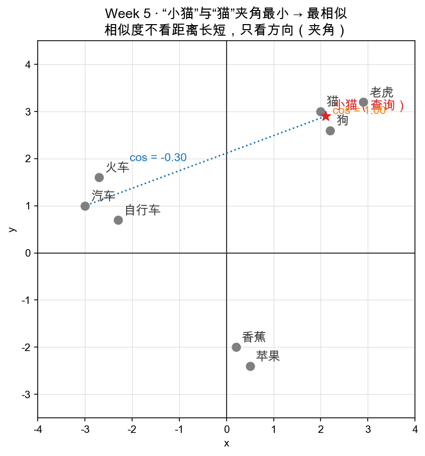

# Day 4：代码实战——相似度计算器与最近邻

> 本章你将：
> - 实现 `similarity.cosine_similarity`，**复用**第 1、2 天的 `proj.dot` 和 `proj.norm`，拼出"两个向量的余弦相似度"；
> - 实现 `similarity.nearest_index`，在一堆向量里找出**跟查询最像的那一个**——这就是"最近邻"；
> - 搞懂那句神秘的 `best_s = -2.0` 到底为什么是 −2 而不是 0 或 −1；
> - 亲手把 `pytest tests -k w5` 跑到**全绿**，并读一张"词向量散点图"来收尾。

---

## 4.1 开场：把前三天攒的货，拼成一个"相似度计算器"

前三天，你手里已经有了一整套工具：`dot`（亲密度原始分）、`norm`（长度）、`angle_deg`（夹角）。它们全是"给定两个向量，吐一个数"。今天，我们要用它们**攒出两个真正"干活"的函数**，干的就是 AI 里最日常的那件活——

> 给我一个查询向量（比如"小猫"的 embedding），再从一堆向量里（"猫""狗""汽车"……的 embedding）找出**跟它最像的那一个**。

这件事在工业界有个名字叫**最近邻搜索（nearest-neighbor search）**，而衡量"像不像"的那把尺子，就是前三天反复露面的**余弦相似度**。

打开新战场 `matrixlab/similarity.py`，它长这样：

```python
from . import proj   # 复用前几天的成果

def cosine_similarity(u: list, v: list) -> float:
    raise NotImplementedError("TODO: Week 5 Day 4 —— 余弦相似度")

def nearest_index(query: list, vectors: list) -> int:
    raise NotImplementedError("TODO: Week 5 Day 4 —— 最近邻")
```

注意顶部那行 `from . import proj`——这就是"复用"的姿势：**相似度不重新造轮子，直接用你第 1、2 天写的点积和长度**。

---

## 4.2 实现 cosine_similarity：两行公式，一堆复用

余弦相似度，就是第 2 天解出来的那个 `cosθ`：

```
cosine_similarity(u, v) = u·v / (|u| · |v|)
```

它的取值范围 [−1, 1]：

| 值 | 含义 |
|---|---|
| 1 | 方向完全相同（最像） |
| 0 | 垂直（毫不相干） |
| −1 | 方向完全相反（最不像） |

既然 `dot` 和 `norm` 都躺在 `proj` 里，函数体就是公式照抄：

```python
def cosine_similarity(u: list, v: list) -> float:
    return proj.dot(u, v) / (proj.norm(u) * proj.norm(v))
```

> 📌 **划重点：** 余弦相似度 = `dot(u,v) / (norm(u) × norm(v))`。它只回答"**方向像不像**"，自动把长度约掉了——所以 `(1,0)` 和 `(2,0)` 相似度也是 1，`(2,0)` 和 `(100,0)` 也是 1。这正是"长度是噪声、方向才是语义"的数学实现。

为什么长度会被约掉？看分子分母：分子 `u·v` 带着两个长度，分母 `norm(u)·norm(v)` 正好也带着同样的两个长度，一除，长度就没影了，只剩纯方向信息 `cosθ`。

---

## 4.3 实现 nearest_index：在一堆向量里找"最像的"

第二个函数要解决的问题是：

> 给 `query`（查询向量）和 `vectors`（一组向量），返回 `vectors` 里与 `query` 余弦相似度**最高**的那个向量的**下标**。

思路是经典的"**保冠军**"套路，三步：

1. 设一个"当前最高分" `best_s`，和一个"冠军下标" `best_i`；
2. 遍历 `vectors`，算出每个 `v` 与 `query` 的相似度 `s`；
3. 一旦 `s` 比 `best_s` 大，就更新冠军。

写出来是这样：

```python
def nearest_index(query: list, vectors: list) -> int:
    best_i = -1
    best_s = -2.0        # 见 4.4 节，为什么是 -2
    for i, v in enumerate(vectors):
        s = cosine_similarity(query, v)
        if s > best_s:
            best_s = s
            best_i = i
    return best_i
```

> 💡 **你可能会问：`enumerate` 是干嘛的？**
>
> `enumerate(vectors)` 一边给你元素 `v`，一边给你它的下标 `i`：`for i, v in enumerate([[1,0],[0,1]])` 会依次端出 `(0, [1,0])`、`(1, [0,1])`。因为最终要返回**下标**（不是向量本身），所以要一边走路一边数步数。

---

## 4.4 为什么初始 `best_s = -2.0`？——今天最容易问的一个 "为什么"

仔细看那行 `best_s = -2.0`。你八成会问：**余弦相似度最小不是 −1 吗？为什么不设成 0 或 −1，偏要 −2？**

答案只有一个：**初始值必须比"所有可能出现的相似度"都小**，否则第一次比较时冠军就被虚占了。

设想几种错误初值，会出什么岔子：

| 错误的 best_s | 会怎样 |
|---|---|
| 0 | 如果所有向量与 query 的相似度都是**负数**（比如 query 和全部候选都反着），就没有一个 `s > 0`，函数会返回 `best_i = -1`——一个**根本不存在的下标**。|
| −1 | 如果某个候选的相似度恰好 = −1（完全反向，这是合法的！），`s > −1` 不成立，它会被漏掉。|

所以正确做法是设一个**比最小值 −1 还小的数**，比如 −2（或负无穷）。这样**任何合法相似度都能打赢这个初始值**，哪怕全世界都跟 query 反着，第一个候选也会被正确收为冠军。

> 📌 **划重点：** `best_s = -2.0` 不是拍脑袋，是因为余弦相似度的理论下界是 −1，初始"冠军门槛"必须严格小于下界。设成 0 或 −1 都会在"全是负数"或"恰好 −1"的边缘翻车。这是"保冠军"套路里最经典的一个细节。

顺带印证一句测试：`test_nearest_index_negative_query` 里，query 是 `[-1, 0.01]`，它跟候选"东"几乎反向（相似度约 −0.99995），跟"北"垂直（0），跟"东北"约 −0.71。正确答案是"北"（下标 1）——正是那个"相似度全都不高"的刁钻场景，专门来抓 `best_s` 设错的人。

---

## 4.5 读图：散点图里的"相似度就是夹角"

写完代码，看一张图，把"余弦相似度 = 方向"这个抽象结论落成画面：



这张图是"二维词向量"的示意图（真实 embedding 是 768 维，这里为了画得出来，压到了 2 维——第 3 天讲过，任何一对向量都能剪成一张二维纸）。几个要点：

- 红色星星是**查询"小猫"**（约在 (2.1, 2.9)）。
- **猫、狗、老虎**三只动物挤在右上角，离"小猫"方向很近；**汽车、火车、自行车**躺在左边；**苹果、香蕉**沉在下方。
- 橙色虚线连到**最相似的那个**——程序算出来的是"猫"，余弦相似度 ≈ 0.999（图上 4 舍 5 入显示成 `cos = 1.00`）；第二近的"狗" ≈ 0.997，"老虎" ≈ 0.994，都紧追不舍。
- 蓝色虚线连到"汽车"，方向几乎相反，余弦相似度 ≈ **−0.30**，是个负数。

看关键对比：**"小猫"和"汽车"的分数是负的**——不是"有点不像"，是"方向背道而驰"。这就是余弦相似度的脾气：**它只看方向，不看距离**。哪怕把一个词向量伸长十倍，相似度纹丝不动；可方向一反，分数立刻变负。

> 💡 **你可能会问：为什么猫、狗、老虎都跟"小猫"几乎一样像，挤在一起分不出胜负？**
>
> 这正是"二维压扁"留下的错觉——真实 embedding 有 768 个维度，这张图只挑了其中两个。压到 2 维后，三只动物恰好在这两个维度上的方向都几乎重合：猫 ≈ 0.999、狗 ≈ 0.997、老虎 ≈ 0.994，**差在千分位之后**，可以说是不分胜负。我们要学的不是"哪个词赢"，而是**这个"比方向"的机制本身**。真到 768 维里，谁更像谁，交给数据说话。

---

## 4.6 收官：把本周测试跑到全绿

两个函数都写好了，跑本周完整测试，一次性验收前四天的全部成果：

```bash
pytest tests -k w5 -q
```

你应该看到类似这样的绿色输出：

```
13 passed, 78 deselected in 0.10s
```

（数字以你机器为准，关键是**没有红字**。）如果哪条红了，看报错里的 `assert`，它几乎总是精确指出了你哪个函数算错了——回头对照 `reference/` 里的同名实现找差异。

---

## 4.7 本章小结

- ✅ `cosine_similarity(u, v) = dot(u,v) / (norm(u)·norm(v))`，取值范围 [−1, 1]，**只看方向不看长度**。
- ✅ `nearest_index` = "保冠军"套路：遍历 + 记录最高分，返回下标。
- ✅ `best_s = -2.0` 是因为余弦相似度下界是 −1，门槛必须严格小于下界，否则"全是负数"就翻车。
- ✅ 读懂了词向量散点图：小猫 ↔ 猫/狗/老虎 ≈ 1（方向近），小猫 ↔ 汽车 ≈ −0.30（方向反）。

---

## 动手练习

1. **实现 `cosine_similarity` 与 `nearest_index`**（复用 `proj`），跑 `pytest tests -k w5 -q` 到全绿。
2. **写个小脚本**，复现 4.5 节图里的关键数字：算出"小猫 (2.1, 2.9)"与"猫 (2.0, 3.0)"、"狗 (2.2, 2.6)"、"老虎 (2.9, 3.2)"、"汽车 (−3.0, 1.0)"的余弦相似度，确认"猫/狗/老虎 ≈ 1、汽车 ≈ −0.30"。
3. **试试 `nearest_index` 的刁钻场景**：用 `query = [-1, 0.01]`、`vectors = [[1,0],[0,1],[1,1]]`，看它返回几（预期 1，即"北"），体会"相似度全是非正数时冠军照选"。

## 参考答案

卡住 20 分钟以上，看 `reference/similarity.py`——两个函数加起来才十几行，重点体会 `best_s = -2.0` 那行注释的解释。

---

👉 最后一章，我们摘掉"二维玩具"的帽子，把余弦相似度和最近邻**接到真实的 LLM 部件上**：embedding 检索、attention 的 QKᵀ 分数、"国王−男人+女人≈女王"——你会发现，本周写的两行代码，就是 AI 每天都在跑的东西：[Day 5：AI 联系——embedding 相似度就是夹角](./05-Day5-AI联系-embedding相似度就是夹角.md)。
