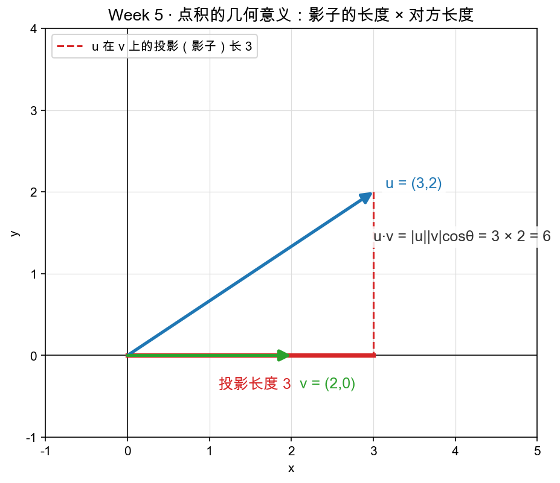

# 🚀 Week 5：点积、长度与相似度——向量之间的"亲密度"

> **适合谁：** 已经跟着 Week 1～4 把"向量是一根箭头""矩阵是变换/坐标系"的直觉建立起来的人。你会 Python（会写函数、跑 `pytest`），**但没学过三角、没学过内积、没碰过 embedding 背后的数学**。
>
> **本周定位：** 前面四周我们一直把向量当"箭头"看，只关心它**指向哪、拉多长**。本周回答一个新问题：**两根箭头之间，怎么用一个数衡量"亲不亲"？** 这个数就是点积，而由它长出来的"长度""夹角""余弦相似度"，正是 embedding 检索、attention、推荐系统里日日夜夜在算的东西。
>
> **承诺：** 每个概念都从生活类比讲起（影子、太阳、搬箱子），代码每一行都说清为什么，**不需要上网搜任何东西，也不需要你会任何证明**。

---

## 📖 怎么用这套教程

1. **按顺序读，别跳。** Day 1 的点积是后面四章的唯一地基，缺了它寸步难行。
2. **边读边动手。** 看到"请这样写代码"，就真的去 `matrixlab/proj.py` 和 `matrixlab/similarity.py` 里写。
3. **每写完一个函数就跑测试。** 绿了再往下走，别攒到最后一口气补。
4. **卡住超过 20 分钟，去看参考答案**（`reference/` 里的同名文件），看懂后**自己重写一遍**。

---

## 📚 目录

| 章节 | 标题 | 你会得到 |
|---|---|---|
| Day 1 | [点积——一个数如何度量两个方向的关系](./01-Day1-点积-一个数度量两个方向的关系.md) | 点积的定义与几何意义：对应相乘相加 = $\|u\|\,\|v\|\cos\theta$；正交（垂直）$\Leftrightarrow$ 点积为 0 |
| Day 2 | [长度、夹角与投影——余弦是"方向契合度"](./02-Day2-长度夹角与投影.md) | 长度（n 维勾股）、投影长度/投影向量、夹角公式；"余弦 = 方向契合度" |
| Day 3 | [高维空间——公式照搬，直觉还在吗](./03-Day3-高维空间-公式照搬直觉还在吗.md) | 3 维、768 维点积/长度/夹角公式照抄；高维直觉靠"降维到影子"理解 |
| Day 4 | [代码实战——相似度计算器与最近邻](./04-Day4-代码实战-相似度计算器与最近邻.md) | 余弦相似度 + 在一堆向量里找最近邻；亲手跑绿 `pytest tests -k w5` |
| Day 5 | [AI 联系——embedding 相似度就是夹角，attention 的分数就是点积](./05-Day5-AI联系-embedding相似度就是夹角.md) | embedding 检索、attention 的 $QK^{\mathsf{T}}$ 分数、"$\text{国王}-\text{男人}+\text{女人}\approx\text{女王}$"的验证思路 |

---

## 🗺️ 一张图看懂本周要回答什么

我们手里有两根箭头 u 和 v。本周只问一句话：**它俩"亲不亲"？**



- 把 u "投影"到 v 上，得到一条**影子**，长度是 $|u|\cos\theta$；
- 点积 $u \cdot v$ 就是这条影子再乘上 v 的长度 $|v|$；
- 夹角 $\theta$ 越小，影子越长，点积越大——**"亲密度"越高**。

这一张图，是本周五章全部内容的根。点积 $\to$ 长度 $\to$ 夹角 $\to$ 余弦相似度 $\to$ embedding 检索与 attention，都是同一件事在不同场景下的化身。

---

## ✅ 学完你会得到什么

- 一个**从零写字**的相似度工具箱：`dot` / `norm` / `project_scalar` / `project_onto` / `is_orthogonal` / `angle_deg` / `cosine_similarity` / `nearest_index`，全部在你的 `matrixlab/` 里，测试全绿。
- 对"**余弦相似度为什么是 embedding 的标准度量**"的透彻理解：它只看**方向**、不看**长度**，所以能免疫"词频/语气强度"对长度的污染。
- 看懂 attention 那句 `scores = Q·Kᵀ` 的底层直觉：**注意力分数，本质就是一大堆点积**——这直接为 Week 6 铺路。
- "国王 $-$ 男人 $+$ 女人 $\approx$ 女王"这句 AI 圈黑话背后的数学：它等价于"用向量加法在语义空间里挪位置，再用余弦相似度收账"。
- 一张通往 Week 6（手写迷你 Attention）的门票——你会在那里亲手用本周的 `dot` 拼出 attention 的分数。

---

## 🧭 常用命令速查

```bash
# 【先见证奇迹】用参考答案跑本周测试，看终点长什么样（应全绿）
IMPL=reference pytest tests -k w5 -q

# 跑本周测试 —— 检验你写在 matrixlab/proj.py、matrixlab/similarity.py 里的代码
pytest tests -k w5 -q

# 只跑点积/投影部分的测试
pytest tests -k "proj" -q

# 只跑相似度部分的测试
pytest tests -k "similarity" -q

# 重新生成本周的图（一般用不到，图已生成好）
python figures/gen_w5d1_dot_intuition.py
python figures/gen_w5d4_embedding_scatter.py
```

> `IMPL=reference` 是给 pytest 的一个环境变量，它会去 `reference/` 而不是 `matrixlab/` 里找实现——所以哪怕你的 `matrixlab/` 还全是 `TODO`，参考答案也能跑绿。这个机制 Week 1 第 3 章讲过了，忘了就回去翻一眼。

---

👉 准备好了吗？从 **[Day 1：点积——一个数如何度量两个方向的关系](./01-Day1-点积-一个数度量两个方向的关系.md)** 开始吧！
