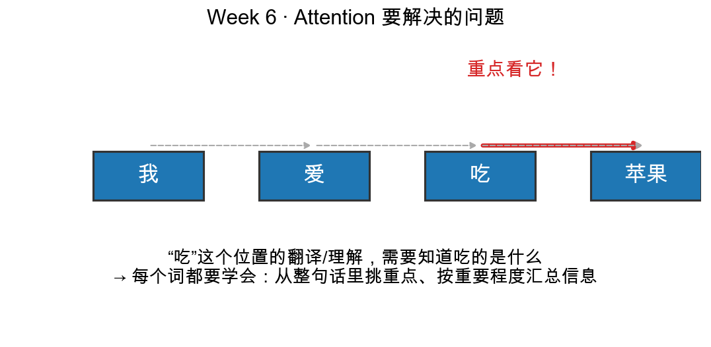
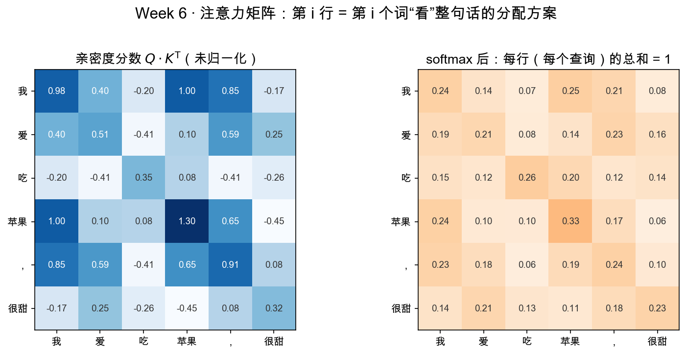

# Day 1：Attention 要解决的问题——"翻译到这个词时我该看哪"

> 本章你将：
> 1. 明白 Attention 要解决的**确切问题**：一句话里每个词，该看别的哪些词、各看多重；
> 2. 用一个翻译例句感受到"有些词天生该盯紧另一些词"；
> 3. 把问题翻译成"给每对词算一个亲密度、再按亲密度汇总"的数学话术；
> 4. 对接前五周：亲密度 = 点积（Week 5），汇总 = 线性组合（Week 2）。

---

## 1.1 先从一个翻译看起

请你翻译这句，慢一点，边译边想自己脑子里发生了什么：

> 我 / 爱 / 吃 / 苹果

你几乎在一瞬间就完成了，可能压根没意识到中间有"思考"。现在把镜头放慢，只看"**吃**"这一个字——当你要理解/翻译"吃"的时候，你其实悄悄做了什么？

- 你**没有**平均地扫一眼整句话；
- 你**重点盯住了"苹果"**，因为"吃"到底是什么意思、该怎么译，很大程度上取决于"吃的是什么"（吃苹果 vs. 吃火锅 vs. 吃醋，差别大了）；
- 对"我"和"爱"，你只是轻轻扫过——它们是背景，不是重点。

这就是 Attention 最朴素的问题：**处理到某个词的时候，该看哪些词、各看多重？** 它不是一次决定，而是**每个词都要做一遍**——处理"苹果"的时候，它同样会回头重点看"吃"。

图上那条红粗箭头，画的就是"吃"→"苹果"这条重点关系；其余灰色虚线代表那些"也连接着，但没那么要紧"的关系。

---

## 1.2 为什么"平均看每个词"不行

你会想：那我让每个词把整句话的所有词**一视同仁地汇总**一遍，行不行？

不行。看两个反例：

| 句子 | "吃"的正确理解 | "平均汇总"会得到的 |
|---|---|---|
| 我 / 爱 / 吃 / 苹果 | 吃掉水果 | 把"我、爱、苹果"一视同仁地揉进来，"爱"的语义被浪费，"苹果"又不够突出 |
| 我 / 爱 / 吃 | （宾语缺失，本身就模糊） | 同上，毫无区别 |

所谓"平均"，就是给"我、爱、苹果"各 $1/3$。可真正理解"吃"的时候，"苹果"应该占大头（比如 $0.8$），"我"、"爱"只占零头（各 $0.1$）。**权重不该人人相等，而该由"谁和谁更相关"来定。**

> 📌 划重点：Attention 解决的问题可以压缩成一句话——**每个词都要学会"按重要程度"去汇总整句话**，重要的多拿，无关的少拿，而不是无脑平均。

---

## 1.3 把这个问题翻译成数学话术

现在我们手头已经有前五周的工具了，试着把这个"翻译问题"用数学说出来。它其实问三件事：

1. **"谁和谁相关"怎么量化？** —— 两个词各有一个向量（Week 1、Week 2 的 embedding，就是词的"坐标"）。两个向量的**点积**（Week 5）正好能度量"方向多接近"，值越大越相关。所以"亲密度分数" = 点积。
2. **"各看多重"怎么表示？** —— 每个词对每个词，都算一个亲密度分数；再把这些分数变成"加起来等于 100%"的权重。这一步就是下一章要讲的 softmax（Day 2、Day 3）。
3. **"把看重的信息汇总起来"怎么算子化？** —— 拿到了权重，就把每个词的向量按权重**加权求和**。加权求和是什么？就是 Week 2 的老朋友**线性组合**：$w_1\cdot v_1 + w_2\cdot v_2 + w_3\cdot v_3 + w_4\cdot v_4$。

看，问题本身不难，难的是**把它落成你能算的东西**。落成之后，整条流水线就清晰地浮现出来了：

$$
\text{"吃"该怎么理解} = \sum_i (\text{亲密度权重}_i \times \text{词}_i\text{ 的向量})
$$

这个 $\sum$ 求和式，就是 Attention 的雏形。后面四天，我们要一砖一瓦把它从"口号"变成"能跑的代码"。

---

## 1.4 一个迷你句子的预告：六个词会算出什么

先剧透一下，学完的终点长什么样。下一章我们要拿 6 个词做实验：

> 我 / 爱 / 吃 / 苹果 / ， / 很甜

给每个词一个随机的 2 维向量（就像 Week 1 里给颜色、给词找坐标那样，只是这里是随便甩在二维平面上的 6 个点）。然后机器会算出一张 $6\times6$ 的**亲密度表**——第 $i$ 行第 $j$ 列，就是"第 $i$ 个词看第 $j$ 个词，该给多少关注"。

先别急着懂这张图，Day 4 会一格一格带你看。现在只建立一个印象：**这是一张方阵，每一行加起来都是 1**（因为一个词把 100% 的注意力分给了整句话里的各个词），而且**对角线最亮**（一个词天然最"像"它自己）。这就对了——你要造的东西，就是能算出这张表的机器。

> 💡 你可能会问：对角线最亮，是不是等于"每个词都只关注自己"？
>
> 在**没有位置信息、词向量又恰好是随机**的玩具例子里，确实每个词最 "像" 自己，所以对角亮。等词向量学会了语义、又加入了位置（Day 5 的 RoPE）之后，权重就会流向真正相关的词——"吃"把注意力流向"苹果"。这张热力图的价值，正在于让你**看得见"谁在关注谁"**。

---

## 1.5 前五周，其实一直在给你备料

到本章为止，你手里已经有了拼出 Attention 的所有零件，缺的只是"装配图纸"。我们清点一下（本周会反复引用的周号，先钉在墙上）：

| 周 | 你学到的东西 | 本周的用场 |
|---|---|---|
| Week 1 / 2 | 每个词一个向量（embedding），向量=坐标 | 句子就是"一行行词向量" |
| Week 2 | 线性组合 = 按配方伸缩再相加 | 加权求和（汇总信息） |
| Week 3 | 矩阵 = 变换（旋转、拉伸…） | 把词向量投射到 Q/K/V 三个空间 |
| Week 4 | 矩阵 = 坐标系（换尺子读同一个东西） | 理解"变换 Q/K/V"其实是在换视角 |
| Week 5 | 点积 = 亲密度 = 余弦方向契合度 | 注意力分数 $QK^T$ |

> 📌 划重点：这周你要做的，不是学新东西，而是把五周的旧砖**砌成一座你见过、但还没亲手盖过的房子**。正因如此，这周是检验前面五周是否真正吃透的试金石——哪里没吃透，这里立刻现形。

---

## 1.6 本章小结

- ✅ Attention 解决的问题：处理某个词时，"该看哪些词、各看多重"——每个词都要做一遍这件事。
- ✅ 不能平均看：权重该由"相关性"决定，而不是人人 $1/n$。
- ✅ 翻译成数学：相关性 = 点积（Week 5），各看多重 = softmax（Day 2/3），汇总 = 加权求和 = 线性组合（Week 2）。
- ✅ 终点形态是一张 $6\times6$ 的注意力矩阵：每行和 = 1，对角最亮。

---

## 动手练习

1. **口头翻译**：把"我/爱/吃/苹果"换成"猫 / 在 / 追 / 老鼠"，说说处理"追"这个词时，你最应该重点看哪个词？为什么？（这题不用代码，纯练"谁看谁"的直觉。）
2. **纸面算分数**：给两个词向量 $a = [1, 0]$、$b = [0, 1]$，用 Week 5 学的点积公式，算一算"$a$ 关注 $b$"的原始亲密度分数是多少？再算 $a$ 关注自己 $a$ 是多少？感受一下"自己和自己最像"从哪来。

## 参考答案

这两题都只用 Week 5 的 `reference/proj.py` 里的 `dot`：第 1 题对应"最难的那对关系"，第 2 题 `dot([1,0],[0,1]) = 0`、`dot([1,0],[1,0]) = 1`。卡住 20 分钟再去 `reference/proj.py` 看 `dot` 的定义。

---

## 📌 AI 联系

ChatGPT、Claude 这些大模型之所以"读得懂上下文"，底层就靠这个机制：**每个 token 在每一层里，都对整句里所有其它 token 算一次"亲密度"，再按权重把它们的含义吸收进自己**。你今天建立的"谁看谁、看多重"的直觉，就是那个让模型"理解语境"的引擎的第一性原理。真实的 Transformer 里这份"亲密度"会算成千上万次（多层、多头），但**每一次都长得和本周你要写的那个 $\sum$ 一模一样**。

---

👉 下一步，去 **[Day 2：Q、K、V 逐项拆解——三个变换，三种角色](./02-Day2-QKV逐项拆解-三个变换三种角色.md)**，看看"亲密度"这一步，模型为什么要先做三个变换。
