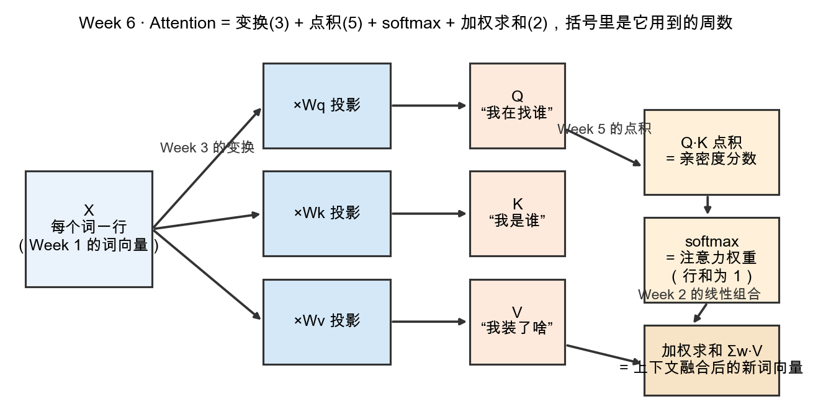

# Day 2：Q、K、V 逐项拆解——三个变换，三种角色

> 本章你将：
> 1. 看懂 Attention 的三个主角 Q、K、V 分别是什么"角色"；
> 2. 明白 $X\cdot W_q$ / $X\cdot W_k$ / $X\cdot W_v$ 是三个**变换**（Week 3），把一个词向量轮换进三个不同"空间"；
> 3. 背下并理解公式的三步：$\mathrm{scores} = Q\cdot K^T$、$\mathrm{weights} = \mathrm{softmax}(\mathrm{scores})$、$\mathrm{out} = \mathrm{weights}\cdot V$；
> 4. 用 Q="我在找谁"、K="我是谁"、V="我装了啥"六个字记住三种角色的分工。

---

## 2.0 先亮出那张"全家福"流水线

昨天我们把问题落在了"亲密度 + 加权求和"上。但在动手之前，真正的 Attention 多做了一步准备：**它不直接用原始的"词向量"，而是先把每个词向量变换三次，得到三个不同身份的向量 Q、K、V。** 下面这张图是本周的地图，请先整体看一遍，再逐块拆：



图的读法从左到右：

1. 左边 X 是"每个词一行"的词向量矩阵（Week 1 / Week 2 的 embedding）；
2. 中间三个"$\times W_q$ / $\times W_k$ / $\times W_v$"是三个**变换**（Week 3 说的那种"空间运动"）；
3. 变换出来的三样东西——Q、K、V——各有各的角色；
4. 右边三步公式：$Q\cdot K$ 点积 $\to$ $\mathrm{softmax}$ $\to$ 加权求和 $\sum w\cdot V$。

下面逐个配角色，再逐行拆公式。

---

## 2.1 为什么一个词要变成三个向量？

你可能会想：一个词一个向量就够了吧，为什么要"一拆三"，还拆成 Q、K、V？

因为**关注这件事，天然有三个不同的问法**，需要三套信息去回答。打个比方：一场招聘会。

- 有个人在招人（他有一个"我想找什么样的人"的标准）；
- 每个应聘者有份简历（写着"我是谁、我会什么"）；
- 每个应聘者还揣着一肚子干货（"我到底能做什么贡献"）。

把"我"和"你"配对，需要两样东西分别回答两个问题：**"我在找谁"**和**"我是谁"**——去找的人要有"寻人标准"，被找的人要有"自我介绍"。而且，你找到人之后，要吸收的是对方的**干货**，不是对方的"寻人标准"。所以干脆给每个词造三个版本：

| 记号 | 角色（六个字口诀） | 招聘会类比 |
|---|---|---|
| Q（Query，查询） | **我在找谁** | 招聘方的"寻人标准" |
| K（Key，键） | **我是谁** | 应聘者的"简历/自我介绍" |
| V（Value，值） | **我装了啥** | 应聘者的"干货/实际贡献" |

用 Q 和 K 的"匹配度"去决定"该听谁的"（权重），再用这个权重去取 V 的"干货"来汇总。**找人用 $Q\cdot K$ 的匹配，吸收东西用 V。** 一句话总结这三者的分工。

---

## 2.2 三个变换：$X\cdot W_q$、$X\cdot W_k$、$X\cdot W_v$

那这三个 Q、K、V 从哪来？它们**不是天上掉的**，而是把原始词向量 X 分别乘上三个矩阵：

$$
\begin{aligned}
Q &= X \cdot W_q \\\\
K &= X \cdot W_k \\\\
V &= X \cdot W_v
\end{aligned}
$$

这里的 `·` 是 Week 3 学的**矩阵乘法**，也就是"施加一个变换"。回忆 Week 3 的直觉：矩阵乘法 = 把空间拉伸/旋转/剪切一下。所以：

- **乘 Wq**：把 $X$ 旋转/拉伸进一个"查询空间"，在这个空间里，两个词的坐标距离，回答了"它们想找的东西像不像"；
- **乘 Wk**：把 $X$ 变换进"键空间"，回答"这本简历和别人像不像"；
- **乘 Wv**：把 $X$ 变换进"值空间"，回答"这个词的干货长什么样"。

三个 W（Wq、Wk、Wv）是**三套不同的变换**，是模型要学习的参数。同样的 $X$，过三个不同的变换，得到三个不同"视角"下的同一个词。

> 💡 你可能会问：为什么不直接 $Q=K=V=X$，省掉三个矩阵？
>
> 三个 W 各自的"视角"不同，给了模型自由度：一个词可以"想找的东西"和"自己是谁"侧重不同（比如"苹果"作为查询想找"吃"，作为键又让自己的"我是谁"突出水果属性）。没有这三个变换，这些侧重就混在一套坐标里，分不开。这是"为什么有效"的直觉版本，Week 8 会看到它们是被训练数据"磨"出来的。

> 📌 划重点：Q/K/V 不是一个词的三份副本，而是**同一个词向量被三个不同变换（乘三个不同的矩阵）投射出的三种角色**。

---

## 2.3 公式第一步：$Q\cdot K^T$（点积出场）

有了 Q 和 K，怎么算"第 $i$ 个词和第 $j$ 个词有多相关"？——用点积。

回忆 Week 5：两个向量的点积 = "方向有多合拍"（越大越同向，$0$ 正交，负反向）。所以：

```
scores[i][j] = 第 i 个词的 Q 与第 j 个词的 K 的点积
```

把所有 $(i, j)$ 都算一遍，就得到一张**分数方阵**：第 $i$ 行第 $j$ 列 = "词 $i$ 在找谁"和"词 $j$ 是谁"的契合度。

用矩阵记法压成一行：**$\mathrm{scores} = Q \cdot K^T$**。这里的 $K^T$（读"K 的转置"）是 Week 3 Day 4 学过的转置——把 K 的行列对调，好让"第 $i$ 个 $Q$ 行 $\times$ 第 $j$ 个 $K$ 列"这个点积，恰好落在 $(i, j)$ 那一格。你不需要会背矩阵乘法的下标规则，记准一句话就够：

> 📌 划重点：`scores = Q·K^T` 本质就是"**一堆点积堆成的一张表**"，每个格子是 Week 5 的一次亲密度测量。

放大看一个格子：如果 $Q$ 的第 1 行是 $[1, 0]$，$K$ 的第 0 行也是 $[1, 0]$，那 $\mathrm{scores}[1][0] = 1\cdot 1 + 0\cdot 0 = 1$（很相关）；如果 $K$ 的第 2 行是 $[0, 1]$，那 $\mathrm{scores}[1][2] = 1\cdot 0 + 0\cdot 1 = 0$（完全无关）。就这么朴实。

---

## 2.4 公式第二步：$\mathrm{weights} = \mathrm{softmax}(\mathrm{scores})$（把分数变百分比）

分数算出来了，但它们还不能拿来"加权"——因为它们**可正可负、加起来也不等于 1**。而"权重"必须满足两个要求：

1. 都是**非负**（不能说"我 -30% 地关注某词"）；
2. 加起来**等于 1**（一个词总共 100% 的注意力，要分完）。

于是有了 **softmax**：把每一行分数，变成"加和为 1 的一串正数"。细节和实现是下一章（Day 3）的全部内容，今天只记住它的**职责**：

> 📌 划重点：softmax = "把分数翻译成百分比"。分数大的词，分到的百分比就大；而且整行加起来恰好 100%。

所以：

```
weights = softmax(scores)   # 逐行做：每一行干成一串"权重"百分比
```

权重就是昨天说的"各看多重"的那把尺子。

---

## 2.5 公式第三步：$\mathrm{out} = \mathrm{weights}\cdot V$（线性组合出场）

最后一步，吸收干货：拿"权重"当配方，把各个 V 揉成一个新向量。

$$
\mathrm{out}[i] = \sum_j \mathrm{weights}[i][j] \cdot V[j]
$$

也就是：**词 $i$ 的新表示 = 所有词 $j$ 的 $V$，按"$i$ 有多关注 $j$"加权求和的线性组合。**

这正是 Week 2 的"伸缩再相加"——每个 $V[j]$ 先按权重 $w$ 伸缩，再全部加起来。如果"吃"把 $0.8$ 的注意力给了"苹果"、$0.1$ 给了"我"、$0.1$ 给了"爱"，那"吃"更新后的向量就 $\approx 0.8\cdot V_{\text{苹果}} + 0.1\cdot V_{\text{我}} + 0.1\cdot V_{\text{爱}}$——**"苹果的干货"被大量吸收了进来**，于是"吃"的表示里带上了"吃的是苹果"这个上下文。

> 📌 划重点：加权求和 = Week 2 的线性组合。Attention 的最后一步，就是把"每个词的干货"，按"我有多关注它"这个配方，重新调一杯"吸收了上下文的新词向量"。

---

## 2.6 把三步串成一条公式

现在把三步并排放一起，这就是 Transformer 论文里那行你以后会反复见到的公式（写法会略有差异，本质一样）：

$$
\begin{aligned}
\mathrm{scores}  &= Q \cdot K^T & &\text{（点积，Week 5）} \\\\
\mathrm{weights} &= \mathrm{softmax}(\mathrm{scores}) & &\text{（百分比，Day 3）} \\\\
\mathrm{out}     &= \mathrm{weights} \cdot V & &\text{（线性组合，Week 2）}
\end{aligned}
$$

三步背后的三件数学工具，你在前五周**全都练过**，此刻只是第一次被串到同一条流水线上：

| 步骤 | 公式 | 用的旧知识 | 职责 |
|---|---|---|---|
| 1 | $Q\cdot K^T$ | Week 5 点积 | 测"谁和谁相关" |
| 2 | $\mathrm{softmax}(\mathrm{scores})$ | Day 3 归一化 | 定"各看多重" |
| 3 | $\mathrm{weights}\cdot V$ | Week 2 线性组合 | 做"把干货汇总" |

> 💡 你可能会问：Q、K、V 是谁先、谁后，有没有顺序讲究？
>
> Q 和 K 是"配对"用的，两者地位对等（$Q\cdot K^T$ 里谁在前只是转不转置的区别）。V 则是"被吸收"的内容，不参与匹配，只在最后被加权。一句话：**Q 找、K 被找、V 被拿**。记住这九个字，整个公式的顺序就不会记混。

> ⚠️ 易踩坑：别把 Q、K、V 当成三个**不同的词**——它们是**同一个词**的三张脸。每个词都同时有自己的 Q、自己的 K、自己的 V；"吃"用它的 Q 去找"苹果"的 K 配对，最后吸收的却是"苹果"的 V。

---

## 2.7 本章小结

- ✅ 一个词要拆成 Q（我在找谁）、K（我是谁）、V（我装了啥）三种角色。
- ✅ Q/K/V 是同一个 $X$ 乘上三个不同变换矩阵 $W_q/W_k/W_v$ 得到的（Week 3 变换）。
- ✅ 公式三步：$\mathrm{scores}=Q\cdot K^T$（Week 5 点积）$\to$ $\mathrm{weights}=\mathrm{softmax}(\mathrm{scores})$（Day 3）$\to$ $\mathrm{out}=\mathrm{weights}\cdot V$（Week 2 线性组合）。
- ✅ Q 找、K 被找、V 被拿，九字口诀锁顺序。

---

## 动手练习

1. **配对练习**：`tests/test_w6_attention.py` 里的 `test_attention_scores_are_dot_products` 给了两组 Q、K，用 Week 5 的 `proj.dot` 手算 scores[0][0] 和 scores[1][1]，验证它们就是点积。你还没实现 `attention_scores`，但可以先在草稿纸上把这张分数表画出来。
2. **角色连线**：给下面三句话分别标上 Q / K / V——
   - "这个词想知道和谁相关"；
   - "这个词是被别人拿着来匹配的自我介绍"；
   - "这个词身上可被吸收的实际内容"。

## 参考答案

1. 分数表就是把每对 (Qi, Kj) 做点积；直接读 `reference/attention.py` 的 `attention_scores`（它循环里调的正是 `proj.dot`）。
2. 依次是 Q、K、V——正是"我在找谁 / 我是谁 / 我装了啥"。

卡住 20 分钟再看 `reference/attention.py` 与 `reference/proj.py`。

---

## 📌 AI 联系

真实的 GPT/LLaMA/Qwen 里，$X\cdot W_q$、$X\cdot W_k$、$X\cdot W_v$ 这三个矩阵乘，是每一层都要做的**真实计算**——几十上百亿的参数里，有相当一部分就是这三个 $W$。你此刻建立的"三个变换、三种角色"图景，就是这些重量级参数在干的活。等到了 Week 8，你会看到这些 W 是如何被"损失函数 + 梯度"一点点磨成"会找出相关词"的形状的。

---

👉 三个变换和三步公式都认全了。下一步，去 **[Day 3：softmax——把分数变成百分比](./03-Day3-softmax-把分数变成百分比.md)**，把公式里目前还"黑盒"的那个 softmax，彻底拆开、亲手实现。
