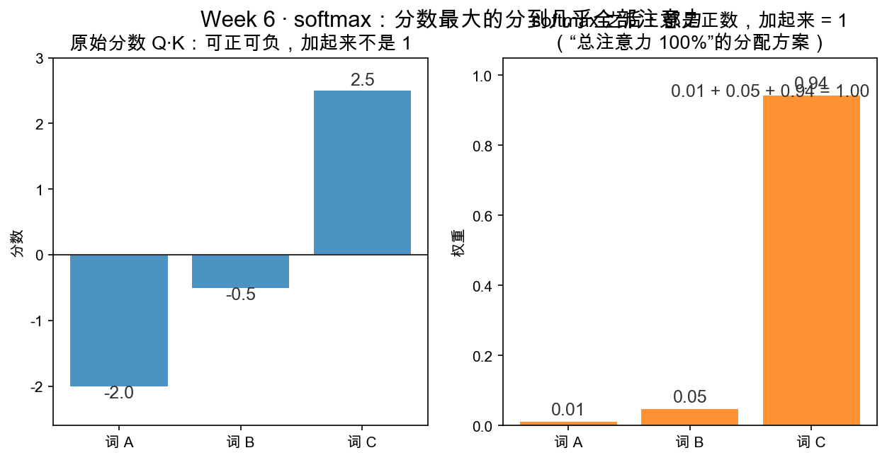

# Day 3：softmax——把分数变成百分比

> 本章你将：
> 1. 明白"为什么分数不能直接当权重"——分数可正可负、加起来不是 $1$；
> 2. 理解 softmax 的两个操作：先取指数（放大差距 + 保证正数）、再归一化（保证和 = $1$）；
> 3. 学会那个数值技巧："全体先减最大值"结果不变，却能防溢出；
> 4. 亲手实现 `softmax`，并跑过它的测试。

---

## 3.1 昨天留下的那个"黑盒"

昨天的公式里，第二步写着 `weights = softmax(scores)`，我们只说了它的**职责**（把分数变百分比），没说它**怎么做**。今天就把这个黑盒拆开。

先回顾问题：`scores = Q·K^T` 算出来的一行分数，长这样：

```
拿某一行举例：  [-2.0,  -0.5,  2.5]
```

这一行表示"词 $i$ 对 3 个词（A、B、C）的原始亲密度"。它有两个毛病，让它**没法直接当权重**：

1. **可正可负**。权重应该是"占比"，没道理出现负数——我不能"-2 地关注"某个词。
2. **加起来不是 1**。权重作为"百分比分配方案"，总和必须恰好是 100%（= $1$），否则叫"权重"名不副实。

所以我们要一个函数，把这一行 "乱七八糟的分数" 变成 "非负、且和为 1" 的一行。这个函数就是 softmax。看下面这张图，左半边是原始分数，右半边是 softmax 之后的权重：



注意右半边那行小字 **$0.01 + 0.05 + 0.94 = 1.00$**：三个权重全部非负，而且加满到 $1$。这就是 softmax 干的事。

---

## 3.2 第一步：取指数（exp）——保证正数、放大差距

怎么把负数变成正数？一个万能办法：**取指数**。e 的多少次方（数学里写作 exp(x)，Python 里是 `math.exp(x)`），有几个我们正需要的性质：

- **永远 > 0**：不管 $x$ 是 $-100$ 还是 $100$，$e^x$ 都是正数（$e$ 的负次方是一个正的小分数）。负数的毛病，解决了。
- **差距被放大**：$x$ 越大，$e^x$ 大得越猛（$e^{10} \approx 22026$，而 $e^0 = 1$）。于是"分数最大的那个"会被推到绝对统治地位——正是我们要的"重要的多拿"。

拿 [-2.0, -0.5, 2.5] 取指数：

$$
\begin{aligned}
e^{-2.0} &\approx 0.135 \\
e^{-0.5} &\approx 0.607 \\
e^{2.5} &\approx 12.182
\end{aligned}
$$

原本 $-2$ 和 $2.5$ 只差 $4.5$；取完指数，$0.135$ 和 $12.182$ 差了快 $100$ 倍。**差距被指数放大，最高分的词脱颖而出。**

> 📌 划重点：取指数这一步同时干了两件事——①把负数抬成正数；②把大小差距急剧拉开，让"最高分"显得鹤立鸡群。

> 💡 你可能会问：为什么是 exp，而不是绝对值或者平方，也能变正啊？
>
> 绝对值、平方确实能变正，但它们**不能同样好地"放大差距"**，更重要的是：exp 和后面的很多数学性质（概率里的推导、求导时的简洁、以及后面 Week 8 梯度会感谢它）天然合拍。这里你只需要知道：**softmax = 取指数 + 归一化**，而这套组合长期被证明是最好用的。

---

## 3.3 第二步：归一化——让总和等于 1

取完指数，得到 $[0.135, 0.607, 12.182]$，全是正数了，但加起来是 $12.924$，还不是 $1$。怎么办？——**每个数除以这串数的总和**。

$$
0.135 / 12.924 \approx 0.010 \qquad 0.607 / 12.924 \approx 0.047 \qquad 12.182 / 12.924 \approx 0.943
$$

现在 $[0.010, 0.047, 0.943]$ 三个数：全正 ✓，加起来 = $1$ ✓，最大的分数分到最多的权重 ✓。这就和图里右半边完全对上了。

所以 softmax 的两步定义，用公式写出来是：

$$
\mathrm{softmax}(\mathrm{scores}) = \left[ \frac{e^{s_1}}{\sum_j e^{s_j}},\ \frac{e^{s_2}}{\sum_j e^{s_j}},\ \dots,\ \frac{e^{s_n}}{\sum_j e^{s_j}} \right]
$$

其中分母 $\sum_j e^{s_j} = e^{s_1} + e^{s_2} + \dots + e^{s_n}$ 是所有取指数之后的数的总和，作用就是"逼总分归一成 $1$"。

> 📌 划重点：softmax = **先 exp（变正、拉差距）** + **再除以总和（逼成 1）**。两步而已，不需要任何新数学。

---

## 3.4 数值技巧：先减最大值

慢着，这里藏着一个工程坑。如果分数很大，比如 $[1000, 1001]$，直接算 $e^{1001}$ 会怎样？——**数字爆炸**，Python 会溢出到 `inf`（无穷大），结果就崩了。

解决办法很巧妙：**给全体分数先减去最大值，再取指数。**

```
scores = [1000, 1001]
减最大值 1001 之后：  [-1, 0]
```

$e^{-1} = 0.368$，$e^0 = 1$；归一化： $[0.368/1.368,\ 1/1.368] \approx [0.269, 0.731]$。

神奇的是，**减不减最大值，softmax 的结果完全一样**（差别只是分子分母同时约掉了一个 $e^{1001}$）。原因一句话：softmax 只关心"相对大小"，而"全体减同一个数"不改变相对大小——你比第一名低 $1$ 分，减完还是低 $1$ 分。

> ⚠️ 易踩坑：减最大值**不是**为了让答案更准，而是为了让中间结果**不溢出**——$e^{1001}$ 会爆，但 $e^{-1}$、$e^0$ 安全得很。别忘了实现里先 `m = max(scores)`，再算 `exp(s - m)`。

测试里专门有一条盯着这件事：`test_softmax_shift_invariance` 断言 `softmax([100, 101]) == softmax([0, 1])`——减不减 $100$，结果一个样。

> 📌 划重点：先减最大值，是"不改变答案、只保证过程安全"的纯工程技巧。softmax 看的是相对差距，所以平移不影响最终百分比。

---

## 3.5 亲手实现 softmax

现在把你的战场打开：`matrixlab/attention.py`，里面有一个待实现的：

```python
def softmax(scores: list) -> list:
    """把一列分数变成"百分比"：每项取指数，再除以总和。"""
    raise NotImplementedError("TODO: Week 6 Day 3 —— softmax")
```

按三步实现（对照公式）：

1. 求最大值 `m = max(scores)`；
2. 每个分数减 m 再取指数：`exps = [math.exp(s - m) for s in scores]`；
3. 求总和 `total = sum(exps)`，返回 `[e / total for e in exps]`。

注意文件顶部已经 `import math`，直接用 `math.exp`。

写完后，跑这条（先单独跑 softmax 的测试，不用管还没实现的 attention）：

```bash
pytest tests -k softmax -q
```

这一族测试会逐条检查：和是否为 1（`test_softmax_sums_to_one`）、顺序是否保持大者更大（`test_softmax_order_preserved`）、平移不变（`test_softmax_shift_invariance`）、具体数值（`test_softmax_values`）。四绿即成功。

---

## 3.6 手算一遍看全过程

拿 scores = [1, 2] 完整走一遍（这是 `test_softmax_values` 用的例子）：

```
m = max([1,2]) = 2
```

$$
\begin{aligned}
e^{1-2} &= e^{-1} \approx 0.3679 \\
e^{2-2} &= e^{0} = 1.0000 \\
\mathrm{total} &= 0.3679 + 1 = 1.3679 \\
w_0 &= 0.3679 / 1.3679 \approx 0.2689 \\
w_1 &= 1.0000 / 1.3679 \approx 0.7311
\end{aligned}
$$

检查：$0.2689 + 0.7311 = 1.0000$ ✓，且 $w_0 < w_1$（分数 $1 < 2$，权重也小）✓。

一个数 $1$、一个数 $2$，只差 $1$ 分，权重却分到了 $27\%$ / $73\%$——指数把这点小差距放大了。这就是为什么 softmax 会让"注意力"高度集中到最高分上，而不是平均分给每个词。

---

## 3.7 本章小结

- ✅ 分数不能直接当权重：可正可负、和不为 $1$。
- ✅ softmax 两步：exp（变正 + 拉差距）$\to$ 除以总和（和 = $1$）。
- ✅ 数值技巧：先减最大值，结果不变、只防溢出。
- ✅ 手算 $[1,2] \to [0.269, 0.731]$，差距被指数放大。

---

## 动手练习

1. **手算**：scores = [0, 0, 3]，用纸笔按"减最大值 $\to$ exp $\to$ 归一化"三步算出三个权重，验证和为 $1$，并指出谁拿了大头。
2. **代码**：实现 `matrixlab/attention.py` 的 `softmax`，跑 `pytest tests -k softmax -q` 到全绿。
3. **思考**：把 [0, 0, 3] 换成 [0, 0, 30]，权重会不会变得更极端？为什么？（不用算，凭 exp 放大差距的直觉回答。）

## 参考答案

1. 减 $3$ 得 $[-3,-3,0]$，exp 得 $[e^{-3}, e^{-3}, 1]$，权重 $\approx [0.045, 0.045, 0.91]$（第三项拿大头）。
2. 见 `reference/attention.py` 的 `softmax`（就是上面 3.5 的三行）。
3. 会更极端——指数把 30 分的优势拉到几乎 100%，前两项趋近 0。

卡住 20 分钟再看 `reference/attention.py`。

---

## 📌 AI 联系

softmax 是深度学习里最常用的"把分数转概率/权重"的开关之一，不只 Attention 用它——分类网络最后一步也常把 logits（就分数那类东西）过 softmax 变成"各类别的概率"。你今天这个函数虽然只有三行，却是你在 LLM 里到处都能撞见的老熟人。

---

👉 softmax 拆完了。下一步，去 **[Day 4：代码实战——MiniAttention：随机词向量上的注意力](./04-Day4-代码实战-MiniAttention.md)**，把昨天那三步公式的剩余零件全拼上，跑出一个完整的注意力。
