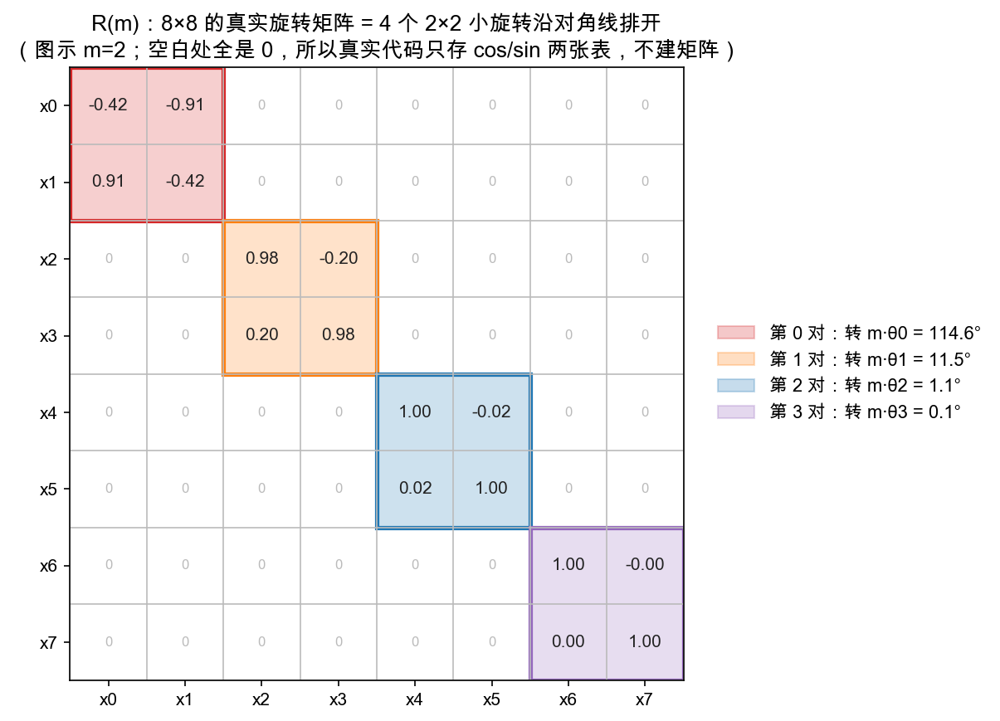
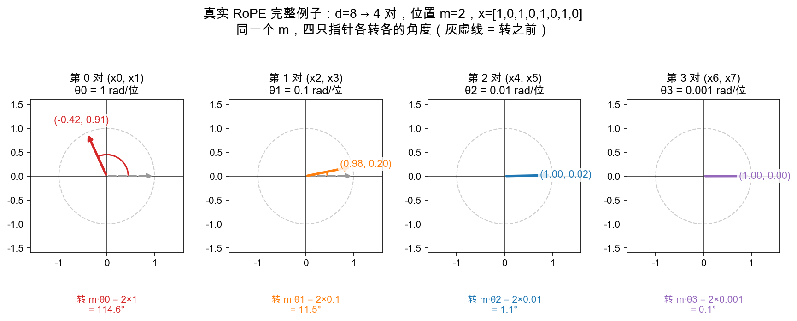
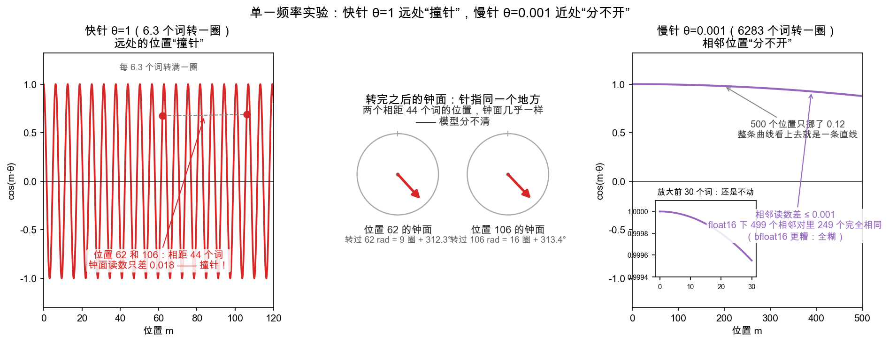
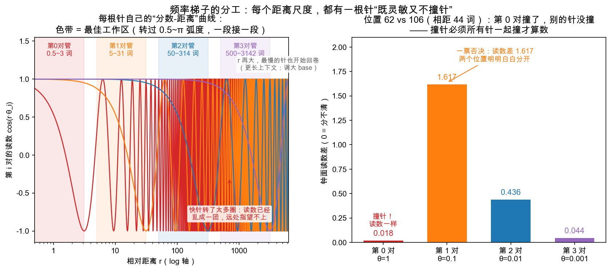
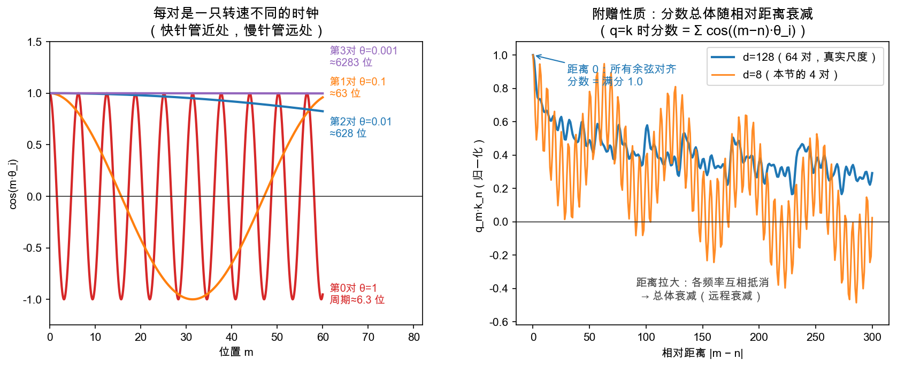

# Day 5：RoPE——用旋转矩阵给词排队

> 本章你将：
> 1. 发现迷你 Attention 的致命缺陷：**它对词的先后顺序一无所知**；
> 2. 掌握 RoPE 的核心思路：给位置 $m$ 的词向量**旋转 $m\cdot\theta$ 度**（Week 3 旋转矩阵）；
> 3. 用两条"已教事实"亲手推出那个魔法性质：**同一对词，$q_m\cdot k_n$ 只依赖相对位置 $(m-n)$**；
> 4. 认识旋转的另一面：**保长度**（$|Rv| = |v|$）；
> 5. 实现 `rotate_2d` / `apply_rope_2d` / `rope_score`，并跑 `pytest tests -k rope` 到绿。

---

## 5.1 昨天那个注意力的致命伤：它不知道顺序

回到 Day 4 的 `attention(Q, K, V)`。想象两句完全不同的话：

```
A: 我 爱 吃 苹果
B: 苹果 吃 爱 我
```

把它们各自喂给你的 `attention`——**输出会完全一样！** 为什么？因为你只用了点积 `Q·K^T`，而点积是"逐词对应相乘再相加"，它**根本不看词排在第几位**。把整句话前后颠倒、随机打乱，只要还是那几个词向量，"谁看谁、看多重"的分数矩阵一模一样。

这就是所谓 **Attention 是"位置无关"（permutation invariant）的**：它天然不知道"苹果"在"吃"前面还是后面。可对语言来说，顺序至关重要——"猫追老鼠"和"老鼠追猫"是两个世界。

> 📌 划重点：注意力公式本身只做"看谁、看多重"，**不含任何顺序信息**。所以我们必须想办法，把"第几个位置"这件事，额外喂进词向量里。

---

## 5.2 怎么给向量"打上位置"？RoPE 的思路

思路有很多种（还有"位置向量 + 加法"等），本教程要教你的是现在大模型里最优雅、最主流的一种——**RoPE**（Rotary Position Embedding，旋转位置编码）。它的核心思路一句话：

> **位置 m 的词向量，绕原点旋转 $m\cdot\theta$ 度。位置越靠后，转的角度越大。**

为什么是"旋转"？因为旋转有个绝妙的好处——回想 Week 3 Day 6 那个彩蛋（RoPE 预告里我们轻轻埋过这颗雷）：旋转矩阵是"保长度"的变换（转一转，箭头长短不变），而且旋转角度可以无限累加。用它来编码位置，既不会把向量"弄爆"，又能用角度区分先后。


**左图**：把同一个向量 $[1,0]$，按位置 $0$、$1$、$2$、$3$ 分别旋转 $0^\circ$、$30^\circ$、$60^\circ$、$90^\circ$。四个不同位置，就是四个不同的方向。**位置信息，此刻变成了"箭头指向的角度"。**

> 💡 你可能会问：为什么不简单加一个数字"位置"?比如给向量整体平移一格？
>
> 平移（加法）也能编码位置，但 RoPE 选旋转是**为了另一个更诱人的性质**——它能让"分数只取决于两个词的**相对距离**"，而不是绝对位置（下一节马上推出）。这个性质对"要能处理任意长度句子"的模型极其重要。先记住动机，跟着推一遍就懂了。

---

## 5.3 两个"已教事实"，推出 RoPE 的魔法性质

现在干件漂亮的事：用你**已经会的两条事实**，推出 RoPE 最核心的性质。我们一步步走。

**事实一（Week 3）**：旋转的复合 = 角度相加。先转 $30^\circ$ 再转 $60^\circ$，等于直接转 $90^\circ$。用符号写：

$$
\text{把向量转 } a \text{ 度，再转 } b \text{ 度} = \text{把向量直接转 } (a+b) \text{ 度}
$$

**事实二（Week 5）**：两个向量的点积，只和它们的**夹角**（以及各自长度）有关，和它们具体指向哪个方向无关——把两个箭头一起转同一个角度，它们之间的夹角不变，所以点积不变。

现在，假设有个查询在第 $m$ 位、有个键在第 $n$ 位。RoPE 规定：

$$
\begin{aligned}
q_m &= \text{把查询向量转 } m\cdot\theta \text{ 度} \\\\
k_n &= \text{把键向量转 } n\cdot\theta \text{ 度}
\end{aligned}
$$

那么注意力分数（点积）是 $q_m \cdot k_n$。用"事实二"，我们可以"把两个箭头一起往回转 $n\cdot\theta$ 度"——**点积不变**：

$$
\begin{aligned}
q_m\cdot k_n &= (\text{把 } q_m \text{ 往回转 } n\cdot\theta) \cdot (\text{把 } k_n \text{ 往回转 } n\cdot\theta) \\\\
             &= (\text{转 } m\cdot\theta \text{ 再回 } n\cdot\theta \text{ 的 } q) \cdot (\text{转 } n\cdot\theta \text{ 再回 } n\cdot\theta \text{ 的 } k\text{，也就是没转的 } k)
\end{aligned}
$$

用"事实一"计算角度：转 $m\cdot\theta$ 再往回 $n\cdot\theta$ 转成 $(m-n)\cdot\theta$。回推 $k$ 那边：转 $n\cdot\theta$ 再回 $n\cdot\theta$ = 转 $0^\circ$，即 $k$ 原样。于是：

$$
q_m\cdot k_n = (q \text{ 转了 } (m-n)\cdot\theta \text{ 之后的向量}) \cdot (\text{原始的 } k)
$$

看右边——**只出现了 $(m-n)$ 和原始的 $q$、$k$**，一点都没剩 "$m$" 和 "$n$" 单独出场！换句话说，分数由两样东西决定：**这两个词是谁**（原始的 $q$、$k$），和**它们隔多远**（相对位置 $(m-n)$）——而与"这两个词各自站在第几位"无关。

> 📌 划重点：RoPE 的魔法可浓缩为一句——**"旋转复合 = 角度相加" + "点积只与夹角有关"，合力推出：两个确定的词（$q$、$k$ 先定死），加了位置之后，它们的注意力分数只依赖相对距离 $(m-n)$。** 同一对词，站在第 $m$、$n$ 位，与站在第 $(m+5)$、$(n+5)$ 位，分数一模一样（因为词没变、相对距离也没变）。

> 💡 你可能会问：那是不是"任意两个词，只要相对距离相同，分数就相同"？
>
> **不是。** 比如"我"看"苹果"（相邻，距离 $-1$）和"猫"看"狗"（同样相邻，距离 $-1$）——相对距离一样，但两对词的内容完全不同，分数一般也不同。这条性质说的从来不是"所有词对的分数都一样"，而是：**同一对词，整体平移到句子的任何位置，分数不变**。词的内容管"合不合得来"，相对距离管"距离给这份合拍打多少折扣"，两者各管一段，缺一不可。

**右图**正是这个性质的可视化：它画了 `q_m·k_n` 随相对位置 $(m-n)$ 变化的曲线——一条余弦波，而且标题写着"$m$ 和 $n$ 一起平移，分数纹丝不动"。

---

## 5.4 旋转还保长度：箭头转一圈不变短

RoPE 选旋转还有第二个好处：**旋转不改变向量长度**（$|Rv| = |v|$）。

直观：拿着一根长度 $5$ 的棍子转任意角度，棍子还是 $5$ 长。数学上，这是"旋转矩阵是正交矩阵"的自然结果，但你不用管那个名词，看测试就知道——`test_rotate_preserves_length` 拿 $[3,4]$（长度 $5$）转 $37^\circ$，断言转完长度仍是 $5$：

```python
v = [3, 4]
r = rope.rotate_2d(v, 37)
assert (r[0]**2 + r[1]**2)**0.5 == approx(5)   # 长度不变
```

> 📌 划重点：旋转编码位置，**只改方向、不改长度**。这意味着被"打上位置"之后，词向量携带的其它信息（它有多"强"、多"重要"）不会被位置信息破坏——位置的加入是"无损"的。

---

## 5.5 实现：rotate_2d / apply_rope_2d / rope_score

打开 `matrixlab/rope.py`，三个函数等你实现。

### 5.5.1 rotate_2d：旋转一个 2D 向量

这是 Week 3 Day 1 教过的旋转矩阵实战。把 2D 向量 $v=[v_0,v_1]$ 逆时针转 $\theta$ 度：

```python
def rotate_2d(v: list, theta_deg: float) -> list:
    t = math.radians(theta_deg)          # 角度制转弧度制（math.cos/sin 要弧度）
    c, s = math.cos(t), math.sin(t)
    return [c * v[0] - s * v[1], s * v[0] + c * v[1]]
```

对照 Week 3 的旋转矩阵：新 $x = c\cdot x - s\cdot y$，新 $y = s\cdot x + c\cdot y$。文件顶部已 `import math`。测试会验四个地标角：$0^\circ$（不动）、$90^\circ$（东→北）、$180^\circ$（反向）、以及任意角保长度。

### 5.5.2 apply_rope_2d：给整串词打位置

给一个向量序列（按位置排好的词向量列表），第 $i$ 个转 $i\cdot\theta$ 度：

```python
def apply_rope_2d(seq: list, theta_per_step: float) -> list:
    return [rotate_2d(v, i * theta_per_step) for i, v in enumerate(seq)]
```

`theta_per_step` 就是前面说的 $\theta$——相邻位置转过的角度差。测试 `test_apply_rope_2d` 拿三个 $[1,0]$、$\theta=90^\circ$，期望转出 $[1,0]\to[0,1]\to[-1,0]$，正好对应 $0^\circ$、$90^\circ$、$180^\circ$。

### 5.5.3 rope_score：旋转后的点积

RoPE 之后的注意力分数，就是两个（已经转好位置的）向量做点积：

```python
def rope_score(q: list, k: list) -> float:
    return q[0] * k[0] + q[1] * k[1]
```

注意：这里的 q、k 是**已经 apply_rope 打好了位置**的向量。`rope_score(qm, kn)` 就是"第 $m$ 位的查询 $\cdot$ 第 $n$ 位的键"。

---

## 5.6 跑测试到绿 + 亲眼看"只依赖相对位置"

实现完，跑：

```bash
pytest tests -k rope -q
```

全部 11 个都绿即成功：玩具版 6 个（`rotate_preserves_length`、`rotate_landmarks`、`rotation_is_linear`、`apply_rope_2d`、`rope_score_depends_only_on_relative_position`、`rope_keeps_length_of_every_token`）+ 5.8.9 的真实版 5 个（名字都带 `rope_real`）。

其中最值得细看的是 `test_rope_score_depends_only_on_relative_position`，它正是 5.3 节推的那条性质的**实验验证**：

```python
def score(m, n):
    qm = rope.rotate_2d(q, m * theta)
    kn = rope.rotate_2d(k, n * theta)
    return rope.rope_score(qm, kn)

assert score(1, 1) == approx(score(2, 2))     # (1,1) 和 (2,2) 相对距离都是 0
assert score(0, 3) == approx(score(5, 8))     # (0,3) 和 (5,8) 相对距离都是 -3
assert score(1, 0) == approx(score(3, 2))     # 相对距离都是 1
```

三组断言，每组两个位置的**绝对坐标**不同、但**相对距离 $(m-n)$** 相同——分数一样。注意 `score` 里的 `q`、`k` 是闭包外**固定不变**的两个向量，测试从始至终没有换过词——这正对应 5.3 的前提：**同一对词**，只挪位置。还顺带给了具体数值：`score(1,2) == cos(-30°) ≈ 0.866`，说明分数确实就是"相对距离夹角的余弦"。

（可以先用 `IMPL=reference pytest tests -k rope -q` 看参考答案全绿，再回自己代码复现。）

---

## 5.7 分数矩阵里的"斜条纹"长什么样

把 8 个位置的 score 全算出来排成方阵，会看到一幅漂亮的**斜条纹**：


每一格 = `q_m·k_n`。因为分数只由 $(m-n)$ 决定，所以**同一条对角线（"左上到右下"方向）上的格子数值完全相同**——$(m-n)$ 相等的所有格子抱团相等。这种"对角线上元素相同"的矩阵，数学里叫 **Toeplitz 矩阵**，你不必记这个词，但"斜条纹 = 只依赖相对位置"这个画面值得钉在脑子里。

> 💡 你可能会问：图上颜色有红有蓝，负分数是什么意思？
>
> 分数 = $\cos((m-n)\cdot 30^\circ)$，当相对距离对应的夹角超过 $90^\circ$ 时，余弦变负，就显蓝。它只是说"这两个位置的关系方向偏了"，softmax 之后会自动转成权重（正数、和为 $1$），所以负分数并不可怕。

---

## 5.8 真实 RoPE 的全貌（动手实现）

你实现的是 **2 维、单一频率** 的玩具版。真实 RoPE 把你的直觉原样照搬，只做两处升级：

| | 玩具版（你写的） | 真实 RoPE（LLaMA / Qwen 里跑的） |
|---|---|---|
| 向量维度 | 2 维 | $d$ 维（如 LLaMA 每个注意力头 128 维） |
| 频率 | 全队共用一个 $\theta$ | 切成 $d/2$ 对，每对配一个频率 $\theta_i$ |
| 旋转对象 | 演示用小向量 | 每一层、每个头的 $q$ 和 $k$（$v$ **不转**） |

机制没变——还是"位置 $m$ → 旋转 $m\cdot\theta$"，只是把**一条链**扩成 **$d/2$ 条不同转速的链**。下面用 $d=8$ 走一遍完整流程；真实模型只是把 8 换成 128，每一步一模一样。学完这一节，你会在 5.8.9 亲手把它实现出来。

### 5.8.1 第 ① 步：把 $d$ 维切成 $d/2$ 对

取一个 8 维向量（想象它是某个注意力头里的 $q$ 或 $k$）：

$$x = [x_0, x_1, x_2, x_3, x_4, x_5, x_6, x_7]$$

**相邻两维配一对**：$(x_0,x_1)$、$(x_2,x_3)$、$(x_4,x_5)$、$(x_6,x_7)$——共 4 对。每一对就是一个独立的 2D 小箭头，住在自己的 2D 小平面里；接下来所有旋转都在这些小平面上**各自独立**进行，互不串门。

### 5.8.2 第 ② 步：每对配一个频率 $\theta_i = \mathrm{base}^{-2i/d}$

真实 RoPE 不再固定写死一个 $\theta$ 让全队共用，而是按公式给第 $i$ 对各算一个：

$$\theta_i = \mathrm{base}^{-2i/d},\qquad \mathrm{base} = 10000$$

$d=8$ 代入，得到一架漂亮的"十倍速"梯子：

| 对编号 $i$ | 0 | 1 | 2 | 3 |
|---|---|---|---|---|
| $\theta_i$（rad / 每挪一位） | $1$ | $0.1$ | $0.01$ | $0.001$ |
| $\theta_i$（° / 每挪一位） | $\approx 57.30^\circ$ | $\approx 5.73^\circ$ | $\approx 0.57^\circ$ | $\approx 0.057^\circ$ |
| 转满一圈要多少位（$2\pi/\theta_i$） | $\approx 6$ 位 | $\approx 63$ 位 | $\approx 628$ 位 | $\approx 6283$ 位 |

把每对想成钟表盘上的一只指针：**第 0 对是"秒针"**——每过一个词转 1 弧度（$\approx 57^\circ$），6 个词左右就转满一圈，专门精细区分**相邻、近距离**的位置差；**越靠后的对转得越慢**，第 3 对六千多个词才转一圈，像"时针"，负责**远距离**的粗定位。从秒针到时针一架梯子排开，任何尺度的相对距离都有指针在管。——但这架梯子凭什么"长短通吃"？先卖个关子，5.8.6~5.8.7 用两个小实验拆给你看。

> 💡 你可能会问：为什么 base 是 10000？
>
> 它决定最慢那只针的"量程"：base 越大，指针整体转得越慢、能区分的上下文越长。原版 RoPE 用 10000；要撑超长上下文的模型会把它调大（如 LLaMA 3 用 500000），或做 NTK / YaRN 这类"频率缩放"——思想都是"把针调慢，把量程调大"。知道有这回事即可。

### 5.8.3 第 ③ 步：位置 $m$ 处，第 $i$ 对转 $m\cdot\theta_i$

对每一对，做的就是你 5.5 写过的 `rotate_2d`（角度换成 $m\cdot\theta_i$，且真实代码用弧度制）：

$$
\begin{aligned}
x'\_{2i} &= x\_{2i}\cos(m\theta_i) - x\_{2i+1}\sin(m\theta_i) \\\\
x'\_{2i+1} &= x\_{2i}\sin(m\theta_i) + x\_{2i+1}\cos(m\theta_i)
\end{aligned}
$$

4 对 = 4 个 $2\times2$ 的小旋转矩阵。把它们**沿对角线排开**、其余位置填 0，就拼出真实的 $8\times8$ 旋转矩阵 $R(m)$——这种结构叫**块对角矩阵**：



图上每个色块就是你写过的那个旋转矩阵；$m=2$ 时 4 块分别转 $114.6^\circ$、$11.5^\circ$、$1.1^\circ$、$0.1^\circ$。注意空白处全是 0——64 个数里只有 16 个非零。**所以真实代码从不真的建这个矩阵**，只存 cos/sin 两张表（5.8.8 细说）。

### 5.8.4 完整例子：$d=8$、$m=2$，一步一步算

取 $x = [1, 0, 1, 0, 1, 0, 1, 0]$（故意让每对都是 $[1,0]$——转完每对正好读出 cos 和 sin，最方便对照）。

位置 $m=2$，各对要转的角度 $m\cdot\theta_i$ 分别是 $2$、$0.2$、$0.02$、$0.002$ rad，即 $114.6^\circ$、$11.5^\circ$、$1.1^\circ$、$0.1^\circ$。逐对算（新 $x = c\cdot x - s\cdot y$，新 $y = s\cdot x + c\cdot y$）：

| 对 $i$ | 原值 | $m\cdot\theta_i$ | $\cos$ | $\sin$ | 转后 $(x'\_{2i},\ x'\_{2i+1})$ |
|---|---|---|---|---|---|
| 0 | $(1,0)$ | $2$ rad $=114.6^\circ$ | $-0.416$ | $0.909$ | $(-0.416,\ 0.909)$ |
| 1 | $(1,0)$ | $0.2$ rad $=11.5^\circ$ | $0.980$ | $0.199$ | $(0.980,\ 0.199)$ |
| 2 | $(1,0)$ | $0.02$ rad $=1.1^\circ$ | $0.9998$ | $0.0200$ | $(0.9998,\ 0.0200)$ |
| 3 | $(1,0)$ | $0.002$ rad $=0.1^\circ$ | $\approx 1.0000$ | $0.0020$ | $(1.0000,\ 0.0020)$ |

把 4 对拼回去，就得到"打好位置"的向量：

$$x' = [-0.416,\ 0.909,\ 0.980,\ 0.199,\ 1.000,\ 0.020,\ 1.000,\ 0.002]$$

顺手验证 5.4 的保长度：原来每对长度都是 1（总长度 $\sqrt{4}=2$）；转完每对长度仍是 1（总长度仍是 2）✅——**8 维也照样只改方向、不改长度**。



把这一步画出来就是上图：同一个 $m=2$，第 0 对大转弯 $114.6^\circ$，第 1 对转 $11.5^\circ$，第 2、3 对几乎没动——**四只指针，各转各的**。

### 5.8.5 关键问题：为什么"只依赖相对位置"在 $d$ 维依然成立

现在有 4 个不同频率了，5.3 的推导还管用吗？**管用，因为各对之间互不干扰。**

先把记号说死：$q$、$k$ 是两个 **8 维内容向量**（词本身的信息，由 $Q$、$K$ 投影得来）；下标表示它**站在哪个位置**——$q_m = R(m)\ q$ 表示"$q$ 站在位置 $m$、旋转完毕之后的向量"。注意力分数 = 位置 $m$ 的 $q$ 与位置 $n$ 的 $k$ 做点积：位置 $m$ 的词"转头看"位置 $n$ 的词，打多少分。

$d$ 维点积 = 各对点积之和：

$$q_m\cdot k_n = \sum\_{i=0}^{d/2-1}\ (\text{第 }i\text{ 对的 }q_m)\cdot(\text{第 }i\text{ 对的 }k_n)$$

每一对内部就是一个 2D 玩具版 RoPE——5.3 那两条旧事实（旋转复合 = 角度相加、点积只看夹角）原样适用，所以第 $i$ 对贡献的分数只依赖 $(m-n)\cdot\theta_i$。**每一对都只依赖 $(m-n)$，加起来当然也只依赖 $(m-n)$。** 用矩阵语言一句话：$R(m)$ 是块对角的正交矩阵，$R(m)^\top R(n) = R(n-m)$，于是 $q_m\cdot k_n = q^\top R(n-m)\ k$——右边只剩相对位置。

**数值验证**（接着 5.8.4 的例子，先把每个符号摆到明面上）：

- **向量只有一个**：$x = [1, 0, 1, 0, 1, 0, 1, 0]$，就是 5.8.4 用过的那个 8 维向量。为了让手算能跟上，我们让 $q$ 和 $k$ 的**内容向量**都取它（两个词"长得一样"，只看位置带来的差别）。
- **$(m,n) = (2,5)$ 不是两个向量**，是两个**位置编号**：$q$ 站在位置 2，$k$ 站在位置 5。打分方式：$q$ 按位置 2 旋转（第 $i$ 对转 $2\theta_i$），$k$ 按位置 5 旋转（第 $i$ 对转 $5\theta_i$），转完再做 8 维点积。

取两组位置：**第一组** $q$ 在位置 2、$k$ 在位置 5，相对距离 $m-n = 2-5 = -3$；**第二组** $q$ 在位置 10、$k$ 在位置 13，相对距离 $m-n = 10-13 = -3$。两组**绝对位置**完全不同、**相对距离**相同——如果分数相等，"只依赖相对位置"就实锤了。

逐对算第一组。因为每对的原值都是 $(1,0)$，第 $i$ 对的 $q$ 转完是 $(\cos 2\theta_i,\ \sin 2\theta_i)$，$k$ 转完是 $(\cos 5\theta_i,\ \sin 5\theta_i)$，这一对贡献的点积用差角公式恰好合成一个余弦：

| 对 $i$ | $\theta_i$ | $q$ 转的角度 $2\theta_i$ | $k$ 转的角度 $5\theta_i$ | 第 $i$ 对点积 $=\cos\big((2{-}5)\theta_i\big)$ |
|---|---|---|---|---|
| 0 | 1 | 2 rad | 5 rad | $\cos(-3) = -0.990$ |
| 1 | 0.1 | 0.2 rad | 0.5 rad | $\cos(-0.3) = 0.955$ |
| 2 | 0.01 | 0.02 rad | 0.05 rad | $\cos(-0.03) \approx 1.000$ |
| 3 | 0.001 | 0.002 rad | 0.005 rad | $\cos(-0.003) \approx 1.000$ |

4 对加起来，总分 $= \sum_i \cos\big((m{-}n)\theta_i\big) = -0.990 + 0.955 + 1.000 + 1.000 = 1.965$。

第二组根本不用重算：每一对的点积里，绝对位置 $m$、$n$ 都被差角公式消成了 $m-n$，只要相对距离还是 $-3$，各对贡献就一模一样，总分还是 $1.965$。两组绝对位置完全不同，分数一字不差 ✅。

真实代码长什么样？核心就是这十几行（NumPy 版；将来读 LLaMA 源码，你能认出同款骨架）：

```python
import numpy as np

d, base = 8, 10000
theta = base ** (-np.arange(0, d, 2) / d)   # 第②步: [1, 0.1, 0.01, 0.001]

def rope(x, m):
    """给 d 维向量 x 打上位置 m。"""
    x = x.reshape(-1, 2)                      # 第①步：切成 d/2 对
    ang = m * theta                           # 第③步：每对转 m·θ_i
    c, s = np.cos(ang), np.sin(ang)
    x0, x1 = x[:, 0], x[:, 1]
    out = np.stack([x0 * c - x1 * s,          # 你写过的 rotate_2d，
                    x0 * s + x1 * c], axis=1) # 只是对所有对一起算
    return out.reshape(-1)                    # 拼回 d 维

x = np.array([1, 0, 1, 0, 1, 0, 1, 0.])
print(rope(x, 2))
# [-0.416  0.909  0.980  0.199  1.000  0.020  1.000  0.002]  ← 与 5.8.4 手算一致

def score(q, k, m, n):
    """q 站在位置 m，k 站在位置 n：各自按自己的位置旋转后再点积。"""
    return rope(q, m) @ rope(k, n)

print(score(x, x, 2, 5))    # q=x 在位置 2， k=x 在位置 5  → 1.9649...
print(score(x, x, 10, 13))  # q=x 在位置 10，k=x 在位置 13 → 1.9649...
                            # 相对距离都是 -3，分数一字不差
```

### 5.8.6 动手实验：单一频率为什么两头都顾不上

先把你可能有的疑问摆上台面：**为什么不干脆全队共用一个"调得刚刚好"的频率，非要一架梯子？**

答案藏在"读数"的本质里。RoPE 写进向量的位置信息，是钟面上指针的指向——$\cos(m\theta)$ 和 $\sin(m\theta)$。而钟面只认**转了多少圈、再多出多少零头**（角度 mod $2\pi$）：转 1 圈再多 30° 和转 7 圈再多 30°，针指在同一个地方。就这一条，让任何单一频率都陷入两头堵。下面用两个实验把它逼出来。



**实验 ①（左图、中图）：快针 $\theta=1$——远处撞针。** 快针 6.3 个词转满一圈，近处非常灵：隔 1 个词转 $57.3^\circ$、隔 2 个词转 $114.6^\circ$，一眼分明。可一拉远就露馅：扫描前 300 个位置，**位置 62 和位置 106 相距 44 个词，钟面读数只差 0.018**——因为 44 个词正好让针转了 7 整圈再多 0.018 弧度（$44 = 7\times 2\pi + 0.018$）。中图把两只钟面并排放着：**针指在同一个地方，模型以为它们是同一个位置。**对快针来说，"隔 44 个词"和"没隔"长一个样——远距离的粗定位彻底报废。

**实验 ②（右图）：慢针 $\theta=0.001$——近处分不开。** 把针放慢 1000 倍，一圈要走 6283 个词，量程这下够了。代价是：相邻两个词，针只挪 $0.057^\circ$，**读数差最多 0.001**——500 个位置的曲线看上去就是一条直线。更致命的是，真实模型用 float16 / bfloat16 存数：**499 个相邻位置对里，249 对的 cos 值在 float16 下一模一样**（换成 bfloat16，糊掉的比例涨到 468/499）。这点差别再过一层 softmax，彻底蒸发——"隔 1 个词还是隔 2 个词"无从判断。

> 📌 划重点：单一频率被两头夹死——**要覆盖 $N$ 个位置不撞针，必须 $\theta \le 2\pi/N$（针要慢）；要让相邻位置分得开，必须 $\theta$ 大到读数差看得见（针要快）**。两个条件一挤，一根针最多分清 $2\pi/\varepsilon$ 个位置（$\varepsilon$ 是能分辨的最小读数差）。快与慢只能二选一：快针活在近处、慢针活在远处，**没有一根针能两头都管**。

### 5.8.7 频率梯子如何"长短通吃"

破局的想法只有一步，但方向常常想反：**不是从梯子里挑一根"刚刚好"的针来用，而是 $d/2$ 根针全部同时在场。**

一个位置打出的向量，不是一根针的读数，而是 **$d/2$ 根针的并排读数**。两个位置要真的混淆，必须**所有针同时指到同一个地方**——单独一根针撞了，不算撞。这就是"长短通吃"的全部秘密，拆成两步看：



**第一步（左图）：每个距离数量级，恰好有一根针在"最佳工作区"。** 相对距离为 $r$ 的两个词，第 $i$ 对的针转过 $r\cdot\theta_i$ 弧度。当这个角度落在 $0.5\sim\pi$ 之间时，这根针**既转出了看得出的差别、又没转满一圈撞回去**——对应 $r$ 在 $0.5/\theta_i \sim \pi/\theta_i$ 之间，这就是它的最佳工作区。频率每往上一对就缩小 10 倍，工作区便一段接一段接力：第 0 对管 $0.5\sim 3$ 个词，第 1 对管 $5\sim 31$ 个词，第 2 对管 $50\sim 314$ 个词，第 3 对管 $500\sim 3142$ 个词——**距离每涨一个数量级，接力棒正好交到下一根针手里，全程无盲区**。左图同时暴露了单根针的短板：快针的曲线在远处抖成一团乱麻（转了太多圈），慢针的曲线在近处几乎贴着 1 不动（分不开相邻词）——短板互不重叠，拼起来才完整。

**第二步（右图）：一根针撞了，别的针一票否决。** 回到实验 ① 那对撞针（62 vs 106）：第 0 对的读数差果然只剩 0.018，可第 1 对是 1.617、第 2 对是 0.436——**快针上没分开的，慢针上明明白白分开**。把三组典型位置对全部算一遍（读数差 = 那一对的 $\cos$、$\sin$ 两个数合起来看的差距）：

| 位置对 | 情形 | 第 0 对 | 第 1 对 | 第 2 对 | 第 3 对 |
|---|---|---|---|---|---|
| 62 vs 106 | 相距 44 词（快针撞针） | **0.018 撞** | 1.617 | 0.436 | 0.044 |
| 100 vs 101 | 相邻两词（慢针没劲） | 0.959 | 0.100 | 0.010 | **0.001 废** |
| 0 vs 2000 | 句首 vs 句中 | 1.654 | 1.013 | 1.088 | 1.683 |

每一行**总有一根针醒着**：近处有快针兜底，远处有慢针兜底。撞针必须"全家一起撞"——对一架从 1 排到 0.001 的十倍速梯子来说，几千个位置的范围内这不会发生。

> 💡 你可能会问：为什么不把频率**均匀**排开（比如 $0.75$、$0.5$、$0.25$）？
>
> 因为距离是按**数量级**铺开的：近处要一根很快的针，远处要一根很慢的针，中间每个十倍程都得有人接手。均匀排开在高频端挤（相邻两根针管的距离段差不多，浪费名额），在低频端断档（最慢的两根针之间空出一大段没人管的距离）。频率按十倍缩的**几何梯子**，正好一个数量级一根针。

（那再远的距离呢——最慢的针也开始回卷了？把 base 调大、整架梯子一起放慢就行，就是 5.8.2 说的"把量程调大"；LLaMA 3 的 base 500000 干的就是这件事。）

### 5.8.8 附赠性质：远程衰减 + 工程里的三个细节

频率梯子还附赠一个性质：把各对的余弦加起来（正是 $q=k$ 时的分数），相对距离越大，各频率互相抵消得越厉害——**分数总体随距离衰减**（中间有起伏，趋势向下）。模型因此天然带上"多关注近处"的先验，这就是 RoPE 论文里说的**远程衰减**。下图左的 4 条波动曲线，就是那 4 根针各自的读数随位置的波动；下图右是把它们加起来之后的效果：



**工程细节一：不建矩阵，只查表。** 所有位置、所有对的 $\cos(m\cdot\theta_i)$、$\sin(m\cdot\theta_i)$ 可以提前算好，存成两张小表（大小 = 最大位置数 $\times\ d/2$）。前向传播时按位置查表、逐元素乘加即可——一次完整矩阵乘法都不用。

**工程细节二：只转 $q$ 和 $k$，不转 $v$。** 位置只需影响"谁看谁、看多重"（分数），不该影响"看到之后搬什么内容"（$v$）。所以每一层、每个头，在 $Q,K$ 投影之后立刻旋转，$V$ 原样通过。

**工程细节三：配对方式有两种写法。** 本节讲的是"相邻两维成对"（论文原版，也最直观）。LLaMA 源码用另一种：前一半维度与后一半一一配对（$x_i$ 配 $x\_{i+d/2}$），配合 `rotate_half` 技巧——只是维度排列不同，数学完全等价。读源码时认准"**cos/sin 两张表 + 逐对旋转**"这个骨架，就不会被写法差异晃到。

> 📌 划重点：真实 RoPE = 你写的 `rotate_2d`，在 $d/2$ 对维度上同时各转各的，第 $i$ 对的频率 $\theta_i = 10000^{-2i/d}$。快针管近处、慢针管远处；各对独立 ⇒"分数只依赖相对位置"原样成立；还附赠远程衰减。机制没变，只是把一条链扩成好多条不同转速的链——真到读源码那天，你会一眼认出"这就是我 Week 6 写过的那东西"。

### 5.8.9 动手实现：真实 RoPE

光看不练假把式——真实 RoPE 的数学你已经全部见过（5.8.1~5.8.3 的三步 + 5.8.4 的手算），现在亲手写进 `matrixlab/rope.py`。5.8.5 那段 NumPy 代码是工程里的**向量化写法**（一次算所有对）；matrixlab 里用纯 Python 列表 + `math` 把同样的数学写一遍——和 Week 1~7 的风格一致，逐对循环反而更清楚。

**函数一：`real_frequencies`——算频率梯子。** 对应 5.8.2 的第 ② 步：

```python
def real_frequencies(d: int, base: float = 10000) -> list:
    """频率梯子：第 i 对的频率 theta_i = base^(-2i/d)，共 d/2 个（弧度/每挪一位）。"""
    return [base ** (-2 * i / d) for i in range(d // 2)]
```

一行列表推导式：$i$ 从 0 到 $d/2-1$，逐个代入 $\theta_i = \mathrm{base}^{-2i/d}$。`real_frequencies(8)` 返回的就是 5.8.2 那张十倍速梯子表：$[1,\ 0.1,\ 0.01,\ 0.001]$。

**函数二：`apply_rope_d`——按对旋转。** 对应 5.8.3 的第 ③ 步。本质就是你 5.5 写过的 `rotate_2d`，只换两件事：**弧度制**（真实代码不用角度制）、**每对的转速来自 `freqs`**：

```python
def apply_rope_d(x: list, m: int, freqs: list) -> list:
    """给 d 维向量 x 打上位置 m：第 i 对 (x[2i], x[2i+1]) 转 m*freqs[i] 弧度。"""
    out = []
    for i, f in enumerate(freqs):
        c, s = math.cos(m * f), math.sin(m * f)
        a, b = x[2 * i], x[2 * i + 1]
        out += [c * a - s * b, s * a + c * b]
    return out
```

循环体就是那个熟悉的"新 $x = c\cdot x - s\cdot y$，新 $y = s\cdot x + c\cdot y$"——第 $i$ 对取 $(x\_{2i},\ x\_{2i+1})$，转 $m\cdot\theta_i$ 弧度，转完拼回去。注意位置 $m$ 是**整数**（第几个词），角度 $m\cdot\theta_i$ 才随频率连续变化。

**函数三：`rope_score_d`——旋转后点积。** 对应 5.8.5 的分数定义：

```python
def rope_score_d(q: list, k: list, m: int, n: int, freqs: list) -> float:
    """真实 RoPE 分数：q 站位置 m、k 站位置 n，各自旋转后做 d 维点积。"""
    qm = apply_rope_d(q, m, freqs)
    kn = apply_rope_d(k, n, freqs)
    return sum(a * b for a, b in zip(qm, kn))
```

三行：旋转 $q$、旋转 $k$、$d$ 维点积（就是 $d/2$ 个 2D 点积的和）。"只依赖相对位置"不用你做任何事——5.8.5 推过，它自动成立。

写完跑：

```bash
pytest tests -k rope -q
```

现在是 **11 个测试**：玩具版 6 个 + 真实版 5 个。真实版的测试专门对着你学过的几处落点：`test_rope_real_frequencies` 对十倍速梯子表、`test_rope_real_hand_example` 对 5.8.4 的手算数字、`test_rope_real_score_depends_only_on_relative_position` 对 5.8.5 那组 (2,5)/(10,13) 分数一字不差，外加"保长度"与"$d=2$ 时退化回玩具版"两条性质。（卡住 20 分钟再看 `reference/rope.py`。）

---

## 5.9 本章小结

- ✅ Attention 对顺序无感，必须额外喂位置；RoPE 用"旋转 $m\cdot\theta$ 度"来编码位置。
- ✅ 核心性质（两条旧事实推出的）：**同一对词**（$q$、$k$ 固定）的 $q_m\cdot k_n$ 只依赖 $(m-n)$——旋转复合 = 角度相加 + 点积只与夹角有关。词的内容不同，分数照样不同。
- ✅ 旋转保长度（$|Rv|=|v|$），改方向不改长度，位置信息是"无损"注入。
- ✅ 三个函数：rotate_2d（旋转）、apply_rope_2d（按位置轮流转）、rope_score（转后的点积）。
- ✅ 分数矩阵呈"斜条纹"：同对角线上值相同 = 只与相对位置有关。
- ✅ 真实 RoPE = 把 $d$ 维切成 $d/2$ 对，第 $i$ 对按频率 $\theta_i=10000^{-2i/d}$ 旋转（5.8 有完整例子）：第 0 对最快管近处、末对最慢管远处；只转 $q,k$ 不转 $v$；工程上只存 cos/sin 两张表。
- ✅ 动手实现真实 RoPE：`real_frequencies`（频率梯子）、`apply_rope_d`（按对旋转，弧度制）、`rope_score_d`（旋转后 d 维点积）——5.8.9，共 11 个测试守着。

---

## 动手练习

1. **代码**：实现 `matrixlab/rope.py` 的全部六个函数（玩具版三个见 5.5，真实版三个见 5.8.9），跑 `pytest tests -k rope -q` 全绿。
2. **纸面推一遍**：$\theta=90^\circ$ 时，位置 $0$、$1$、$2$ 的向量 $[1,0]$ 各转了多少度、得到什么向量？（对照测试 `test_apply_rope_2d`。）
3. **性质复述**：不看教程，用"旋转复合=角度相加"和"点积只与夹角有关"这两句话，口述给"明天的自己"听：为什么 RoPE 的分数只依赖 $(m-n)$？（别忘了说清前提：**同一对词**！换了词，分数照样变。）
4. **纸面算一算**：快针 $\theta=1$ 时，相距多少个词的两个位置最容易"撞针"？提示：找一个距离 $r$，让针转过的角度（$r$ 弧度）最接近 $2\pi$ 的整数倍。算完对照 5.8.6 实验 ① 的数字。

## 参考答案

1. 见 `reference/rope.py`（三函数与 5.5 完全对应）。
2. $0^\circ\to[1,0]$、$90^\circ\to[0,1]$、$180^\circ\to[-1,0]$。
3. 关键在 5.3 的"一起往回转 $n\cdot\theta$ 度"那一步：把 $q$ 和 $k$ 各自的角度都减掉 $n\cdot\theta$，点积不变，剩下的角度恰是 $(m-n)\cdot\theta$。
4. 就是要找这样的 $r$：针转过的角度 $r$（弧度）最接近 $2\pi$ 的整数倍。$r=6$ 时离整圈还差 $0.283$ 弧度；$r=44$ 时 $44-7\times 2\pi \approx 0.018$，几乎正好整圈——所以相距 44 的两个位置读数只差 0.018，这正是 5.8.6 实验 ① 里位置 62 和 106 那对撞针的来历。

卡住 20 分钟再看 `reference/rope.py`。

---

## 📌 AI 联系

RoPE 是当下 LLM 位置编码的事实标准：LLaMA、Qwen、GPT 系列的一堆变体都在用它（或它的近亲）。你今天悟到的"把位置藏进夹角、让分数只依赖相对距离"，正是这些模型能**稳定长上下文、天然处理相对顺序**的底层原因之一。这条从"旋转矩阵"（Week 3）到"大模型位置编码"的线，就此打通。

---

👉 位置补齐了，机制也跑通了。最后一天，我们把五周 + 这周的整张地图**串成一条线**，并读透那张注意力热力图。去 **[Day 6：可视化与大串讲——Attention 热力图](./06-Day6-可视化与大串讲-Attention热力图.md)**。
