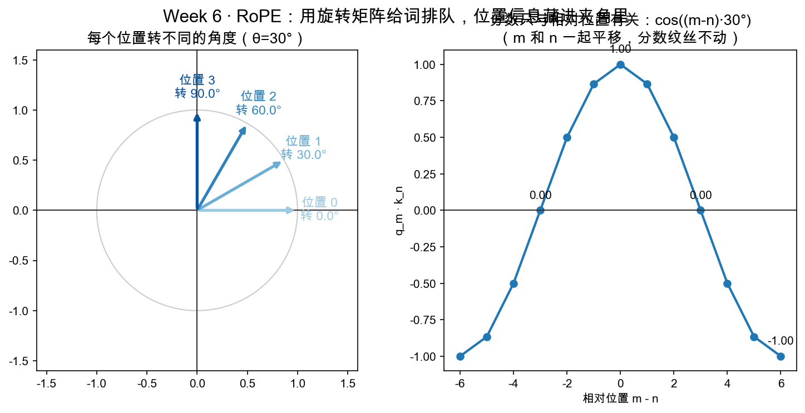
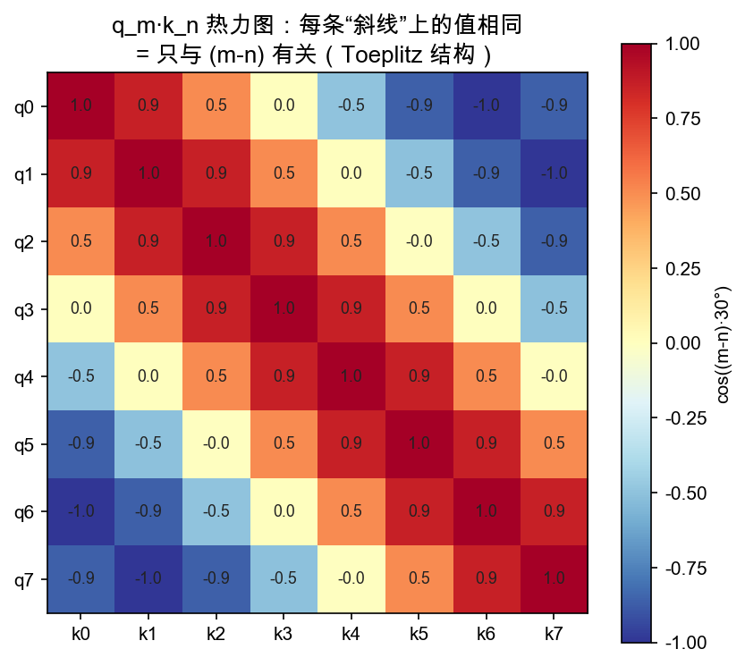

# Day 5：RoPE——用旋转矩阵给词排队

> 本章你将：
> 1. 发现迷你 Attention 的致命缺陷：**它对词的先后顺序一无所知**；
> 2. 掌握 RoPE 的核心思路：给位置 m 的词向量**旋转 m·θ 度**（Week 3 旋转矩阵）；
> 3. 用两条"已教事实"亲手推出那个魔法性质：**q_m·k_n 只依赖相对位置 (m-n)**；
> 4. 认识旋转的另一面：**保长度**（|Rv| = |v|）；
> 5. 实现 `rotate_2d` / `apply_rope_2d` / `rope_score`，并跑 `pytest tests -k rope` 到绿。

---

## 5.1 昨天那个注意力的致命伤：它不知道顺序

回到 Day 4 的 `attention(Q, K, V)`。想象两句完全不同的话：

```
A: 我 爱 吃 苹果
B: 苹果 吃 爱 我
```

把它们各自喂给你的 `attention`——**输出会完全一样！** 为什么？因为你只用了点积 `Q·K^T`，而点积是"逐词对应相乘再相加"，它**根本不看词排在第几位**。把整句话前后颠倒、随机打乱，只要还是那几个词向量，"谁看谁、看多重"的分数矩阵一模一样。

这就是所谓 **Attention 是"位置无关"（permutation invariant）的**：它天然不知道"苹果"在"吃"前面还是后面。可对语言来说，顺序至关重要——"猫追老鼠"和"老鼠追猫"是两个世界。

> 📌 划重点：注意力公式本身只做"看谁、看多重"，**不含任何顺序信息**。所以我们必须想办法，把"第几个位置"这件事，额外喂进词向量里。

---

## 5.2 怎么给向量"打上位置"？RoPE 的思路

思路有很多种（还有"位置向量 + 加法"等），本教程要教你的是现在大模型里最优雅、最主流的一种——**RoPE**（Rotary Position Embedding，旋转位置编码）。它的核心思路一句话：

> **位置 m 的词向量，绕原点旋转 m·θ 度。位置越靠后，转的角度越大。**

为什么是"旋转"？因为旋转有个绝妙的好处——回想 Week 3 Day 6 那个彩蛋（RoPE 预告里我们轻轻埋过这颗雷）：旋转矩阵是"保长度"的变换（转一转，箭头长短不变），而且旋转角度可以无限累加。用它来编码位置，既不会把向量"弄爆"，又能用角度区分先后。



**左图**：把同一个向量 [1,0]，按位置 0、1、2、3 分别旋转 0°、30°、60°、90°。四个不同位置，就是四个不同的方向。**位置信息，此刻变成了"箭头指向的角度"。**

> 💡 你可能会问：为什么不简单加一个数字"位置"?比如给向量整体平移一格？
>
> 平移（加法）也能编码位置，但 RoPE 选旋转是**为了另一个更诱人的性质**——它能让"分数只取决于两个词的**相对距离**"，而不是绝对位置（下一节马上推出）。这个性质对"要能处理任意长度句子"的模型极其重要。先记住动机，跟着推一遍就懂了。

---

## 5.3 两个"已教事实"，推出 RoPE 的魔法性质

现在干件漂亮的事：用你**已经会的两条事实**，推出 RoPE 最核心的性质。我们一步步走。

**事实一（Week 3）**：旋转的复合 = 角度相加。先转 30° 再转 60°，等于直接转 90°。用符号写：

```
把向量转 a 度，再转 b 度  =  把向量直接转 (a+b) 度
```

**事实二（Week 5）**：两个向量的点积，只和它们的**夹角**（以及各自长度）有关，和它们具体指向哪个方向无关——把两个箭头一起转同一个角度，它们之间的夹角不变，所以点积不变。

现在，假设有个查询在第 m 位、有个键在第 n 位。RoPE 规定：

```
q_m  = 把查询向量转 m·θ 度
k_n  = 把键向量转 n·θ 度
```

那么注意力分数（点积）是 `q_m · k_n`。用"事实二"，我们可以"把两个箭头一起往回转 n·θ 度"——**点积不变**：

```
q_m·k_n  =  (把 q_m 往回转 n·θ) · (把 k_n 往回转 n·θ)
         =  (转 m·θ 再回 n·θ 的 q) · (转 n·θ 再回 n·θ 的 k，也就是没转的 k)
```

用"事实一"计算角度：转 m·θ 再往回 n·θ = 转 (m−n)·θ。回推 k 那边：转 n·θ 再回 n·θ = 转 0°，即 k 原样。于是：

```
q_m·k_n  =  (q 转了 (m−n)·θ 之后的向量) · (原始的 k)
```

看右边——**只出现了 (m−n) 和原始的 q、k**，一点都没剩 "m" 和 "n" 单独出场！换句话说，分数完全被 **相对位置 (m−n)** 决定，而与"这两个词各自在第几位"无关。

> 📌 划重点：RoPE 的魔法可浓缩为一句——**"旋转复合 = 角度相加" + "点积只与夹角有关"，合力推出：加了位置之后，注意力分数只依赖两个词的相对距离 (m−n)。** 第 m 位和第 n 位，与第 (m+5) 位和第 (n+5) 位，分数一模一样（因为它们相对距离相同）。

**右图**正是这个性质的可视化：它画了 `q_m·k_n` 随相对位置 (m−n) 变化的曲线——一条余弦波，而且标题写着"m 和 n 一起平移，分数纹丝不动"。

---

## 5.4 旋转还保长度：箭头转一圈不变短

RoPE 选旋转还有第二个好处：**旋转不改变向量长度**（|Rv| = |v|）。

直观：拿着一根长度 5 的棍子转任意角度，棍子还是 5 长。数学上，这是"旋转矩阵是正交矩阵"的自然结果，但你不用管那个名词，看测试就知道——`test_rotate_preserves_length` 拿 [3,4]（长度 5）转 37°，断言转完长度仍是 5：

```python
v = [3, 4]
r = rope.rotate_2d(v, 37)
assert (r[0]**2 + r[1]**2)**0.5 == approx(5)   # 长度不变
```

> 📌 划重点：旋转编码位置，**只改方向、不改长度**。这意味着被"打上位置"之后，词向量携带的其它信息（它有多"强"、多"重要"）不会被位置信息破坏——位置的加入是"无损"的。

---

## 5.5 实现：rotate_2d / apply_rope_2d / rope_score

打开 `matrixlab/rope.py`，三个函数等你实现。

### 5.5.1 rotate_2d：旋转一个 2D 向量

这是 Week 3 Day 1 教过的旋转矩阵实战。把 2D 向量 v=[v0,v1] 逆时针转 θ 度：

```python
def rotate_2d(v: list, theta_deg: float) -> list:
    t = math.radians(theta_deg)          # 角度制转弧度制（math.cos/sin 要弧度）
    c, s = math.cos(t), math.sin(t)
    return [c * v[0] - s * v[1], s * v[0] + c * v[1]]
```

对照 Week 3 的旋转矩阵：新 x = c·x − s·y，新 y = s·x + c·y。文件顶部已 `import math`。测试会验四个地标角：0°（不动）、90°（东→北）、180°（反向）、以及任意角保长度。

### 5.5.2 apply_rope_2d：给整串词打位置

给一个向量序列（按位置排好的词向量列表），第 i 个转 i·θ 度：

```python
def apply_rope_2d(seq: list, theta_per_step: float) -> list:
    return [rotate_2d(v, i * theta_per_step) for i, v in enumerate(seq)]
```

`theta_per_step` 就是前面说的 θ——相邻位置转过的角度差。测试 `test_apply_rope_2d` 拿三个 [1,0]、θ=90°，期望转出 [1,0]→[0,1]→[-1,0]，正好对应 0°、90°、180°。

### 5.5.3 rope_score：旋转后的点积

RoPE 之后的注意力分数，就是两个（已经转好位置的）向量做点积：

```python
def rope_score(q: list, k: list) -> float:
    return q[0] * k[0] + q[1] * k[1]
```

注意：这里的 q、k 是**已经 apply_rope 打好了位置**的向量。`rope_score(qm, kn)` 就是"第 m 位的查询 · 第 n 位的键"。

---

## 5.6 跑测试到绿 + 亲眼看"只依赖相对位置"

实现完，跑：

```bash
pytest tests -k rope -q
```

全部 7 个（`rotate_preserves_length`、`rotate_landmarks`、`rotation_is_linear`、`apply_rope_2d`、`rope_score_depends_only_on_relative_position`、`rope_keeps_length_of_every_token`）都绿即成功。

其中最值得细看的是 `test_rope_score_depends_only_on_relative_position`，它正是 5.3 节推的那条性质的**实验验证**：

```python
def score(m, n):
    qm = rope.rotate_2d(q, m * theta)
    kn = rope.rotate_2d(k, n * theta)
    return rope.rope_score(qm, kn)

assert score(1, 1) == approx(score(2, 2))     # (1,1) 和 (2,2) 相对距离都是 0
assert score(0, 3) == approx(score(5, 8))     # (0,3) 和 (5,8) 相对距离都是 -3
assert score(1, 0) == approx(score(3, 2))     # 相对距离都是 1
```

三组断言，每组两个位置的**绝对坐标**不同、但**相对距离 (m−n)** 相同——分数一样。还顺带给了具体数值：`score(1,2) == cos(-30°) ≈ 0.866`，说明分数确实就是"相对距离夹角的余弦"。

（可以先用 `IMPL=reference pytest tests -k rope -q` 看参考答案全绿，再回自己代码复现。）

---

## 5.7 分数矩阵里的"斜条纹"长什么样

把 8 个位置的 score 全算出来排成方阵，会看到一幅漂亮的**斜条纹**：



每一格 = `q_m·k_n`。因为分数只由 (m−n) 决定，所以**同一条对角线（"左上到右下"方向）上的格子数值完全相同**——(m−n) 相等的所有格子抱团相等。这种"对角线上元素相同"的矩阵，数学里叫 **Toeplitz 矩阵**，你不必记这个词，但"斜条纹 = 只依赖相对位置"这个画面值得钉在脑子里。

> 💡 你可能会问：图上颜色有红有蓝，负分数是什么意思？
>
> 分数 = cos((m−n)·30°)，当相对距离对应的夹角超过 90° 时，余弦变负，就显蓝。它只是说"这两个位置的关系方向偏了"，softmax 之后会自动转成权重（正数、和为 1），所以负分数并不可怕。

---

## 5.8 真实 RoPE 的收尾（不要求实现）

你实现的是**2 维、单一频率**的玩具版。真实的 RoPE 把你的直觉照搬，只加了一个twist，一句话讲完：

> **真实 RoPE 把词向量的每一对维度（第 0-1 维、第 2-3 维、第 4-5 维……）都两两一组，按不同的频率 θ 去旋转。** 于是低维组转得慢（编码长距离、宽泛的位置关系）、高维组转得快（编码短距离、精细的相邻关系），各管各的粒度。

换句话说：你 `rotate_2d` 里的"一个 θ"放大成"每对维度一个不同的 θ"，再在每一对上各做一次你写过的旋转。**机制没变，只是把一条链扩成好多条不同转速的链。** 真到读源码那天，你会一眼认出"这就是我 Week 6 写过的那东西"。

---

## 5.9 本章小结

- ✅ Attention 对顺序无感，必须额外喂位置；RoPE 用"旋转 m·θ 度"来编码位置。
- ✅ 核心性质（两条旧事实推出的）：q_m·k_n 只依赖 (m−n)——旋转复合=角度相加 + 点积只与夹角有关。
- ✅ 旋转保长度（|Rv|=|v|），改方向不改长度，位置信息是"无损"注入。
- ✅ 三个函数：rotate_2d（旋转）、apply_rope_2d（按位置轮流转）、rope_score（转后的点积）。
- ✅ 分数矩阵呈"斜条纹"：同对角线上值相同 = 只与相对位置有关。
- ✅ 真实 RoPE = 每对维度配一个不同频率 θ 的旋转（一句话版）。

---

## 动手练习

1. **代码**：实现 `matrixlab/rope.py` 的三个函数，跑 `pytest tests -k rope -q` 全绿。
2. **纸面推一遍**：θ=90° 时，位置 0、1、2 的向量 [1,0] 各转了多少度、得到什么向量？（对照测试 `test_apply_rope_2d`。）
3. **性质复述**：不看教程，用"旋转复合=角度相加"和"点积只与夹角有关"这两句话，口述给"明天的自己"听：为什么 RoPE 的分数只依赖 (m−n)？

## 参考答案

1. 见 `reference/rope.py`（三函数与 5.5 完全对应）。
2. 0°→[1,0]、90°→[0,1]、180°→[-1,0]。
3. 关键在 5.3 的"一起往回转 n·θ 度"那一步：把 q 和 k 各自的角度都减掉 n·θ，点积不变，剩下的角度恰是 (m−n)·θ。

卡住 20 分钟再看 `reference/rope.py`。

---

## 📌 AI 联系

RoPE 是当下 LLM 位置编码的事实标准：LLaMA、Qwen、GPT 系列的一堆变体都在用它（或它的近亲）。你今天悟到的"把位置藏进夹角、让分数只依赖相对距离"，正是这些模型能**稳定长上下文、天然处理相对顺序**的底层原因之一。这条从"旋转矩阵"（Week 3）到"大模型位置编码"的线，就此打通。

---

👉 位置补齐了，机制也跑通了。最后一天，我们把五周 + 这周的整张地图**串成一条线**，并读透那张注意力热力图。去 **[Day 6：可视化与大串讲——Attention 热力图](./06-Day6-可视化与大串讲-Attention热力图.md)**。
