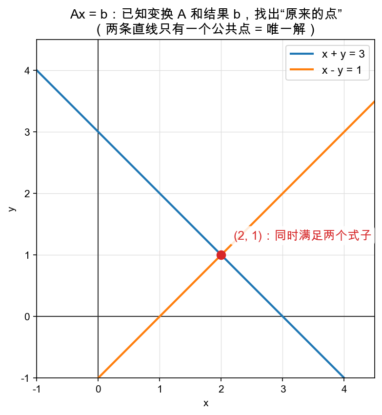

# Day 1：Ax = b——已知输出和变换，求输入

> 本章你将：
> - 把"解方程组"翻译成一句矩阵黑话：**已知变换 A 和结果 b，反推出原来的输入 x**；
> - 看见它的几何长相：二元方程 = 一条直线，解方程组 = 找两条直线的**交点**（三个未知数就是三个平面的交点）；
> - 亲手把"用逆矩阵解"和"用 Week 2 的 solve2 解"两件事串起来，体会它们说的是同一回事；
> - 为明天的编程做好铺垫：n 元方程组，需要的是一套"机械化、能写进循环"的办法。

---

## 1.1 从一件特别日常的事说起

你上小学时就会解这种题：

```
小明买了苹果和梨，一共 3 斤，花了…… 
```

翻译成数学，就是"**已知一些结果，反推出产生这些结果的原因**"。比如：

- 我知道 $x + y = 3$（两个数加起来是 3）；
- 又知道 $x - y = 1$（两个数差是 1）；
- 那 x、y 到底各是多少？

你心里已经在算了：两个式子一加，$2x = 4$，$x = 2$；代回去 $y = 1$。答案 $(2, 1)$，一秒出。

现在，我要给你配一副"矩阵眼镜"，把这道题看成一件你已经很熟的事——**矩阵变换**。

---

## 1.2 换副眼镜：方程 = 变换的"逆问题"

回忆 Week 3：矩阵乘向量，就是把一个点搬去另一个地方，是一种**变换（运动）**。比如矩阵

```
A = [x+y 的系数行]  …… 先别管具体数字
```

我们把上面俩方程换个写法，把未知数 x、y 打包成一支向量 $x = (x, y)$，把两个结果打包成 $b = (3, 1)$，系数打包成矩阵 A：

```
        ┌        ┐
A =     │ 1   1  │
        │ 1  −1  │
        └        ┘

Ax = b  等价于
        ┌        ┐┌   ┐   ┌   ┐
        │ 1   1  ││ x │   │ 3 │
        │ 1  −1  ││ y │ = │ 1 │
        └        ┘└   ┘   └   ┘
```

把它展开，就是 Week 3 学的矩阵乘向量（行 $\times$ 列，对应相乘再相加）：

- 第一行：$1 \cdot x + 1 \cdot y = 3$，正是 $x + y = 3$；
- 第二行：$1 \cdot x + (-1) \cdot y = 1$，正是 $x - y = 1$。

一模一样！所以：

> 📌 **划重点：解方程组 = 已知"变换 A"和"变换后的结果 b"，反推出"变换前的原始输入 x"。** 这是整个线性代数里最经典的一类问题，有个专门的词叫**逆问题（inverse problem）**——正问题是"给输入，算输出"（$Ax = b$ 直接乘），逆问题反过来："给输出，找输入"。

换个更形象的问法：**A 是一台机器，b 是它吐出来的成品，问：丢进机器里的原料 x 长什么样？** 解方程，就是"看成品推断原料"。

> 💡 **你可能会问：这跟 Week 4 的逆矩阵不是一样吗？**
>
> 敏锐！完全一样。Week 4 Day 3 学的逆矩阵 $A^{-1}$，干的正是这件事：$x = A^{-1} b$，"把 A 做过的事撤销掉，就找回原来的 x"。区别只在于：**那会儿我们承认"有逆矩阵"这个前提，用一条公式直接套**；而解方程组，是**不预设逆矩阵存在，纯靠消元硬算**。你马上会看到两条路殊途同归。

---

## 1.3 几何：两个方程 = 两条直线，解 = 交点

看图：



蓝线是 $x + y = 3$，橙线是 $x - y = 1$，它们只相交于一个红点 $(2, 1)$。

这个图告诉你一件很深的事：

- **一个二元方程 $ax + by = c$，几何上就是平面上的一条直线**——所有满足它的点 (x, y)，正好铺满这条直线；
- **解方程组**，就是要找一个**同时落在两条直线上的点**——也就是**它们的交点**；
- 两条不平行、不重合的直线，恰好交于一点 → 方程有**唯一解** $(2, 1)$。

推广到三个未知数：一个三元方程 $ax + by + cz = d$ 是三维空间里的**一个平面**；解三个三元方程，就是找**三个平面的公共点**。再往上（四元、n 元），几何图像画不出来了，但规律一模一样：**n 个未知数 = n 个"超平面"，解 = 它们唯一的公共点。**

所以"解方程求交点"这句话，是从二维一路通向 n 维的同一句直觉。明天的代码，就是要机械化地算出这个"公共点"。

> ⚠️ **易踩坑：不是所有方程组都有唯一解。**
>
> 两条直线可能**平行**（永远不相交 → 无解），也可能**重合**（无限多个公共点 → 无穷多解）。翻译成矩阵语言：A 把平面"压扁"了（行列式为 0，Week 4 Day 3 讲过），变换不可逆，自然没法从 b 唯一地反推回 x。明天的代码也会专门处理这种"没有唯一解"的情况（抛异常），现在先心里有数：**唯一解的前提，是那几条"线/面"恰好交于一点。**

---

## 1.4 两把尺子量同一件事：逆矩阵 vs 消元

现在回到那道小学题，用你手里已有的两件工具各解一遍，体会"殊途同归"。

**工具一：逆矩阵公式（Week 4）。**

A 的逆矩阵（Week 4 Day 3 的 formula）是

$$
A^{-1} = \frac{1}{det}
\begin{bmatrix} d & -b \\\\ -c & a \end{bmatrix}
$$

对这道题 $a=1,\ b=1,\ c=1,\ d=-1$，行列式 $det = ad - bc = 1 \cdot (-1) - 1 \cdot 1 = -2$，所以

$$
A^{-1} = \left(-\frac{1}{2}\right)
\begin{bmatrix} -1 & -1 \\\\ -1 & 1 \end{bmatrix} =
\begin{bmatrix} 0.5 & 0.5 \\\\ 0.5 & -0.5 \end{bmatrix}
$$

于是

$$
x = A^{-1} b =
\begin{bmatrix} 0.5 & 0.5 \\\\ 0.5 & -0.5 \end{bmatrix}
\begin{bmatrix} 3 \\\\ 1 \end{bmatrix} =
\begin{bmatrix} 0.5 \cdot 3 + 0.5 \cdot 1 \\\\ 0.5 \cdot 3 - 0.5 \cdot 1 \end{bmatrix} =
\begin{bmatrix} 2 \\\\ 1 \end{bmatrix}
$$

得 $x = (2, 1)$。✓

**工具二：消元（Week 2 的 solve2）。**

Week 2 Day 5 你亲手写过 `solve2.solve_2x2`，它的思路是初中那套**加减消元 + 回代**：让两个式子里的 x 系数相同，相减消掉 x，解出 y，再代回求 x。对同一道题，它也算出 $(2, 1)$。

**结论**：逆矩阵是"一眼看穿的公式解"，消元是"逐步碾过去的硬解"。前者的存在有个前提（行列式 $\neq 0$），后者则是一条**永远能走、还能机械化推广到 n 元**的"笨办法"。所以明天的编程，我们选消元——因为它能写成循环，对任意 n 都成立。

> 📌 **AI 联系：** "已知输出、反推输入"这个动作，在 LLM 的底层数学里无处不在。训练网络时我们做的事其实是它的亲戚：已知一批"输入→输出"的例子里有误差，反推该**改哪个参数**（Week 8 的梯度下降）。$Ax = b$ 之所以是"正事"，就是因为它把"从结果倒推原因"这种能力，第一次规规矩矩地交到了你手里。

---

## 1.5 一句话说清"Week 2 → Week 7"的进化

你可能已经觉得眼熟：**Week 2 的 `solve2`，不就是解方程吗？** 对，那一周你只会解**二元**的——因为我们的战场还是平面，两个未知数够了。本周的进化，只是把这件事从 2 个未知数推广到 **n 个**：

| | Week 2 | Week 7 |
|---|---|---|
| 未知数个数 | 2 个（平面） | n 个（高维） |
| 几何 | 两条直线求交点 | n 个超平面求公共点 |
| 工具 | `solve2.solve_2x2`（写死两元） | `gauss.solve_linear`（循环，任意 n） |
| 本质 | 已知变换和结果，反推输入 | 一模一样 |

明天的任务，就是把这个"2 元的加减消元"，升级成"n 元的高斯消元"——它其实是同一个招式，只是学会了**用循环代替手算**。

---

## 1.6 本章小结

- ✅ 解方程组 = **逆问题**：已知变换 A 和结果 b，反推出原始输入 x。
- ✅ 几何：二元方程 = 直线，解 = 交点；三元方程 = 平面，解 = 三平面公共点；推广到 n 元同理。
- ✅ 两条路：逆矩阵（公式，有前提）与消元（硬解，可推广到 n 元），殊途同归。
- ✅ 唯一解的前提：那些"线/面"恰好交于一点；平行/重合则无解或无穷多解（对应 A 不可逆）。

明天，我们把"加减消元"机械化，写成能解任意 n 元方程的 `gauss.solve_linear`。

---

## 动手练习

1. **手算（就在草稿纸上）**：解 $3x + 2y = 8$、$2x - y = 3$。先乖乖用加减消元，再用逆矩阵公式验一遍，看是不是同一个答案。
2. **想一想**：上一题里 $det = 3 \cdot (-1) - 2 \cdot 2 = -7$，不等于 0。如果 det 恰好是 0，几何上这两条直线是什么关系？
3. **预热**：打开 `matrixlab/gauss.py` 瞄一眼——明天你要填的那个 `solve_linear` 现在还只是个 `raise NotImplementedError`。不用现在写，先看看它的函数签名长什么样。

> 明天见答案：第 1 题 x = 2, y = 1；第 2 题 det = 0 意味着两直线平行或重合（没有唯一交点）。

## 参考答案

本章没有要写的代码，参考答案见明天 Day 2 的 `reference/gauss.py`。第 1 题你若用第 2 题的逆矩阵公式算，$A^{-1} = \left(-\frac{1}{7}\right)\begin{bmatrix}-1 & -2 \\\\ -2 & 3\end{bmatrix}$，乘 b=(8,3) 得 (2,1)。

---

👉 **[Day 2：代码实战——高斯消元：从 2 元到 n 元](./02-Day2-代码实战-高斯消元-从2元到n元.md)**
