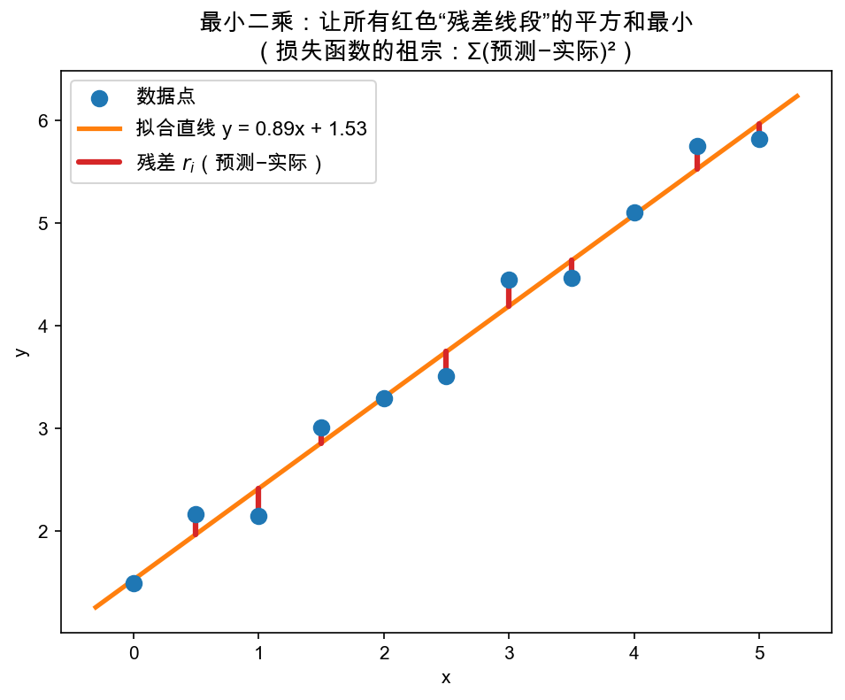
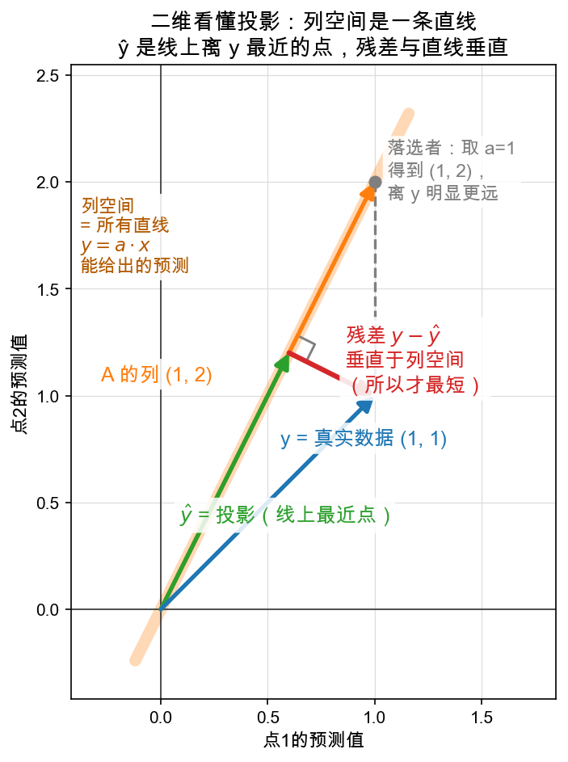
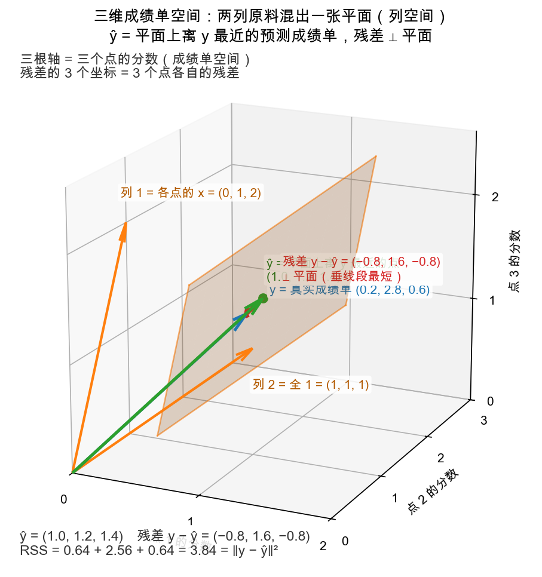

# Day 3：超定方程组与最小二乘——找不到完美解时的"最佳妥协"

> 本章你将：
> - 撞见一种"**方程比未知数多**"的头疼情况——**超定方程组**，它一般没有精确解；
> - 学会诚实的退路：**没有完美解，就找"误差平方和最小"的那一个**，这叫**最小二乘**；
> - 走通本章的主线（四步）：**把逐点残差打包成一支"箭头" → RSS 就是箭头长度的平方 → 最近点 = 垂足（投影）→ 垂直 ⟺ 点积为 0 → 法方程 $(A^T A) x = A^T y$**；
> - 实现 `matrixlab/lstsq.py` 的 `fit_line / predict / residual_sum`，跑 `pytest tests -k w7_lstsq` 到绿。

---

## 3.1 先撞上那堵墙：点太多，直线穿不过去

昨天我们解的方程组，"方程个数 = 未知数个数"，恰好能解出一个唯一解，两条直线也恰好交于一点。

但现实世界不是这样的。想象你在记录"学习时长和考试成绩"的关系，测了一堆数据：

```
小时数 x :  0    1    2    3
分数   y : 1.0  2.2  2.8  4.1
```

看起来"学得越多分越高"，你猜它大概是一条直线 $y = a \cdot x + b$。问题来了：**这条直线有两个未知数（a、b），却要同时满足 4 个点**——除非这 4 个点本来就严格共线，否则根本不可能。

对每个点写一个方程 $a \cdot x_i + b = y_i$：

```
a·0 + b = 1.0      （点 1）
a·1 + b = 2.2      （点 2）
a·2 + b = 2.8      （点 3）
a·3 + b = 4.1      （点 4）
```

**4 个方程，2 个未知数。** 这种"方程比未知数多"的方程组叫**超定方程组（overdetermined）**，它的常态是：**无解**。就像让一条直线穿过 4 个东倒西歪的点——办不到。

> ⚠️ **易踩坑：别急着说"那就是没答案"。** 现实数据永远带噪声，永远"穿不过去"，但我们不是要一个"完美穿点"的答案，而是要一个"**离所有点都尽量近**"的答案。这个"尽量近"，就是本周的主角——最小二乘。

---

## 3.2 退而求其次：定义"残差"，让残差平方和最小

既然穿不过所有点，那就换一个目标。先定义"错得有多离谱"：

对某个点 $(x_i, y_i)$，直线 $y = a \cdot x + b$ 在 $x_i$ 处给出预测 $\hat{y}_i = a \cdot x_i + b$，实际值是 $y_i$，两者的**竖直误差**是：

$$
\text{误差}_i = \text{预测} - \text{实际} = (a \cdot x_i + b) - y_i
$$

这个误差在统计里有正式名字：**残差（residual）**，记作 $r_i$。字面意思就是"**残余下来的误差**"——直线把数据里能用 $y = a \cdot x + b$ 解释的部分"吃掉"之后，每个点上仍然**残存、亏欠的那一小截**。残差不是什么新东西，就是刚才公式里那个竖直误差 $(a \cdot x_i + b) - y_i$，只是给它起了个学名；后面说到"残差"，指的都是它（到本节末尾的图里，它就是那些红色竖线段）。

有的点残差是正的（直线在点上方），有的是负的（在下方）。**如果直接加起来，正的负的会互相抵消**，明明一堆误差，加起来却是 0——骗自己。所以经典做法是把每个残差**平方**，再加起来：

$$
\text{残差平方和 } RSS = \sum r_i^2 = \sum (a \cdot x_i + b - y_i)^2
$$

平方有两个好处：① 正负都变正，不会抵消；② 大幅度惩罚"离得特别远"的点（误差大 1 倍，平方后大 4 倍）。

> 📌 **划重点：最小二乘 = 找 (a, b) 让这个"残差平方和"最小。** "二乘"就是"平方"（误差的二次方），"最小"就是找使这个和最小的参数。它就是"最佳妥协"的数学定义。

看图：



蓝点是数据，橙色是拟合出的直线，红色竖线段是每个点的**竖直误差——也就是残差 $r_i$**（有的在直线上方，有的在下方；恰好落在直线上的点残差为 0，看不出红线段）。最小二乘找的那条直线，就是让这些红线段的**长度平方加起来最小**的那一条。注意它可能碰巧穿过个别点，但穿不过所有点——它是"整体离所有点最近"的，不是"逐点完美"的。

> 💡 **你可能会问：为什么要"平方"而不是"绝对值"？**
>
> 绝对值也能避免抵消（|误差| 之和）。但平方有个数学上的甜头：它是一个**光滑**的函数（没有尖角），求"什么时候最小"时可以痛快地求导（Week 8 Day 1 教导数）。绝对值在 0 处有个尖角，处理起来麻烦得多。所以历史上大家选了平方，而且一用就再也回不去了——**它后来直接长成了 AI 的损失函数**（Day 6 细说）。3.3 还会给你一个更深的理由：平方之后，残差平方和**恰好等于一段距离的平方**，整个问题才能画成一幅几何图。

---

## 3.3 核心一步：把残差打包成一支箭头（一幅"成绩单"的画）

问题变成：**在所有可能的 (a, b) 里，哪一个让 RSS 最小？**

这里有一个百年老答案，一句话版本：**用投影。** 这句话不解释就是咒语。本章把它拆成一条四步逻辑链，每一环都只用你已经学过的东西。三维以上的图不好画，先拿一个**二维小例子**把整条链走通，再原样搬回真实问题。

> 🚧 **先立一块警告牌：接下来要换空间了。** 3.2 那幅图（横轴 x、纵轴 y 的数据平面）到这里退场。后面所有图都画在另一个空间——**成绩单空间**：一根坐标轴管一个点，轴上的刻度是**分数**，不再是 x。

**缩小例子：把截距 b 先拿掉。** 模型简化成"过原点的直线" $y = a \cdot x$，只剩一个未知数 a。取两个点 (1, 1) 和 (2, 1)：

```
a·1 = 1      （点 1）
a·2 = 1      （点 2）
```

**把这两个点想成两个学生。** 真实情况是一张**成绩单**：学生 1 得 1 分、学生 2 得 1 分。打包成一个向量：

$$
y = \begin{bmatrix} 1 \\\\ 1 \end{bmatrix} \qquad \text{（真实成绩单：每个坐标 = 一个学生的分数）}
$$

任何候选直线 $y = a \cdot x$ 也会**预测**出一张成绩单：学生 1 预测 $a \cdot 1$ 分，学生 2 预测 $a \cdot 2$ 分（Week 2 的线性组合，组合里只有一项；这一列 (1, 2) 就是 A，**列空间 = 这列的所有倍数 = 全部候选成绩单**）：

$$
\underbrace{\begin{bmatrix} a \cdot 1 \\\\ a \cdot 2 \end{bmatrix}}\_{\text{候选成绩单}}
= a \cdot \underbrace{\begin{bmatrix} 1 \\\\ 2 \end{bmatrix}}\_{\text{A 的列：两个点的 } x}
$$

把 a 从负无穷取到正无穷，候选成绩单 $(a,\ 2a)$ 排成**一条过原点、斜率是 2 的直线**（学生 2 的 x 是学生 1 的两倍，所以他的预测永远是学生 1 的两倍）。"$A x = y$ 有没有解"翻译过来就一句：**有没有哪张候选成绩单恰好等于真实成绩单？** $(a, 2a) = (1, 1)$ 要求 a 同时等于 1 和 0.5——矛盾，所以无解。

**核心一步（那座桥）：把逐点残差打包成一支箭头。**
固定一个候选 a，按 3.2 的定义逐点算残差（预测 − 实际）：点 1 的残差是 $a \cdot 1 - 1$，点 2 的残差是 $a \cdot 2 - 1$。现在把它们**竖着打包成一个向量**——打包方式是我们自己选的，而这一步棋是整章的关键：

$$
\begin{bmatrix} a \cdot 1 - 1 \\\\ a \cdot 2 - 1 \end{bmatrix}
\qquad \text{（残差向量：每个坐标 = 一个点的残差）}
$$

它几何上就是**从候选成绩单指向真实成绩单的那支箭头**（方向差个正负号，无所谓）。打包之后奇迹发生：**"两点间距离的平方"的定义恰好是"对应坐标差的平方和"**（初中两点距离公式），而这里每个坐标差就是一个点的残差，所以

$$
\underbrace{RSS}\_{\text{逐点残差平方和}}
= (a \cdot 1 - 1)^2 + (a \cdot 2 - 1)^2
= \underbrace{\lVert y - a \cdot (1, 2) \rVert^2}\_{\text{两张成绩单之间距离的平方}}
$$

> 📌 **划重点（那座桥）：残差平方和 RSS = ‖y − 候选成绩单‖²，就是"真实成绩单到候选成绩单的距离的平方"。** 逐点的小误差 → 一支箭头的坐标；误差的平方和 → 箭头长度的平方。这不是巧合，是打包那一刻就设计好的。于是"让 RSS 最小"变成一道初中几何题：**直线（全部候选成绩单）外有一个定点 y，求线上离它最近的点。**

（这也是"平方"比"绝对值"更深一层的理由：平方之后，RSS 才恰好是**一段距离的平方**，整个问题才能画成一幅几何图；换成绝对值之和，这幅画就没了。）

看图——左边是旧空间（数据平面），右边是新空间（成绩单空间），**同样那两个残差，在右边成了同一支箭头的两个坐标**：



右图每个元素都有名字：橙色直线是**全部候选成绩单 $(a, 2a)$ 排成的线**（= 列空间）；蓝点是真实成绩单 $y = (1, 1)$；绿点是 $\hat{y} = (0.6, 1.2)$——线上离 y 最近的候选；红色箭头是从 $\hat{y}$ 指向 y 的**残差向量** $(0.4, -0.2)$，红色虚线阶梯把它拆开：横向差 0.4 就是点 1 残差的大小，纵向差 0.2 就是点 2 残差的大小（差个正负号，平方后无差别）；箭头与直线之间标了直角。灰色落选者取 a = 1，成绩单 (1, 2)，距离² = 1，明显更远。

不信"最近的点"真是垂足？用数字把 a 从小到大扫一遍。$RSS(a) = (a-1)^2 + (2a-1)^2 = 5a^2 - 6a + 2$：

| a | 候选成绩单 (a, 2a) | RSS = 距离² |
|---|---|---|
| 0.5 | (0.5, 1.0) | 0.25 |
| **0.6** | **(0.6, 1.2)** | **0.20 ← 最小** |
| 0.7 | (0.7, 1.4) | 0.25 |
| 1.0 | (1.0, 2.0) | 1.00（灰色落选者） |

**为什么"最近"的那一点，恰好是"垂直"落下的？**
反过来想最直观：假如残差**斜着**离开直线，那它沿着直线方向就还留有一个"影子"分量——顺着影子在线上挪一点，就能离 y 更近，说明现在还不是最近；只有当它**笔直地立起来、与直线垂直**时，线上才没有任何方向能更近。初中几何也这么说：**垂线段最短。**（上表也印证了：从 0.6 无论往哪边挪，RSS 都变大。）这个最近点 $\hat{y}$ 就叫 **y 在列空间上的投影**。

**把"垂直"翻译回代数，法方程就自己冒出来了。**
先用初中方式验一遍"垂直"：直线方向 (1, 2) 的斜率是 2，残差方向 (0.4, −0.2) 的斜率是 −0.5，乘积 $2 \times (-0.5) = -1$ ✓（初中规则：两线垂直 ⟺ 斜率乘积为 −1）。Week 5 的**点积**是这条规则的通用版：**点积为 0 ⟺ 垂直**。验算：$(1, 2) \cdot (0.4, -0.2) = 0.4 - 0.4 = 0$ ✓。

于是"残差要垂直于列空间"就是一个含 a 的方程：

$$
(1, 2) \cdot \big[(1, 1) - a \cdot (1, 2)\big] = 0
\quad\Longrightarrow\quad
\underbrace{(1 \cdot 1 + 2 \cdot 1)}\_{=3} - a \cdot \underbrace{(1 \cdot 1 + 2 \cdot 2)}\_{=5} = 0
\quad\Longrightarrow\quad
a = 0.6
$$

和表格里扫出来的最小值**完全一致**——"垂足"和"RSS 最小的点"是同一个点。盯住 5 和 3 的出身：

- $5 = (1, 2) \cdot (1, 2)$：**列和自己的点积**——它就是 $A^T A$；
- $3 = (1, 2) \cdot (1, 1)$：**列和 y 的点积**——它就是 $A^T y$。

把"每一列都和残差点积为 0"写成矩阵形式。先盯住等号右边的 0：它**不是数字，是零向量**——每个分量都是 0 的向量；而"向量相等"就是"逐个分量相等"：

$$
A^T (y - A\hat{x}) = \underbrace{\begin{bmatrix} \text{第 1 列} \cdot \text{残差} \\\\ \text{第 2 列} \cdot \text{残差} \\\\ \vdots \end{bmatrix}}\_{\text{乘积的第 } i \text{ 个分量}} = \underbrace{\begin{bmatrix} 0 \\\\ 0 \\\\ \vdots \end{bmatrix}}\_{\text{零向量 } \mathbf{0}} \qquad\Longrightarrow\qquad (A^T A)\ \hat{x} = A^T y
$$

为什么会这样打包？$A^T$ 是 A 的**转置**，行变列（Week 3 学过 `mat.transpose`）。转置之后，$A^T$ 的第 $i$ **行**恰好是 A 的第 $i$ **列**"躺倒"的样子，所以 $A^T$ 乘残差，得到的向量**第 $i$ 个分量 = A 的第 $i$ 列与残差的点积**。而"等于零向量"要求**每一个分量都是 0**——这正是"每一列都和残差点积为 0"：n 条条件被一条向量式打包，不多不少。条件的个数 = A 的列数 = 未知数的个数，所以法方程总是"正常大小"的方程组，用昨天的 `gauss.solve_linear` 一解就出。

顺带排掉一个记号陷阱：前面单列（直线）的例子里，等号右边的 0 是**真数字**——1 列给 1 个条件，就是 1 个孤零零的 0；两列起，条件摞成一摞，0 就升级成**零向量**（2 个 0 摞起来）。教材常偷懒不写粗体、统一印成"$= 0$"，靠上下文告诉你它是几维——心里默念一句"等号两边的 0 形状相同"，就不会被绊住。右边这条就是**法方程（normal equations）**——它不是天上掉下来的咒语，只是"残差要垂直于列空间"这句话的代数化身。

**最后，把小例子换回真实问题。** 把截距 b 加回来：学生变成 n 个（n 个点的成绩单是 n 维向量），候选直线给出**两种原料**——各点的 x 组成的列、全 1 组成的列，按比例 (a, b) 混合：

$$
\text{候选成绩单} = a \cdot \begin{bmatrix} x_1 \\\\ \vdots \\\\ x_n \end{bmatrix} + b \cdot \begin{bmatrix} 1 \\\\ \vdots \\\\ 1 \end{bmatrix}
$$

两种原料的一切混合铺成**一张平面**——列空间从"一条线"升级成"一张平面"。故事一字不差，只是三件套换了个尺码：

1. RSS 仍然是"y 到候选成绩单的距离的平方"（每个坐标 = 一个点的残差）；
2. 答案 = **平面上离 y 最近的点** $\hat{y}$（投影）；
3. 最近 ⟺ 残差**垂直于整个平面** ⟺ 残差和**每一列**的点积都为 0 → 两个方程，正好配两个未知数 → $2\times 2$ 的法方程。

三个点时成绩单空间是三维，还画得出来。就用 xs = [0, 1, 2]、ys = [0.2, 2.8, 0.6] 这三个点，把法方程从头到尾解一遍——前面单列的例子只有一列、一个未知数，只欠一条垂直条件；现在两列、两个未知数，垂直条件也正好翻倍成两条。

**第 1 步：写出 A、未知数和 y。** 按上面的混合式，第一种原料是各点的 x，第二种是全 1：

$$
A = \begin{bmatrix} 0 & 1 \\\\ 1 & 1 \\\\ 2 & 1 \end{bmatrix}, \qquad \hat{x} = \begin{bmatrix} a \\\\ b \end{bmatrix}, \qquad y = \begin{bmatrix} 0.2 \\\\ 2.8 \\\\ 0.6 \end{bmatrix}
$$

A 的第 1 列就是 x 列 $(0, 1, 2)$，第 2 列就是全 1 列 $(1, 1, 1)$；$\hat{x} = (a, b)$ 是要找的配方比例。

**第 2 步：写出残差向量。** 候选成绩单 $A\hat{x}$ 的三个坐标就是每个点的预测 $a \cdot x_i + b$；残差 = 真实 − 预测，逐坐标写出来：

$$
r = y - A\hat{x} = \begin{bmatrix} 0.2 - b \\\\ 2.8 - a - b \\\\ 0.6 - 2a - b \end{bmatrix}
$$

**第 3 步：垂直条件一——r 和第 1 列（x 列）的点积为 0。** 套用前面 a = 0.6 例子的展开套路（列和 y 的点积，减去 a 乘"列和自己"的点积，再减去 b 乘"列和另一列"的点积）：

$$
(0, 1, 2) \cdot r = \underbrace{(0 \cdot 0.2 + 1 \cdot 2.8 + 2 \cdot 0.6)}\_{= 4.0} - a \cdot \underbrace{(0 \cdot 0 + 1 \cdot 1 + 2 \cdot 2)}\_{= 5} - b \cdot \underbrace{(0 + 1 + 2)}\_{= 3} = 0
$$

整理得第一条方程：**$5a + 3b = 4.0$**。

**第 4 步：垂直条件二——r 和第 2 列（全 1 列）的点积为 0。**

$$
(1, 1, 1) \cdot r = \underbrace{(0.2 + 2.8 + 0.6)}\_{= 3.6} - a \cdot \underbrace{(0 + 1 + 2)}\_{= 3} - b \cdot \underbrace{(1 + 1 + 1)}\_{= 3} = 0
$$

整理得第二条方程：**$3a + 3b = 3.6$**。（两个 3 出身不同：一个是 x 列和全 1 列的点积，一个是全 1 列和自己的点积，纯属这组数据恰好相等。）

两条垂直条件，不多不少两条方程，正好配 a、b 两个未知数。并排一摆，就是法方程 $(A^T A)\hat{x} = A^T y$ 摊开的样子：

$$
\underbrace{\begin{bmatrix} 5 & 3 \\\\ 3 & 3 \end{bmatrix}}\_{A^T A} \begin{bmatrix} a \\\\ b \end{bmatrix} = \underbrace{\begin{bmatrix} 4.0 \\\\ 3.6 \end{bmatrix}}\_{A^T y} \qquad\Longleftrightarrow\qquad \begin{cases} 5a + 3b = 4.0 \\\\ 3a + 3b = 3.6 \end{cases}
$$

盯住每个数的出身——$A^T A$ 的元素全是"列和列的点积"，$A^T y$ 的元素全是"列和 y 的点积"，和前面 5 与 3 的出身一脉相承：

| 数 | 出身（哪两个向量的点积） | 去了哪 |
|---|---|---|
| $5 = 0^2 + 1^2 + 2^2$ | x 列 · x 列 | $A^T A$ 第 1 行第 1 列 |
| $3 = 0 + 1 + 2$ | x 列 · 全 1 列 | $A^T A$ 第 1 行第 2 列 |
| $3 = 1 + 1 + 1$ | 全 1 列 · 全 1 列 | $A^T A$ 第 2 行第 2 列 |
| $4.0 = 0 \cdot 0.2 + 1 \cdot 2.8 + 2 \cdot 0.6$ | x 列 · y | $A^T y$ 第 1 个分量 |
| $3.6 = 0.2 + 2.8 + 0.6$ | 全 1 列 · y | $A^T y$ 第 2 个分量 |

（顺带一提：$A^T A$ 永远是对称的——"x 列和全 1 列的点积"与"全 1 列和 x 列的点积"是同一句话，所以第 2 行第 1 列还是那个 3。）

**第 5 步：解这个 2×2。** 消元：两条方程相减，$3b$ 正好抵消——

$$
(5a + 3b) - (3a + 3b) = 4.0 - 3.6 \quad\Longrightarrow\quad 2a = 0.4 \quad\Longrightarrow\quad a = 0.2
$$

回代第二条：$3 \cdot 0.2 + 3b = 3.6 \Rightarrow 3b = 3.0 \Rightarrow$ **$b = 1.0$**。拟合直线就是 $\hat{y} = 0.2x + 1.0$。

**第 6 步：验收。** 代回去，预测 $\hat{y} = (1.0,\ 1.2,\ 1.4)$，残差 $y - \hat{y} = (-0.8,\ 1.6,\ -0.8)$——**它的 3 个坐标就是 3 个点各自的残差**，RSS $= 0.8^2 + 1.6^2 + 0.8^2 = 3.84$ = 距离的平方。顺手验一遍垂直（两条条件要真的成立才算数）：$(0, 1, 2) \cdot (-0.8,\ 1.6,\ -0.8) = 1.6 - 1.6 = 0$ ✓，$(1, 1, 1) \cdot (-0.8,\ 1.6,\ -0.8) = -0.8 + 1.6 - 0.8 = 0$ ✓。

> 📌 **划重点：n 个点、2 个未知数时，"残差垂直于列空间"给出且只给出 2 条方程——残差和每一列各点积一次。摊开是 $2\times 2$ 的法方程，解出 (a, b)，代回去得 ŷ 和残差向量。** 前面单列例子里的 5 和 3，在这里长成了完整的 $A^T A$ 和 $A^T y$——法方程不是天上掉下来的咒语，只是"每一列都和残差垂直"这组条件的打包写法。（Week 8 学了导数还会再见面：那时你会看到"对 a、b 求偏导、令其为 0"给出的是**同样这两条方程**——碗底和垂足是同一个点。）



图中三根坐标轴分别是"点 1 / 点 2 / 点 3 的分数"——整个空间就是成绩单空间的三维版。蓝箭头是真实成绩单 y，两支橙色箭头是原料列，浅橙色平面是所有候选成绩单（列空间），绿色 ŷ 是平面上离 y 最近的点，红色残差向量与平面垂直。还记得 3.2 那张拟合图的红色竖线段吗？**它们就是这支残差向量的一个个坐标**——两张图是同一件事，只是换了个空间看。四个点以上就得进四维空间，画不出来，但你已经知道那里面发生着什么。

> 📌 **法方程的四步逻辑链：残差打包成箭头 → RSS = 距离² → 最近点 = 垂足（投影）→ 垂直 ⟺ 点积为 0 → $(A^T A)x = A^T y$。** 四个环节没有一个新知识：两点距离公式（初中）、垂线段最短（初中几何）、点积（Week 5）、转置（Week 3）——法方程只是把它们串成一句话：**"y 在 A 的列空间上的投影"的代数写法**。

---

## 3.4 手算一下 $A^T A$ 长啥样：它就是"列与列做点积"

上一节说破了：法方程里的每一项都是**点积**。所以 $A^T A$ 和 $A^T y$ 不用背——它们是"列与列互相做点积"的机械结果。对直线拟合：

- A 有 n 行 2 列：**第 1 列是所有 $x_i$，第 2 列全是 1**（第 i 行是 $[x_i, 1]$）；
- $A^T A$ 的第 (i, j) 个元素（第 i 行第 j 列那个格子）= **第 i 列与第 j 列的点积**；$A^T y$ 的第 i 个元素 = **第 i 列与 y 的点积**。

两个列摆在一起，逐个算点积：

$$
A^T A =
\begin{bmatrix} \sum x_i^2 & \sum x_i \\\\ \sum x_i & n \end{bmatrix}
\qquad
A^T y =
\begin{bmatrix} \sum x_i \cdot y_i \\\\ \sum y_i \end{bmatrix}
$$

每一个的来历（对照上面的矩阵看）：

| 位置 | 是哪两个向量做点积 | 算出来 |
|---|---|---|
| (1,1) | x 列 · x 列 | $\sum x_i^2$ |
| (1,2) | x 列 · 全 1 列 | $\sum x_i$ |
| (2,1) | 全 1 列 · x 列 | $\sum x_i$（点积对称，所以和 (1,2) 相等） |
| (2,2) | 全 1 列 · 全 1 列 | $1+1+\cdots+1 = n$ |
| $A^T y$ 第 1 个 | x 列 · y | $\sum x_i \cdot y_i$ |
| $A^T y$ 第 2 个 | 全 1 列 · y | $\sum y_i$ |

未知数 $x = [a; b]$。

用 3.1 的真实数据走一遍（xs = [0, 1, 2, 3]，ys = [1.0, 2.2, 2.8, 4.1]）：

```
Σx = 6        Σx² = 0+1+4+9 = 14        n = 4
Σxy = 0 + 2.2 + 5.6 + 12.3 = 20.1      Σy = 10.1

AᵀA = [[14, 6], [6, 4]]      Aᵀy = [20.1, 10.1]
```

解这两个方程 $14a + 6b = 20.1$、$6a + 4b = 10.1$，得 **a = 0.99、b = 1.04**——正是 3.6 节测试 `test_fit_line_noisy` 期待的答案。

对照代码看就清楚了（就是把上面六个点积直译成 Python）：

```python
n = len(xs)
AtA = [[sum(xs[i] * xs[i] for i in range(n)), sum(xs)],
       [sum(xs), float(n)]]
Aty = [sum(xs[i] * ys[i] for i in range(n)), sum(ys)]
```

- `AtA[0][0]` = $\sum x_i^2$（每个 x 的平方和）；
- `AtA[0][1]` = `AtA[1][0]` = $\sum x_i$（x 的和）；
- `AtA[1][1]` = n（1 的个数 = 点个数，写成 `float(n)` 保证是浮点）；
- `Aty[0]` = $\sum x_i \cdot y_i$，`Aty[1]` = $\sum y_i$。

然后 `a, b = gauss.solve_linear(AtA, Aty)`——复用昨天的机器，解出 a、b。

> 💡 **写代码时要不要每次现推？不用。** 这组"口诀"（Σx²、Σx、n、Σxy、Σy）直接背下来就行——但它已经不是咒语了：你知道每一项是哪两个列做点积，忘了随时能推回来。

---

## 3.5 写代码：三个函数

打开 `matrixlab/lstsq.py`，它顶部已经 `from . import gauss`，你可以直接复用昨天的 `solve_linear`。

**`fit_line(xs, ys)`** —— 拟合直线，返回 `(a, b)`：

```python
def fit_line(xs: list, ys: list):
    n = len(xs)
    AtA = [[sum(xs[i] * xs[i] for i in range(n)), sum(xs)],
           [sum(xs), float(n)]]
    Aty = [sum(xs[i] * ys[i] for i in range(n)), sum(ys)]
    a, b = gauss.solve_linear(AtA, Aty)
    return (a, b)
```

就是上一节那条 $(A^T A)x = A^T y$ 的直译：先拼出 $2\times 2$ 的 `AtA` 和 $2\times 1$ 的 `Aty`，交给 `solve_linear` 解，返回斜率 a 和截距 b。

> 💡 **你可能会问：`float(n)` 干嘛？直接写 `n` 不行吗？**
>
> 这道题的数据都是整数，`n` 是 int。但 `solve_linear` 里面要做除法 `s / M[i][i]`，在 Python 3 里 int/int 已经是浮点除，其实没问题；写 `float(n)` 只是**明确示意**"这是浮点矩阵元"，避免将来有人把 int 搬进别的整数运算时踩坑。习惯上数据一进矩阵就统一当浮点，最省心。

**`predict(x, a, b)`** —— 用拟合好的直线做预测：

```python
def predict(x: float, a: float, b: float) -> float:
    return a * x + b
```

一行：$y = a \cdot x + b$。

**`residual_sum(xs, ys, a, b)`** —— 残差平方和（越小越好）：

```python
def residual_sum(xs: list, ys: list, a: float, b: float) -> float:
    return sum((a * x + b - y) ** 2 for x, y in zip(xs, ys))
```

对每个点算残差 $r_i = (a \cdot x + b - y)$，平方，加起来。这就是 3.2 节定义的 RSS——也就是"预测成绩单到真实成绩单的距离的平方"（3.3 的那座桥）。

> ⚠️ **易踩坑：`(a * x + b - y) ** 2` 的括号。** 一定要先 `(a*x + b − y)` 再 `** 2`。如果写成 `a*x + b - y**2`，就变成"预测减去 $y^2$"，完全不是误差平方，测试 `test_residual_zero_on_exact_fit` 会红——它要求严格共线时残差恰为 0。

---

## 3.6 验收：跑测试

写完三个函数，跑：

```bash
pytest tests -k w7_lstsq -q
```

预期：

```text
.....                                                                   [100%]
5 passed, 91 deselected in 0.2s
```

5 个测试分别验收：

| 测试 | 它在考你什么 |
|---|---|
| `test_fit_line_exact` | 三点严格共线 $y=2x+1$，应精确恢复 $a=2、b=1$ |
| `test_fit_line_noisy` | 带噪声的四点，应逼近 $a=0.99、b=1.04$ |
| `test_predict` | $y = a \cdot x + b$ 的正算 |
| `test_residual_zero_on_exact_fit` | 严格共线时残差平方和 = 0 |
| `test_fit_beats_bad_line` | 最小二乘的残差，比"随便一条线"（$y=0$）要小 |

`test_fit_line_noisy` 就是 3.1 节那四个点，理论答案 a=0.99、b=1.04——你去算，`fit_line` 吐出来的应该和它几乎一样（浮点允许极小误差）。值得注意 `test_fit_beats_bad_line`：它断言"用最小二乘拟合的残差，比不拟合（直线 $y = 0$）的残差更小"，这是对"最佳妥协"一词的正面验收。

如果还红：多半是 `AtA`/`Aty` 四项里的某一项下标、或者 `sum(xs)` 之类写错。对照 3.4 节的矩阵一项一项核对；卡 20 分钟看 `reference/lstsq.py`。

---

## 3.7 小结

- ✅ 数据点比未知数多 → **超定方程组**，一般无解（直线穿不过所有点）。
- ✅ 退路：**最小二乘** = 让**残差平方和 RSS 最小**，是"最佳妥协"的数学定义。
- ✅ **把逐点残差打包成一支箭头（残差向量）**：每个坐标 = 一个点的残差，所以 **RSS = 箭头长度的平方 = y 到候选成绩单的距离的平方**。
- ✅ 于是最优解 = **列空间里离 y 最近的点（垂足，即投影）**；"残差垂直于列空间 ⟺ 点积为 0"翻译成代数，**法方程 $(A^T A)x = A^T y$** 就自己冒出来了。
- ✅ 直线拟合的 $A^T A$ 是 $2\times 2$（列与列互相做点积：$\sum x^2$、$\sum x$、n；$A^T y$ 是 $\sum xy$、$\sum y$），复用 `gauss.solve_linear` 解出 (a, b)。
- ✅ `pytest tests -k w7_lstsq` → 5 passed。

你已经掌握了"数据太多时如何画出那根最合理的直线"。明天换个话题——**矩阵自己长什么样**（特征值与特征向量）；但先记住今天这个"误差平方和最小"，Day 6 会让你看到它就是 AI 损失函数的祖宗。

---

## 动手练习

1. **必做**：实现 `matrixlab/lstsq.py` 的 `fit_line / predict / residual_sum`，跑 `pytest tests -k w7_lstsq -q` 到 `5 passed`。
2. **手算核对**：对三个共线点 (0,1)、(1,3)、(2,5)，写出它的 $A^T A$ 和 $A^T y$（$\sum x=3,\ \sum x^2=5,\ \sum y=9,\ \sum xy=13$，$n=3$），然后说服自己：把这个 $2\times 2$ 交给 `solve_linear`，会解出 a=2、b=1。
3. **（挑战）**：在 `python3` 里用你的 `fit_line` 拟合 [0,1,2,3] → [1.0,2.2,2.8,4.1]，打印 (a, b)，再用 `predict` 预测 x=10 的分数，看看和 $0.99 \cdot 10 + 1.04$ 差多少。
4. **（概念自测）**：还用 3.3 的 toy 例子（点 (1,1)、(2,1)，模型 $y = a \cdot x$）：写出 a = 0.8 时的候选成绩单，算它的距离²，确认比 a = 0.6 的 0.20 大。

## 参考答案

卡住 20 分钟以上，打开 `reference/lstsq.py`（和你编辑的文件同名），**只看卡住的那一个函数**。第 3 题：predict(10, a, b) $\approx$ 10.94（用 $a \approx 0.99$、$b \approx 1.04$ 算出来）。第 4 题：候选成绩单 (0.8, 1.6)，距离² $= (0.8-1)^2 + (1.6-1)^2 = 0.04 + 0.36 = 0.40 > 0.20$ ✓。

---

👉 **[Day 4：特征值与特征向量——Ax = $\lambda$x：不被改变方向的向量](./04-Day4-特征值与特征向量-Ax等于λx.md)**
