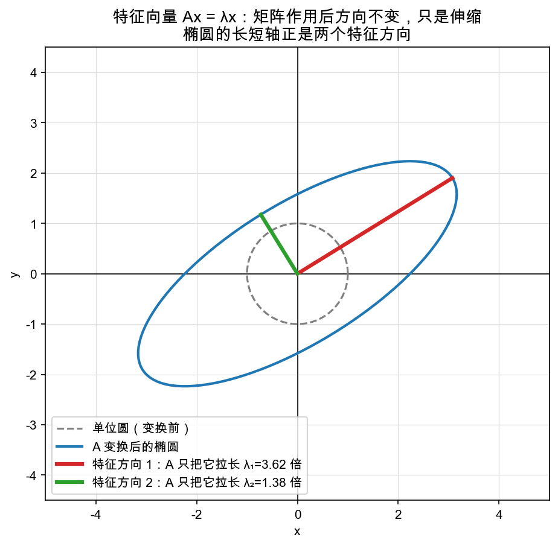

# Day 4：特征值与特征向量——Ax = λx：不被改变方向的向量

> 本章你将：
> - 认识一个全新的、专门问矩阵"自己"的问题：**有没有哪个向量，被 A 作用后方向不变，只是被拉长一点点？**
> - 掌握两个词的精确含义：**特征向量**（那个方向不变的向量）和**特征值**（它被拉长的倍数 λ）；
> - 用"主轴""木纹方向"的直觉，看懂那张单位圆被压成椭圆的图；
> - 知道它为什么叫"特征/本征"，并给明天要写的幂迭代法埋好引子。

---

## 4.1 换个问法：矩阵会"偏爱"某些方向吗？

前六周，我们一直在问"矩阵对向量**做了什么**"：把点搬到哪、把空间怎么拉伸旋转。这些问题的主角是**被操作的向量**。

今天，我们把主角换成**矩阵自己**，问一个稍微自恋一点的问题：

> **有没有一支向量 v，被 A 作用之后，方向完全没变，只是被拉长（或压短）了一点？**

换句话说，`A v` 不是把 v 拐去别的方向，而是**还在原来那根直线上**，只是长度变成了原来的 λ 倍：

```
A v = λ v
```

有些矩阵，确实藏着这样的特殊向量。它们就是矩阵的**"指纹"**——不管你从哪个坐标系看它、把它"拍"成哪张照片（Week 4 的相似矩阵），这些方向和倍数都不会变。这正是第 4 周结尾埋下的钩子："相似矩阵有相同的本征值"。

> 💡 **你可能会问：一般向量被 A 作用，方向不是都会变吗？**
>
> 对，绝大多数向量都会被打偏。但角落里可能有**极少数**向量，A 作用在它身上"顺着毛捋"，只是伸缩——它就是我们要找的宝贝。打个比方：一块木板用劲一拉，会朝某个方向变形；但木板上顺着**木纹**的方向，怎么拉都还是那个方向，只是木纹被拉长了。特征向量，就是矩阵的"木纹方向"。

---

## 4.2 定义：特征向量和特征值

正式说（别紧张，就一句话）：

> 对一个方阵 A，如果存在**非零**向量 v 和一个**数** λ，满足
>
> ```
> A v = λ v
> ```
>
> 那么 v 就叫做 A 的一个**特征向量（eigenvector）**，λ 是它对应的**特征值（eigenvalue）**。

拆开看：

- **特征向量 v**：被 A 作用后**方向不变**的那支向量（可能被拉长 λ 倍；λ 是负数时还会反向，但仍在原直线上）；
- **特征值 λ**：这个方向上的向量被**拉伸的倍数**。λ > 1 拉伸、0 < λ < 1 压短、λ < 0 反向伸缩。

读 `A v = λ v` 可以这么记：**左边是"A 对 v 动手术"，右边是"干脆只乘个 λ"**。当这俩相等，说明 A 对这个 v 而言，简单到只等于"乘一个数"。

> ⚠️ **易踩坑：v 必须是**非零 **向量。** 零向量 0 永远满足 `A·0 = λ·0 = 0`（两边都等于 0），但它信息量为零，谁都能拿来充数。所以定义里专门排除零向量，只认"真正有长度、有方向"的那些 v。

---

## 4.3 一个能马上验算的例子

拿对角矩阵当开胃菜（它最简单）：

```
A = [ 2  0 ]
    [ 0  3 ]
```

- 试 `v = (1, 0)`：`A v = (2·1 + 0·0, 0·1 + 3·0) = (2, 0) = 2·(1, 0)`。方向没变（还在 x 轴上），长度变 2 倍 → **λ = 2，v = (1,0) 是特征向量**。
- 试 `v = (0, 1)`：`A v = (0, 3) = 3·(0,1)` → **λ = 3，v = (0,1) 是特征向量**。
- 试 `v = (1, 1)`：`A v = (2, 3)`，方向和 (1,1) 明显不一样了 → **(1,1) 不是特征向量**。

看：这个 A 的"木纹"就是 x 轴和 y 轴，对应的拉伸倍数分别是 2 和 3。明天你要写的幂迭代法，测试 `test_power_iteration_diagonal` 用的正是这个 A，验收标准就是"λ ≈ 3，v 几乎指向 y 轴"——因为 3 是最大特征值。

> 💡 **你可能会问：特征向量可以沿原方向任意拉长，那到底取多长？**
>
> 方向比长度重要。因为 `A v = λ v`，那 `A(2v) = 2Av = 2λv = λ(2v)`——**v 的任意倍数也还是特征向量**（对应同一个 λ）。所以大家通常约定"取长度 1 的那个"（归一化，明天写代码就会用到）。记住：**特征值 λ 是唯一的，特征向量 v 有一整条线**（差一个非零倍数）。

---

## 4.4 图像：那个椭圆，就是"主轴"被看光的证据

看图——这不是随便画的，它是 Day 5 你写代码要验算的那个矩阵 `A = [[3,1],[1,2]]`：



- 灰色虚线是**单位圆**（变换前的一圈点）；
- 蓝线椭圆是**A 作用后**这圈点被拉成的形状——一个圆被压扁、拉长成了椭圆；
- 红色和绿色两条粗线，是椭圆的**长轴和短轴**——它们正是 A 的两个**特征方向**。

妙就妙在这里：**单位圆上无数个点，绝大多数都被 A 拐到了新方向，唯独落在长轴上的点，方向没变，只是被拉长了 λ1 ≈ 3.618 倍；落在短轴上的点，方向也没变，只是被拉长 λ2 ≈ 1.382 倍。**

所以：

> 📌 **划重点：特征向量 = 矩阵的"主轴"（principal axes）。** 把单位圆（球）拿去让 A 变，变出来的椭圆（椭球）的**长轴、短轴**，就是 A 的特征方向；它们的"半径"（拉伸倍数）就是特征值。知道了一个矩阵的主轴和拉伸倍数，你就抓住了它所有变换行为的"骨架"。

---

## 4.5 为什么叫"特征/本征"？

"特征值"的"特征"，英文是 **eigen**，是德语词，本义是 **"自己的、固有的（proper / own）"**。

所以"特征向量"其实更贴切的译法是"**本征向量**"（`eigenvector` = 矩阵"自己固有的"向量）——强调这些方向是**矩阵自己长出来的**，不是我们外加的。就像一个人的指纹、一棵树的年轮纹路：它属于那个对象本身，换个环境、换个角度拍，还是它。

这也解释了 4.1 说的那件事：既然特征值属于矩阵"本身"，Week 4 的相似矩阵（同一个变换在不同坐标系下的"照片"）就该有**相同的特征值**——照片可以换，指纹不变。

> 📌 **AI 联系：** "矩阵自己的主轴/指纹"这个念头，正是后面主成分分析（PCA）和张量分解等一堆 AI 技术的起点。你在 Week 4 Day 6 见过 PCA 的一句话直觉（"找一根数据最分散的新坐标轴"）；现在可以说得更准一句：**PCA 找的那根轴，就是数据协方差矩阵的一个特征向量**。到 Day 6 我们还会再点一次这个联系。

---

## 4.6 留给明天的问题：怎么把这些"主轴"找出来？

现在你知道了**定义**：`A v = λ v`。但给定一个具体的 A，怎么把它的特征向量和特征值**算出来**？

教科书的方法（求行列式 `det(A − λI) = 0` 的根，再解方程组）又繁又不适合交给直觉，本课直接跳过。我们要学的是工程上最常用、也最有"动手感"的一个办法——**幂迭代法（power iteration）**。

先剧透一句它的核心直觉，明天写代码时你会恍然大悟：

> **随便拿一支向量，反复用 A 去"拽"它。** 拽一次，它对最大特征方向的分量增长最快；拽很多次，整支向量就会"自动转向"（绝对值）最大的那个特征方向。

一支乱指的箭头，被同一个矩阵反复拉扯，最后稳稳指向它的最长主轴——这个过程既优雅，又能让明天的你用 `A v ≈ λ v` 亲自验收。

---

## 4.7 小结

- ✅ 特征向量 v：满足 `A v = λ v` 的非零向量，A 作用后**方向不变**，只伸缩。
- ✅ 特征值 λ：这个方向被**拉伸的倍数**（可为负）。
- ✅ 直觉：特征向量 = 矩阵的"主轴"（木纹方向）；单位圆被 A 变成椭圆，椭圆长短轴就是特征方向，轴长 = 特征值。
- ✅ 名字：eigen = 德文"自己的/固有的"，强调这些方向是矩阵**本身**的属性，换坐标系（相似矩阵）不变。
- ✅ 预告：明天用**幂迭代法**——反复用 A 拽向量，让它自动转向最大特征方向。

---

## 动手练习

1. **验算**：对 `A = [[2,0],[0,3]]`，用纸笔算 `A v`，确认 `(1,0)`、`(0,1)` 是特征向量（λ 分别 2、3），而 `(1,1)` 不是。
2. **想一想**：`λ = 1` 意味着什么？`λ = 0` 又意味着什么？（提示：前者"纹丝不动"，后者"被压扁"。）
3. **找找看**：`I = [[1,0],[0,1]]`（单位矩阵）有哪些特征向量？特征值都是几？

## 参考答案

本章没有要写的代码，答案明天见 `reference/eigen.py`。第 2 题：λ=1 时 `Av = v`，这个方向完全不动；λ=0 时 `Av = 0`，整个方向被压扁成零向量。第 3 题：单位矩阵对**任何**向量都满足 `I v = v`，所以所有非零向量都是特征向量，特征值全是 1。

---

👉 **[Day 5：代码实战——幂迭代法与特征方向可视化](./05-Day5-代码实战-幂迭代法与特征方向.md)**
