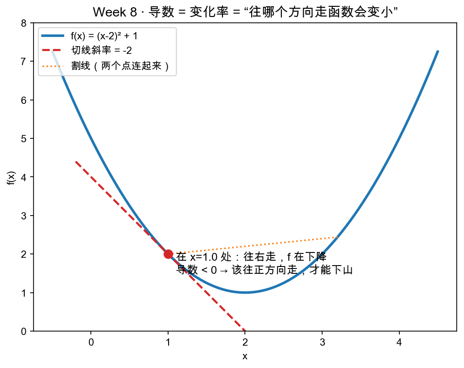

# Day 1：导数扫盲——斜率、变化率与"下山的方向"

> 本章你将：
> 1. 把初中就熟的"直线斜率"，推广成曲线在一点上的"切线斜率"——这就是**导数**；
> 2. 理解导数的含义不是玄学，而是一句大白话：**往这个方向走，函数会变大还是变小、变多快**；
> 3. 学会一个不求任何公式、直接"捅一捅"函数就测出变化率的招——**数值梯度**，并亲手实现 `grad.numerical_gradient`；
> 4. 记住本周最重要的一句话：**梯度指向"上升最快"的方向，反着走就下山。**

---

## 1.1 为什么快到结业了，还要回来补数学

这一周的目标，是让神经网络**自己学会**——而"学会"翻译成大白话就一句：**参数往哪个方向调，结果会变好？**

"哪个方向会变好"问的正是"变化率"：参数挪一点点，损失掉多少。7 周来你一直在做"给定输入算出输出"的**算术**，但从没碰过"输出怎么随输入**变**"的问题。今天这一章，就把这件事一次讲透——而且好消息是，你其实**初中就会了**，只是当时不叫"导数"这个名字。

---

## 1.2 初中就会的：直线的斜率

回忆初中的一次函数 `y = 3x + 1`。它的图像是一条直线，而直线有个特征叫**斜率**——"x 每往前走 1 格，y 往上走几格"。

```
斜率 3 的意思：x 从 0 走到 1（+1），y 从 1 走到 4（+3）
即：y 的变化 = 3 × x 的变化
```

斜率回答的正是今天的主角问题——**变化率**：输入变一点，输出变多少。斜率 = 3，就是"变化率 = 3"。如果斜率是 -2，那 x 每 +1，y 就 -2，也就是**往下走**。

用两个点就能算斜率，这是初中的老本行：

```
斜率 = 竖着的变化 ÷ 横着的变化 = (y₂ - y₁) ÷ (x₂ - x₁)
```

这条叫"两点式"。它好使，但有个前提：**得是一条直线**。直线的斜率处处一样，随便取哪两个点，算出来都是同一个 3。

---

## 1.3 曲线怎么办：切线就是"局部的直线"

但神经网络里的损失函数是一条**弯的**曲线（比如 `f(x) = (x-2)² + 1`，长成一个"碗"）。弯线没有"处处一样"的斜率——山顶上陡，谷底平。怎么办？

办法你想也想得到：**放大看**。一条再弯的曲线，放到足够近，看起来就跟直线没两样（就像地球那么大，脚下那块地却是平的）。所以虽然在"整条曲线"上没有统一斜率，但**在某个点附近**，我们是能谈斜率的：找到那条"当地最贴合曲线"的直线，它的斜率就是曲线**在这一点的斜率**。

这条"当地最贴合"的直线，初中学几何时应该听过它的名字——**切线**。切线在 `x = 1` 那一点的斜率，就是 `f(x)` 在 `x = 1` 处的**导数**。



看上图：蓝线是碗形的 `f(x) = (x-2)² + 1`，红虚线是它在 `x = 1` 那一点（红点）的切线，切线的斜率是 **-2**。所谓"在 x=1 处的导数"，就这一个数：**-2**。

> 📌 **划重点：导数 = 曲线在某一点的切线的斜率 = 那一点的"瞬时变化率"。** 说人话：导数告诉你，站在这一点，往右挪一小步，函数会往上（正）还是往下（负）走、走多快。

---

## 1.4 导数负的意味着什么：可以下山！

把上图红点的含义读一遍，你会得到一个对训练来说至关重要的发现：

- 在 `x = 1` 处，导数是 **-2**，是**负**的；
- 导数负 = 切线往下斜 = **x 增大，函数值在减小**；
- 也就是说：**站在 x=1 这个点，只要往正方向（往右）走，f 就会下降**——这正是"下山"该走的方向！

反过来想：`f(x) = (x-2)² + 1` 的谷底在 `x = 2`。你现在在 x=1（谷底的左边），导数 -2 负着，等于在喊你"**往右走！往右走函数就变小！**"这和图里注释写的一模一样：*导数 < 0 → 该往正方向走，才能下山*。

如果站到谷底右边（比如 x=3），导数是 +2，正的，那右边是"上坡"，该往左（负方向）走才下山了。

> 💡 **你可能会问：导数到底是"往哪个方向函数变小"，还是"往哪个方向函数变大"？**
>
> 严格说，**导数的正负号**就藏着答案：导数为正 → x 增大则函数增大（上坡）；导数为负 → x 增大则函数减小（下坡）。所以它既告诉你方向，也告诉你坡度。今天结尾还要把它升级成更有用的形态——"梯度"。

---

## 1.5 但你不会求导公式，怎么办？——捅一捅它

到这里有个现实问题：求上面那根切线的斜率 -2，正经微积分是用"求导公式"算出来的（`(x-2)²+1` 求导得 `2(x-2)`，代 x=1 得 -2）。可读者画像说好了——**你没学过微积分，也不该逼你背公式**。

而且真实世界里还有个更要命的点：神经网络的函数有成千上万个参数，就算会求导公式，手推也得推到天荒地老。所以我们换一条**完全不求公式**的路——**用数值"捅一捅"**。

思路朴素到小学生都能懂：想知道"在某个点，y 随 x 怎么变"，就真的**把 x 左右各挪一点点**，看 y 变了多少，再除一下：

```
别人的走法（背公式）：   f'(x) = 2(x-2)            → 代 x=1 得 -2
我们的走法（捅一捅）：   先把 x 挪到 1+ε 和 1-ε，各算一次 f，
                     再用"单位变化"去逼近切线斜率
```

ε（读作 eps）是一个很小很小的数，比如 0.000001。这一招有个正式名字叫**中心差分**，它的公式长这样（别慌，和初中"两点式"几乎一模一样，只是两个点离得极近、对称地夹着目标点）：

```
在 x 处的（数值）导数 ≈ [ f(x + ε) - f(x - ε) ] ÷ (2ε)
```

为什么叫"中心差分"：两个采样点 x+ε 和 x-ε，**对称地**分列在 x 两侧（以 x 为中心），而不是"x 和 x+ε"这种一左一右不对称的取法。对称的取法能消掉一部分误差，结果更准——反正代码是一行的事，我们直接用最准的这一版。

用 `f(x) = (x-2)² + 1`、在 `x = 3` 亲自算一遍：

```
ε = 0.000001
f(3 + ε) = f(3.000001) = (1.000001)² + 1 ≈ 2.000002
f(3 - ε) = f(2.999999) = (0.999999)² + 1 ≈ 1.999998
导数 ≈ (2.000002 - 1.999998) ÷ (2×0.000001)
     = 0.000004 ÷ 0.000002
     = 2.0                                       ← 正好等于 2(x-2) 代 x=3 的精确答案！
```

零求导公式，纯靠"左右各捅一下、再看差多少"，答案就出来了，还精确得吓人。**这就是我们本周不求任何微积分、却能算梯度的全部秘密。**

> ⚠️ **易踩坑：ε 不是越小越好。**
>
> 理论上 ε 越小越准，但电脑算小数是有精度上限的（浮点误差）：ε 小到某个程度，`f(x+ε)` 和 `f(x-ε)` 的差会被舍入误差淹没，结果反而变差。经验值 `1e-6` 是个甜点区，够小到近似准、又没小到被浮点误差吃掉。这就是参考答案里默认 `eps=1e-6` 的原因。

---

## 1.6 从"一个数"到"一堆数"：梯度

上面只讨论了一个变元的函数（只有 x 一个输入）。但神经网络的损失函数有一堆参数（比如两个 w），我们想知道的是**每个参数各自往哪调**。

好消息：套路完全相同，只是**一个一个来**。想看 `f(x0, x1)` 关于 `x0` 的变化率，就把 `x0` 左右各捅一下（`x1` 保持不动），套同样的中心差分公式；再对 `x1` 如法炮制。把关于每个参数的"变化率"按顺序排成一列，这个向量就叫**梯度（gradient）**。

```
梯度 = [ f 关于 x0 的变化率,  f 关于 x1 的变化率,  ... ]
```

用 `f = x0² + 3·x1²` 最直观（这正是测试 `test_gradient_of_quadratic` 用的函数）。它关于 x0 的导数理论上 = `2·x0`，关于 x1 的导数 = `6·x1`。在点 `(2, 1)` 处，梯度应该是 `(4, 6)`。我们用数值法"捅"一下验证：

- 关于 x0：固定 x1=1，把 x0 在 2 附近左右各捅 ε，得到变化率 ≈ **4.0** ✓
- 关于 x1：固定 x0=2，把 x1 在 1 附近左右各捅 ε，得到变化率 ≈ **6.0** ✓

于是梯度 = `(4, 6)`——和理论值完全对得上。你马上要写的 `numerical_gradient` 干的就是这件事：**对输入的每一个分量，逐个套一遍中心差分，最后把得到的一串变化率装进列表返回。**

---

## 1.7 实现 numerical_gradient

打开你的战场 `matrixlab/grad.py`，我们要实现：

```python
def numerical_gradient(f, x: list, eps: float = 1e-6) -> list:
    """用中心差分近似 f 在 x 处的梯度。"""
    raise NotImplementedError("TODO: Week 8 Day 1 —— 数值梯度")
```

思路就三步（对照 1.6）：

1. 结果列表长度 = 输入 x 的长度，先全填 0；
2. 对每个下标 `i`：复制出 `xp`（把第 i 个分量 +ε）和 `xm`（把第 i 个分量 -ε）；
3. 第 i 个梯度 = `(f(xp) - f(xm)) / (2*eps)`，存回结果。

注意复制要用 `x[:]`（切片），**不能**直接 `xp = x` 再改 `xp[i]`——因为 Python 的列表是"引用"，`xp = x` 只是给同一个列表起了个新名字，一改 `xp` 就顺手把 `x` 也改了，那左右两个采样点就全乱了。切片 `x[:]` 才是真的"另起一份拷贝"。

写完后，回仓库根目录跑：

```bash
pytest tests -k w8_grad -q
```

目标输出：

```text
....                                                                     [100%]
4 passed, 87 deselected in 0.10s
```

这 4 条测试分别考：二次函数梯度 `(4,6)`（`test_gradient_of_quadratic`）、乘积函数梯度 `(3,2)`（`test_gradient_of_product`）、谷底梯度为零（`test_gradient_zero_at_bottom`）、以及"梯度符号指向下山方向"（`test_gradient_sign_points_downhill`）。全绿，今天的武器就造好了。

---

## 1.8 梯度告诉你往哪走，反着走就是下山

现在把今天攒的货串成一句话，它是接下来六天的总开关：

> 📌 **划重点：梯度是一个向量，它指向"函数上升最快"的方向；想下降，就朝梯度的反方向走。**

- 如果损失 = 一座山，你现在站在山坡某处，那**梯度就是"最陡的上坡方向"**；
- 我们想让损失**越小越好**（越错越少），所以该走的方向是**梯度的反方向**——这就是"下山"；
- 谷底（最小值）处，无论往哪边走损失都会升，所以那里的梯度是 0（测试 `test_gradient_zero_at_bottom` 正好验证了这一点：`f=x0²+x1²` 在原点梯度 = (0,0)）。

Day 5 你会把"朝梯度反方向挪一步"写成一行代码 `参数 -= 学习率 × 梯度`；而今天你造的 `numerical_gradient`，在整个 AI 圈还有个更值钱的用途——**它是一把"验算尺"**：反向传播（Day 4）那些公式动不动就写错，但只要拿数值梯度在随机点上一对，对得上就是对的。这把尺子你今天造出来，Day 4 立刻上场。

> 📌 **AI 联系：** 所有神经网络——从你下周手写的两层网络，到 GPT 那种千亿参数巨兽——"学习"的引擎都只有这一句话：**算出损失相对每个参数的梯度，然后每个参数朝梯度的反方向挪一小步。** 参数越多，"捅一捅"越慢（这也是为什么真训练不用数值梯度而用 Day 4 的反向传播），但**方向的意义一模一样**。你今天理解的"斜率 = 变化率 = 下山方向"，就是深度学习心脏里跳动的那个东西。

---

## 动手练习

1. **必做**：实现 `matrixlab/grad.py` 的 `numerical_gradient`（照 1.7 思路），跑 `pytest tests -k w8_grad -q` 到 `4 passed`。
2. **手算**：对 `f(x) = (x-5)²`，用中心差分公式在 `x=3` 处"捅一捅"，算出近似导数，看符号，回答"该往正方向还是负方向走才能让 f 变小"。（提示：这正是测试 `test_gradient_sign_points_downhill` 问的，答案 -4。）
3. **思考**：`f=x0²+x1²` 在 `(0,0)` 处梯度是 `(0,0)`。这意味着站在原地往任何方向挪，函数会怎样？——不急着算，凭"谷底"的画面想。

## 参考答案

1. 见 `reference/grad.py` 的 `numerical_gradient`，就是 1.7 的三步（别忘了用切片 `x[:]` 拷贝）。
2. 手算：f(2.9)-f(3.1) = (-2.1)²-(-1.9)² = 4.41-3.61 = 0.8，÷(2×0.1)= 4，加个 ε 换向的负号，导数为 -4。符号为负，说明该往**正**方向（x 增大）走，f 才下降——而 f=(x-5)² 的谷底确实在 x=5，在 3 的右边，方向对上了。
3. 谷底处往哪走都是上坡，所以梯度为 0——"已经到底了，没有更好的方向可走"的信号。

> 卡住 20 分钟以上再看 `reference/grad.py`，重点盯你拷贝列表那一步有没有用 `[:]`。

---

## 1.9 本章小结

- ✅ 导数 = 曲线某一点的**切线斜率** = 那一点的**瞬时变化率**（初中"直线斜率"的推广）。
- ✅ 导数为负 → x 增大则函数下降（下坡）；为正 → 上坡。**符号会指路。**
- ✅ 不会求导公式也能算：**数值梯度 / 中心差分**——左右各捅 ε，用 `(f(x+ε)-f(x-ε))/(2ε)` 逼近，零公式、零微积分。
- ✅ 梯度 = 把"每个参数各自的变化率"排成一列的向量，指向**上升最快**方向。
- ✅ 本周围绕它转的总开关：**反着梯度走，就是下山**；谷底处梯度为 0。

明天，我们先解决"下山要下的那座山长什么样"——把"错得多离谱"用一个数（损失函数）精准地量出来。

👉 **[Day 2：损失函数——用数衡量"错得多离谱"](./02-Day2-损失函数-用数衡量错得多离谱.md)**
