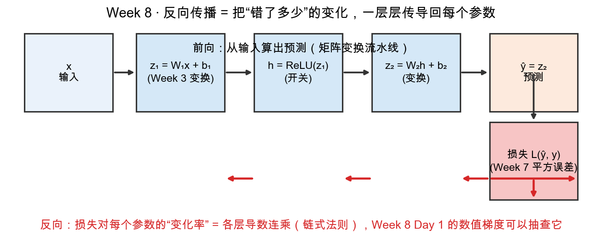

# Day 3：前向传播——复合变换的流水线

> 本章你将：
> 1. 把"一层神经网络"看成一格流水线，四格串起来就是**前向传播**；
> 2. 确认每一个 $Wx + b$ 都是 Week 3 的矩阵变换 + 一次平移（`X @ W1` 逐行就是它）；
> 3. 搞懂 ReLU 这个"开关"：负数归零、正数放行；
> 4. 用一张形状追踪表，把 $N\times2 \to N\times4 \to N\times1$ 每一步的尺寸变化盯清楚，并亲手实现 `relu`、`TwoLayerNet.__init__`、`forward`。

---

## 3.1 网络 = 工厂流水线，每天一格

昨天我把损失比作"一座山"，参数是山上的位置，训练是下山。可这座山是怎么"长"出来的？——先得知道网络**怎么从输入算出预测**。这一正向的计算过程，叫**前向传播（forward）**。

把网络想象成一条 4 站的流水线，原料（输入）从左侧流进，一路加工，右侧流出成品（预测）：

```
输入 x ──► [ 站①：z₁ = W₁x + b₁ ] ──► [ 站②：h = ReLU(z₁) ]
            ──► [ 站③：z₂ = W₂h + b₂ ] ──► 预测 ŷ = z₂ ──► [ 站④：损失 L(ŷ, y) ]
```

今天要把这条流水线的前三站讲透（第四站昨天 `loss` 已经搭好连线）。你会发现：**每一站都不是新东西，全是前 7 周的老熟人换个马甲。**

---

## 3.2 站①：$W_1x + b_1$——Week 3 的矩阵变换 + 平移

第一站写的是 $z_1 = W_1 x + b_1$。拆开看：

- $W_1 x$：**矩阵乘向量**。这就是 Week 3 全程在做的事——矩阵 $W_1$ 把输入向量 $x$ 变换（拉伸/旋转/剪切）到另一个位置。Week 3 Day 5 说过"一层网络就是一次变换"，现在它就是字面意义的兑现。
- $+ b_1$：**平移**。还记得 Week 3 Day 2 埋的伏笔吗——"平移不是线性变换，单独一个矩阵干不了"。所以要在变换之后**加一个平移量 $b$**（叫偏置 bias），把变换后的结果整体搬一下。

一句话：$W_1 x + b_1$ = **先做一次线性变换，再平移**。这是所有神经网络层的标准动作，第一次见它你可能觉得陌生，多看两眼就该和 Week 3 的 `apply_to_points` 对上号。

在 numpy 里，一整批输入（N 个样本、每个 2 维，形状 $N\times2$）一起算时写作 `X @ W1 + b1`，其中：

- `@` 是 numpy 的**矩阵乘法**运算符（Week 3 手写的 `matmul` 上线了）；
- `X @ W1` 会**自动逐行**对每个样本做一次"矩阵乘向量"——第 1 行样本变换到第 1 行结果，第 2 行到第 2 行……这正是 Week 3 说的"`X@W1` 逐行对应"；
- `+ b1` 让长度为 n_hidden 的偏置向量**广播**加到每一行上（numpy 自动把 b1 复制 N 份）。

---

## 3.3 站②：ReLU——一个"开关"

$W_1 x + b_1$ 只会做直线运动（线性 + 平移），光靠它，无论叠多少层，网络整体还是个"直线"。要弯折、要能力，得有个"不按直线出牌"的部件插进来——这就是**激活函数**。我们本周用最简单也最常用的一个：**ReLU**。

ReLU 的规则一条就能说完：

$$
\text{ReLU}(z) = z \text{ 当 } z > 0;\ = 0 \text{ 当 } z \le 0
$$

**负数归零，正数放行。** 像一扇单向门：正向的信号原样通过，负向的一律被压成 0。零处的行为（$z=0$ 时取 0）是约定俗成，不影响大局。

用 numpy 一行实现：

```python
def relu(z: np.ndarray) -> np.ndarray:
    return np.maximum(0.0, z)
```

`np.maximum(0.0, z)` 是**逐元素取大**：把数组 z 的每个数和 0.0 比，取大的那个。所以负数 $\to 0$，正数 $\to$ 自身，正好是 ReLU。（`np.maximum` 是"逐元素取 max"，别和"整个数组求最大"的 `np.max` 搞混——前者两个数组对位比，后者返回一个数。）

为什么要这个"开关"？直觉版答案（今天先记结论，Day 6 用 XOR 给你看实锤）：**ReLU 能把一条直线"折断"**。一个 $Wx+b$ 只能画直线，但多个"变换 $\to$ ReLU $\to$ 变换"叠起来，就能拼出折线，折线能描出更复杂的形状。它是网络从"只会画直线"进化到"能画任意折线"的关键一跃。

---

## 3.4 站③：再变换一次 $z_2 = W_2h + b_2$，得到预测

第三站和第一站动作一样，只是换了一套参数：把 ReLU 输出的 h，再乘一个 $W_2$、加一个 $b_2$，得到 $z_2$——它就是网络的**预测 $\hat{y}$**（本周的输出层只有一个神经元，所以 $W_2$ 是 $n\_hidden\times1$，把 n_hidden 维的 h 收成 1 维的预测值）。

$$
\hat{y} = z_2 = W_2 h + b_2
$$

于是整条流水线从"形状"的角度看，是一路"维度变形"：输入 2 维 $\to$ 隐藏层（第一站把它扩到 n_hidden 维、第二站 ReLU 不改形状）$\to$ 输出 1 维。

---

## 3.5 形状追踪表：数字每一步长什么样

numpy 用户最容易栽的地方就是**形状（shape）**——"哪一维是样本、哪一维是特征、矩阵怎么摆"。所以我们把本周网络的每一站形状都摊在桌面上，务必一条条看过去。设一次喂 N 个样本（N=4 时就是 XOR 的四个点），每个样本 2 维，隐藏层取 4 个神经元：

| 步骤 | 式子 | 形状 | 说明 |
|---|---|---|---|
| 输入 | `X` | $N \times 2$ | N 个样本排成 N 行，每行 2 个数 |
| 站① 变换 | `X @ W1` | $N \times 4$ | W1 是 $2\times4$，把每行 2 维扩成 4 维 |
| 站① 平移 | `+ b1` | $N \times 4$ | b1 长 4，广播加到每行 |
| 站① 得 z1 | `Z1` | $N \times 4$ | 线性变换 + 平移的结果 |
| 站② ReLU | `H = relu(Z1)` | $N \times 4$ | 逐元素，负的归零，形状不变 |
| 站③ 变换 | `H @ W2` | $N \times 1$ | W2 是 $4\times1$，把 4 维收成 1 维 |
| 站③ 平移 | `+ b2` | $N \times 1$ | b2 长 1，广播 |
| 输出 | `out` | $N \times 1$ | 每个样本 1 个预测值 |

一串看下来就一句话：**$N\times2$ 进，$N\times4$ 过一遍隐藏层，$N\times1$ 出。** 中间的"$2\to4\to1$"全由矩阵的尺寸（`W1` 的列数、`W2` 的行数）决定，而你写 `@` 时 numpy 会替你检查：矩阵尺寸对不上，直接报"shape mismatch"，等于免费帮你抓 bug。

> ⚠️ **易踩坑：矩阵乘法 `@` 要求"前一矩阵的列数 = 后一矩阵的行数"。**
>
> `X(N×2) @ W1(2×4)` 的 2 对 2，对上了，结果 $N\times4$；`H(N×4) @ W2(4×1)` 的 4 对 4，结果 $N\times1$。写 `W1`、`W2` 尺寸时心里默念这条规则，就不会写出 `X @ W1.T` 之类一跑就炸的形状错配。

---

## 3.6 看看那张链式法则的全景图（今天只读前向部分）

本周有一张五格流程图，把整个"前向 + 反向"画在一张纸上。今天你在 Day 3，正好**先读它的上半部分**（Day 4 再回来读红字的下半部分）：



顺着黑色箭头从左往右看五个格子：$x$ 输入 $\to$ $z_1 = W_1 x + b_1$（Week 3 变换） $\to$ $h = \text{ReLU}(z_1)$（开关） $\to$ $z_2 = W_2 h + b_2$（变换） $\to$ $\hat{y} = z_2$（预测），再往下掉进 $损失\ L(\hat{y}, y)$（Week 7 平方误差）。这就是你今天要刻进脑子里的前向流水线，和 3.1 那条完全对应。

图里还画了**红色箭头沿相反方向**从损失往回爬——那是 Day 4 的主角（反向传播），今天先别管，只需知道"明天我们会从损失那头逆着走回来，算出每个参数该往哪调"。整张图 = 你的网络完整的一生：黑箭头算预测，红箭头学参数。

---

## 3.7 实现 relu、__init__、forward

轮到你了，`matrixlab/nn.py` 三处待填。

### 3.7.1 relu

```python
def relu(z: np.ndarray) -> np.ndarray:
    """ReLU 激活函数：负数归零，正数放行。"""
    raise NotImplementedError("TODO: Week 8 Day 3 —— ReLU")
```

就一行 `return np.maximum(0.0, z)`（3.3 节）。

### 3.7.2 参数初始化 __init__

```python
def __init__(self, n_in: int, n_hidden: int, seed: int = 0):
    raise NotImplementedError("TODO: Week 8 Day 3 —— 参数初始化")
```

四件事，照参考实现：

```python
rng = np.random.default_rng(seed)          # 带种子的随机数发生器（seed 保证可复现）
self.W1 = rng.normal(0.0, 1.0, size=(n_in, n_hidden))   # 符合 N(0,1) 的随机矩阵
self.b1 = np.zeros(n_hidden)               # 偏置先全 0
self.W2 = rng.normal(0.0, 1.0, size=(n_hidden, 1))
self.b2 = np.zeros(1)
```

三行解释：

- `np.random.default_rng(seed)`：造一个"随机数发生器"。传相同的 `seed` 会得到完全相同的随机序列——所以"seed=0 训练出来的网络"每次跑都一个样，测试才能稳定断言（Day 6 你会反复踩到这个"可复现"的重要性）。
- `rng.normal(0.0, 1.0, size=...)`：从"均值 0、标准差 1"的正态分布里抽一组随机数，填成指定形状的矩阵/数组。`W1` 是 $n\_in\times n\_hidden$，`W2` 是 $n\_hidden\times1$。
- `np.zeros(n)`：造一个全 0 的数组。偏置 `b` 初始化为 0，是标准做法（平移量先不起任何作用，让第一个变换从"纯线性"开始）。

为什么 `W` 要随机、`b` 要 0？一句话：**W 随机是为了让各个变换一开始"方向不同"**（若全是 0 或全一样，网络就成了摆设）；b 起手为 0 是让它先安静待着。细节 Day 6 体会，今天照抄即可。

### 3.7.3 前向 forward

```python
def forward(self, X: np.ndarray) -> np.ndarray:
    """前向传播：X → ReLU(X@W1+b1) → @W2+b2。"""
    raise NotImplementedError("TODO: Week 8 Day 3 —— 前向传播")
```

对照 3.5 的形状表，四行：

```python
self.Z1 = X @ self.W1 + self.b1   # 站①：变换 + 平移 → (N, n_hidden)
self.H = relu(self.Z1)            # 站②：ReLU 开关 → (N, n_hidden)
self.out = self.H @ self.W2 + self.b2   # 站③：再变换 + 平移 → (N, 1)
return self.out
```

注意这里把中间量 `Z1`、`H`、`out` 都**存到了 self 上**（`self.Z1`、`self.H`）。为什么？——因为 Day 4 的反向传播要用到它们（尤其 `Z1` 的正负号决定 ReLU 的"开关"状态、`H` 是传导梯度的中间信使）。**前向存中间量，反向好传梯度**，这是手写网络的第一个工程直觉。

写完跑（现在 nn 的三颗该亮起来了，`relu`、`forward_shapes` 会过）：

```bash
pytest tests -k w8_nn -q
```

目标里，`test_relu`、`test_forward_shapes` 该变绿（`test_forward_shapes` 断言 `out` 形状 (4,1)、`H` 形状 (4,3)——注意这条用 n_hidden=3，是为了让形状断言更通用）。其余（mse 已绿，backward/training 还在红）是后面几天的活，别慌。

---

## 动手练习

1. **必做**：实现 `matrixlab/nn.py` 的 `relu`、`TwoLayerNet.__init__`、`forward`（照 3.7），跑 `pytest tests -k w8_nn -q`，确认 `test_relu`、`test_forward_shapes` 转绿。
2. **形状心算**：不跑代码，说出 `n_in=2, n_hidden=5` 时，喂 `X`(N=10)，`Z1`、`H`、`out` 的形状各是什么；`W1`、`W2` 的形状是什么。
3. **手算 ReLU**：给 `z = [-3, -0.1, 0, 2.5]` 逐元素过 ReLU，写下结果（就是 `test_relu` 的断言值）。

## 参考答案

1. 见 `reference/nn.py` 的 `relu`、`__init__`、`forward`，正是 3.7 的几行。**卡住 20 分钟再看**，重点核对 `W1`/`W2` 的形状 `(n_in, n_hidden)` 和 `(n_hidden, 1)`。
2. `W1`: $2\times5$，`W2`: $5\times1$；`Z1`/`H`: $10\times5$，`out`: $10\times1$。
3. `[0.0, 0.0, 0.0, 2.5]`。

---

## 3.8 本章小结

- ✅ 前向传播 = 一条 4 站流水线：$W_1x+b_1 \to \text{ReLU} \to W_2h+b_2 \to \text{损失}$。
- ✅ `Wx+b` = Week 3 矩阵变换 + 平移；numpy 里 `X @ W1` 自动逐行、`+ b1` 自动广播。
- ✅ ReLU = 开关：负数归零、正数放行（`np.maximum(0.0, z)`）；它能"折断"直线，是网络能力来源。
- ✅ 形状追踪：$N\times2 \to N\times4 \to N\times1$；`@` 要求"前列数 = 后行数"。
- ✅ 前向把 `Z1/H/out` 存到 self，为明天的反向铺路。

明天，我们顺着红箭头**逆着流水线走回去**，看"损失对每个参数的变化率"是怎么被一层层算出来的——这就是反向传播。

👉 **[Day 4：反向传播直觉——变化如何传回去](./04-Day4-反向传播直觉-变化如何传回去.md)**
