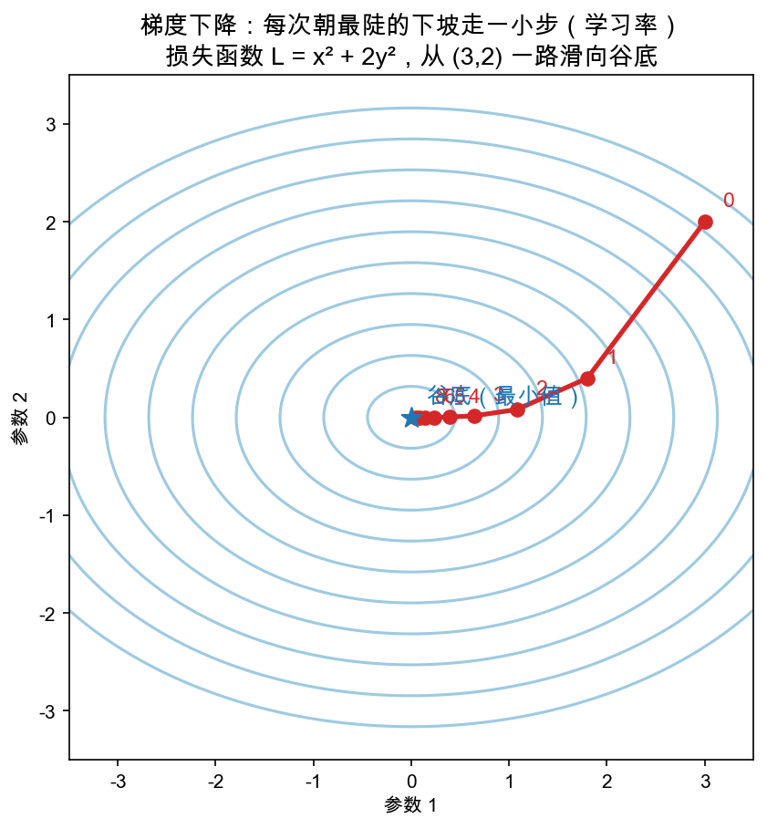

# Day 5：梯度下降——一步一步滑下山

> 本章你将：
> 1. 把三天的积累拧成一招：**参数 -= 学习率 × 梯度**，让损失真正开始下降；
> 2. 理解学习率的含义——"一步迈多大"，并亲眼看到迈太大、迈太小的后果；
> 3. 从"一次挪一步"（`sgd_step`）到"重复几千步"（`train`），实现训练循环；
> 4. 跑 `pytest tests -k "training"`，看到损失被一步步压下来。

---

## 5.1 我们攒齐了三块拼图，今天把它们拼上

回望一下这周：Day 1 学会了"梯度指向上升最快方向，反着走是下山"；Day 2 学会了"损失是参数的函数，损失越小网络越对"；Day 3/4 学会了"前向算预测、反向算每个参数的梯度"。三块拼图，今天拼成完整的一步——**梯度下降**。

一句话版本（也是你马上要写的那行代码）：

```
参数 = 参数 - 学习率 × 梯度
```

- `- 梯度`：朝**梯度的反方向**走（下山方向）；
- `× 学习率`：这一步**迈多大**，别一脚蹿过头。

用代码写（Day 4 的 `backward` 返回一个"参数名 → 梯度"的字典，正好拿来迭代）：

```python
for name, g in grads.items():
    setattr(self, name, getattr(self, name) - lr * g)
```

`getattr(self, name)` 取出当前参数（比如 `self.W2`），减去 `lr * g` 后，`setattr` 再写回去。一个循环，把 W1、b1、W2、b2 全更新一遍。`setattr`/`getattr` 就是"按名字读写对象的属性"，让你不用为四个参数写四行几乎一样的减号。

---

## 5.2 为什么是"反方向"而不是别的方向？

这里值得停一下，问一句常被忽略的问题：下山的方向那么多，凭什么偏偏反着梯度走？Day 1 给过结论（梯度 = 上升最快方向，反着走 = 下降最快方向），这里补一个平面上的直观画面，就是你复习 `w8d5_gd_path.png` 时要看到的东西：



这张图的主角是损失函数 `L = x² + 2y²`（两个参数 x、y，就像网络里的两个权重）。一圈圈蓝线是**等高线**——同一条线上的所有点，损失一样高（想象一座椭圆形的山，一圈圈等高线就是"海拔刻度"）。红点是起点 `(3, 2)`，蓝星是谷底 `(0, 0)`。

看红线走法：它不是横平竖直地靠过去，而是**每一步都垂直于等高线、直指谷底的方向切进去**——那条"垂直于等高线"的方向，正是梯度反方向（梯度永远垂直于等高线，指向海拔上升最快的方向）。红线 0→1→2→… 一路贴着最陡的下坡往下钻，最后落在谷底蓝星上。**这就是"反着梯度走"在几何上的样子。**

注意一个细节：这座山是"椭圆"的（x² 前面系数 1、y² 前面系数 2，y 方向更陡），所以红线走的是一条**弯**的弧，而不是直线——因为每一步都要重新问一遍"现在哪边最陡"。这正是梯度下降的精髓：**不一步到位，而是每走一步都重新判断方向。**

---

## 5.3 学习率：步子迈多大是一门学问

`lr`（learning rate，学习率）控制一步迈多远。它别看只是一个数，选得不对，下山之旅会翻车。看三种情况：

| 学习率 | 现象 | 类比 |
|---|---|---|
| 太小（如 0.0001） | 方向对，但每步只挪一丝，要百万步才到底 | 蚂蚁走路：稳，但慢到绝望 |
| 合适（如 0.1） | 每步都有进展，几千步稳稳到底 | 正常人下台阶：又快又稳 |
| 太大（如 10） | 一步直接跨过谷底，弹到对面的山坡上，来回横跳甚至越弹越高 | 一脚从楼梯上飞出去：快，但失控 |

`w8d5_gd_path.png` 图里的脚本注释写着 `lr=0.2`，从 `(3,2)` 出发，8 步就肉眼可见地贴到谷底了——这就是"合适"的样子。而到 Day 6 你会实打实看到：**lr=0.1 时 XOR 损失慢慢降；硬把 lr 调到 10，损失会震荡甚至爆炸**。学习率是训练时第一个要调的旋钮，也是唯一一个你今天就该有直觉的超参数。

> ⚠️ **易踩坑：梯度再对，学习率乱来也白搭。**
>
> "梯度下降"这个名字容易让人误以为"只要算对了梯度就万事大吉"。实际上**方向由梯度决定，步长由学习率决定，两者都得对**。初学最常翻的车就是手一抖把 lr 写成 10，看损失曲线原地起飞还以为是反向传播写错了。先查 lr，再查梯度。

---

## 5.4 实现 sgd_step 和 train

轮到 `matrixlab/nn.py` 最后两个方法。

### 5.4.1 sgd_step：走一步

```python
def sgd_step(self, X: np.ndarray, y: np.ndarray, lr: float) -> None:
    """一次梯度下降：参数 -= lr * 梯度。"""
    raise NotImplementedError("TODO: Week 8 Day 5 —— 梯度下降一步")
```

三步：

```python
self.forward(X)                # 先算预测（并缓存 Z1/H/out 给 backward 用）
grads = self.backward(X, y)    # 再算每个参数的梯度
for name, g in grads.items():  # 每个参数各挪一小步
    setattr(self, name, getattr(self, name) - lr * g)
```

注意顺序不能错：**必须先 forward 再 backward**（backward 依赖 forward 缓存的 `out/H/Z1`），然后才更新参数。

### 5.4.2 train：重复很多步

```python
def train(self, X: np.ndarray, y: np.ndarray, epochs: int, lr: float,
          verbose: bool = False) -> list:
    """训练循环：返回每轮的损失历史。"""
    raise NotImplementedError("TODO: Week 8 Day 5 —— 训练循环")
```

思路：把 `sgd_step` 放进一个循环，跑 `epochs` 遍，每遍记一次损失：

```python
history = []
for epoch in range(epochs):
    self.sgd_step(X, y, lr)              # 走一步
    loss = self.loss(X, y)               # 量一下现在多高（顺便再 forward 一次）
    history.append(loss)                 # 记进"行车记录仪"
    if verbose and epoch % max(1, epochs // 10) == 0:
        print(f"epoch {epoch}: loss = {loss:.6f}")   # 每隔 1/10 打印一次
return history
```

`history`（损失历史）就是 Day 2 埋过伏笔那条"损失曲线"的数据：`train` 结束返回它，你就能画图、就能断言"损失真的降了"。`verbose=True` 时每 `epochs//10` 步打印一行进度，让你肉眼看着损失往下掉。（`max(1, ...)` 只是防止 `epochs` 太小除成 0 报错的保护。）

---

## 5.5 验收：损失真的在下降

写完 `sgd_step` 和 `train`，跑：

```bash
pytest tests -k "training" -q
```

目标里 `test_training_reduces_loss` 转绿。这条测试干了件漂亮事：

```python
loss0 = net.loss(X, y)                   # 训练前的初始损失
history = net.train(X, y, epochs=2000, lr=0.1)   # 训练 2000 步
assert history[-1] < loss0               # ①损失比最开始小
assert history[-1] < 0.05                # ②一路降到了 0.05 以下
```

它用 XOR 数据（四个点，Day 6 认真讲），随机初始化一个 4 隐藏神经元的网络，训练 2000 步后断言：损失不仅比一开始小，而且**跌破 0.05**。这就是"学习"的实锤——那 2000 步里，`sgd_step` 被调了 2000 次，每次都用梯度把 4 组参数往谷底挪一点，累积成一次肉眼可见的"越来越会"。

再跑本周全家桶：

```bash
pytest tests -k w8 -q
```

此时除了 `test_xor_learned`（3000 步才达标，你的代码其实已经够绿了，可能只差步数）这条"四类全分对"的终极测试外，其余 10 条应全绿。`test_xor_learned` 是 Day 6 大结业验收的主角，明天揭晓为什么它要求 3000 步、LR 0.1、n_hidden=4。

> 📌 **AI 联系：** 你在 Day 5 写出的这套 `sgd_step → train`，就是世界上每一个神经网络训练循环的骨架。真正的 LLM 训练，只不过是把"XOR 的 4 个点"换成"全网网页文本"、把"4 个参数"换成"几千亿个参数"、把"2000 步"换成"几百万步"、把"lr=0.1"换成"带预热和衰减的学习率计划"——**循环的骨架一模一样。** 你今天亲手转动的这个循环，是通往 GPT 训练现场的那扇门的门轴。

---

## 动手练习

1. **必做**：实现 `matrixlab/nn.py` 的 `sgd_step`、`train`（照 5.4），依次跑 `pytest tests -k "training" -q` 和 `pytest tests -k w8 -q`。
2. **打印曲线**：在 `python3` 里跑 `train(..., verbose=True)`，观察打印出的损失（首轮约 0.36，来自 train 内部"先 sgd_step 再记损失"的顺序）一路降到 <0.05，体会"下山"的节奏。
3. **作死实验**：把 `train` 的 `lr` 从 0.1 改成 10（或 0.0001），再跑一次，看损失曲线是"原地起飞震荡"还是"龟速爬行"——验证 5.3 那张表。

## 参考答案

1. 见 `reference/nn.py` 的 `sgd_step`（forward→backward→循环更新）和 `train`（循环 + 记 history）。**卡住 20 分钟再看**，重点确认 `sgd_step` 里先 forward 后 backward 的顺序。
2. 参考输出形如 `epoch 0: loss = 0.3xxx` → `epoch 1800: loss = 0.0xxx`，单调下降。
3. lr=10 损失会震荡/爆炸（越界 NaN）；lr=0.0001 损失几乎纹丝不动。**学习率是第一个该调的超参数。**

---

## 5.6 本章小结

- ✅ 梯度下降的一步 = `参数 -= 学习率 × 梯度`：反方向走（下山）+ 控制步长。
- ✅ 几何 = 每步垂直于等高线、直指最陡下坡（`w8d5_gd_path.png` 的红线）。
- ✅ 学习率三步走：太小龟速、合适平滑、太大震荡甚至爆炸。
- ✅ `sgd_step`（走一步，先 forward 后 backward）+ `train`（循环记 history）拼成训练骨架。
- ✅ 验收：2000 步后，XOR 损失曲线从首轮约 0.36 一路跌破 0.05（未训练时是 2.3）。

明天，是这八周的最后一战：把这一切串起来，**从零训练出能分清 XOR 四类的两层网络**，并真正看懂它的"决策边界"长什么样。

👉 **[Day 6：大结业——numpy 训练两层网络（XOR 分类）](./06-Day6-大结业-numpy训练两层网络.md)**
