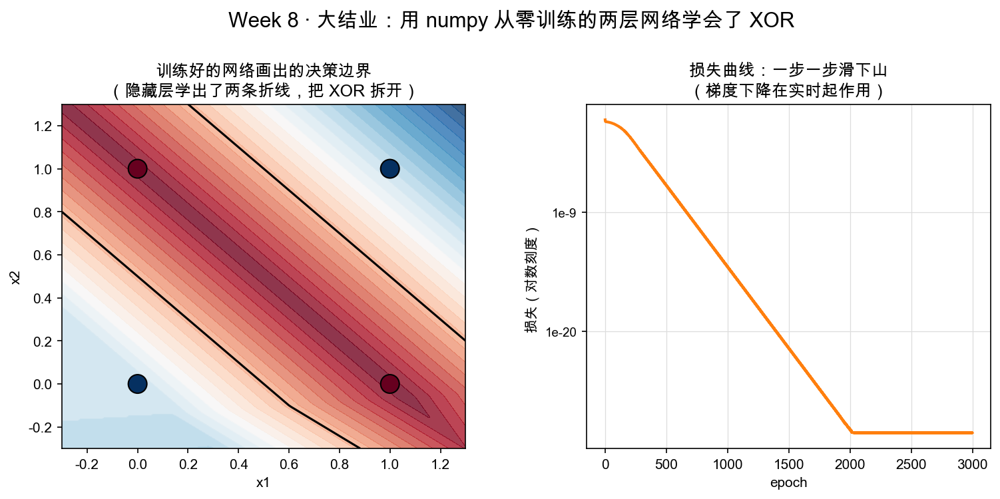

# Day 6：大结业——numpy 训练两层网络（XOR 分类）

> 本章你将：
> 1. 认识 XOR 这个"单层搞不定"的经典难题，搞懂为什么**需要一个隐藏层（能画折线）**；
> 2. 亲手实现 `xor_dataset`，并用你这一周写出的全部代码**完整训练**一个两层网络；
> 3. 看损失从首轮约 $0.36$ 一路跌到 $0.05$ 以下、四个点全部 $|\text{预测}-\text{标签}| < 0.5$，跑 `pytest tests -k xor` 验收；
> 4. 读懂决策边界图（左：边界；右：损失曲线），并（可选）和 PyTorch 同款代码对照一眼。

---

## 6.1 终极考题：XOR，一条直线搞不定的事

这八周，你从一根数轴走到了能训练网络的门槛。最后一战，选一个最能证明"网络真学到了东西"的题目——**XOR（异或）**。

先看这道题是什么。输入两个二进制数 x1、x2（各取 0 或 1），异或的规则是"**相同得 0，不同得 1**"：

| 输入 (x1, x2) | 异或输出 |
|---|---|
| (0, 0) | 0 |
| (0, 1) | 1 |
| (1, 0) | 1 |
| (1, 1) | 0 |

就这么四个点。把它画在平面上，就是图上四个大圆点：左下 (0,0) 和右上 (1,1) 是 0 类，左上 (0,1) 和右下 (1,0) 是 1 类。

问题来了：能不能**画一条直线**（Week 7 学的单层拟合就是一根直线），把 0 类和 1 类分开？——**不能。** 你拿尺子比划一下就懂：这四个点是正方形的四个角，0 类和 1 类**斜对角**地交错分布。无论那条直线怎么摆，最多把一类隔出去，另一类的两个点总有一个混进来。**一条直线必然分不开 XOR。**

> 📌 划重点：XOR 是"线性不可分"的鼻祖级例子——单层网络（本质就是一条 $Wx+b$ 直线）对它束手无策。这正是它成为"神经网络入门必考题"的原因：**逼着你引入隐藏层。**

---

## 6.2 隐藏层凭什么能行：直线折断成折线

回忆 Day 3 埋下的那句话——ReLU 能把直线"折断"。现在它兑现了。

单层只有一次 $Wx+b$，只能画一条直线。但两层（$W_1x+b_1 \to \text{ReLU} \to W_2\cdot+b_2$）的结构里，隐藏层的每个神经元都能贡献一条"折痕"：第一个 ReLU 在某个位置把空间折一下，第二个再折一下……多个 ReLU 叠加，就把一条直线折成了**折线**，折线能绕出足够复杂的形状，把斜对角的 XOR 两类**包起来分开**。Day 3 的 `w8d4_chain.png` 里那个 ReLU"开关"格子，就是这些"折痕"的来源。

于是本周网络诞生了：

- 输入层：2 个神经元（x1、x2）；
- 隐藏层：**4 个神经元**（4 条折痕，够把 XOR 的四角绕开）；
- 输出层：1 个神经元（回归一个 $0\sim1$ 之间的数，$>0.5$ 判 1 类、$<0.5$ 判 0 类）。

这套配置，就是接下来训练的全部家当，也正好和测试、和图脚本里的 `TwoLayerNet(n_in=2, n_hidden=4, seed=0)` 一字不差。

---

## 6.3 补上最后一块：xor_dataset

`matrixlab/nn.py` 里还剩最后一个函数没写：

```python
def xor_dataset():
    """XOR 玩具数据：四个点，异或结果作为标签。"""
    raise NotImplementedError("TODO: Week 8 Day 6 —— XOR 数据集")
```

就是把 6.1 那张表写成 numpy 数组：

```python
X = np.array([[0.0, 0.0], [0.0, 1.0], [1.0, 0.0], [1.0, 1.0]])
y = np.array([[0.0], [1.0], [1.0], [0.0]])
return X, y
```

`X` 是 $4\times2$（四个点、每个 2 维），`y` 是 $4\times1$（每个点的标签）。注意 `y` 写成 `[[0.0],[1.0],...]` 这种"一列"的形状，是为了和前向输出的 `(4,1)` 形状对齐，MSE 才能逐元素相减。`X` 的四行按 $(0,0)(0,1)(1,0)(1,1)$ 排列，`y` 按 0,1,1,0 排列——**一一对应**，别错位。

---

## 6.4 完整跑一遍训练：损失一路下滑

现在，你这一周写的所有函数已经到齐：`relu`、`mse_loss`、`xor_dataset`、`TwoLayerNet` 的 `__init__/forward/loss/backward/sgd_step/train`。把它们串起来，就是你人生中第一个"从零训练"的神经网络（打开 `python3` 或写进脚本跑）：

```python
from matrixlab.nn import TwoLayerNet, xor_dataset   # 用你战场里的实现

X, y = xor_dataset()
net = TwoLayerNet(n_in=2, n_hidden=4, seed=0)      # 和图脚本一致：4 神经元、seed 0
print("初始损失:", net.loss(X, y))                   # 约 2.33（随机瞎猜，四舍五入等于闭眼答）

history = net.train(X, y, epochs=3000, lr=0.1, verbose=True)

pred = net.forward(X)
print("最终损失:", history[-1])                     # 接近 0（远小于 0.05）
print("预测:", pred.ravel().round(2))               # 接近 [0, 1, 1, 0]
print("四类全对:", (abs(pred - y) < 0.5).all())      # True
```

跑起来你会看到：初始损失约 $2.33$（网络随机初始化，瞎猜得离谱），但 `train` 内部**每跑一步就先更新再记损失**，所以它返回的 `history`（也就是损失曲线）第一个点是"首轮更新后"的值——约 $0.36$。之后一路往下，3000 步时跌到接近 $0$（远小于 $0.05$），预测值贴到 `[0, 1, 1, 0]` 附近——**四个点全部 $|\text{预测}-\text{标签}| < 0.5$，一个不落地分对了。**

`verbose=True` 打印出的那串 loss，就是 Day 2 埋好的"损失曲线"：$0.36 \to 0.28 \to 0.24 \to \dots \to 0.10 \to 0.00$，一路向右下走。**你在 8 周前连矩阵乘法规则都觉得神秘，现在却能亲眼看着自己写的代码把损失一步一步踩下去。** 这就是终点。

---

## 6.5 读懂决策边界图

训练完的网络到底"看"见了什么？答案在这张图里（左：决策边界；右：损失曲线）：



**左边**是网络在整个平面上的"判定地图"。热力色表示网络对每个位置输出的值（蓝=靠近 $0$、红=靠近 $1$），中间那条黑色粗线是"$0.5$ 分界线"（预测 $=0.5$ 的等高线），四个大圆点是 XOR 的四个样本。看那条黑线：它不是直线，而是**弯弯曲曲绕成一个把斜对角同类点圈在一起的形状**——这正是 6.2 说的"折线"：4 个隐藏神经元提供的折痕，把平面上 0 类和 1 类的领地绕开、分好。

**右边**是损失曲线（橙色线，注意纵轴是**对数刻度**，所以"一路下滑"看起来虽缓，实际是跨越级数地缩小）。它就是你 `train` 返回的 `history` 画出来的，横轴是训练步数：因为 `train` 是"先更新一步再记损失"，曲线起点是首轮更新后的约 $0.36$，然后一路压到 $0.01$ 量级以下。

两半合起来，恰好对应 "学习" 的两张面孔：**左图是"学会了什么"（边界），右图是"学得怎么样"（损失）。**

---

## 6.6 终极验收：跑测试

```bash
pytest tests -k xor -q
```

目标：`test_xor_learned` 转绿。它做的事就是 6.4 那段脚本的自动化版——`train(X, y, epochs=3000, lr=0.1)` 后断言 `np.all(np.abs(pred - y) < 0.5)`。再跑一次本周全家桶：

```bash
pytest tests -k w8 -q
```

应看到完整 **11 passed**：4 条数值梯度 + 7 条神经网络全绿。这一天，你交付的不再是"某个函数"，而是一整个**已学会 XOR 的神经网络**。

> 💡 **你可能会问：为什么偏偏是 3000 步、lr=0.1、4 个神经元？别的行不行？**
>
> 这是一组"够用且稳"的官方参数：4 个神经元的折痕足够绕开 XOR，lr=0.1 步长合适，3000 步足够收敛到 <0.05。它们不是唯一答案——3 个隐藏神经元有时也能行，lr=0.05 会慢一点，lr 狂暴一点会翻车（Day 5 的作死实验你已经见过）。但测试和图脚本都锚定这组参数，是为了**可复现**（seed=0 保证每次初始化一样），让"11 passed"成为你每次都能复现的里程碑。

> ⚠️ **易踩坑：改参数前先想"这是不是测试锚定的那组"。**
>
> `seed=0`、`n_hidden=4`、`lr=0.1`、`epochs=2000/3000` 这几个数在 `test_w8_nn.py` 和图脚本里都是写死的。你自己玩可以随便调，但要复现"11 passed"就得用回这组。尤其 `seed`——不传 seed 或换个 seed，初始随机数变了，损失曲线形状会不一样（虽然最终也能学会）。

---

## 6.7 彩蛋：PyTorch 同款代码对照（可选）

你已经用 numpy 把这套机制每一行都写过一遍了。现在看一眼工业界怎么写同一件事（PyTorch，别跑它，就"读懂"）：

```python
import torch, torch.nn as nn

net = nn.Sequential(
    nn.Linear(2, 4),    # z1 = W1 x + b1
    nn.ReLU(),          # h = ReLU(z1)
    nn.Linear(4, 1),    # z2 = W2 h + b2
)
loss_fn = nn.MSELoss()                       # 你的 mse_loss
optimizer = torch.optim.SGD(net.parameters(), lr=0.1)   # 你的 sgd_step + lr

for epoch in range(3000):                    # 你的 train
    pred = net(X)                            # 你的 forward
    loss = loss_fn(pred, y)                  # 你的 loss
    optimizer.zero_grad()
    loss.backward()                          # 你的 backward（自动微分，Day 4 说的那个引擎）
    optimizer.step()                         # 你的 sgd_step：参数 -= lr*梯度
```

四行结构，逐一对上你这一周手写的每一块：`Linear` = 你的 $Wx+b$，`ReLU` = 你的 `relu`，`MSELoss` = 你的 `mse_loss`，`backward()+step()` = 你的 `backward()+sgd_step`，for 循环 = 你的 `train`。**没有一丁点魔法是你在 numpy 里没亲手写过的。** 这一刻，你才真正理解了那句话：框架只是把你的 numpy 代码打包成了更省事的接口。

> 📌 **AI 联系：** 训练一个 4 神经元网络学会 XOR，和训练 GPT 学会预测下一个词，在机制上**没有本质区别**——都是"前向算预测、损失打分数、反向传梯度、梯度下降挪参数"这四个动作循环几百万次。差别只在规模（千亿参数 vs 10 个）和数据（全网文本 vs 4 个点）。你今天跑通的最小闭环，就是那台机器同一条流水线的微缩模型。

---

## 动手练习

1. **必做**：实现 `matrixlab/nn.py` 的 `xor_dataset`（6.3），然后跑 `pytest tests -k xor -q` 和 `pytest tests -k w8 -q`，拿到 **11 passed**。
2. **完整训练**：照 6.4 写一段脚本（或 `python3` 交互跑），打印初始损失、最终损失、预测值、`四类全对`，亲眼看四个点被分对。
3. **挑战**：把隐藏层神经元数从 4 改成 2，重训一遍，观察损失还能不能降到 <0.05、四个点还能不能全分对。（提示：折痕不够，经常失败——你会切身感受"容量"的含义。）

## 参考答案

1. 见 `reference/nn.py` 的 `xor_dataset`，就是 6.3 的四行。**卡住 20 分钟再看。**
2. 参考输出：初始损失 $\approx 2.33$，最终损失 $\approx 0$（$< 0.05$），预测 $\approx [0, 1, 1, 0]$（四舍五入后），`四类全对: True`。
3. n_hidden=2 时，两条折痕常不够绕开 XOR，损失降不干净、有的点分不对——这正是引入 4 个神经元的动机。

---

## 6.8 本章小结

- ✅ XOR 是"线性不可分"鼻祖：一条直线分不开斜对角交错的两类。
- ✅ 隐藏层 + ReLU = 把直线折成折线，才能绕开 XOR。
- ✅ `xor_dataset` = 四行数组；`TwoLayerNet(n_in=2, n_hidden=4, seed=0)` + `train(3000, lr=0.1)` $\to$ 损失 $2.33 \to$（首轮 $0.36$）$\to \approx 0$，四类全对。
- ✅ 决策边界图：左图折线分界、右图损失曲线（对数刻度）。
- ✅ PyTorch 的 `Sequential + MSELoss + SGD`，逐一行对应你这一周的手写代码。

明天，是这趟旅程的收尾：我们用一张地图，把这八周攒下的所有直觉串成一条主线，并回答最开始那个承诺——"学完能读懂 Transformer、理解 embedding、手推小网络"。

👉 **[Day 7：结业总结——回望矩阵直觉地图](./07-Day7-结业总结-回望矩阵直觉地图.md)**
