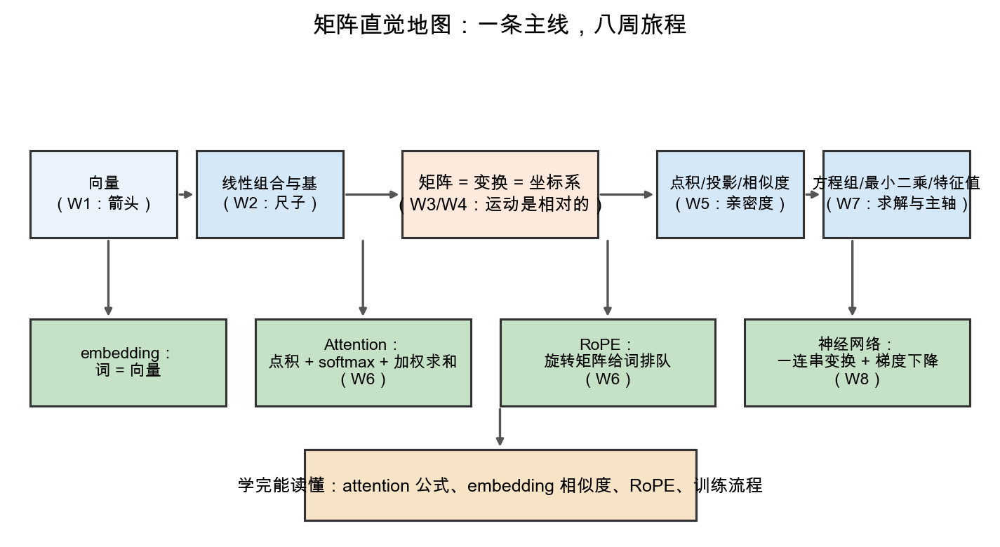

# Day 7：结业总结——回望矩阵直觉地图

> 本章你将：
> 1. 用一张地图，把 8 周走过的路串成一条主线，看清各周是怎么咬合的；
> 2. 拿到一份"矩阵直觉清单"——几条你以后遇到任何矩阵问题都能脱口而出的直觉；
> 3. 逐一验收课程开头许下的**三个结业目标**：看懂 Transformer 公式、理解 embedding 空间、手推小网络；
> 4. 拿到"下一步怎么走"的路标：PyTorch、3Blue1Brown、LLM 源码阅读。

---

## 7.1 从一根数轴，到训练出一个网络

八周前（Week 1 第 0 章），你站在零起点上，看到的第一样东西是一根**数轴**——一个点、一个地址。今天，你刚刚亲手训练出一个会分辨 XOR 的两层神经网络。这中间隔着几十章、几百行代码，但**它们不是散落的碎片，而是一条环环相扣的主线**。

先停一秒钟，诚实地享受一下这个跨度：一个只懂"初中数学 + Python"的人，如今能脱稿解释"神经网络为什么能学习"，能指着 `Q @ K.T` 说"这就是一堆点积"，能自己写前向、反向、梯度下降。**你做到了。** 下面这张图，就是我们一路走来的全部地形：

读这张地图，从中间那格出发（它是全课程的地基），再向左右上下看：

- **中间一行（主干，橙色格）**：`矩阵 = 变换 = 坐标系`。这是 Week 3/4 的灵魂——矩阵既描述一个"运动"，本身又是一组"尺子"；"运动是相对的"正是孟岩《理解矩阵》的核心。它左边接着上游，右边接着下游。
- **上游**：`向量（W1：箭头）` → `线性组合与基（W2：尺子）`。先有"箭头"，才能"伸缩相加"，才谈得上"选谁当尺子"。
- **下游（蓝色格）**：`点积/投影/相似度（W5）` 与 `方程组/最小二乘/特征值（W7）`。一个度量"方向契合度"，一个负责"求解"与"找主轴"。
- **底部一行（绿色格，AI 落地）**：`embedding：词=向量`、`Attention：点积+softmax+加权求和`、`RoPE：旋转矩阵给词排队`、`神经网络：一连串变换+梯度下降`——这四个，就是上面所有数学在 LLM 里的四个真实落点。
- **最底下一格（浅黄）**，是全课程的目标：**学完能读懂 attention 公式、embedding 相似度、RoPE、训练流程**。

箭头的方向，就是"依赖"的方向：先教上游、再教主干、再教下游、最后落地到 AI。**这不是一份目录，是一条因果链。**

---

## 7.2 矩阵直觉清单：六条，终身受用

课程走到这，真正留下的不是几十个公式，而是**六条直觉**。它们在你以后读任何矩阵相关的代码/论文时，都会自动浮上来：

1. **矩阵 = 变换 = 坐标系。** 看见 `Ax`，先想"它在把 x 搬到哪"；看见一个方阵，也可以想"它自己就是一组铺在空间里的尺子"。同一个东西，两种读法（W3/W4）。
2. **运动是相对的。** "把点搬过去"和"换把尺子来量"是一体两面：`Ma = b` 既是"a 被变到 b"，又是"在 M 尺子里读数 a 的向量，标准尺子里读数是 b"（W4）。
3. **点积 = 相似度。** 两个向量点积的几何意义是"方向有多合拍"（含长度）。embedding 的相似度、attention 的 `QK^T`，本质都是它（W5/W6）。
4. **特征向量 = 主轴。** 一个变换"最不肯拐弯"的方向就是它的主轴，特征值是沿主轴的缩放倍数——找主成分、理解变换的"骨架"都用它（W7）。
5. **网络 = 一连串变换。** 一层网络就是一个 `Wx+b`（变换+平移），ReLU 负责把直线折断；整个网络就是这些变换**串成的流水线**（W8）。
6. **学习 = 梯度下降。** "变聪明"不是玄学，而是：算出损失对每个参数的梯度（变化率），然后朝反方向挪一小步，重复几千几万遍（W8）。

这六条，你不需要会证明任何一条，但要能**给别人讲明白每一条背后的画面**。它们是这门课真正的产出。

> 📌 划重点：本课教你的不是"矩阵怎么算"，而是"矩阵是什么感觉"。公式会忘，但这六条直觉一旦长进脑子里，以后每次重学都会快一倍。

---

## 7.3 验收：课程开头的三个结业目标，逐个打勾

Week 1 第 0 章许下的承诺（也是 CURRICULUM 里写的结业目标），今天来对账。一共三项，一项一项验收：

### 目标 1：看懂 Transformer 里的矩阵公式（attention、QKV 投影、softmax、RoPE）

- `X @ Wq`、`X @ Wk`、`X @ Wv`？——三个 **Week 3 的变换**，把词投影进三个空间（"我在找谁 / 我是谁 / 我装了什么"）。
- `scores = Q @ K.T`？——**一堆点积**（Week 5），衡量词与词的亲密度。
- `weights = softmax(scores)`？——把分数变成百分比（Week 6 Day 3）。
- `out = weights @ V`？——用百分比加权求和（Week 6）。
- RoPE 里的旋转？——**Week 3 的旋转矩阵**，给词按位置转角度；`q_m·k_n` 只依赖 (m-n)，靠"旋转复合=角度相加 + 点积只看夹角"（Week 3 + Week 5）。

✅ **勾。** 现在你看到 `QK^T` 不会再头皮发麻，而是能拆成"一堆点积 + softmax + 加权求和"三连。

### 目标 2：理解 embedding 空间（相似度、国王-男人+女人≈女王）

- 词 = 高维空间里的一个点（**向量**，Week 1）；
- 每个词是各"语义刻度"的配方（**线性组合/坐标**，Week 2）；
- 两个词像不像 = 两个向量的**夹角/余弦**，不是距离（Week 5 Day 5 讲过为什么）；
- "国王 - 男人 + 女人 ≈ 女王" = **向量加减**：从"国王"里减掉"男性"那部分、加上"女性"那部分，就落到"女王"附近（Week 2 Day 6 首秀，Week 5 收尾）。

✅ **勾。** embedding 不再是魔法表，而是"一堆带语义的坐标，靠线性组合和夹角来组织"。

### 目标 3：手推/手写一个小网络的一次前向 + 反向 + 梯度更新

✅ **勾，而且是超额完成。** 你不只"手推了一次"，而是**手写了整个网络**：`forward`（复合变换流水线）、`loss`（均方误差）、`backward`（链式法则逐层传梯度，Day 4 那张手算梯度表就是"手推"）、`sgd_step`/`train`（梯度下降），最后在 XOR 上训练到 11 passed。这不是"看懂公式"，是"从零造出来"。

三个目标，全部达成。**你可以骄傲地把 Week 1 第 0 章那三行"惊鸿一瞥"，重新翻出来看一遍——这次，它们都是老朋友了。**

---

## 7.4 下一步怎么走：三条路标

结业不是终点，是换一副更清晰的眼镜继续上路。三条路，按你此刻的兴奋点选：

1. **PyTorch（最顺滑的下一步）。** 你已经在 Day 6 彩蛋里见过它的四行骨架。去官方 60 分钟上手教程，把 `Tensor`、`nn.Module`、`DataLoader`、`Adam` 优化器补起来。**你手写过的每一块，PyTorch 都替你打包好了**，所以你会比别人快得多地"看懂"它。
2. **3Blue1Brown（把直觉钉得更深）。** YouTube 上"线性代数的本质"和"神经网络"两个系列，是这门课直觉的"原版动画"。你现在去看，会发现每一集都能和你的八周对上线——而且看得比当初快了十倍。
3. **LLM 源码阅读（真正入门的下一步）。** 从 Karpathy 的 `nanoGPT` 或 `micrograd` 读起（后者就是一个微缩的自动微分玩具，和你的 `backward` 一脉相承）。读的时候你会发现：**所谓千亿参数的语言模型，骨架就是你 Week 8 写的那个 for 循环，只是放大了几个数量级。**

> 📌 划重点：别急着啃大部头。先选一条**最让你兴奋**的路走，走到卡住，就回来看这份"六条直觉清单"——它会是你在新地形里最趁手的登山杖。

---

## 7.5 写在最后：你真正学到的是什么

最后说一句心里话。这门课教了你矩阵、点积、特征值、梯度——但如果你问"到底学到了什么"，我觉得是一件事：

> **任何看似玄学的 AI 术语，拆到底，都是一块你早就会的砖，几块一拼，就露出了全貌。**

Word embedding 是"给词找坐标"，attention 是"点积求亲密度"，训练是"下山"。这三句话，8 周前它是一堆吓人的符号，8 周后它是你随时能脱口而出的常识。**这种"拆开看、拼起来"的能力，比任何一个具体公式都值钱**——因为新的术语还会源源不断地冒出来（MoE、LoRA、KV cache……），但你手里已经有了一把能拆它们的刀。

感谢你走完这八周。去把 Week 1 第 0 章翻出来，看着那个曾让你倒吸凉气的 `scores = Q @ K.T`，笑一笑吧——它现在简单得像 1+1。

**结业快乐。** 🎓

---

## 动手练习

1. **画图**：合上本文，凭记忆在白纸上默画出 `w8d7_map.png` 的骨架（上游→主干→下游→AI 落地四个 AI 盒子→目标），标清每格的周数。画不出来就回头看一遍。
2. **填空**：不看前文，默写"六条直觉清单"的每一条前面半句（矩阵=…、运动=…、点积=…、特征向量=…、网络=…、学习=…），再补全后半句。
3. **对账**：回到 [Week 1 第 0 章：总览——LLM 的底层全是矩阵](../week1/00-总览-LLM的底层全是矩阵.md)，把开头三段"惊鸿一瞥"（embedding / `QK^T` / `x@W+b`）逐段默读一遍，给每一段写一句"它现在简单在哪"的注释。

## 参考答案

1. 骨架 = 上游(W1 向量、W2 组合) → 主干(W3/W4 矩阵=变换=坐标系) → 下游(W5 点积、W7 求解) → 落地(embedding/Attention/RoPE/网络) → 目标。全对即可，细节允许模糊。
2. 见 7.2，六条一字不差地回忆出来即为满分。
3. 三句注释参考：`embedding` = 查表拿坐标；`Q @ K.T` = 一堆点积求亲密度；`x @ W + b` = 一次变换 + 平移（一层网络）。

---

## 7.6 本章小结

- ✅ 八周是一条因果链：向量 → 组合/基 → 矩阵=变换=坐标系 → 点积 → attention → 求解/特征值 → 网络=变换+梯度下降。
- ✅ 六条直觉清单：矩阵=变换=坐标系、运动相对、点积=相似度、特征向量=主轴、网络=一连串变换、学习=梯度下降。
- ✅ 三个结业目标（Transformer 公式 / embedding 空间 / 手推小网络）**全部达成**。
- ✅ 下一步：PyTorch（最顺）、3Blue1Brown（钉直觉）、nanoGPT/micrograd（读源码）。

🎉 恭喜结业！这门课的终点到了，而你自己的"矩阵直觉之旅"，其实才刚刚开始。

👉 回到 **[课程首页](../../README.md)**，或回到 **[本周导读](./README.md)**。
